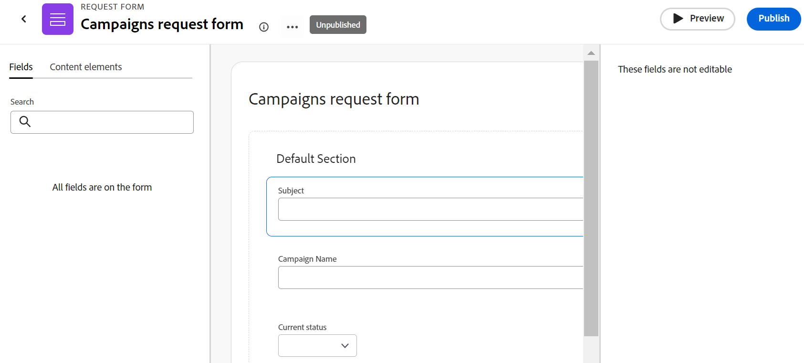

# Criar e gerenciar um formulário de solicitação no Adobe Workfront Planning

<!--update the metadata with real information when making this available in TOC and in the left nav-->

<!--take Preview and Production references at Production time-->

As informações destacadas nesta página referem-se a funcionalidades que ainda não estão disponíveis. Ela está disponível somente no ambiente de Pré-visualização para todos os clientes. Depois das versões mensais para produção, os mesmos recursos também ficam disponíveis no ambiente de produção para clientes que ativaram versões rápidas. 

Para obter informações sobre versões rápidas, consulte [Habilitar ou desabilitar versões rápidas para sua organização](/help/quicksilver/administration-and-setup/set-up-workfront/configure-system-defaults/enable-fast-release-process.md). 

{{planning-important-intro}}

Você pode criar um formulário de solicitação e associá-lo a um tipo de registro no Adobe Workfront Planning. Você pode compartilhar o formulário com outras pessoas e elas podem enviar solicitações para criar registros.

Este artigo descreve como um gerenciador de espaço de trabalho pode criar um formulário de solicitação associado a um tipo de registro.

Para obter informações sobre como enviar uma solicitação a um tipo de registro para criar um registro, consulte [Enviar solicitações do Adobe Workfront Planning para criar registros](/help/quicksilver/planning/requests/submit-requests.md).

## Requisitos de acesso

+++ Expanda para visualizar os requisitos de acesso.

<table style="table-layout:auto">
 <col>
 </col>
 <col>
 </col>
 <tbody>
    <tr>
<tr>
<td>
   
 Produtos
 </td>
   <td>
   <ul><li>
 Adobe Workfront
</li>
   <li>
 Planejamento do Adobe Workfront
</li></ul></td>
  </tr>  
 <tr>
   <td role="rowheader">
plano do Adobe Workfront*
</td>
   <td>

Qualquer um dos seguintes planos da Workfront:

<ul><li>Selecionar</li>
<li>Prime</li>
<li>Ultimate</li></ul>

O Workfront Planning não está disponível para planos herdados do Workfront

   </td>

<tr>
   <td role="rowheader">
Pacote de planejamento do Adobe Workfront*
</td>
   <td>

Qualquer 
  

Para obter mais informações sobre o que está incluído em cada plano do Workfront Planning, entre em contato com seu gerente de conta da Workfront. </td>

<tr>
   <td role="rowheader">
plataforma Adobe Workfront
</td>
   <td>

A instância da Workfront de sua organização deve ser integrada à Adobe Unified Experience para acessar o Workfront Planning.

Para obter mais informações, consulte <a href="/help/quicksilver/workfront-basics/navigate-workfront/workfront-navigation/adobe-unified-experience.md">Experiência unificada da Adobe para Workfront</a>. 

   </td>

</tr>
  </tr>
  <tr>
   <td role="rowheader">
Licença da Adobe Workfront*
</td>
   <td>
   
Padrão

   
O Workfront Planning não está disponível para licenças herdadas do Workfront

  </td>
  </tr>
  <tr>
   <td role="rowheader">
Configuração do nível de acesso
</td>
   <td> 
Não há controles de nível de acesso para o Adobe Workfront Planning
  
</td>
  </tr>
<tr>
   <td role="rowheader">
Permissões de objeto
</td>
   <td>
   <ul>
   <li>
Gerenciar permissões para um espaço de trabalho e tipo de registro
</li>
    <li>
Os administradores do sistema podem gerenciar espaços de trabalho que não criaram. 
</li>
    </ul>
   
Para obter informações sobre o compartilhamento de permissões para objetos do Workfront Planning, consulte  
   <a href="/help/quicksilver/planning/access/sharing-permissions-overview.md">Visão geral das permissões de compartilhamento no Adobe Workfront Planning</a> 
  </td>
  </tr>
 </tbody>
</table>

*Para obter mais informações sobre requisitos de acesso do Workfront, consulte [Requisitos de acesso na documentação do Workfront](/help/quicksilver/administration-and-setup/add-users/access-levels-and-object-permissions/access-level-requirements-in-documentation.md).

+++

## Limitações de exibição de campo e valor em formulários de solicitação

Há limitações na forma como determinados campos são exibidos no formulário de solicitação e em como seus valores serão exibidos posteriormente nos registros ou na página de detalhes da solicitação, após o envio de uma solicitação.

Para obter informações sobre como enviar solicitações do Workfront Planning, consulte [Enviar solicitações do Adobe Workfront Planning para criar registros](/help/quicksilver/planning/requests/submit-requests.md).

* Veja a seguir as limitações de como determinados campos são exibidos em formulários de solicitação, registros criados por um formulário de solicitação ou na página de detalhes da solicitação:

   * Não é possível adicionar campos dos seguintes tipos a um formulário de solicitação:

      * Criado por, Última modificação por, Aprovado por
      * Data de criação, Última data de modificação, Data de aprovação
      * Campos de pesquisa de objetos do Workfront
      * Campos de pesquisa de registros conectados do Workfront Planning

* Veja a seguir as diferenças entre como os formatos de campo são exibidos no construtor de formulários de solicitação e como os valores dos campos são formatados no registro ou na página de detalhes da solicitação:

   * Os campos Moeda, Número e Porcentagem são exibidos como um tipo de campo de texto de linha única no construtor de formulários.

     No entanto, o formato do campo é preservado e os valores do campo serão exibidos como moeda, números e percentuais após o envio da solicitação, no tipo de registro e na página de detalhes da solicitação.

* A seguir, descrevemos como alguns valores de campo são exibidos nos formulários de solicitação e nas páginas de detalhes da solicitação:

   * A formatação especial dos campos Moeda, Número e Porcentagem não é preservada. Por exemplo, a precisão decimal não é preservada para os valores desses campos nessas áreas.
   * Os valores do campo Pessoas são exibidos como IDs.
   * Os campos de fórmula que não se referem a outros campos ou cálculos não exibem valores. Por exemplo, um campo com uma fórmula `STRING` exibe um valor &quot;N/A&quot;.
   * Os campos de fórmula que se referem aos campos Moeda exibem os valores sem contabilizar taxas de câmbio.
   * Os valores dos campos de parágrafo exibem um valor &quot;N/A&quot; no formulário de solicitação e exibem tags html em vez do texto formatado na página de detalhes da solicitação.

## Criar um formulário de solicitação para um tipo de registro

{{step1-to-planning}}

1. Clique no espaço de trabalho ao qual deseja adicionar registros.

   O espaço de trabalho é aberto e os tipos de registro são exibidos como cartões.

1. Clique em um cartão de tipo de registro. Para obter informações sobre como criar um tipo de registro, consulte [Criar tipos de registro](/help/quicksilver/planning/architecture/create-record-types.md).

   A página do tipo de registro é aberta na exibição acessada pela última vez. Por padrão, uma página do tipo de registro é aberta na exibição de tabela.

1. Clique no menu **Mais**  à direita do nome do tipo de registro no cabeçalho da página e clique em **Criar formulário de solicitação** ou **Gerenciar formulários de solicitação**, se você já tiver um formulário e quiser criar outros.
1. (Condicional) Se quiser adicionar outro formulário, clique em **Novo formulário de solicitação**.
1. Atualize o nome do formulário de solicitação. Por padrão, o nome do formulário é **Formulário sem título**. <!--check this; you logged a bug to rename it to 'Untitled request form' but was it fixed?-->
1. (Opcional) Adicione uma **Descrição** para o formulário de solicitação.

   <!--Not possible yet: The Description is visible when you access the request form from the Requests area of Workfront.-->

1. Clique em **Criar**. O formulário de solicitação para o tipo de registro selecionado é aberto na guia Formulário.

   

   O formulário de solicitação contém as seguintes informações, por padrão:

   * Campos de registro disponíveis na exibição de tabela do tipo de registro selecionado. <!--they are working on removing the limitation below-->

   * **Seção padrão**: esta é a quebra de seção padrão que o Workfront aplica ao formulário de solicitação. Todos os campos de registro são exibidos na área **Seção padrão**.
   * Campo **Assunto**: o campo que identificará a solicitação no Workfront. A configuração e o valor do campo Subject não são editáveis.

     >[!NOTE]
     >
     >* O campo **Assunto** exige um valor quando está visível no formulário de solicitação. No entanto, você pode remover o campo **Assunto**, se necessário, e os solicitantes não o verão no formulário quando enviarem a solicitação.
     >* Quando o campo Assunto está ausente em um formulário de solicitação, mas há um campo Nome para o nome do registro futuro, o nome da solicitação é automaticamente atribuído ao mesmo nome do registro criado.
     >* Quando os campos Assunto e Nome estiverem ausentes no formulário de solicitação, a solicitação será nomeada usando o seguinte padrão: `< Record name > request form < Entry date of the request >`; o registro é nomeado como **Sem título**.

   * Todos os campos associados ao tipo de registro.

     Os campos contidos no formulário de solicitação estarão visíveis para todos que enviarem uma solicitação para esse tipo de registro.

1. (Opcional) Passe o mouse sobre qualquer campo no formulário que deseja remover, em seguida, clique no ícone **x** para removê-los. Eles são adicionados à guia **Campos** à esquerda do formulário.

   Por exemplo, remova o campo **Assunto**, pois ele não está visível no Workfront Planning. <!--remove this example if this becomes visible in Planning?-->

1. (Opcional) Para remover a **Seção padrão** do formulário, faça o seguinte:

   1. Remova todos os campos da Seção padrão.
   1. Clique em **Elementos de conteúdo**, adicione uma nova seção e adicione um nome à seção.
   1. Adicione campos à nova seção.
   1. Clique no ícone **x** para remover a **Seção padrão**.
1. Clique em qualquer campo e use os controles no painel direito no formulário para definir seu tamanho ou qualquer uma das seguintes informações:

   * **Rótulo**: este é o nome do campo como ele aparecerá no formulário de solicitação. Isso não altera o nome do campo de registro.
   * **Instruções**: adicione mais informações sobre o campo.
   * **Criar um campo obrigatório**: quando selecionado, o campo deve ter um valor. Caso contrário, o formulário não poderá ser enviado.
   * **Adicionar lógica**: defina quais condições devem ser atendidas para que o campo seja exibido ou fique oculto.

   >[!TIP]
   >
   >   O tipo de campo de cada campo é exibido na parte superior do painel direito, depois que você seleciona o campo no formulário.
   >     

1. (Opcional) Clique na guia **Elementos de conteúdo** no lado esquerdo do formulário e adicione qualquer um dos seguintes elementos:

   * **Texto descritivo**
   * **Quebra de seção**

   Para obter mais informações sobre como criar um formulário personalizado, consulte [Criar um formulário personalizado](/help/quicksilver/administration-and-setup/customize-workfront/create-manage-custom-forms/form-designer/design-a-form/design-a-form.md).

1. (Opcional) Clique em **Visualizar** para ver como o formulário será exibido para outros usuários quando eles o usarem para enviar um novo registro.

1. (Opcional) Clique na guia **Configuração** e adicione pelo menos um usuário ou equipeao campo **Aprovadores** para aprovar novas solicitações para este formulário de registro.

   

   <!--below bullet list is duplicated in the Add approval to a request form article-->

   * Quando você associa um formulário de solicitação a aprovadores, qualquer nova solicitação deve primeiro ser aprovada por todos os aprovadores antes de gerar um novo registro.
   * Você pode adicionar um ou vários aprovadores a um formulário de solicitação.
   * Se pelo menos um aprovador rejeitar a solicitação, ela será rejeitada e o registro não será criado.
   * Todos os aprovadores devem tomar uma decisão antes que uma solicitação seja aprovada ou rejeitada.
   * Se uma equipe estiver definida como um aprovador, somente uma decisão será necessária da equipe.

     Para obter mais informações sobre como adicionar aprovações a formulários de solicitação, consulte [Adicionar aprovação a um formulário de solicitação](/help/quicksilver/planning/requests/add-approval-to-request-form.md).

1. (Opcional) Clique no menu **Mais**  à direita do nome do formulário no cabeçalho e clique em **Editar** para atualizar o nome do formulário.

1. Clique em **Publicar** para publicar o formulário e obter um link exclusivo para ele.

   As seguintes situações ocorrem:

   * O botão **Publicar** foi removido.
   * O botão **Cancelar publicação** é adicionado ao formulário. Clicar nele impedirá que o formulário seja acessível.
   * Um botão **Compartilhar** é adicionado ao formulário.
   * O formulário fica disponível na área Solicitações do menu Principal do Workfront.

1. Clique em **Compartilhar** para compartilhar o formulário com outras pessoas.

   Para obter informações sobre como compartilhar um formulário de solicitação, consulte a seção [Compartilhar um formulário de solicitação](#share-a-request-form) neste artigo
1. Clique na seta à esquerda do nome do formulário no cabeçalho para fechar o formulário.

   A exibição de tabela **Formulários de solicitação** é aberta e o formulário é adicionado a ela.

1. (Opcional) Passe o mouse sobre o nome de um formulário de solicitação na exibição de tabela, em seguida, clique no menu **Mais**  à direita do nome do formulário e clique em um dos seguintes:

   * **Editar formulário**: clique para editar mais informações sobre o formulário.
   * **Cancelar publicação**: clique para desfazer a publicação do formulário que o remove da área Solicitações no Workfront.
   * **Compartilhar**: clique aqui para modificar quem tem acesso ao formulário.
   * **Copiar link**: clique para copiar rapidamente o link do formulário de solicitação sem abrir o formulário.
   * **Excluir**: clique aqui para excluir o formulário. Todas as solicitações e registros adicionados usando o formulário não são excluídos. O formulário não pode ser recuperado.

   

1. Clique na seta à esquerda de **Formulários de solicitação** no cabeçalho para fechar a tabela de formulários de solicitação.

   A página de tipo de registro é aberta.
1. (Opcional e condicional) Clique no menu **Mais**  à direita do nome do tipo de registro no cabeçalho e siga um destes procedimentos:

   1. Clique em **Atualizar formulário de solicitação** para fazer alterações no formulário de solicitação e, em seguida, clique em um formulário de solicitação para abri-lo e editá-lo.
   1. Clique em **Copiar link para solicitar o formulário** para compartilhar o link para o formulário com outras pessoas.

1. (Opcional) Vá para a área **Solicitações** no Workfront e localize o formulário compartilhado para enviar uma solicitação. Para obter informações, consulte [Enviar solicitações do Adobe Workfront Planning para criar registros](/help/quicksilver/planning/requests/submit-requests.md).

## Compartilhar um formulário de solicitação

1. Crie um formulário de solicitação conforme descrito na seção [Criar um formulário de solicitação para um tipo de registro](#create-a-request-form-for-a-record-type) deste artigo.
1. Clique no menu **Mais**  à direita do nome do formulário de solicitação na página do tipo de registro.
1. Clique em **Compartilhar** para compartilhar o formulário com outras pessoas.

1. Para compartilhar o formulário internamente, selecione a guia **Compartilhamento interno**, procure o nome de um usuário, equipe, função de trabalho, grupo ou empresa no campo **Conceder acesso para enviar este formulário** e selecione-o quando ele aparecer na lista. A permissão **Enviar** é selecionada por padrão para cada entidade.

   

1. (Opcional) Clique no menu suspenso após o nome de uma entidade e clique em **Remover** para removê-la da lista e parar de compartilhar o formulário com ela.

   >[!NOTE]
   >
   >Além de equipes, grupos, empresas e funções de trabalho, você pode compartilhar somente com usuários que foram adicionados à Adobe Admin Console. Não é possível adicionar usuários somente do Workfront. Para obter informações, consulte [Gerenciar usuários na Adobe Admin Console](/help/quicksilver/administration-and-setup/add-users/create-and-manage-users/admin-console.md).

1. Na seção **Quem pode enviar solicitações por meio deste formulário**, selecione uma das seguintes opções para indicar quais tipos de usuários podem acessar este formulário:

   * Somente pessoas convidadas podem acessar
   * Qualquer pessoa com acesso de exibição ou superior ao espaço de trabalho
   * Qualquer pessoa com acesso de contribuição ou superior ao espaço de trabalho
1. (Opcional) Clique em **Copiar link** para compartilhar o link para o formulário com as pessoas que têm acesso para fazer isso. O link é copiado para a área de transferência.
1. Para compartilhar o formulário publicamente, selecione a guia **Compartilhamento público** e habilite a configuração **Criar link público**.

   

   >[!WARNING]
   >
   >* Quando você habilita a configuração **Criar link público**, qualquer pessoa pode acessar o formulário e enviar um novo registro, mesmo pessoas de fora da sua organização que não tenham uma conta do Workfront.
   >
   >* Um formulário que contém os seguintes tipos de campo não pode ser compartilhado publicamente:
   >
   >     * Conexões do Workfront ou AEM Assets
   >     * Pessoas
   >

1. Escolha uma **Data de expiração do link**.

   Você pode selecionar datas futuras dentro de 180 dias a partir da data atual.

   >[!TIP]
   >
   >Depois que a data de compartilhamento expirar, o formulário de solicitação não estará mais disponível na área Solicitações do Workfront e os links compartilhados com outros usuários não estarão mais acessíveis.

   As pessoas receberão um erro depois que o link expirar e você deverá atualizar a data do link e gerar um novo link para compartilhar antes que as pessoas possam acessar o formulário novamente.

1. (Opcional e condicional) Clique em **Salvar** para salvar os detalhes de compartilhamento do formulário.
1. (Condicional) Se o formulário foi salvo anteriormente, clique em **Copiar link**.

   As opções de compartilhamento de formulário são salvas e o link é copiado para a área de transferência. Agora você pode compartilhá-lo com outras pessoas.

   Para obter informações sobre como criar registros usando um link para um formulário de solicitação, consulte [Enviar solicitações do Adobe Workfront Planning](/help/quicksilver/planning/requests/submit-requests.md).

1. Clique em **Salvar** no canto inferior direito da guia **Formulário** para salvar o formulário.
