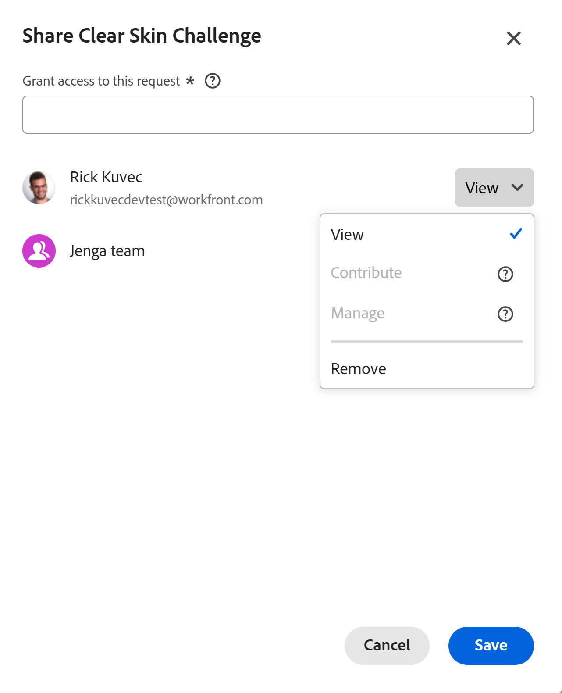

# Compartilhar solicitações do Planning

<!--add to TOC, and miniTOC-->

As informações nesta página se referem a funcionalidades que ainda não estão disponíveis. Ela está disponível somente no ambiente de Pré-visualização para todos os clientes. Após o lançamento para Pré-visualização, os mesmos recursos também estarão disponíveis mensalmente no ambiente de Produção para clientes que ativaram versões rápidas. 

Para obter informações sobre versões rápidas, consulte [Habilitar ou desabilitar versões rápidas para sua organização](/help/quicksilver/administration-and-setup/set-up-workfront/configure-system-defaults/enable-fast-release-process.md). 

{{planning-important-intro}}

Depois que uma solicitação de Planejamento é enviada, você pode controlar quem a visualiza, quem pode trabalhar nela e quais ações cada pessoa ou equipe tem permissão para realizar. Isso mantém as pessoas certas focadas nas solicitações certas — e garante que elas possam realizar apenas as ações apropriadas à sua função.

## Requisitos de acesso

+++ Expanda para visualizar os requisitos de acesso da funcionalidade neste artigo. 

<table style="table-layout:auto"> 
<col> 
</col> 
<col> 
</col> 
<tbody> 
<tr> 
   <td role="rowheader">
Pacote do Adobe Workfront
</td> 
   <td> 

Qualquer Workfront ou Fluxo de trabalho com um pacote do Planning
 
Ou

Qualquer Workfront Planning quando adquirido como um produto independente
 
 </tr> 
  <tr> 
   <td role="rowheader">
Licença do Adobe Workfront
</td> 
   <td>
Qualquer
 
  </td> 
  </tr> 
  <tr> 
   <td role="rowheader">
licença do Adobe Planning
</td> 
   <td>
Qualquer
 
  </td> 
  </tr> 
  <tr> 
   <td role="rowheader">
Configuração do nível de acesso
</td> 
   <td> 
Você deve adicionar um Workflow e um tipo de licença do Planning ao nível de acesso quando tiver um Workflow e um pacote do Planning
   
</td> 
  </tr> 
  <tr> 
   <td role="rowheader">
Permissões de objeto
</td> 
   <td>   
Exibir permissões ou mais altas para um espaço de trabalho e tipo de registro, se você for um usuário do Workfront
  </td> 
  </tr>  
</tbody> 
</table>

Para obter mais informações sobre requisitos de acesso do Workfront, consulte [Requisitos de acesso na documentação do Workfront](/help/quicksilver/administration-and-setup/add-users/access-levels-and-object-permissions/access-level-requirements-in-documentation.md).

+++

## Considerações ao compartilhar solicitações

* Você pode conceder as seguintes permissões aos usuários para uma solicitação:

  * View: Os usuários podem ver somente a solicitação.
  * Contribute: os usuários podem exibir, editar e comentar a solicitação.
  * Gerenciar: Os usuários podem exibir, editar, comentar e excluir a solicitação.

* Os solicitantes recebem automaticamente acesso de Gerenciar às solicitações enviadas, a menos que um administrador tenha configurado um padrão diferente.

  Para obter informações, consulte [Criar formulário de solicitação](/help/quicksilver/planning/requests/create-request-form.md).

* Os administradores do Workfront podem acessar e gerenciar todas as solicitações.
* Os usuários com acesso de Gerenciamento a um tipo de registro herdam o acesso de Gerenciamento ao formulário de entrada desse tipo de registro e a cada solicitação enviada por meio dele.
* Qualquer pessoa com permissões para uma solicitação pode compartilhar a solicitação com o mesmo nível de permissão ou com um nível inferior ao seu.

  Usuários com permissões do Contribute não podem conceder permissões de gerenciamento à solicitação.

* Pessoas e equipes diferentes podem ter diferentes níveis de acesso na mesma solicitação.
* As permissões podem ser atribuídas por meio de várias entidades. Se um usuário tiver permissões do Contribute para uma solicitação, mas seu grupo ou função de trabalho tiver permissões de exibição, ele manterá o nível mais alto de permissões, que é o Contribute.

## Compartilhar uma solicitação

Certifique-se de que você esteja usando a nova experiência de solicitação.

1. {{step1-to-requests}}
1. Localize uma solicitação do Planning e clique nela para abri-la.
1. Clique em **Compartilhar**.

   A caixa **Compartilhar** é aberta para a solicitação selecionada.

   

1. No **campo Conceder acesso a esta solicitação**, comece digitando o nome de um usuário, equipe, função, grupo ou empresa e clique nele quando ele for exibido na lista.

   Somente entidades ativas são exibidas na lista.
1. No menu suspenso à direita do nome de cada entidade, selecione um dos seguintes níveis de permissões:

   * Gerenciar
   * Contribuir
   * Exibir
1. (Opcional) Para cada nível de permissão, clique no ícone de permissão granular e selecione ou desmarque quaisquer permissões granulares, como **Editar**, **Comentário**, **Compartilhar** ou **Excluir**.

   
1. Clique em **Salvar**.

   A solicitação é compartilhada com as entidades selecionadas.

