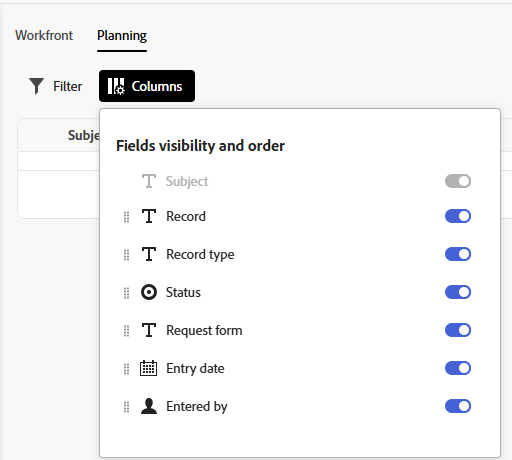

# Enviar solicitações do Adobe Workfront Planning para criar registros

<!--update title when there will be more functionality added to the Planning requests, besides creating records-->
<!--take Preview and Prod references out when releasing to Prod all-->

As informações destacadas nesta página referem-se a funcionalidades que ainda não estão disponíveis. Ela está disponível somente no ambiente de Pré-visualização para todos os clientes. Depois das versões mensais para produção, os mesmos recursos também ficam disponíveis no ambiente de produção para clientes que ativaram versões rápidas. 

Para obter informações sobre versões rápidas, consulte [Habilitar ou desabilitar versões rápidas para sua organização](/help/quicksilver/administration-and-setup/set-up-workfront/configure-system-defaults/enable-fast-release-process.md). 

{{planning-important-intro}}

Depois que um gerenciador de espaço de trabalho cria um formulário de solicitação para um tipo de registro no Adobe Workfront Planning, você pode usar o formulário para submeter solicitações que criarão registros para o tipo de registro associado ao formulário.

Você pode submeter uma solicitação do Workfront Planning nas seguintes áreas:

* Na área Solicitações do Workfront.
* De um link direto para o formulário de solicitação que foi compartilhado.

  Este artigo descreve como enviar uma solicitação para adicionar novos registros a um tipo de registro da área Solicitações do Workfront ou de um link compartilhado.
* Na página tipo de registro, ao adicionar ou solicitar um novo registro. Para obter informações, consulte [Criar registros](/help/quicksilver/planning/records/create-records.md).

Usuários do Workfront e usuários externos podem enviar solicitações para tipos de registro do Planning e criar registros. <!--double check on the external users-->

Para obter informações sobre como um gerenciador de espaço de trabalho pode criar um formulário de solicitação e associá-lo a um tipo de registro, consulte [Criar e gerenciar um formulário de solicitação no Adobe Workfront Planning](/help/quicksilver/planning/requests/create-request-form.md).

## Requisitos de acesso

+++ Expanda para visualizar os requisitos de acesso.

Você deve ter o seguinte acesso para executar as etapas deste artigo:

<table style="table-layout:auto">
 <col>
 </col>
 <col>
 </col>
 <tbody>
    <tr>
<tr>
<td>
   
 Produtos
 </td>
   <td>
   <ul><li>
 Adobe Workfront
</li>
   <li>
 Planejamento do Adobe Workfront
</li></ul></td>
  </tr>  
 <tr>
   <td role="rowheader">
plano do Adobe Workfront*
</td>
   <td>

Qualquer um dos seguintes planos da Workfront:

<ul><li>Selecionar</li>
<li>Prime</li>
<li>Ultimate</li></ul>

O Workfront Planning não está disponível para planos herdados do Workfront

   </td>
<tr>
   <td role="rowheader">
Pacote de planejamento do Adobe Workfront*
</td>
   <td>

Qualquer 
  

Para obter mais informações sobre o que está incluído em cada plano do Workfront Planning, entre em contato com seu gerente de conta da Workfront. </td>
<tr>
   <td role="rowheader">
plataforma Adobe Workfront
</td>
   <td>

A instância da Workfront de sua organização deve ser integrada à Adobe Unified Experience para acessar o Workfront Planning.

Para obter mais informações, consulte <a href="/help/quicksilver/workfront-basics/navigate-workfront/workfront-navigation/adobe-unified-experience.md">Experiência unificada da Adobe para Workfront</a>. 

   </td>

</tr>
  </tr>
  <tr>
   <td role="rowheader">
Licença da Adobe Workfront*
</td>
   <td>
   
Licença externa, do Colaborador, do Light ou do Standard

   
O Workfront Planning não está disponível para licenças herdadas do Workfront

  </td>
  </tr>
  <tr>
   <td role="rowheader">
Configuração do nível de acesso
</td>
   <td> 
Não há controles de nível de acesso para o Adobe Workfront Planning
  
</td>
  </tr>
<tr>
   <td role="rowheader">
Permissões de objeto
</td>
   <td>
   
Exibir ou aumentar permissões para um espaço de trabalho e tipo de registro, se você for um usuário do Workfront
 
  </td>
  </tr>
<tr>
   <td role="rowheader">
Modelo de layout
</td>
   <td> 
Para acessar a área Planejamento no Workfront, você deve ter a seguinte configuração de modelo de layout: 

<ul>
<li>
No ambiente de Produção, todos os usuários, inclusive os administradores do Sistema, devem ser atribuídos a um modelo de layout que inclua o Planning.
</li>
<li>

 No ambiente de Pré-visualização, os usuários com uma licença Light ou Contributor devem receber um modelo de layout que inclua o Planning.
   
Usuários padrão e Administradores do sistema têm as áreas do Planning habilitadas por padrão.

</li></ul>

 No entanto, para enviar solicitações ao Workfront Planning, não é necessário acessar a área Planejamento. 
  
</td>
  </tr>
 </tbody>
</table>

*Para obter mais informações sobre requisitos de acesso do Workfront, consulte [Requisitos de acesso na documentação do Workfront](/help/quicksilver/administration-and-setup/add-users/access-levels-and-object-permissions/access-level-requirements-in-documentation.md).

+++

## Pré-requisitos

Para que você possa enviar uma solicitação para um formulário de solicitação do Workfront Planning, é necessário que o seguinte esteja em vigor:

* Deve existir o seguinte no Workfront Planning:

   * Um espaço de trabalho
   * Um tipo de registro.
   * Um formulário de solicitação associado a um tipo de registro.

     Para obter informações, consulte [Criar um formulário de solicitação no Adobe Workfront Planning](/help/quicksilver/planning/requests/create-request-form.md).

* O formulário de solicitação deve ser compartilhado de uma maneira que você possa acessá-lo. Existem os seguintes cenários:

   * Internamente, o formulário deve ser compartilhado com usuários que têm permissões de Exibição ou superiores para o espaço de trabalho.

     Os usuários do Workfront podem acessar o formulário por meio de um link ou localizá-lo na área Solicitações do Workfront.

   * Se você não tiver uma conta do Workfront, um link para o formulário foi compartilhado com pessoas externas.

     Os usuários do Workfront também podem acessar um link compartilhado com pessoas externas.

* O link para o formulário não deve estar expirado.

## Considerações sobre o envio de solicitações ao Workfront Planning

* Não é possível editar uma solicitação no Workfront depois de enviá-la.
* Cada solicitação enviada cria um registro para o tipo de registro associado ao form usado, se o form não estiver associado a uma aprovação ou se a aprovação tiver sido concedida por todos os aprovadores.
* Os registros criados ao enviar formulários de solicitação não podem ser diferenciados dos registros adicionados por meio de qualquer outro método no Workfront Planning.

  Para obter informações, consulte [Criar registros](/help/quicksilver/planning/records/create-records.md).
* As solicitações enviadas são exibidas na guia Planejamento da seção Enviado na área Solicitações do Workfront.
* Há limitações na forma como determinados tipos de campo são exibidos em um formulário de solicitação ou na página de detalhes da solicitação após o envio de um formulário.

  Para obter informações, consulte [Criar e gerenciar um formulário de solicitação no Adobe Workfront Planning](/help/quicksilver/planning/requests/create-request-form.md).

<!--Not sure how to change the request status, but dev also said: Changing the names of the statuses might lead to some inconsistency between unified-approvals-service and intake-approvals-flow.-->

## Enviar uma solicitação ao Workfront Planning na área Solicitações do Workfront

{{step1-to-requests}}

1. Habilite a configuração **Alternar para uma nova experiência**, no canto superior direito da tela.
Habilitar essa configuração torna os formulários de solicitação do Workfront Planning disponíveis na área **Solicitações** do Workfront.

   >[!TIP]
   >
   >Essa configuração só estará disponível quando os seguintes itens estiverem em vigor:
   >
   >* Sua empresa comprou um pacote do Workfront Planning.
   >* Sua instância do Workfront está integrada à Adobe Unified Experience.
   >* Você tem acesso para exibir pelo menos um espaço de trabalho.
   >

1. Clique em **Nova solicitação**.

   

   A caixa **Nova solicitação** é aberta com as seguintes informações:

   * As 6 filas de solicitações do Workfront acessadas mais recentemente e os formulários de solicitação do Planning são exibidos na seção Recente.
   * 50 outras filas de solicitações do Workfront e formulários de solicitação do Planning são exibidos em ordem alfabética na seção **Todos os formulários de solicitação**. Você pode procurar uma fila de solicitações que não é exibida por padrão.

1. Siga um destes procedimentos:

   * Clique no cartão para um dos formulários de solicitação do Planning nas seções Formulários de solicitação Recentes ou Todos
   * Comece digitando o nome de um formulário de solicitação do Planning na caixa de pesquisa e, em seguida, clique no cartão quando ele for exibido na lista.

   O formulário de solicitação é aberto.

1. Atualize os campos disponíveis no formulário de solicitação. Os campos com um asterisco vermelho são obrigatórios.
1. Clique em **Enviar**.

   O formulário de solicitação é fechado e você retorna à área **Solicitações**.

   Seu formulário é enviado e os seguintes itens ocorrem:

   * Se o formulário de solicitação não foi associado a uma aprovação, a solicitação é adicionada à guia Planejamento da seção Enviado da área Solicitações do Workfront e um novo registro é adicionado ao tipo de registro associado ao formulário.

   * Se o formulário de solicitação foi associado a uma aprovação, a solicitação é adicionada à guia Planejamento da seção Enviado da área Solicitações do Workfront. Um novo registro é adicionado à página de tipo de registro somente após ser aprovado por todos os aprovadores.

     Para obter informações, consulte [Adicionar uma aprovação a um formulário de solicitação](/help/quicksilver/planning/requests/add-approval-to-request-form.md).

     

     >[!IMPORTANT]
     >
     >Todos os usuários com acesso a pelo menos um espaço de trabalho podem exibir a guia Planejamento na área Solicitações. Você pode exibir somente as solicitações submetidas por você ou por qualquer outra pessoa aos espaços de trabalho para os quais você tem pelo menos permissões. Os administradores do Workfront podem exibir todas as solicitações enviadas para qualquer espaço de trabalho no sistema.

   * A solicitação é visível somente para o proprietário, aprovador e pessoas que têm pelo menos permissões de Visualização no espaço de trabalho.

   * Você recebe uma notificação no aplicativo e uma notificação por email informando que a solicitação foi enviada com êxito ou para revisão.
   * Se o formulário de solicitação foi associado a uma aprovação, os aprovadores recebem uma notificação no aplicativo e uma notificação por email para revisar e aprovar a solicitação.

     >[!NOTE]
     >
     >As notificações por email e no aplicativo ficam visíveis somente quando a instância da Workfront da sua organização é integrada à Adobe Unified Experience.
     >
     >Há um link para a solicitação na notificação de confirmação ou aprovação por email.

1. (Opcional) Clique em **Exibir sua solicitação** na mensagem de confirmação para abrir a solicitação ou clique no ícone **X** para fechar a confirmação.

1. (Opcional) Clique na guia **Planning** na área **Solicitações** para exibir suas solicitações.
Todas as solicitações que você tem acesso para visualizar que foram enviadas para um formulário de solicitação do Planning são exibidas em uma lista.
1. (Opcional) Siga qualquer um destes procedimentos:

   

   * Clique em **Filtros** e comece a adicionar condições para quais solicitações você deseja exibir na guia Planning.

     

     Você pode filtrar pelos seguintes campos:

      * **Workspace**: o espaço de trabalho ao qual o formulário de solicitação está associado.
      * **Tipo de registro**: o tipo de registro ao qual o formulário de solicitação está associado.
      * **Data de entrada**: a data em que a solicitação foi enviada.
      * **Formulário de solicitação**: o nome do formulário de solicitação usado para enviar a solicitação.
      * **Status**: o status da solicitação.
      * **Inserido por**: o nome do usuário que adicionou a solicitação. Se a solicitação foi adicionada com alguém fora do Workfront, o campo **Informado por** mostrará `N/A`.

        Você pode ter vários filtros unidos por **And** ou **Or**.
A lista de solicitações é filtrada automaticamente ao adicionar as condições de filtro.

   * Clique em **Colunas** e oculte, mostre ou reorganize as colunas da lista de solicitações.

     >[!TIP]
     >
     >Não é possível adicionar mais colunas.
     >
     >Não é possível exibir o campo **Assunto**.

     

1. Clique no nome de uma solicitação na lista.

   A página de detalhes da solicitação é aberta.

   

   

1. (Condicional) Se o formulário de solicitação não estiver associado a uma aprovação ou se a solicitação tiver sido aprovada, clique no nome da solicitação e depois clique no nome do registro no campo **Registro**.

   A página do registro é aberta no Workfront Planning.

   >[!TIP]
   >
   >* Se o campo principal do registro não foi atualizado no formulário de solicitação, o nome do registro no campo Registro da solicitação será exibido como **Sem título**.
   >
   >* Se o formulário de solicitação estiver associado a uma aprovação, a aprovação deverá ser concedida antes que você possa acessar o registro da página de solicitação.

1. (Opcional) Clique no nome do **Tipo de registro**.

   A página de tipo de registro é aberta no Workfront Planning.

## Enviar uma solicitação ao Workfront Planning a partir de um link compartilhado para um formulário de solicitação

1. Acesse o link compartilhado com você a partir de um tipo de registro do Workfront Planning.

1. Atualize os campos disponíveis no formulário. Os campos com um asterisco são obrigatórios.

   >[!TIP]
   >
   >   Se o campo **Assunto** estiver disponível, ele não estará visível no Workfront Planning após o envio da solicitação.
   >
   >Recomendamos que você atualize o máximo possível de campos em sua solicitação para tornar o novo registro identificável quando ele for adicionado ao tipo de registro no Workfront Planning.

1. Clique em **Enviar**.

   Seu formulário é enviado e os seguintes itens ocorrem:

   * Se o formulário de solicitação não foi associado a uma aprovação, a solicitação é adicionada à guia Planejamento da seção Enviado da área Solicitações do Workfront e um novo registro é adicionado ao tipo de registro associado ao formulário.

   * Se o formulário de solicitação foi associado a uma aprovação, a solicitação é adicionada à guia Planejamento da seção Enviado da área Solicitações do Workfront. Um novo registro é adicionado à página de tipo de registro somente após ser aprovado por todos os aprovadores.

     Para obter informações, consulte [Adicionar uma aprovação a um formulário de solicitação](/help/quicksilver/planning/requests/add-approval-to-request-form.md).

     

     >[!IMPORTANT]
     >
     >Todos os usuários com acesso a pelo menos um espaço de trabalho podem exibir a guia Planejamento na área Solicitações. Você pode exibir somente as solicitações submetidas por você ou por qualquer outra pessoa aos espaços de trabalho para os quais você tem pelo menos permissões. Os administradores do Workfront podem exibir todas as solicitações enviadas para qualquer espaço de trabalho no sistema. <!--ensure this is correct; asking team in slack-->

   * Você recebe uma notificação no aplicativo e uma notificação por email informando que a solicitação foi enviada com êxito ou para revisão.
   * Se o formulário de solicitação foi associado a uma aprovação, os aprovadores recebem uma notificação no aplicativo e uma notificação por email para revisar e aprovar a solicitação.

     >[!NOTE]
     >
     >As notificações por email e no aplicativo ficam visíveis somente quando a instância da Workfront da sua organização é integrada à Adobe Unified Experience.

1. (Opcional) Clique em **Exibir sua solicitação** para abrir a solicitação no Workfront.

   <!--Or-->

   <!--Click [Submit another request](https://pulsar.devtest.workfront-dev.com/intake/6740a1ff44bf3a5600cf4481/request) to open the request form and add a new request.-->

1. (Opcional) Clique em **Menu principal** > **Solicitações** > na guia **Planejamento** para exibir sua solicitação e, em seguida, clique no nome dela.

   A página de detalhes da solicitação é aberta.

   

1. (Condicional) Se o formulário de solicitação não estiver associado a uma aprovação ou se a solicitação tiver sido aprovada, clique no nome da solicitação e depois clique no nome do registro no campo **Registro**.

   A página do registro é aberta no Workfront Planning.

   >[!TIP]
   >
   >* Se o nome do registro não foi adicionado ao formulário de solicitação, o nome do registro no campo Registro da solicitação será exibido como **Sem título**.
   >
   >* Se o formulário de solicitação estiver associado a uma aprovação, a aprovação deverá ser concedida antes que você possa acessar o registro da página de solicitação.

1. (Opcional) Clique no nome do **Tipo de registro**.

   A página de tipo de registro é aberta no Workfront Planning.

