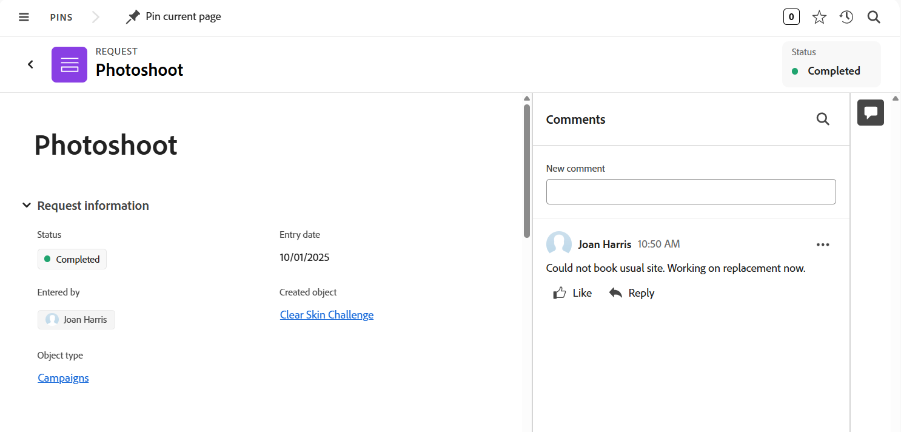

# Enviar solicitações do Adobe Workfront Planning para criar registros

<!--update title when there will be more functionality added to the Planning requests, besides creating records-->
<!--take Preview and Prod references out when releasing to Prod all-->

As informações destacadas nesta página referem-se a funcionalidades que ainda não estão disponíveis. Ela está disponível somente no ambiente de Pré-visualização para todos os clientes. Depois das versões mensais para produção, os mesmos recursos também ficam disponíveis no ambiente de produção para clientes que ativaram versões rápidas. 

Para obter informações sobre versões rápidas, consulte [Habilitar ou desabilitar versões rápidas para sua organização](/help/quicksilver/administration-and-setup/set-up-workfront/configure-system-defaults/enable-fast-release-process.md). 

{{planning-important-intro}}

Depois que um gerenciador de espaço de trabalho cria um formulário de solicitação para um tipo de registro no Adobe Workfront Planning, você pode usar o formulário para submeter solicitações que criarão registros para o tipo de registro associado ao formulário.

Você pode submeter uma solicitação do Workfront Planning nas seguintes áreas:

* Na área Solicitações do Workfront.
* De um link direto para o formulário de solicitação que foi compartilhado.
* Na página tipo de registro, ao adicionar ou solicitar um novo registro. Para obter informações, consulte [Criar registros](/help/quicksilver/planning/records/create-records.md).

Este artigo descreve como enviar uma solicitação para adicionar novos registros a um tipo de registro da área Solicitações do Workfront ou de um link compartilhado.

Usuários do Workfront e usuários externos podem enviar solicitações para tipos de registro do Planning. As solicitações criam registros para o tipo de registro associado ao formulário de solicitação. <!--double check on the external users-->

Para obter informações sobre como um gerenciador de espaço de trabalho pode criar um formulário de solicitação e associá-lo a um tipo de registro, consulte [Criar e gerenciar um formulário de solicitação no Adobe Workfront Planning](/help/quicksilver/planning/requests/create-request-form.md).

## Requisitos de acesso

+++ Expanda para visualizar os requisitos de acesso da funcionalidade neste artigo. 

<table style="table-layout:auto"> 
<col> 
</col> 
<col> 
</col> 
<tbody> 
<tr> 
   <td role="rowheader">
Pacotes Adobe Workfront
</td> 
   <td> 

Qualquer pacote do Workfront e qualquer pacote do Planning

Ou

Qualquer pacote de fluxo de trabalho e qualquer pacote de planejamento

Para obter mais informações sobre o que está incluído em cada pacote do Workfront Planning, entre em contato com o representante de conta da Workfront.

   </td> </tr>

</tr> 
  <tr> 
   <td role="rowheader">
Licença do Adobe Workfront
</td> 
   <td>
Qualquer
 
  </td> 
  </tr> 
  <tr> 
   <td role="rowheader">
Permissões de objeto
</td> 
   <td>   
Exibir permissões ou mais altas para um espaço de trabalho e tipo de registro, se você for um usuário do Workfront
  </td> 
  </tr>  
</tbody> 
</table>

Para obter mais informações sobre requisitos de acesso do Workfront, consulte [Requisitos de acesso na documentação do Workfront](/help/quicksilver/administration-and-setup/add-users/access-levels-and-object-permissions/access-level-requirements-in-documentation.md).

+++

## Pré-requisitos

Para que você possa enviar uma solicitação para um formulário de solicitação do Workfront Planning, é necessário que o seguinte esteja em vigor:

* Deve existir o seguinte no Workfront Planning:

   * Um espaço de trabalho
   * Um tipo de registro
   * Um formulário de solicitação associado a um tipo de registro.

     Para obter informações, consulte [Criar um formulário de solicitação no Adobe Workfront Planning](/help/quicksilver/planning/requests/create-request-form.md).

* O formulário de solicitação deve ser compartilhado de uma maneira que você possa acessá-lo. Existem os seguintes cenários:

   * Internamente, o formulário deve ser compartilhado com usuários que têm permissões de Exibição ou superiores para o espaço de trabalho.

     Os usuários do Workfront podem acessar o formulário por meio de um link ou localizá-lo na área Solicitações do Workfront.

   * Externamente, compartilhando um link para o formulário de registro com pessoas externas que não têm uma conta do Workfront.

     Os usuários do Workfront também podem acessar o link compartilhado com pessoas externas.

* Se compartilhado com um link, o link para o formulário não deve expirar.

## Considerações sobre o envio de solicitações ao Workfront Planning

* Não é possível editar uma solicitação no Workfront depois de enviá-la.
* Cada solicitação enviada cria um registro para o tipo de registro associado ao form usado, se o form não estiver associado a uma aprovação ou se a aprovação tiver sido concedida por todos os aprovadores.
* Os registros criados ao enviar formulários de solicitação são idênticos aos registros adicionados por qualquer outro método no Workfront Planning.

  Para obter informações, consulte [Criar registros](/help/quicksilver/planning/records/create-records.md).
* Os registros criados enviando formulários de solicitação são conectados à solicitação original. Esta conexão não pode ser removida.
* Você pode exibir os registros criados e a solicitação nas seguintes áreas:
   * Área Solicitações no Workfront

  

   * Registros em qualquer página de tipo de registro no campo Conexão da solicitação original
   * Caixa de visualização Detalhes do registro no campo Conexão da solicitação original

  

* As solicitações enviadas são exibidas na área Solicitações do Workfront.
* As solicitações de Planejamento enviadas estão visíveis somente na nova experiência de solicitação. Não é possível ver as solicitações do Planning na experiência de solicitação herdada.
Para obter informações, consulte [Criar e enviar solicitações](/help/quicksilver/manage-work/requests/create-requests/create-submit-requests.md).
* Há limitações na forma como determinados tipos de campo são exibidos em um formulário de solicitação ou na página de detalhes da solicitação após o envio de um formulário.

  Para obter informações, consulte [Criar e gerenciar um formulário de solicitação no Adobe Workfront Planning](/help/quicksilver/planning/requests/create-request-form.md).

<!--Not sure how to change the request status, but dev also said: Changing the names of the statuses might lead to some inconsistency between unified-approvals-service and intake-approvals-flow.-->

## Enviar uma solicitação ao Workfront Planning na área Solicitações do Workfront

{{step1-to-requests}}

1. Habilite a configuração **Alternar para uma nova experiência**, no canto superior direito da tela.
Habilitar essa configuração torna os formulários de solicitação do Workfront Planning disponíveis na área **Solicitações** do Workfront.

   >[!TIP]
   >
   >Essa configuração só está disponível quando a instância do Workfront é integrada à Experiência unificada do Adobe.
   >
   >Para poder enviar solicitações do Workfront Planning nessa área, você deve atender às seguintes condições:
   >
   >* Sua empresa adquiriu uma licença do Workfront Planning.
   >
   >* Você tem acesso para exibir pelo menos um espaço de trabalho.

1. Clique na barra **Que solicitação você deseja enviar** para abrir uma lista de formulários de solicitação.
1. Selecione um formulário de solicitação na lista ou comece a digitar o nome do formulário de solicitação e selecione-o quando ele aparecer na lista.

   Uma janela é aberta com o nome do formulário de solicitação na parte superior.
1. Atualize os campos disponíveis no formulário de solicitação. Os campos com um asterisco vermelho são obrigatórios.
1. Clique em **Enviar**.

   O formulário de solicitação é fechado e você retorna à área **Solicitações**.

   Seu formulário é enviado e os seguintes itens ocorrem:

   * Se o formulário de solicitação não estava associado a uma aprovação, a solicitação é adicionada à lista Solicitações na área Solicitações do Workfront e o widget Minhas solicitações na Página inicial, e um novo registro é adicionado ao tipo de registro associado ao formulário.

     Os campos a seguir exibem informações de solicitação e registro na área Solicitações e o widget Minhas solicitações na Página inicial:

      * **Assunto**: o nome da solicitação original como adicionado na área Solicitações. Você não pode ocultar ou remover o campo **Assunto** da lista de solicitações.
      * **Objeto criado**: o nome do registro que foi criado a partir da solicitação como ele é exibido no Planning.
      * **Tipo de objeto**: o nome do espaço de trabalho e o tipo de registro em que foram criados registros a partir da solicitação no Planning.
      * **Status**: o status do objeto de solicitação.
      * **Formulário de solicitação**: o nome do formulário de solicitação associado ao tipo de registro no Planning.

   * Se o formulário de solicitação foi associado a uma aprovação, a solicitação é adicionada à lista Solicitações na área Solicitações do Workfront e o widget Minhas solicitações com um status Revisão pendente. Um novo registro é adicionado à página de tipo de registro somente após ser aprovado pelos aprovadores.

     Para obter informações, consulte [Adicionar uma aprovação a um formulário de solicitação](/help/quicksilver/planning/requests/add-approval-to-request-form.md).

   * Você pode adicionar o campo Conexão da solicitação original a um tipo de registro no Planning que exiba o nome da solicitação original. Para obter informações, consulte [Tipos de registro de conexão](/help/quicksilver/planning/architecture/connect-record-types.md). 
   * A solicitação é visível somente para o proprietário, aprovador e pessoas que têm pelo menos permissões de Visualização no espaço de trabalho. Os administradores do Workfront podem exibir todas as solicitações enviadas para qualquer espaço de trabalho no sistema.

   * Você recebe uma notificação no aplicativo e uma notificação por email informando que a solicitação foi enviada com êxito ou para revisão.
   * Se o formulário de solicitação foi associado a uma aprovação, os aprovadores recebem uma notificação no aplicativo e uma notificação por email para revisar e aprovar a solicitação.

     >[!NOTE]
     >
     >As notificações por email e no aplicativo ficam visíveis somente quando a instância da Workfront da sua organização é integrada à Adobe Unified Experience.
     >
     >Há um link para a solicitação na notificação de confirmação ou aprovação por email.

1. (Opcional) Clique em **Exibir sua solicitação** na mensagem de confirmação para abrir a solicitação ou clique no ícone **X** para fechar a confirmação.
1. (Opcional) Na lista de solicitações, siga um destes procedimentos:

   * Clique em **Filtros** e comece a adicionar condições para quais solicitações você deseja exibir na lista Solicitações.

     

     Você pode filtrar pelos seguintes campos:

      * **Workspace**: o espaço de trabalho ao qual o formulário de solicitação está associado.
      * **Tipo de registro**: o tipo de registro ao qual o formulário de solicitação está associado.
      * **Data de entrada**: a data em que a solicitação foi enviada.
      * **Formulário de solicitação**: o nome do formulário de solicitação usado para enviar a solicitação.
      * **Status**: o status da solicitação.
      * **Inserido por**: o nome do usuário que adicionou a solicitação. Se a solicitação foi adicionada por alguém fora do Workfront, o campo **Informado por** mostrará `N/A`.
      * **Status do objeto criado**: o status do registro criado.

     Você pode ter vários filtros unidos por **And** ou **Or**.
A lista de solicitações é filtrada automaticamente ao adicionar as condições de filtro.

   * Clique em **Colunas** para abrir a caixa **Visibilidade e ordem dos campos** e, em seguida, ocultar, mostrar ou reorganizar as colunas na lista de solicitações.

     >[!TIP]
     >
     >Não é possível adicionar mais colunas.

     
   * Clique no ícone **+** no canto superior direito da lista de solicitações para abrir o **Gerenciador de colunas** e adicionar ou remover colunas na lista de solicitações.

1. Clique no nome de uma solicitação na lista.

   A página de detalhes da solicitação é aberta.

   

1. (Opcional) Insira um comentário na área **Comentários**.
1. (Condicional) Se o formulário de solicitação não estiver associado a uma aprovação ou se a solicitação tiver sido aprovada, clique no nome da solicitação e, em seguida, clique no nome do registro no campo **Objeto criado**.

   A página do registro é aberta no Workfront Planning.

   >[!TIP]
   >
   >* Se o campo principal do registro não foi atualizado no formulário de solicitação, o nome do registro no campo Registro da solicitação será exibido como **Sem título**.
   >
   >* Se o formulário de solicitação estiver associado a uma aprovação, a aprovação deverá ser concedida antes que você possa acessar o registro da página de solicitação.

1. (Opcional) Clique no nome do **Tipo de registro**.

   A página de tipo de registro é aberta no Workfront Planning.

## Enviar uma solicitação ao Workfront Planning a partir de um link compartilhado para um formulário de solicitação

As informações desta seção se aplicam somente aos usuários do Workfront que enviam uma solicitação de um link compartilhado. As pessoas externas não podem acessar as áreas internas da Workfront, como Solicitações ou Página inicial.

1. Acesse o link compartilhado com você a partir de um tipo de registro do Workfront Planning.

1. Atualize os campos disponíveis no formulário. Os campos com um asterisco são obrigatórios.

   >[!TIP]
   >
   >   Se o campo **Assunto** estiver disponível, ele não estará visível no Workfront Planning após o envio da solicitação.
   >
   >Recomendamos que você atualize o máximo possível de campos em sua solicitação para tornar o novo registro identificável quando ele for adicionado ao tipo de registro no Workfront Planning.

1. Clique em **Enviar**.

   Seu formulário é enviado e os seguintes itens ocorrem:

   * Se o formulário de solicitação não estava associado a uma aprovação, a solicitação é adicionada à lista Solicitações na área Solicitações do Workfront e o widget Minhas solicitações na Página inicial, e um novo registro é adicionado ao tipo de registro associado ao formulário.

   * Se o formulário de solicitação foi associado a uma aprovação, a solicitação é adicionada à lista Solicitações na área Solicitações do Workfront e no widget Minhas solicitações. Um novo registro é adicionado à página de tipo de registro somente após ser aprovado por todos os aprovadores.

     Para obter informações, consulte [Adicionar uma aprovação a um formulário de solicitação](/help/quicksilver/planning/requests/add-approval-to-request-form.md).

     >[!IMPORTANT]
     >
     >Você pode exibir somente as solicitações submetidas por você ou por qualquer outra pessoa aos espaços de trabalho para os quais você tem pelo menos permissões. Os administradores do Workfront podem exibir todas as solicitações enviadas para qualquer espaço de trabalho no sistema. <!--ensure this is correct; asking team in slack-->

   * Você recebe uma notificação no aplicativo e uma notificação por email informando que a solicitação foi enviada com êxito ou para revisão.
   * Se o formulário de solicitação foi associado a uma aprovação, os aprovadores recebem uma notificação no aplicativo e uma notificação por email para revisar e aprovar a solicitação.

     >[!NOTE]
     >
     >As notificações por email e no aplicativo ficam visíveis somente quando a instância da Workfront da sua organização é integrada à Adobe Unified Experience.

   <!--  After the request was approved and the record was created, the Approved by and Approved date fields display information about the approval on the record.-->

1. (Opcional) Clique em **Exibir sua solicitação** para abrir a solicitação no Workfront.

   <!--Or-->

   <!--Click [Submit another request](https://pulsar.devtest.workfront-dev.com/intake/6740a1ff44bf3a5600cf4481/request) to open the request form and add a new request.-->

1. (Opcional) Clique em **Menu principal** > **Solicitações** para exibir sua solicitação e clique no nome da solicitação.

   A página de detalhes da solicitação é aberta.

   

1. (Opcional) Insira um comentário na área Comentários.
1. (Condicional) Se o formulário de solicitação não estiver associado a uma aprovação ou se a solicitação tiver sido aprovada, clique no nome da solicitação e, em seguida, clique no nome do registro no campo **Objeto criado**.

   A página do registro é aberta no Workfront Planning.

   >[!TIP]
   >
   >* Se o nome do registro não foi adicionado ao formulário de solicitação, o nome do registro no campo Registro da solicitação será exibido como **Sem título**.
   >
   >* Se o formulário de solicitação estiver associado a uma aprovação, a aprovação deverá ser concedida antes que você possa acessar o registro da página de solicitação.

1. (Opcional) Clique no nome do **Tipo de objeto**.

   A página de tipo de registro é aberta no Workfront Planning.

## Criar uma solicitação copiando uma solicitação existente

Você pode copiar uma solicitação na lista de solicitações no Workfront e, em seguida, editar os detalhes e enviá-la como uma nova solicitação.

Isso está disponível somente na nova experiência de solicitação.

Para obter instruções, consulte [Copiar e enviar solicitações](/help/quicksilver/manage-work/requests/create-requests/copy-and-submit-requests.md).

## Criar rascunhos e solicitações a partir de rascunhos existentes

Você pode criar um rascunho de uma solicitação, voltar ao rascunho e submetê-lo posteriormente como uma solicitação.

Isso está disponível somente na nova experiência de solicitação.

Para obter instruções, consulte [Criar solicitações de rascunhos](/help/quicksilver/manage-work/requests/create-requests/create-requests-from-drafts.md).

