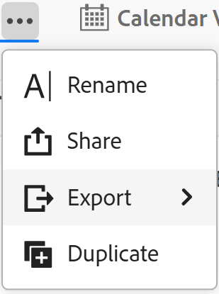

# Exibições de registro duplicadas

As informações destacadas nesta página referem-se a funcionalidades que ainda não estão disponíveis. Ela está disponível somente no ambiente de Pré-visualização para todos os clientes. Depois das versões mensais para produção, os mesmos recursos também ficam disponíveis no ambiente de produção para clientes que ativaram versões rápidas. 

Para obter informações sobre versões rápidas, consulte [Habilitar ou desabilitar versões rápidas para sua organização](/help/quicksilver/administration-and-setup/set-up-workfront/configure-system-defaults/enable-fast-release-process.md). 

{{planning-important-intro}}

Se quiser manter várias versões de uma exibição e fazer pequenas alterações entre as versões, você poderá duplicar uma exibição no Adobe Workfront Planning.

A duplicação de uma exibição cria cópias idênticas de uma exibição existente.

As permissões de compartilhamento da exibição original não são transferidas para a exibição duplicada.

A duplicação de exibições é idêntica para todos os tipos de exibições no Workfront Planning.

## Requisitos de acesso

+++ Expanda para visualizar os requisitos de acesso.

Você deve ter o seguinte acesso para executar as etapas deste artigo:

<table style="table-layout:auto"> 
<col> 
</col> 
<col> 
</col> 
<tbody> 
    <tr> 
<tr> 
<td> 
   
 Produtos
 </td> 
   <td> 
   <ul><li>
 Adobe Workfront
</li> 
   <li>
 Planejamento do Adobe Workfront
</li></ul></td> 
  </tr>   
<tr> 
   <td role="rowheader">
plano do Adobe Workfront*
</td> 
   <td> 

Qualquer um dos seguintes planos da Workfront:
 
<ul><li>Selecionar</li> 
<li>Prime</li> 
<li>Ultimate</li></ul> 

O Workfront Planning não está disponível para planos herdados do Workfront
 
   </td> 
<tr> 
   <td role="rowheader">
Pacote de planejamento do Adobe Workfront*
</td> 
   <td> 

Qualquer 
 

Para obter mais informações sobre o que está incluído em cada plano do Workfront Planning, entre em contato com seu gerente de conta da Workfront. 
 
   </td> 
 <tr> 
   <td role="rowheader">
plataforma Adobe Workfront
</td> 
   <td> 

A instância da Workfront de sua organização deve ser integrada à Adobe Unified Experience para acessar todos os recursos do Workfront Planning.
 

Para obter mais informações, consulte <a href="/help/quicksilver/workfront-basics/navigate-workfront/workfront-navigation/adobe-unified-experience.md">Experiência unificada da Adobe para Workfront</a>. 
 
   </td> 
   </tr> 
  </tr> 
  <tr> 
   <td role="rowheader">
Licença da Adobe Workfront*
</td> 
   <td>
 Padrão 

   
O Workfront Planning não está disponível para licenças herdadas do Workfront
 
  </td> 
  </tr> 
  <tr> 
   <td role="rowheader">
Configuração do nível de acesso
</td> 
   <td> 
Não há controles de nível de acesso para o Adobe Workfront Planning
   
</td> 
  </tr> 
<tr> 
   <td role="rowheader">
Permissões de objeto
</td> 
   <td>   
Gerenciar permissões para uma exibição
  
   
Exibir permissões de um modo de exibição para alterar temporariamente as configurações de modo de exibição ou duplicá-lo
 </td> 
  </tr> 
<tr> 
   <td role="rowheader">
Modelo de layout
</td> 
   <td> 
No ambiente de Produção, todos os usuários, inclusive os Administradores do Sistema, devem ser atribuídos a um modelo de layout que inclua o Planning.

No ambiente de Pré-visualização, os usuários do Standard e os administradores do sistema têm o Planning habilitado por padrão.
</td> 
  </tr> 
</tbody> 
</table>

*Para obter mais informações sobre requisitos de acesso do Workfront, consulte [Requisitos de acesso na documentação do Workfront](/help/quicksilver/administration-and-setup/add-users/access-levels-and-object-permissions/access-level-requirements-in-documentation.md).

+++

## Duplicar uma visualização de registro

{{step1-to-planning}}

1. Clique no cartão de um espaço de trabalho.

   O espaço de trabalho é aberto e os tipos de registro são exibidos como cartões.

1. Clique em um cartão de tipo de registro.

   A página de tipo de registro é aberta.
Por padrão, todos os registros do tipo selecionado são exibidos na exibição de tabela.

1. Passe o mouse sobre a guia da exibição que você deseja duplicar e clique no menu **Mais**  à direita do nome da exibição e clique em **Duplicar**.

   

   A exibição está duplicada e o nome da nova exibição segue o seguinte padrão: `Original view's name (Copy)`. A nova guia de exibição é exibida no final de todas as guias de exibição.