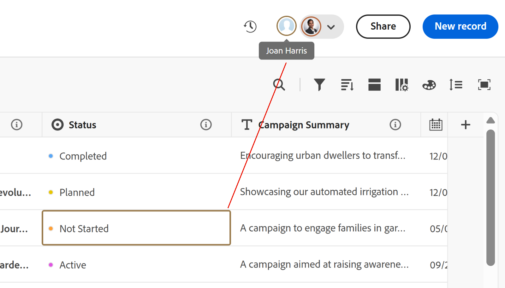

# Gerenciar exibições de registro

<!--The highlighted information on this page refers to functionality not yet generally available. It is available only in the Preview environment for all customers. After the monthly releases to Production, the same features are also available in the Production environment for customers who enabled fast releases.    

For information about fast releases, see [Enable or disable fast releases for your organization](/help/quicksilver/administration-and-setup/set-up-workfront/configure-system-defaults/enable-fast-release-process.md).    -->

{{planning-important-intro}}

Depois de selecionar um tipo de registro na área Adobe Workfront Planning, você pode exibir todos os registros desse tipo nas seguintes exibições:

* Tabela

  Para obter mais informações, consulte [Gerenciar a exibição de tabela](/help/quicksilver/planning/views/manage-the-table-view.md).

* Linha do tempo

  Para obter mais informações, consulte [Gerenciar a exibição da linha do tempo](/help/quicksilver/planning/views/manage-the-timeline-view.md).

* Calendário

  Para obter mais informações, consulte [Gerenciar a exibição de calendário](/help/quicksilver/planning/views/manage-the-calendar-view.md).

Este artigo descreve as seguintes informações sobre visualizações de registro:

* [Criar e editar um modo de exibição](#create-or-edit-record-views)
* [Excluir um modo de exibição](#delete-views)
* [Duplicar uma visualização](#duplicate-views)
* [Habilitar os indicadores de presença em tempo real em uma exibição](#enable-the-real-time-presence-indicator-in-a-view)
  <!--* [Add a view as a favorite](#add-a-view-as-a-favorite) - not possible yet-->

## Requisitos de acesso

+++ Expanda para visualizar os requisitos de acesso.

Você deve ter o seguinte acesso para executar as etapas deste artigo:

<table style="table-layout:auto"> 
<col> 
</col> 
<col> 
</col> 
<tbody> 
    <tr> 
<tr> 
<td> 
   
 Produtos
 </td> 
   <td> 
   <ul><li>
 Adobe Workfront
</li> 
   <li>
 Planejamento do Adobe Workfront
</li></ul></td> 
  </tr>   
<tr> 
   <td role="rowheader">
plano do Adobe Workfront*
</td> 
   <td> 

Qualquer um dos seguintes planos da Workfront:
 
<ul><li>Selecionar</li> 
<li>Prime</li> 
<li>Ultimate</li></ul> 

O Workfront Planning não está disponível para planos herdados do Workfront
 
   </td> 
<tr> 
   <td role="rowheader">
Pacote de planejamento do Adobe Workfront*
</td> 
   <td> 

Qualquer 
 

Para obter mais informações sobre o que está incluído em cada plano do Workfront Planning, entre em contato com seu gerente de conta da Workfront. 
 
   </td> 
 <tr> 
   <td role="rowheader">
plataforma Adobe Workfront
</td> 
   <td> 

A instância da Workfront de sua organização deve ser integrada à Adobe Unified Experience para acessar todos os recursos do Workfront Planning.
 

Para obter mais informações, consulte <a href="/help/quicksilver/workfront-basics/navigate-workfront/workfront-navigation/adobe-unified-experience.md">Experiência unificada da Adobe para Workfront</a>. 
 
   </td> 
   </tr> 
  </tr> 
  <tr> 
   <td role="rowheader">
Licença da Adobe Workfront*
</td> 
   <td>
 Padrão 

   
O Workfront Planning não está disponível para licenças herdadas do Workfront
 
  </td> 
  </tr> 
  <tr> 
   <td role="rowheader">
Configuração do nível de acesso
</td> 
   <td> 
Não há controles de nível de acesso para o Adobe Workfront Planning
   
</td> 
  </tr> 
<tr> 
   <td role="rowheader">
Permissões de objeto
</td> 
   <td>   
Gerenciar permissões para uma exibição
  
   
Permissões de exibição para uma exibição para alterar temporariamente as configurações de exibição
 </td> 
  </tr> 
<tr> 
   <td role="rowheader">
Modelo de layout
</td> 
   <td> 
Todos os usuários, incluindo administradores do Workfront, devem receber um modelo de layout que inclua a área Planejamento no Menu principal. 
 </td> 
  </tr> 
</tbody> 
</table>

*Para obter mais informações sobre requisitos de acesso do Workfront, consulte [Requisitos de acesso na documentação do Workfront](/help/quicksilver/administration-and-setup/add-users/access-levels-and-object-permissions/access-level-requirements-in-documentation.md).

+++

<!--old: 

<table style="table-layout:auto">
 <col>
 </col>
 <col>
 </col>
 <tbody>
    <tr>
<tr>
<td>
   
 Product
 </td>
   <td>
   
 Adobe Workfront
 </td>
  </tr>  
 <td role="rowheader">
Adobe Workfront agreement
</td>
   <td>

Your organization must be enrolled in the early access stage for Workfront Planning 

   </td>
  </tr>
  <tr>
   <td role="rowheader">
Adobe Workfront plan
</td>
   <td>

Any

   </td>
  </tr>
  <tr>
   <td role="rowheader">
Adobe Workfront license*
</td>
   <td>
   
New: Standard

   Or
   
Current: Plan 
 
  </td>
  </tr>
  
  <tr>
   <td role="rowheader">
Access level configurations
</td>
   <td> There are no access controls for Adobe Workfront Planning
  
</td>
  </tr>

  <tr>
   <td role="rowheader">
Permissions
</td>
   <td> 
Manage permissions to a view
  
   
View permissions to a view to temporarily change the view settings

</td>
  </tr>

<tr>
   <td role="rowheader">
Layout template
</td>
   <td> 
All users, including Workfront administrators,  must be assigned a layout template that includes the Planning area in the Main Menu. 
 
For information, see <a href="/help/quicksilver/planning/access/access-overview.md">Access overview</a>. 
 
</td>
  </tr>
 </tbody>
</table>

*For information, see [Access requirements in Workfront documentation](/help/quicksilver/administration-and-setup/add-users/access-levels-and-object-permissions/access-level-requirements-in-documentation.md). -->

## Considerações ao trabalhar com visualizações de registro

* As exibições no Workfront Planning são específicas do tipo de registro. Não é possível aplicar a mesma exibição a dois tipos de registro diferentes.
* As exibições criadas estão visíveis somente para você e os usuários com os quais você compartilha as exibições.
* Quando você modifica ou exclui uma exibição, ela é modificada e excluída para todos os usuários que têm permissões para a exibição.
* Cada usuário pode criar no máximo 100 visualizações. Você pode exibir mais de 100 visualizações para um tipo de registro, mas um usuário pode criar apenas 100 visualizações.
* É possível compartilhar visualizações criadas com outras pessoas. Para obter informações, consulte [Compartilhar modos de exibição](/help/quicksilver/planning/access/share-views.md).
* Os seguintes elementos são exclusivos para cada exibição de registro:

   * Filtro
   * Agrupamento
   * Ordenar
   * Aparência da barra (para a exibição de linha do tempo)

  <!-- some of these are not available in all of the views - edit above-->

  Por exemplo, ao criar um filtro em uma exibição de tabela, os resultados do filtro ficam visíveis somente na exibição selecionada e não em todas as exibições associadas ao tipo de registro.

  >[!NOTE]
  >
  > Alguns elementos de visualização podem não estar disponíveis para todas as visualizações.

## Semelhanças e diferenças entre visualizações de registro

A tabela a seguir mostra as semelhanças e diferenças entre as exibições de tabela, linha do tempo e calendário:

<!--some of these are NOT available right now; if you make this public, comment out the ones not there-->

| Recurso | Exibição em tabela | Visualização da linha do tempo | Exibição de calendário |
|-----------------------------------------------------------------------|------------|---------------|--------------|
| Exibir registros em uma lista ou tabela | ✓ |              | |
| Exibir todos os campos como colunas na tabela, por padrão | ✓ |              |    |
| Ocultar ou mostrar campos (ou colunas) | ✓ |               |    |
| Editar valores de campo para cada registro | ✓ |               |             |
| Adicionar registros como novas linhas na exibição | ✓ |               |        |
| Adicionar campos como novas colunas na exibição | ✓ |               |         |
| Copiar linhas de uma lista externa e colá-las em uma tabela | ✓ |               |          |
| Exibir registros em uma linha do tempo |            | ✓ |             |
| Filtrar registros | ✓ | ✓ | ✓ |
| Exibir registros em um calendário |           |              | ✓ |
| Registros de grupo | ✓ | ✓ |
| Classificar registros | ✓ |              |
| Registros de código de cores |           | ✓ | ✓ |
| Agrupamentos de código de cores |           | ✓ |
| Pesquisar registros específicos | ✓ | ✓ |
| Compartilhar a exibição com outras pessoas | ✓ | ✓ | ✓ |
| Abrir a página do registro na exibição | ✓ | ✓ |    |
| Exibir registros por ano e trimestre |           | ✓ |    |
| Exibir registros por mês |           | ✓ | ✓ |
| Exibir registros por semana |           |               | ✓ |

## Criar ou editar exibições {#create-or-edit-views}

{{step1-to-planning}}

1. Clique no cartão de um espaço de trabalho.

   O espaço de trabalho é aberto e os tipos de registro são exibidos como cartões.

1. Clique em um cartão de tipo de registro.

   A página de tipo de registro é aberta.

   Por padrão, todos os registros do tipo selecionado são exibidos na exibição de tabela.

1. Clique em **+ Exibição** para adicionar um novo modo de exibição.
1. Selecione entre os seguintes tipos de exibições:

   * Tabela
   * Linha do tempo
   * Calendário

   Uma nova guia é criada com a exibição selecionada.

   Dependendo da largura da tela, modos de exibição adicionais podem ser exibidos no menu **Mais** .

>[!TIP]
>
>Quando você cria um tipo de registro, a exibição de tabela também é criada por padrão.
>
>Para criar uma exibição de linha do tempo ou calendário, o tipo de registro para o qual você cria a exibição deve ter pelo menos dois campos de data.
>
>Caso contrário, as opções Linha do tempo e Calendário estarão esmaecidas.
>

1. (Condicional) Clique em **Avançar** ao criar uma exibição de linha do tempo ou calendário.

   Por padrão, o Workfront atribui à exibição um dos seguintes nomes:

   * `Table < number >`
   * `Timeline < number >`
   * `Calendar < number >`

   O número é um incremento gerado automaticamente.

1. (Condicional) Selecione as **Datas de início** e **datas de término** para os registros que serão exibidos na exibição de linha do tempo ou calendário.

   >[!TIP]
   >
   >    Você pode selecionar entre campos de data de registro ou campos de data de pesquisa a partir de tipos de objeto ou registro conectados. Você deve usar agregadores para campos de data (MAX ou MIN) ao selecionar campos de pesquisa como datas Inicial e Final para as exibições de linha do tempo e calendário. Para obter informações, consulte [Tipos de registro de conexão](/help/quicksilver/planning/architecture/connect-record-types.md).

1. Clique em **Criar**.

   A visualização é exibida como uma nova guia. As exibições são exibidas na ordem cronológica de quando foram criadas ou compartilhadas com você.
1. (Opcional) Clique no menu **Mais**  ao lado da última exibição para exibir todas as exibições do tipo de registro selecionado.

   Exibições adicionais são exibidas no menu **Mais** após a última guia de exibição. O número ao lado do menu **Mais** mostra o número de exibições adicionais.
1. (Opcional) Para renomear uma exibição depois de sua criação, clique no menu suspenso exibição e no menu **Mais**  > **Renomear** para atualizar o nome da exibição

   Ou

   Clique duas vezes no nome da exibição e comece a digitar o novo nome.  <!--ensure there is not another saving step here?!-->

1. (Opcional) Para gerenciar um tipo específico de visualização, consulte os seguintes artigos:

   * [Gerenciar a exibição de tabela](/help/quicksilver/planning/views/manage-the-table-view.md)
   * [Gerenciar a exibição de linha do tempo](/help/quicksilver/planning/views/manage-the-timeline-view.md)
   * [Gerenciar a exibição de calendário](/help/quicksilver/planning/views/manage-the-calendar-view.md)

## Excluir visualizações

{{step1-to-planning}}

1. Clique no cartão de um espaço de trabalho.

   O espaço de trabalho é aberto e os tipos de registro são exibidos como cartões.

1. Clique em um cartão de tipo de registro.

   A página de tipo de registro é aberta.

   Por padrão, todos os registros do tipo selecionado são exibidos na exibição de tabela.

1. Passe o mouse sobre um dos nomes de exibição na guia de exibição, em seguida, clique em **Mais**  à esquerda do nome da exibição e em **Excluir**.
Primeiro, talvez seja necessário clicar em **Mais** à esquerda da última guia para localizar o modo de exibição que você deseja excluir.

1. Clique em **Excluir** para confirmar. <!--ensure there is not another saving step here?!-->

   A exibição é excluída para todos os usuários que podem acessar a área de registros e não pode ser recuperada.

<!--## Add a view as a favorite - this is not possible yet-->

<!--not possible yet - August 30, 2023: -->

## Duplicar uma visualização

Se quiser manter várias versões de uma exibição e fazer pequenas alterações entre as versões, você poderá duplicar uma exibição.

A duplicação de uma exibição cria cópias idênticas de uma exibição existente.

As permissões de compartilhamento da exibição original não são transferidas para a exibição duplicada.

{{step1-to-planning}}

1. Clique no cartão de um espaço de trabalho.

   O espaço de trabalho é aberto e os tipos de registro são exibidos como cartões.

1. Clique em um cartão de tipo de registro.

   A página de tipo de registro é aberta.
Por padrão, todos os registros do tipo selecionado são exibidos na exibição de tabela.

1. Passe o mouse sobre a guia da exibição que você deseja duplicar, clique no menu **Mais**  à direita do nome da exibição e clique em **Duplicar**.

   

   A exibição está duplicada e o nome da nova exibição segue o seguinte padrão: `Original view's name (Copy)`. A nova guia de exibição é exibida no final de todas as guias de exibição.

## Ativar o indicador de presença em tempo real em uma exibição

Os avatares de outros usuários que estão editando informações de registro ao mesmo tempo que você exibe no canto superior direito de todas as visualizações de registro, por padrão.

Ao exibir a visualização de tabela, você também pode visualizar qual campo outro usuário está editando no momento em que você está visualizando o registro.

1. Ir para uma página de tipo de registro e abrir qualquer exibição.
1. (Condicional) Se houver outros usuários editando os registros do tipo selecionado ao mesmo tempo, seus avatares serão exibidos no canto superior direito da exibição.
1. Clique no menu suspenso ao lado dos avatares e selecione a opção **Mostrar colaboradores**. O botão de alternância é selecionado por padrão.

   

1. (Condicional) Abra uma exibição de tabela e o campo que outra pessoa está editando ativamente será destacado na cor correspondente ao contorno do avatar na exibição de tabela.

   Se a cor de destaque do avatar for cinza, o usuário parou de editar ativamente o registro há mais de 30 segundos.

   

   >[!TIP]
   >
   >Você pode selecionar a opção **Mostrar colaboradores** de qualquer modo de exibição. O campo atualmente editado por outros é descrito somente na exibição de tabela.
