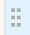
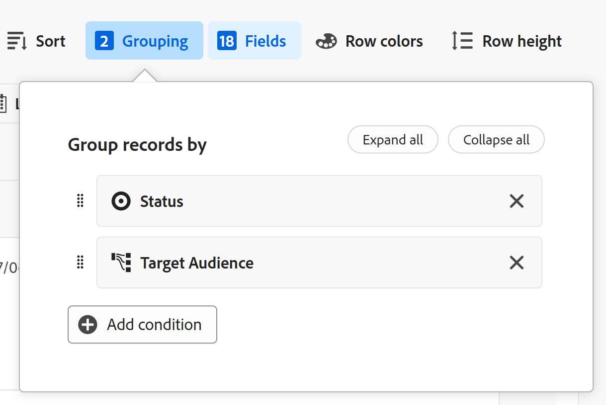
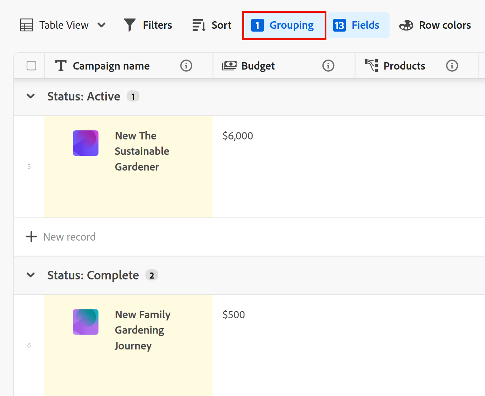
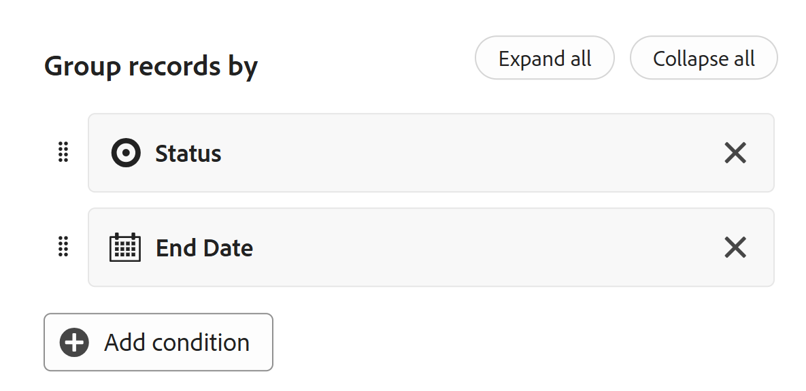
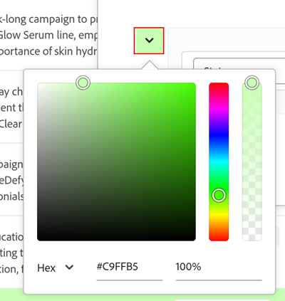
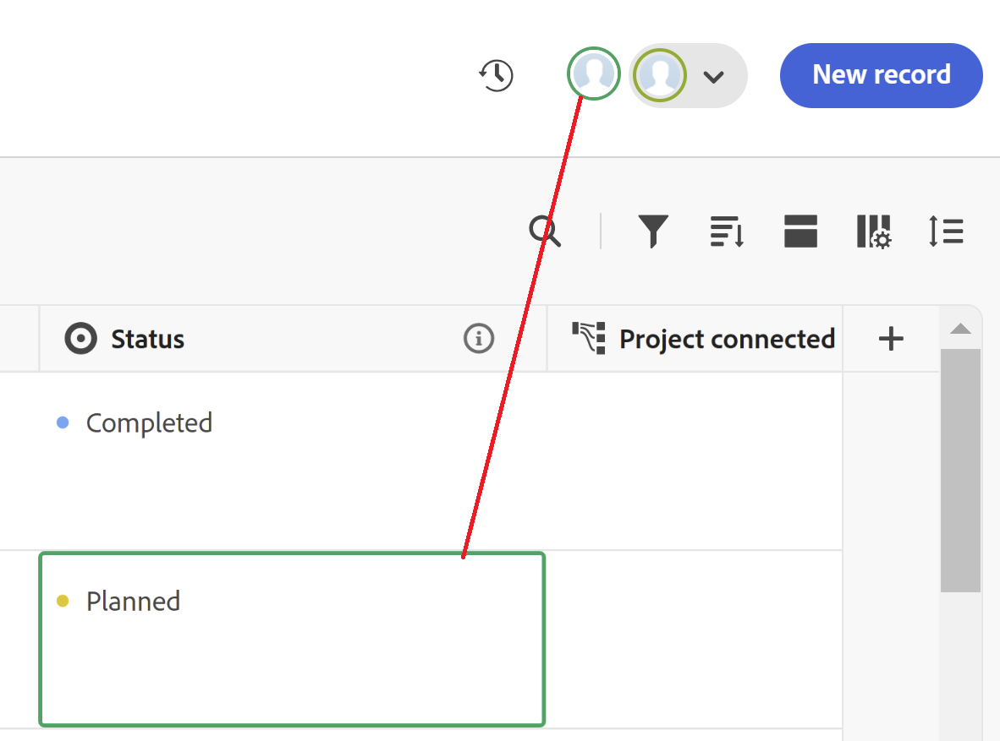
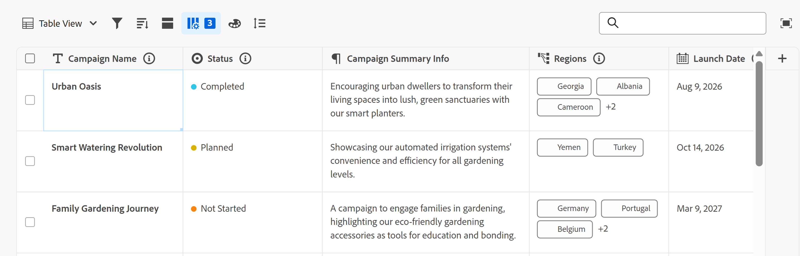

# Gerenciar a exibição de tabela

<!--
The information highlighted on this page refers to functionality not yet generally available. It is available only in the Preview environment for all customers. After the monthly releases to Production, the same features are also available in the Production environment for customers who enabled fast releases. 

For information about fast releases, see [Enable or disable fast releases for your organization](/help/quicksilver/administration-and-setup/set-up-workfront/configure-system-defaults/enable-fast-release-process.md). 
-->

{{planning-important-intro}}

Você pode exibir registros e seus campos em uma exibição de tabela, ao acessar a página tipo de registro no Adobe Workfront Planning.

Para obter informações sobre exibições de registros e como gerenciá-las, consulte [Gerenciar exibições de registros](/help/quicksilver/planning/views/manage-record-views.md).

Este artigo descreve as seguintes informações:

* [Criar ou editar colunas e linhas em uma exibição de tabela](#manage-a-table-view)
* [Habilitar indicadores de presença em tempo real para a exibição de tabela](#enable-the-real-time-presence-indicator)

Para obter informações sobre como exportar a exibição de tabela para um arquivo do Excel ou CSV, consulte [Exportar registros da exibição de tabela](/help/quicksilver/planning/records/export-records-from-the-table-view.md).

## Requisitos de acesso

+++ Expanda para exibir os requisitos de acesso para a funcionalidade neste artigo. 

<table style="table-layout:auto"> 
<col> 
</col> 
<col> 
</col> 
<tbody> 
    <tr> 
<tr> 
</tr>   
<tr> 
   <td role="rowheader">
Pacote do Adobe Workfront
</td> 
   <td> 

Qualquer Workfront e qualquer pacote do Planning

Qualquer fluxo de trabalho e qualquer pacote de planejamento

Para obter mais informações sobre o que está incluído em cada pacote do Workfront Planning, entre em contato com o representante de conta da Workfront. 
 
   </td> 
  <tr> 
   <td role="rowheader">
Licença do Adobe Workfront
</td> 
   <td>
 Padrão para criar e excluir visualizações

   
Colaborador ou superior para atualizar elementos de visualização

  </td> 
  </tr> 
  <tr> 
   <td role="rowheader">
Permissões de objeto
</td> 
   <td>   
Gerenciar permissões para uma exibição
  
   
Exibir permissões de um modo de exibição para alterar temporariamente as configurações de modo de exibição ou duplicá-lo
 </td> 
  </tr> 
</tbody> 
</table>

Para obter mais informações sobre requisitos de acesso do Workfront, consulte [Requisitos de acesso na documentação do Workfront](/help/quicksilver/administration-and-setup/add-users/access-levels-and-object-permissions/access-level-requirements-in-documentation.md).

+++ 

<!--
Old:
<table style="table-layout:auto"> 
<col> 
</col> 
<col> 
</col> 
<tbody> 
    <tr> 
<tr> 
<td> 
   
 Products
 </td> 
   <td> 
   <ul><li>
 Adobe Workfront
</li> 
   <li>
 Adobe Workfront Planning
</li></ul></td> 
  </tr>   
<tr> 
   <td role="rowheader">
Adobe Workfront plan*
</td> 
   <td> 

Any of the following Workfront plans:
 
<ul><li>Select</li> 
<li>Prime</li> 
<li>Ultimate</li></ul> 

Workfront Planning is not available for legacy Workfront plans
 
   </td> 
<tr> 
   <td role="rowheader">
Adobe Workfront Planning package*
</td> 
   <td> 

Any 
 

For more information about what is included in each Workfront Planning plan, contact your Workfront account manager. 
 
   </td> 
 <tr> 
   <td role="rowheader">
Adobe Workfront platform
</td> 
   <td> 

Your organization's instance of Workfront must be onboarded to the Adobe Unified Experience to be able to access Workfront Planning.
 

For more information, see <a href="/help/quicksilver/workfront-basics/navigate-workfront/workfront-navigation/adobe-unified-experience.md">Adobe Unified Experience for Workfront</a>. 
 
   </td> 
   </tr> 
  </tr> 
    <td role="rowheader">
Adobe Workfront license*
</td> 
   <td>
 Standard to create and delete views

   
Contributor or higher to update view elements

   
Workfront Planning is not available for legacy Workfront licenses
 
  </td> 
  </tr> 
  <tr> 
   <td role="rowheader">
Access level configuration
</td> 
   <td> 
There are no access level controls for Adobe Workfront Planning
   
</td> 
  </tr> 
<tr> 
   <td role="rowheader">
Object permissions
</td> 
   <td>   
Manage permissions to a view
  
   
View permissions to a view to temporarily change the view settings or to duplicate it
 </td> 
  </tr> 
<tr>
   <td role="rowheader">
Layout template
</td>
   <td> Users with a Light or Contributor license must be assigned a layout template that includes Planning.
   
Standard users and System Administrators have the Planning areas enabled by default.

</li></ul>
</td>
  </tr>
</tbody> 
</table>
-->

## Editar registros usando a exibição de tabela

É possível editar informações de registro na exibição de tabela.

Para obter mais informações sobre como editar registros na exibição de tabela, consulte [Editar registros](/help/quicksilver/planning/records/edit-records.md).

## Gerenciar uma exibição de tabela {#manage-a-table-view}

<!--
Depending on what environment you access record types from, the record type page displays using two different views: 

* Table view, in the Production environment
* List view, in the Preview environment

OR: 

If the List view in Project connected pages and request forms stays the same after GTable rolls out - keep that list as the List view and change the Table view in this article to "Table redesigned view" for now; keep it "the table view" here for the future; for the time being, just say "Updating the view in Prod and Preview is different and make the separate sections for Preview and Prod below with the different steps.

### Manage the table view in the Production environment
-->

Ao criar uma exibição de tabela, todos os registros do tipo selecionado são exibidos em uma tabela. Cada linha é um registro exclusivo e cada coluna é um campo de registro. Todos os campos e registros são exibidos por padrão.

Para gerenciar uma exibição de tabela:

1. Crie uma exibição de tabela, conforme descrito no artigo [Gerenciar exibições de registros](/help/quicksilver/planning/views/manage-record-views.md).

   

1. (Opcional) Clique em **Altura da linha** e selecione uma das seguintes opções para modificar a altura das linhas da tabela:
   * Pequena
   * Padrão
   * Médio
   * Alta

1. (Opcional) Clique no ícone **Tela cheia**  para abrir o modo de exibição em tela cheia, em seguida no ícone **Sair da tela cheia**  ou em Escape no teclado para sair da tela cheia.

1. Atualize os seguintes elementos de exibição conforme descrito nas subseções abaixo:
   * [Colunas (ou campos)](#add-columns-or-fields)
   * [Linhas (ou registros)](#add-rows-or-records)
   * [Filtros](#add-filters)
   * [Classificar](#add-a-sort)
   * [Agrupamento](#add-groupings)
   * [Cores da linha](#add-row-colors)
   * [Indicador de presença em tempo real](#enable-the-real-time-presence-indicator)

### Adicionar colunas (ou campos) {#add-columns}

Os cabeçalhos de coluna de uma exibição de tabela exibem campos associados aos registros na exibição. Os campos exibidos na visualização de tabela também são exibidos na seção Detalhes de um registro.

Para obter mais informações, consulte [Editar registros](/help/quicksilver/planning/records/edit-records.md).

<!--this is not available yet:You can display record fields (or columns) in both a table and a timeline view. However, the number of columns displayed in the table of the timeline view is limited and you cannot add columns in addition to those selected by default.-->

Adicionar colunas a uma exibição é idêntico a adicionar campos a um tipo de registro.

É possível adicionar até 500 campos (ou colunas) em uma exibição de tabela.

1. Vá para uma página de tipo de registro e clique em uma guia de exibição de tabela ou clique em **+ Exibição** para adicionar um novo modo de exibição e, em seguida, escolha **Tabela**.

1. Comece a adicionar campos (ou colunas), conforme descrito no artigo [Criar campos](/help/quicksilver/planning/fields/create-fields.md).

   As colunas adicionadas ficam visíveis para todos os usuários que acessam o tipo de registro e são adicionadas como novos campos na página do registro.

1. (Opcional) Clique no ícone **Campos**  na barra de ferramentas, procure um campo e desmarque a opção de alternância à direita do nome do campo para ocultar o campo.

1. Siga um destes procedimentos para reordenar colunas na tabela:

   * Segure o cabeçalho da coluna e arraste e solte-o na posição desejada. A coluna movida brevemente será exibida com um plano de fundo azul até que você faça outros ajustes na tabela.

   * Clique em **Campos** na barra de ferramentas da tabela, arraste e solte os campos na ordem desejada e clique fora da caixa **Visibilidade e ordem dos campos** para fechá-la.

     

     >[!TIP]
     >
     >* Por padrão, o campo Nome é sempre o primeiro campo na exibição de tabela. Este é considerado um campo primário.
     >
     >* Não é possível mover o campo Nome para outra posição, a menos que você designe outro campo como o principal. Para obter mais informações, continue com a Etapa 4. <!--accurate?-->
     >
     >

   * Substitua o campo na primeira coluna por outro campo alterando o campo primário. Para obter mais informações, continue para a etapa 4. <!--accurate?-->

1. (Opcional) Passe o mouse sobre um nome de campo no cabeçalho da coluna de qualquer campo que não seja exibido na primeira coluna da tabela, clique na seta para baixo à direita do nome do campo e clique em **Definir como campo principal**.

   

1. Clique em **Definir campo** para confirmar.

   O campo se torna um campo primário, o que significa que ele é exibido como a primeira coluna da exibição de tabela. O campo principal anterior é movido para a segunda coluna.

   Os campos primários se tornam o título e a exibição do registro na área de cabeçalho da página do registro e em todos os locais onde os registros são exibidos. Por exemplo, o título do registro é exibido em campos conectados e em todas as exibições. Para obter mais informações sobre campos primários, consulte [Visão geral do campo primário](/help/quicksilver/planning/fields/primary-field-overview.md).

1. Clique e arraste as linhas de separação da coluna e solte-as no ponto desejado para aumentar a largura das colunas.

   >[!TIP]
   >
   >As alterações feitas na largura e na ordem da coluna são permanentes e visíveis a todos os usuários que acessam o tipo de registro.

1. Passe o mouse sobre o cabeçalho da coluna, clique na seta para baixo e clique em **Ocultar campo**

   Ou

   Clique em **Campos** na barra de ferramentas da tabela e desabilite a alternância associada aos campos (ou colunas) que você deseja ocultar. A caixa **Visibilidade e ordem dos campos** é exibida.

   >[!TIP]
   >
   >O número de campos ocultos é exibido à esquerda do ícone Campos na barra de ferramentas.
   >
   >Por padrão, campos ocultos não são exibidos na caixa de visualização **Detalhes** do registro. Todos os campos são exibidos na página Detalhes do registro. Para obter informações, consulte [Gerenciar o layout da página de registro](/help/quicksilver/planning/records/manage-the-record-page.md).

1. Clique no ícone **Campos** e habilite a alternância associada aos campos que deseja exibir nas colunas da tabela. Todos os campos são exibidos por padrão.

1. Faça o seguinte para localizar rapidamente registros que correspondam a uma palavra-chave:

   1. Na caixa **Pesquisar**  e comece a digitar uma palavra-chave associada a qualquer campo de um registro exibido na tela. O número de correspondências corretas é exibido ao lado do item de pesquisa e o campo com a correspondência correta é realçado.

      

      Você pode usar qualquer palavra ou caractere especial visível na tela.

      Não é possível usar palavras-chave associadas a campos ocultos na exibição de tabela.

   1. Pressione **Enter** no teclado para ir para o próximo campo encontrado.

   1. (Opcional) Se houver mais de uma correspondência, clique nas setas para cima e para baixo à direita da palavra-chave de pesquisa para localizar todas as correspondências na tabela.

   1. Clique no ícone **x** na caixa de pesquisa para limpar a palavra-chave de pesquisa.

### Adicionar linhas (ou registros) {#add-rows}

As linhas de uma exibição de tabela exibem registros individuais do tipo de registro selecionado.

Você pode ter até 50.000 registros (ou linhas) para .

1. Vá para uma página de tipo de registro e clique em uma guia de exibição de tabela ou clique em **+ Exibição** para adicionar um novo modo de exibição e, em seguida, escolha **Tabela**.

1. Comece a adicionar registros (ou linhas), conforme descrito no artigo [Criar registros](/help/quicksilver/planning/records/create-records.md).

   Os registros adicionados na exibição de tabela são salvos imediatamente e ficam visíveis para todos os usuários que têm permissões de Exibição ou superiores para o espaço de trabalho.

   Uma imagem em miniatura também é adicionada ao registro.

1. (Opcional) Clique no menu **Mais**  à direita do nome do registro e clique em **Editar miniatura** para adicionar uma nova miniatura ao novo registro.

1. Clique em **Campos** na parte superior da tabela e selecione o alternador do campo **Miniatura** para exibi-lo à esquerda do campo principal.

   Para obter informações, consulte [Adicionar uma miniatura a um registro](/help/quicksilver/planning/records/add-thumbnails-to-records.md).

1. (Opcional) Selecione um ou vários registros em uma linha, em seguida, arraste e solte o ícone **alça**  à esquerda do registro para reordenar as linhas.

   >[!NOTE]
   >
   >Não é possível reordenar linhas se você aplicar pelo menos uma classificação à exibição de tabela.
   >
   >As alterações feitas na ordem das linhas ficam visíveis para todos os usuários que acessam o tipo de registro

<!-- this section below links from the timeline view; consider splitting them if they become different-->

### Adicionar filtros {#add-filters}

Os filtros ajudam a reduzir a quantidade de informações exibidas na tela.

Considere o seguinte ao trabalhar com filtros na exibição de tabela:

<!-- this list is almost identical to the one for the table view - update both-->

* Os filtros criados para a exibição de tabela funcionam independentemente dos filtros na exibição de linha do tempo quando aplicados ao mesmo tipo de registro.

* Os filtros são exclusivos para a exibição selecionada. Duas exibições de tabela do mesmo tipo de registro podem ter filtros diferentes aplicados a elas. Dois usuários que visualizam a mesma visualização de tabela veem o mesmo filtro aplicado no momento.

* Não é possível nomear os filtros criados e aplicar a uma exibição de tabela.

* A remoção de filtros os remove de qualquer pessoa que acesse o mesmo tipo de registro que você e use a mesma visualização que você usa.

* Você pode filtrar por campos de registro conectados ou campos de pesquisa.

* Você pode filtrar por campos de pesquisa que exibem vários valores.

* Você pode fazer referência a um campo que esteja a até 4 níveis de distância do tipo de registro atual. Por exemplo, se você estiver criando um filtro para um tipo de registro de Atividade e a Atividade estiver conectada ao tipo de registro de Produto que está conectado ao tipo de registro de Campanha que está conectado a um Projeto do Workfront, será possível fazer referência ao Orçamento do projeto no filtro que está sendo criado para o tipo de registro de Atividade.

Para adicionar um filtro a uma exibição de tabela:

1. Crie uma exibição de tabela para uma página de tipo de registro, conforme descrito no artigo [Gerenciar exibições de registro](/help/quicksilver/planning/views/manage-record-views.md).
1. Selecione uma exibição de tabela e clique em **Filtros** no canto superior direito da tabela.
1. Clique em **Adicionar condição** e adicione as seguintes informações:

   * Procure um campo e selecione-o quando ele for exibido na lista.

   * **Selecione uma opção** (ou um modificador de filtro) para definir que tipo de condição o campo deve atender

     A tabela abaixo exibe os modificadores disponíveis para cada tipo de campo.

     <table>
        <thead>
        <tr>
            <th><b>Tipo de campo</b></th>
            <th><b>Modificadores</b></th>
        </tr>
        </thead>
        <tbody>
        <tr>
            <td>Linha única, Parágrafo, Fórmula </td>
            <td>
Contém

            
Não contém

            
É

            
Não é

            
Está vazio

            
Não está vazio
</td>
        </tr>
        <tr><td>Seleção única</td>
            <td>
É

            
Não é

            
É algum dos

            
Não é nenhum dos

            
Está vazio

            
Não está vazio
</td>
        </tr>
        <tr>
            <td>Multisseleção, Pessoas</td>
            <td>
Tem qualquer um dos

            
Possui todos os

            
É exatamente

            
Não tem nenhum dos

            
Está vazio

            
Não está vazio
</td>
        </tr>
        <tr>
            <td>Número, Porcentagem, Moeda</td>
            <td>
=

            
≠

            
 &lt; 

            
&gt;

            
≤

            
≥

            
Está vazio

            
Não está vazio
</td>
        </tr>
        <tr>
            <td>Data</td>
            <td>
É

            
Não é

            
Está depois

            
Está antes

            
Está entre

Não está entre

            
Está vazio

Não está vazio
</td>
        </tr>

     <tr>
            <td>Caixa de seleção</td>
            <td>
É

        </tr>
        </tbody>
        </table>

   * Selecione um valor para o campo selecionado.

   

   Não há limite para quantas condições de filtragem você pode adicionar.

1. (Opcional) Clique em **Adicionar condição** para adicionar outra opção de filtragem e repita as etapas acima. O número de filtros aplicados é exibido à esquerda do ícone Filtros.
1. Clique nos seguintes operadores para indicar como as condições de filtro são unidas e devem ser aplicadas:

   * **AND**: todas as condições especificadas devem ser atendidas.
   * **OU**: qualquer uma das condições especificadas deve ser atendida. Esta é a opção padrão.

   1. (Opcional) Adicione operadores **AND** ou **OR** adicionais entre vários agrupamentos de condição.

      

   A lista de registros é filtrada automaticamente.  <!--at this time, you can't name and save the filter - but will this change?!-->
   <!-- asked on the task for the simple filters whether there is a limitation for how many statements a filter can have?!-->

1. (Opcional) Clique no ícone **x** para remover uma condição de filtro.
1. (Opcional) Clique em **Filtros** para fechar a caixa de filtros. <!--right now you cannot "clear all" for filters, but this might come later-->

### Adicionar uma classificação {#sort-information}

Ao aplicar uma classificação, você pode organizar as informações em uma determinada ordem.

Você pode classificar as seguintes informações:

* Todos os registros em uma exibição de tabela. <!--or timeline view. ***********verify this is the case for the timeline view*********************-->
  <!--* All groupings. - this is not available yet-->

Considere o seguinte ao classificar registros na exibição de tabela:

<!-- if this is available for the timeline view, update both when you update one-->

* A classificação é exclusiva da exibição selecionada. Duas exibições de tabela do mesmo tipo de registro podem ter critérios de classificação diferentes aplicados a elas. Dois usuários que observam a mesma exibição de tabela veem a mesma classificação aplicada atualmente.

* Não é possível nomear as classificações criadas e aplicar a uma exibição de tabela.

* A classificação criada é preservada ao sair.

* É possível classificar por quantos campos forem exibidos na exibição de tabela de um tipo de registro.

* Não é possível classificar por campos de registro conectados, mas você pode classificar por campos de pesquisa a partir de tipos de registro conectados.

* Quando você classifica por campos de pesquisa com vários valores (que não foram resumidos por um agregador), o primeiro valor é usado para classificação.

* A remoção dos critérios de classificação os remove de qualquer pessoa que acesse o mesmo tipo de registro que você e use a mesma exibição usada.

* Você pode fazer referência a um campo que esteja a até 4 níveis de distância do tipo de registro atual. Por exemplo, se você estiver criando uma classificação para um tipo de registro de Atividade e a Atividade estiver conectada ao tipo de registro de Produto que está conectado ao tipo de registro de Campanha que está conectado a um Projeto do Workfront, será possível fazer referência ao Status do projeto na classificação que você está criando para o tipo de registro de Atividade.

Para classificar <!--ungrouped (add this when sorting for groupings will be available--> registros, faça o seguinte:

1. Crie uma exibição de tabela, conforme descrito no artigo [Gerenciar exibições de registros](/help/quicksilver/planning/views/manage-record-views.md).
1. Clique no ícone **Classificar**  no canto superior direito da tabela

   Ou

   Passe o mouse sobre o nome de uma coluna na exibição de tabela, clique na seta para baixo à direita do nome do cabeçalho da coluna e clique em **Classificar por este campo**. O campo é adicionado como uma seleção de classificação no ícone Classificar no canto superior direito da exibição de tabela.

1. (Condicional) Na caixa **Classificar registros por**, clique em um dos campos sugeridos ou clique em **Escolher um campo diferente** e procure um campo diferente. Em seguida, clique nele quando ele for exibido na lista.

   A classificação é aplicada automaticamente à exibição de tabela e os registros são classificados pelos critérios selecionados.

   <!-- add a step that you can rearrange the sorting fields here, when this will be possible-->

1. (Opcional) Clique em **Adicionar condição** e repita as etapas acima para classificar por campos adicionais.

   O número de campos que você está classificando é exibido à esquerda do ícone Classificar no canto superior direito da barra de ferramentas. Você pode escolher somente campos que sejam exibidos nas colunas da exibição de tabela.

1. (Opcional) Na caixa **Classificar registros por**, clique no ícone **x** à direita de um campo de classificação para remover a classificação

   Ou

   Clique em **Limpar tudo** para remover todos os campos da classificação.

1. Clique fora da caixa **Classificar registros por** para fechá-la.

   

   As informações exibidas na tabela são classificadas de acordo com os critérios selecionados.

   Os campos selecionados para a classificação exibem um ícone de classificação seguido de um número que indica a ordem em que a classificação é aplicada.

### Adicionar agrupamentos {#add-groupings}

<!--this section exists in the timeline view too, but the display is slightly different, so I kept both steps; consider updating both sections if any updates to groupings are introduced-->

Você pode agrupar registros por informações semelhantes ao aplicar um agrupamento a uma exibição.

Considere o seguinte:

* Você pode aplicar agrupamentos nas visualizações de tabela e linha do tempo. Os agrupamentos da exibição de tabela são independentes daqueles na exibição de linha do tempo do mesmo tipo de registro.
* Você pode aplicar três níveis de agrupamento em uma visualização. Os registros são agrupados na ordem de agrupamentos selecionada.
&lt;!—* Você pode aplicar até quatro níveis de agrupamento ao usar a API. —verificando esta por enquanto—>
* Os agrupamentos são exclusivos para a exibição selecionada. Duas exibições de tabela do mesmo tipo de registro podem ter agrupamentos diferentes aplicados a elas. Dois usuários observando a mesma visualização de tabela veem o mesmo agrupamento aplicado no momento.
* Não é possível nomear os agrupamentos criados para uma exibição de tabela.
* A remoção de agrupamentos os remove de qualquer pessoa que acesse o mesmo tipo de registro que você e que exiba a mesma visualização que você.
* É possível editar registros listados em um agrupamento.
* Você pode agrupar por campos de registro conectados ou campos de pesquisa.
* Quando você agrupa por campos de pesquisa com vários valores (que não foram resumidos por um agregador), os registros são agrupados por cada combinação exclusiva de valores de campo.
* Você pode fazer referência a um campo que esteja a até 4 níveis de distância do tipo de registro atual. Por exemplo, se você estiver criando um agrupamento para um tipo de registro de Atividade e a Atividade estiver conectada ao tipo de registro de Produto que está conectado ao tipo de registro de Campanha que está conectado a um Projeto do Workfront, você poderá fazer referência ao Status do projeto no agrupamento que está criando para o tipo de registro de Atividade.
* Os agrupamentos são listados na ordem alfabética de seus valores.
<!--checking into this: * You can apply up to 4 levels of grouping when using the API. -->
<!-- checking also into this: * You cannot group by a Paragraph-type field.-->

Para adicionar um agrupamento:

1. Crie uma exibição de linha do tempo para um tipo de registro, conforme descrito no artigo [Gerenciar exibições de registros](/help/quicksilver/planning/views/manage-record-views.md).
1. Clique em **Agrupamento** no canto superior direito da exibição de tabela.

   

1. Clique em um dos campos sugeridos ou clique em **Escolher um campo diferente**, procure um campo diferente e clique nele quando ele for exibido na lista.

   O agrupamento é aplicado automaticamente à tabela e os registros são exibidos na linha de separação de agrupamento.

1. (Opcional) Clique em **Adicionar condição** e repita as etapas acima para adicionar até três agrupamentos.

   O número de campos selecionados para o agrupamento é exibido ao lado do ícone Grouping.

   

1. (Opcional) Na caixa **Agrupar registros por**, clique no ícone **x** à direita de um campo selecionado para o agrupamento para remover o agrupamento.

1. Clique fora da caixa **Agrupar registros por** para fechá-la.
1. (Opcional) Clique em **+ Novo registro** no final de qualquer agrupamento para adicionar novos registros e, em seguida, atualize a página para adicionar o novo registro ao agrupamento apropriado. <!--this might need to be changed when they add the Refresh button on the toolbar of the table view-->

1. Para expandir ou recolher agrupamentos, siga um destes procedimentos:

   1. Clique no ícone **Agrupamento** e depois em **Expandir tudo** ou **Recolher tudo**. Isso expande todos os agrupamentos e subagrupamentos na visualização de tabela.

      

   1. Clique com o botão direito do mouse em qualquer um dos cabeçalhos de agrupamento na exibição de tabela e clique em uma das seguintes opções:
      * **Expandir grupo**
      * **Recolher grupo**
      * **Expandir tudo**
      * **Recolher tudo**
      * **Expandir subgrupos**
      * **Recolher subgrupos**

      Dependendo do número de agrupamentos aplicados à exibição, algumas opções podem não estar disponíveis.

<!--
 this is not available yet: 

To sort grouped records: 

1. Create a view, as described in [Create or edit record views](#create-or-edit-record-views). 
1. ************************* add steps here for sorting grouped records****************

-->

### Adicionar cores da linha

1. (Opcional) Clique em **Cores da linha** para definir condições e escolher a configuração de cores diferentes para linhas da tabela.

1. Clique em **Adicionar cor** e procure um campo e, em seguida, selecione-o quando ele for exibido na lista. Este é o campo cujo valor você deseja determinar a cor de uma linha.

   Por exemplo, para exibir campanhas com um status de Ativo em verde, selecione **Status** e escolha um modificador e um valor para o campo.

   

1. Clique no menu suspenso do seletor de cores no canto superior esquerdo da condição selecionada para escolher a cor da condição e clique fora da caixa do seletor de cores para fechá-lo.

   

1. (Opcional) Clique em **Adicionar condição** para adicionar mais campos e valores ao primeiro conjunto de condições

   Ou

   Clique em **Adicionar cor** para adicionar um novo conjunto de condições e identificar uma nova cor.

   Por exemplo, você pode exibir campanhas em um status Planning em amarelo definindo um novo conjunto de condições.

   

1. (Opcional) Ative a configuração **Aplicar a toda a linha** no canto superior direito da caixa Cores da linha. A linha inteira em que a condição é atendida é exibida automaticamente na cor selecionada.

   >[!NOTE]
   >
   >* Se a configuração Aplicar a toda a linha estiver desativada, somente o lado esquerdo do campo Primário exibirá um indicador de cor estreito com a cor selecionada. A configuração é desativada por padrão.
   >
   >* Não é possível aplicar cores de linha a uma linha inteira quando há pelo menos um agrupamento selecionado na exibição de tabela. A cor da função se aplica somente à esquerda da célula do campo principal quando o agrupamento é aplicado à tabela.

1. Clique fora da caixa **Cores da linha** para fechá-la. As cores são aplicadas automaticamente.

### Ativar o indicador de presença em tempo real

Os avatares de outros usuários que estão editando informações de registro ao mesmo tempo que você exibe no canto superior direito de todas as visualizações de registro, por padrão.

Ao exibir a visualização de tabela, você também pode visualizar qual campo outro usuário está editando no momento em que você está visualizando o registro.

1. Ir para uma página de tipo de registro e abrir qualquer exibição.
1. (Condicional) Se houver outros usuários editando os registros do tipo selecionado ao mesmo tempo, seus avatares serão exibidos no canto superior direito da exibição.
1. Clique no menu suspenso ao lado dos avatares e ative a configuração **Mostrar colaboradores**. A configuração é ativada por padrão.

   

   >[!TIP]
   >
   >Você pode selecionar a opção **Mostrar colaboradores** de qualquer modo de exibição. O campo atualmente editado por outros é descrito somente na exibição de tabela.

1. (Condicional) Abra uma exibição de tabela e o campo que outra pessoa está editando ativamente será destacado na cor correspondente ao contorno do avatar na exibição de tabela.

   Se a cor de destaque do avatar for cinza, o usuário parou de editar ativamente o registro há mais de 30 segundos.

   

   <!--maybe include a screen shot after release if they update the UI text in this list of users-->

1. (Opcional) Clique no triângulo no canto superior direito da célula que contém o campo editado por outros. Uma lista de usuários que estão editando o campo é exibida.

>[!TIP]
>
>Os indicadores de presença em tempo real exibem os usuários que estão editando atualmente um campo em qualquer lugar do Workfront Planning. Isso inclui a exibição de tabela ou a área Detalhes do registro.

<!--

### Manage the list view in the Preview environment

**********MAYBE THIS IS VALID ONLY WHEN WE REPLACE THE NAVIGATION?????????*********

(*****************Maybe add this when they remove the list view from connection pages and request form list: In the Preview environment, the table view has been replaced with the list view. *******************)

*******************IF THEY REPLACE THE LIST VIEW (IN PROJECTS AND FORMS) WITH THE NEW LIST, THEN JUST UPDATE THAT ARTICLE - "MANAGE THE LIST VIEW" - AND ADD A LINK TO IT HERE; IF NOT, THEN ADD THE SPECIFICS OF THE VIEW HERE**************

When creating a table view, all records of the selected type display in a table. Each row is a unique record and each column is a record field. All fields and all records display by default. 

To manage a table view: 

1. Create a table view, as described in the article [Manage record views](/help/quicksilver/planning/views/manage-record-views.md).

    

1. (Optional) Click **Row height**, then select from the following options to modify the height of the table rows: 
    * Short
    * Standard
    * Medium
    * Tall 

1. (Optional) Click the **Full screen** icon  to open the view in full screen, then the **Exit full screen** icon  or Escape on your keyboard to exit the full screen.

1. Update the following view elements as described in the subsections below:
    * [Columns (or fields)](#add-columns-or-fields)
    * [Rows (or records)](#add-rows-or-records)
    * [Filters](#add-filters) 
    * [Sort](#add-a-sort) 
    * [Grouping](#add-groupings)
    * [Row colors](#add-row-colors)
    * [Real-time presence indicator](#enable-the-real-time-presence-indicator)

### Add columns (or fields) {#add-columns}

The column headers of a table view display fields associated with the records in the view. Fields displayed in the table view also display in the Details section of a record. 

For more information, see [Edit records](/help/quicksilver/planning/records/edit-records.md). 

Adding columns to a view is identical to adding fields to a record type.  

You can add up to 500 fields (or columns) in a table view. 

1. Go to a record type page and click a table view tab, or click **+ View** to add a new view, then choose **Table**. 

1. Start adding fields (or columns), as described in the article [Create fields](/help/quicksilver/planning/fields/create-fields.md). 

    The columns you add are visible to all users who access the record type and are added as new fields on the record's page.

1. (Optional) Click the **Fields** icon  in the toolbar, search for a field, then unselect the toggle to the right of the field name to hide the field. 
   
1. Do one of the following to reorder columns in the table:

    * Grab the column header and drag and drop it in the desired position. The column you moved briefly displays with a blue background until you make other adjustments to the table. 

    * Click **Fields** in the table's toolbar, then drag and drop the fields in the desired order, then click outside the **Fields visibility and order** box to close it.
        
        

        >[!TIP]
        >
        >* The Name field is always the first field in the table view, by default. This is considered a primary field. 
        >
        >* You cannot move the Name field to another position, unless you designate another field as the primary field. For more information, continue with Step 5. **********************accurate?**************
        >
        >
 
    * Replace the field in the first column with another field by changing the primary field. For more information, continue to step 5. **********************accurate?**************

1. (Optional) Hover over a field name in the column header of any field that does not display in the first column of the table, click the downward-pointing arrow to the right of the field name, then click **Set as primary field**. 
    
    

1. Click **Set field** to confirm. 

    The field becomes a primary field which means it displays as the first column of the table view. The previous primary field moves to the second column.

    Primary fields become the record's title and display in the header area of the record's page, and everywhere where the records display. For example, the record title displays in connected fields and all views. For more information about primary fields, see [Primary field overview](/help/quicksilver/planning/fields/primary-field-overview.md). 

    >[!TIP]
    >
    >Click on the **information** icon  to the right of the field name in a column to view its **Description**.

1. Click and drag the column separation lines and drop them in the desired spot to increase the width of the columns. 

    >[!TIP]
    >
    >The changes you make to the column width and order are permanent and visible to all users who access the same view. 

1. Hover over the column header, then click the downward-pointing arrow, then click **Hide field**

    Or

    Click **Fields** in the table toolbar and deselect the toggle associated with the fields (or columns) you want to hide. The **Fields visibility and order** box displays.

    >[!TIP]
    >
    >The number of hidden fields displays to the left of the Fields icon in the toolbar.
    >
    >By default, hidden fields do not display in the record's **Details** preview box. All fields display in the record's Details page. For information, see [Manage the record page layout](/help/quicksilver/planning/records/manage-the-record-page.md).

1. Click the **Fields** icon and select the toggle associated with the fields you want to display in the columns of the table. All fields display by default.

1. Do the following to quickly find records that match a keyword:

    1. In the **Search** box  start typing a keyword associated with any field of a record that displays on the screen. The number of correct matches displays next to the search item and the field with the correct match is highlighted. 

        

        You can use any word or special character that is visible on the screen. 
    
        You cannot use keywords that are associated with fields that are hidden in the table view. 

    1. Press **Enter** on your keyboard to go to the next found field. 

    1. (Optional) If there is more than one match, click the up and down arrows to the right of the search keyword to find all the matches in the table. 

    1. Click the **x** icon in the search box to clear the search keyword. 
1. For number, currency, percentage, and formula fields that are formatted as any of these field types, expand the aggregator dropdown menu at the bottom of the columns, and select from the following options:

    * **SUM**: Displays the total of all cells in the column. This is the default selection. 
    * **MIN**: Displays the lowest value from all the cells in the column. 
    * **MAX**: Displays the highest value from all the cells in the column. 
    * **AVG**: Displays the average value of all the cells in the column. 

    The aggregator row in the column is frozen and is part of the view settings. The aggregator you choose will be shared with the view when you share the view with others. 

### Add rows (or records) {#add-rows}

The rows of a table view display individual records of the selected record type. 

You can have up to 50,000 records (or rows) for a record type. 

1. Go to a record type page and select a table view, or click **+ View** to add a new view, then choose **Table**. 

1. Start adding records (or rows), as described in the article [Create records](/help/quicksilver/planning/records/create-records.md). 

    The records you add in the table view are saved immediately and are visible to all users who have View or higher permissions to the workspace. 

    A default thumbnail image is also added to the new record.

1. (Optional) Click the **More** menu  to the right of the record, then click **Edit thumbnail** to edit the thumbnail. 
1. Click **Fields** at the top of the table, then select the toggle for the **Thumbnail** field to display it to the left of the primary field. It is deselected by default. 
    
    For information, see [Add a thumbnail to a record](/help/quicksilver/planning/records/add-thumbnails-to-records.md).

******************** NOT POSSIBLE NOW **********

1. (Optional) Select one or multiple records in a row, then drag and drop the **handle** icon  to the left of the record to reorder the rows. 

    >[!NOTE]
    >
    >You cannot reorder rows if you apply at least one sort to the table view. 
    >
    >The changes you make to the row order are visible to all users who access the record type

******************** NOT POSSIBLE ABOVE **************

### Add filters {#add-filters}

Filters help you reduce the amount of information displayed on the screen.

Adding filters in the table view in the Preview environment is identical to adding filters in the Production environment. 

For information, see the [Add filters](#add-filters) section in this article. 

*****************at production, paste here the information from the Production section above*******************

### Add a sort {#sort-information} 

By applying a sort, you can organize information in a given order. 

Consider the following when sorting records in the table view: 

*********** if this is available for the timeline view, update both when you update one ****************

* Sorting is unique to the view that you select. Two table views of the same record type can have different sorting criteria applied to them. Two users looking at the same table view see the same sorting that is currently applied. 

* You cannot name the sortings you build and apply to a table view.

* The sorting you create is preserved when you navigate away.

* You can sort by as many fields as you see displayed in the table view of a record type.

* You cannot sort by connected record fields, but you can sort by lookup fields from connected record types. 

* When you sort by lookup fields with multiple values (that have not been summarized by an aggregator), the first value is used for sorting. 

* Removing sorting criteria removes them from anyone accessing the same record type as you and uses the same view as you use.

* You can reference a field that is up to 4 levels away from the current record type. For example, if you are creating a sort for an Activity record type, and the Activity is connected to the Product record type which is connected to the Campaign record type which is connected to a Workfront Project, you can reference the project's Status in the sort you are creating for the Activity record type. 

To sort records, do the following:

1. Create a table view, as described in the article [Manage record views](/help/quicksilver/planning/views/manage-record-views.md).
1. Click the **Sort** icon  at the top of the table
    
    Or

    Hover over the name of a column in the table view, click the downward-pointing arrow to the right of the column header name, then click **Sort**. 
    
1. (Conditional) If you click **Sort** at the top of the table, the **Sort records by** box opens. Click one of the suggested fields, or click **Choose a different field** and search for a different field, then click it when it displays in the list. 

    The sorting is applied automatically to the table view and records display sorted by your selected criteria. 
    
1. (Optional) Click **Add condition**, and repeat the above steps to sort by additional fields.  

    The number of fields that you are sorting by displays to the left of the Sort icon in the upper-right corner of the toolbar. You can choose only fields that display in the columns of the table view.
1. (Conditional) If you clicked the **Sort** icon at the top of the table, select the order in which you want the field sorted in the **Sort records by** box. The options for the sorting order depend on the type of field you are sorting by. 

    >[!TIP]
    >
    >The selections below are not available when you access sorting from the column header. 

    Choose from the following options: 

    * Date fields: 
        * Earliest to latest
        * Latest to earliest
    * Text, paragraph, select fields, people, Record ID:
        * Alphabetical A to Z
        * Reverse alphabetical Z to A
    * Number, percentage, currency fields:
        * Ascending 0 to 9
        * Descending 9 to 0
    * Checkbox fields: 
        * Selected first
        * Deselected first

    The field is added as a sorting selection in the **Sort** icon at the top of the table. 

1. (Optional) In the **Sort records by** box, click the **x** icon to the right of a sorting field to remove the sort

    Or

    Click **Clear all** to remove all fields from the sort. 

1. Click outside the **Sort records by** box to close it. 

    

    The information displayed in the table is sorted according to your selected criteria. 
    
    The fields selected for the sort display a sorting icon followed by a number that indicates the order in which the sorting is applied. 

### Add groupings {#add-groupings}

***********************this section exists in the timeline view too, but the display is slightly different, so I kept both procedures; consider updating both sections if any updates to groupings are introduced***************

You can group records by similar information when applying  a grouping to a view.

Consider the following:

* You can apply groupings both in the table and timeline views. The groupings of the table view are independent from those in the timeline view of the same record type.
* You can apply 3 levels of grouping in a view. The records are grouped in the order of groupings that you select. 
***************  * You can apply up to 4 levels of grouping when using the API. --checking on this one for now ******************
* The groupings are unique to the view that you select. Two table views of the same record type can have different groupings applied to them. Two users looking at the same table view see the same grouping that is currently applied. 
* You cannot name the groupings you build for a table view.
* Removing groupings removes them from anyone accessing the same record type as you and who displays the same view as you do. 
* You can edit records listed under a grouping. 
* You can group by connected record fields or lookup fields. 
* When you group by lookup fields with multiple values (that have not been summarized by an aggregator), records are grouped by each unique combination of field values.  
* You can reference a field that is up to 4 levels away from the current record type. For example, if you are creating a grouping for an Activity record type, and the Activity is connected to the Product record type which is connected to the Campaign record type which is connected to a Workfront Project, you can reference the project's Status in the grouping you are creating for the Activity record type. 
* Groupings are listed in the alphabetical order of their values. 
********************* checking into this: * You can apply up to 4 levels of grouping when using the API. ******************

To add a grouping:

1. Create a table view for a record type, as described in the article [Manage record views](/help/quicksilver/planning/views/manage-record-views.md). 
1. Click **Grouping** in the upper-right corner of the table view.

    

1. Click one of the suggested fields, or click **Choose a different field**, search for a different field, then click it when it displays in the list.

    The grouping is applied automatically to the table and records display under the grouping separation line.
    
1. (Optional) Click **Add condition** and repeat the above steps to add up to 3 groupings. 

    The number of fields selected for the grouping displays next to the Grouping icon. 

    

1. (Optional) Inside the **Group records by** box, click the **x** icon to the right of a field selected for the grouping to remove the grouping. 

1. Click outside the **Group records by** box to close it. 
1. (Optional) Click **+ New record** at the end of any grouping to add new records, then refresh your page to add the new record to the appropriate grouping.

1. To expand or collapse groupings, click the **Grouping** icon, then **Expand all**, or **Collapse all**. This expands all the groupings and subgroupings in the table view. 

    

    
    ******** NOT POSSIBLE **********
    1. Right-click any of the grouping headers in the table view, then click one of the following options:
        * **Expand group**
        * **Collapse group**
        * **Expand all**
        * **Collapse all**
        * **Expand subgroups**
        * **Collapse subgroups**

        Depending on the number of groupings you apply to the view, some options might not be available.
    ********* NOT POSSIBLE ABOVE **********
   

### Add row colors

1. (Optional) Click **Row colors** to define conditions and choose configure different colors for table rows.

1. Click **Add color**, then search for a field then select it when it displays in the list. This is the field whose value you want to define the color of a row.

    For example, to display campaigns with a status of Active in green, select **Status**, then choose a modifier and a value for the field. 

    

1. Click the drop-down menu for the color picker in the upper-left corner of the condition you selected, to pick the color for the condition, then click outside the color picker box to close it. 

    

1. (Optional) Click **Add condition** to add more fields and values to the first set of conditions 

    Or

    Click **Add color** to add a new set of conditions and identify a new color. 
    
    For example, you can display campaigns in a Planning status in yellow by defining a new set of conditions. 

    

1. (Optional) Turn on the **Apply to the entire row** setting in the upper-right corner of the **Row colors** box. The entire row where the condition is met automatically displays in the selected color. 

    >[!NOTE]
    >
    >If the **Apply to the entire row** setting is turned off, only the background of the primary field cell displays in the selected color. The setting is turned off by default.
    >

1. Click outside the **Row colors** box to close it. The colors are applied automatically.

### Enable the real-time presence indicator

The avatars of other users who are editing record information at the same time as you display in the upper-right corner of all record views, by default.

When you display the table view, you can also view which field another user is editing at the time you are viewing the record. 

Enabling the real-time presence indicator in the table view in the Preview environment is identical to enabling it in the Production environment. 

For information, see the [Enable the real-time presence indicator](#enable-the-real-time-presence-indicator) section in this article. 

************* at production, paste here the information from the Production section above ****************

-->

