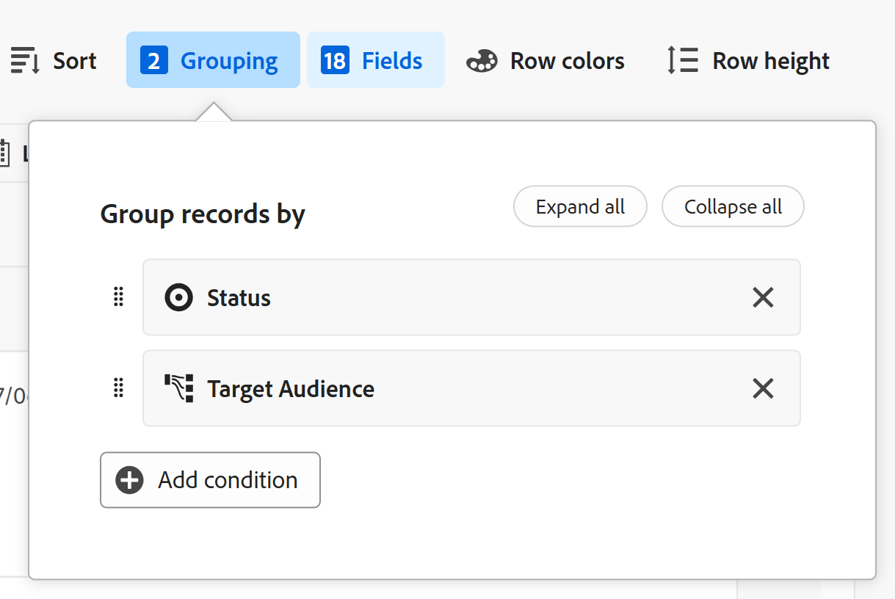
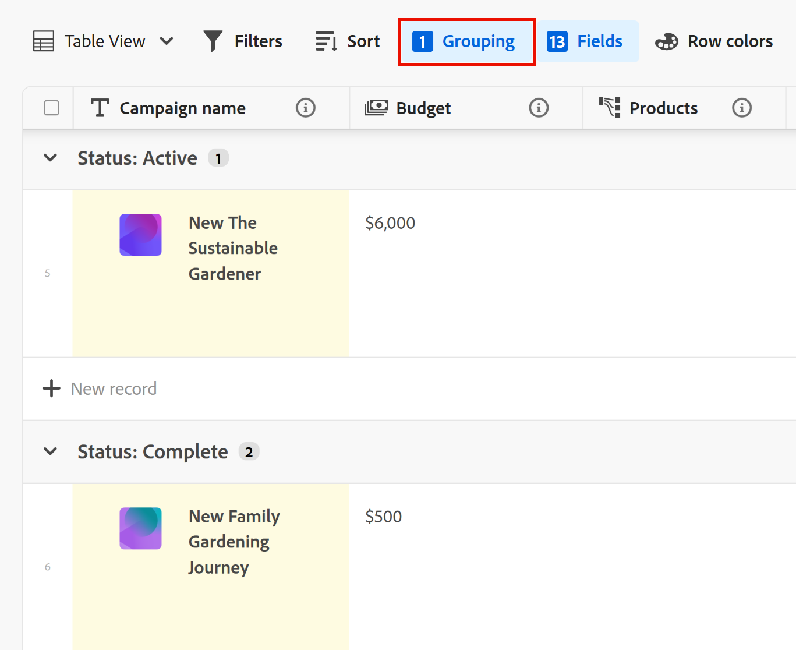

# Gerencie as visualização de tabela

As informações destacadas nesta página referem-se a funcionalidade ainda não disponíveis por completo. Ela está disponível somente no Visualização ambiente para todos os clientes. Depois das versões mensais para produção, os mesmos recursos também ficam disponíveis no ambiente de produção para clientes que ativaram versões rápidas. 

Para obter informações sobre versões rápidas, consulte [Habilitar ou desabilitar versões rápidas para sua organização](/help/quicksilver/administration-and-setup/set-up-workfront/configure-system-defaults/enable-fast-release-process.md). 

{{planning-important-intro}}

Você pode exibir registros e seus campos em uma exibição de tabela, ao acessar a página tipo de registro no Adobe Workfront Planning.

Para obter informações sobre exibições de registros e como gerenciá-las, consulte [Gerenciar exibições de registros](/help/quicksilver/planning/views/manage-record-views.md).

## Requisitos de acesso

+++ Expanda para visualizar os requisitos de acesso.

Você deve ter o seguinte acesso para executar as etapas neste artigo:

<table style="table-layout:auto"> 
<col> 
</col> 
<col> 
</col> 
<tbody> 
    <tr> 
<tr> 
<td> 
   
 Produtos
 </td> 
   <td> 
   <ul><li>
 Adobe Workfront
</li> 
   <li>
 Planejamento da Adobe Systems workfront
</li></ul></td> 
  </tr>   
<tr> 
   <td role="rowheader">
Adobe Systems plano da Workfront*
</td> 
   <td> 

Qualquer um dos seguintes planos da Workfront:
 
<ul><li>Selecionar</li> 
<li>Prime</li> 
<li>Ultimate</li></ul> 

O planejamento da workfront não está disponível para planos herdados da Workfront
 
   </td> 
<tr> 
   <td role="rowheader">
Adobe Systems pacote de Planejamento da Workfront*
</td> 
   <td> 

Qualquer 
 

Para obter mais informações sobre o que está incluído em cada plano do Workfront Planning, entre em contato com seu gerente de conta da Workfront. 
 
   </td> 
 <tr> 
   <td role="rowheader">
plataforma Adobe Workfront
</td> 
   <td> 

A instância da Workfront de sua organização deve ser integrada à Adobe Unified Experience para acessar todos os recursos do Workfront Planning.
 

Para obter mais informações, consulte <a href="/help/quicksilver/workfront-basics/navigate-workfront/workfront-navigation/adobe-unified-experience.md">Experiência unificada da Adobe para Workfront</a>. 
 
   </td> 
   </tr> 
  </tr> 
  <tr> 
   <td role="rowheader">
Licença da Adobe Workfront*
</td> 
   <td>
 Padrão 

   
O Workfront Planning não está disponível para licenças herdadas do Workfront
 
  </td> 
  </tr> 
  <tr> 
   <td role="rowheader">
Configuração do nível de acesso
</td> 
   <td> 
Não há controles de nível de acesso para o Adobe Workfront Planning
   
</td> 
  </tr> 
<tr> 
   <td role="rowheader">
Permissões de objeto
</td> 
   <td>   
Gerenciar permissões em um visualização
  
   
Exibir permissões a um visualização para alterar temporariamente as configurações do visualização
 </td> 
  </tr> 
<tr> 
   <td role="rowheader">
Modelo de layout
</td> 
   <td> 
No ambiente de Produção, todos os usuários, incluindo os Administradores do Sistema, devem ser atribuídos a um layout modelo que inclua as áreas de Planejamento.

No Visualização ambiente, os usuários do Standard e os Administradores do sistema têm a área de Planejamento ativada por padrão.
</td> 
  </tr> 
</tbody> 
</table>

*Para obter mais informações sobre requisitos de acesso do Workfront, consulte [Requisitos de acesso na documentação do Workfront](/help/quicksilver/administration-and-setup/add-users/access-levels-and-object-permissions/access-level-requirements-in-documentation.md).

+++

## Editar registros usando a tabela visualização

É possível editar informações de registro somente no visualização da tabela.

Para obter mais informações sobre como editar registros na tabela visualização, consulte [Editar registros](/help/quicksilver/planning/records/edit-records.md).

## Gerenciar uma visualização de tabela {#manage-a-table-view}

<!--insert screen shot of table view-->

Ao criar uma visualização de tabela, todos os registros do tipo selecionado são exibidos em uma tabela. Cada linha é um registro exclusivo e cada coluna é um campo de registro. Todos os campos e registros são exibidos por padrão.

Para gerenciar uma exibição de tabela:

1. Crie uma exibição de tabela, conforme descrito no artigo [Gerenciar exibições de registros](/help/quicksilver/planning/views/manage-record-views.md). 

   

   

1. (Opcional) Clique em **Altura da linha** e selecione uma das seguintes opções para modificar a altura das linhas da tabela:
   * Pequena
   * Média
   * Alta

1. Atualize os seguintes elementos de exibição conforme descrito nas subseções abaixo:
   * [Colunas (ou campos)](#add-columns-or-fields)
   * [Linhas (ou registros)](#add-rows-or-records)
   * [Filtros](#add-filters)
   * [Classificar](#add-a-sort)
   * [Agrupamento](#add-groupings)
   * [Cores da linha](#add-row-colors)
   * [Indicador de presença em tempo real](#enable-the-real-time-presence-indicator)

### Adicionar colunas (ou campos) {#add-columns}

Os cabeçalhos de coluna de uma tabela visualização campos de exibição associados aos registros na visualização. Os campos exibidos na tabela visualização também são exibidos na seção Detalhes de um registro.

Para obter mais informações, consulte [Editar registros](/help/quicksilver/planning/records/edit-records.md).

<!--this is not available yet:You can display record fields (or columns) in both a table and a timeline view. However, the number of columns displayed in the table of the timeline view is limited and you cannot add columns in addition to those selected by default.-->

A adição de colunas a uma visualização é idêntica à adição de campos a um tipo de registro.

É possível adicionar até 500 campos (ou colunas) em uma tabela visualização.

1. Vá para uma página de tipo de registro e clique em uma guia de exibição de tabela ou clique em **+ Exibição** para adicionar um novo modo de exibição e, em seguida, escolha **Tabela**.

1. Comece a adicionar campos (ou colunas), conforme descrito no artigo [Criar campos](/help/quicksilver/planning/fields/create-fields.md).

   As colunas adicionadas ficam visíveis para todos os usuários que acessam o tipo de registro e são adicionadas como novos campos na página do registro.

1. Siga um destes procedimentos para reordenar colunas na tabela:

   * Segure o cabeçalho da coluna e arraste e solte-o na posição desejada. A coluna movida brevemente será exibida com um plano de fundo azul até que você faça outros ajustes na tabela.

   * Clique **em Campos** na barra de ferramentas da tabela, em seguida, arraste e solte os campos na solicitar desejada, em seguida, clique fora da **visibilidade campos e solicitar** caixa para fechá-la.

     

     >[!TIP]
     >
     >* O campo Nome é sempre o primeiro campo da tabela visualização, por padrão. Isso é considerado um campo primário.
     >
     >* Não é possível mover o campo Nome para outra posição, a menos que designe outro campo como o campo principal. Para obter mais informações, continue com a Etapa 4. <!--accurate?-->
     >
     >

   * Substituir o campo na primeira coluna com outro campo alterando o campo principal. Para obter mais informações, prossiga para a etapa 4. <!--accurate?-->

1. (Opcional) Passe o mouse sobre um nome de campo no cabeçalho da coluna de qualquer campo que não seja exibido na primeira coluna da tabela, clique na seta para baixo apontando para a direita do nome do campo e, em seguida, clique **em Definir como campo** principal.

   

1. Clique **em Definir campo** para confirmar.

   O campo se torna um campo primário, o que significa que ele é exibido como a primeira coluna da tabela visualização. O campo primário anterior se move para a segunda coluna.

   Os campos primários se tornam o título e a exibição do registro na área de cabeçalho da página do registro e em todos os locais onde os registros são exibidos. Por exemplo, o título do registro é exibido em campos conectados e em todas as exibições. Para obter mais informações sobre campos primários, consulte [Visão geral do campo primário](/help/quicksilver/planning/fields/primary-field-overview.md).

1. Clique e arraste as linhas de separação da coluna e solte-as no ponto desejado para aumentar a largura das colunas.

   >[!TIP]
   >
   >As alterações feitas na largura e na ordem da coluna são permanentes e visíveis a todos os usuários que acessam o tipo de registro.

1. Passe o mouse sobre o cabeçalho da coluna, clique na seta para baixo e clique em **Ocultar campo**

   Ou

   Clique em **Campos** na barra de ferramentas da tabela e desabilite a alternância associada aos campos (ou colunas) que você deseja ocultar. A caixa **Visibilidade e ordem dos campos** é exibida.

   >[!TIP]
   >
   >O número de campos ocultos é exibido à esquerda do ícone Campos na barra de ferramentas.

1. Clique no ícone **Campos** e habilite a alternância associada aos campos que deseja exibir nas colunas da tabela. Todos os campos são exibidos por padrão.

1. Faça o seguinte para localizar rapidamente registros que correspondam a uma palavra-chave:

   1. Clique no **ícone  start digitando um palavra-chave associado a qualquer campo de um registro exibido na tela. O número de correspondências corretas é exibido ao lado do item de pesquisa e o campo com a correspondência correta é destacado.

      

      Você pode usar qualquer palavra ou caractere especial visível na tela.

      Não é possível usar palavras-chave associadas a campos oculto na tabela visualização.

   1. Pressione **Enter** no teclado para ir para o próximo campo encontrado.

   1. (Opcional) Se houver mais de uma correspondência, clique nas setas para cima e para baixo à direita da palavra-chave de pesquisa para localizar todas as correspondências na tabela.

   1. Clique no **ícone x** na caixa de pesquisa para limpar a palavra-chave de pesquisa.

### Adicionar linhas (ou registros) {#add-rows}

As linhas de uma exibição de tabela exibem registros individuais do tipo de registro selecionado.

É possível ter até 50.000 registros (ou linhas) para um tipo de registro S.

1. Vá para uma página de tipo de registro e clique em uma guia de exibição de tabela ou clique em **+ Exibição** para adicionar um novo modo de exibição e, em seguida, escolha **Tabela**.

1. Início a adição de registros (ou linhas), conforme descrito no artigo [Criar registros](/help/quicksilver/planning/records/create-records.md).

   Os registros adicionados na tabela visualização são salvos imediatamente e ficam visíveis para todos os usuários que têm Exibir ou permissões mais altas para o espaço de trabalho.

1. (Opcional) Adicione uma miniatura a cada registro e clique **em Campos** no canto superior direito da tabela, em seguida, selecione a alternância para o **campo Miniatura** para exibi-lo à esquerda do campo principal. Ele é desmarcado por padrão.

   Para obter informações, consulte [Adicionar uma miniatura a um registro](/help/quicksilver/planning/records/add-thumbnails-to-records.md).

1. (Opcional) Selecione um ou vários registros em uma linha e arraste e solte o **ícone  de identificador de alça** à esquerda do registro para reordenar as linhas.

   >[!NOTE]
   >
   >Não é possível reordenar linhas se você aplicar pelo menos uma classificação à exibição de tabela.
   >
   >As alterações feitas na ordem das linhas ficam visíveis para todos os usuários que acessam o tipo de registro

<!-- this section below links from the timeline view; consider splitting them if they become different-->

### Adicionar filtros {#add-filters}

Os filtros ajudam a reduzir a quantidade de informações exibidas na tela.

Considere o seguinte ao trabalhar com filtros na exibição de tabela:

<!-- this list is almost identical to the one for the table view - update both-->

* Os filtros criados para a exibição de tabela funcionam independentemente dos filtros na exibição de linha do tempo quando aplicados ao mesmo tipo de registro.

* Os filtros são exclusivos para a exibição selecionada. Duas exibições de tabela do mesmo tipo de registro podem ter filtros diferentes aplicados a elas. Dois usuários que visualizam a mesma visualização de tabela veem o mesmo filtro aplicado no momento.

* Não é possível nomear os filtros criados e aplicar a uma exibição de tabela.

* A remoção de filtros os remove de qualquer pessoa que acesse o mesmo tipo de registro que você e use a mesma visualização que você usa.

* Adicionar filtros à exibição de tabela é idêntico a adicionar filtros à exibição de linha do tempo.

* É possível filtrar por campos de registro conectados ou campos de pesquisa.

* É possível filtrar por campos de pesquisa que exibem vários valores.

* É possível referenciar um campo que esteja a até 4 níveis do tipo de registro atual. Por exemplo, se você estiver criando um filtro para um tipo de registro de Atividade, e a Atividade estiver conectada ao tipo de registro do Produto que está conectado ao tipo de registro Campaign que está conectado a um Projeto da Workfront, é possível referenciar o Orçamento do projeto no filtro que você está criando para o tipo de registro de atividade.

Para adicionar um filtro a uma tabela visualização:

1. Criar uma tabela visualização de um tipo de registro página, conforme descrito nas visualizações](/help/quicksilver/planning/views/manage-record-views.md) de registro do artigo[.
1. Selecione uma visualização de tabela e clique **em Filtros** no canto superior direito da tabela.
1. Clique em **Adicionar condição** e adicione as seguintes informações:

   * **Selecione um campo** que você deseja filtrar por <!-- the tip below might change-->

   * **Selecione uma opção** (ou um modificador de filtro) para definir que tipo de condição o campo deve atender

     A tabela abaixo exibe os modificadores disponíveis para cada tipo de campo.

     <table>
        <thead>
        <tr>
            <th><b>Tipo de campo</b></th>
            <th><b>Modificadores</b></th>
        </tr>
        </thead>
        <tbody>
        <tr>
            <td>Linha única, Parágrafo, Fórmula </td>
            <td>
Contém

            
Não contém

            
É

            
Não é

            
Está vazio

            
Não está vazio
</td>
        </tr>
        <tr><td>Seleção única</td>
            <td>
É

            
Não é

            
É algum dos

            
Não é nenhum dos

            
Está vazio

            
Não está vazio
</td>
        </tr>
        <tr>
            <td>Multisseleção, Pessoas</td>
            <td>
Tem qualquer um dos

            
Possui todos os

            
É exatamente

            
Não tem nenhum dos

            
Está vazio

            
Não está vazio
</td>
        </tr>
        <tr>
            <td>Número, Porcentagem, Moeda</td>
            <td>
=

            
≠

            
 &lt; 

            
&gt;

            
≤

            
≥

            
Está vazio

            
Não está vazio
</td>
        </tr>
        <tr>
            <td>Data</td>
            <td>
É

            
Não é

            
É depois

            
Está antes

            
Fica entre

Não fica entre

            
Está vazio

Não está vazio
</td>
        </tr>

     <tr>
            <td>Caixa de seleção</td>
            <td>
É

        </tr>
        </tbody>
        </table>

   * Selecione um valor para o campo selecionado.

   

   Não há limite para quantas condições de filtragem você pode adicionar.

1. (Opcional) Clique em **Adicionar condição** para adicionar outra opção de filtragem e repita as etapas acima. O número de filtros aplicados é exibido à esquerda do ícone Filtros.
1. Clique nos seguintes operadores para indicar como as condições de filtro são unidas e devem ser aplicadas:

   * **AND**: todas as condições especificadas devem ser atendidas.
   * **OU**: Qualquer uma das condições especificadas deve ser atendida. Essa é a opção padrão.

   1. (Opcional) Adicione operadores AND **ou** OR **adicionais** entre agrupamentos de várias condições.

      

   A lista de registros é filtrada automaticamente.  <!--at this time, you can't name and save the filter - but will this change?!-->
   <!-- asked on the task for the simple filters whether there is a limitation for how many statements a filter can have?!-->

1. (Opcional) Clique no **ícone x** para remover uma condição de filtro.
1. (Opcional) Clique em **Filtros** para fechar a caixa de filtros. <!--right now you cannot "clear all" for filters, but this might come later-->

### Adicionar uma classificação {#sort-information}

Ao aplicar uma classificação, você pode organizar as informações em uma determinada ordem.

Você pode classificar as seguintes informações:

* Todos os registros em uma exibição de tabela. <!--or timeline view. ***********verify this is the case for the timeline view*********************-->
  <!--* All groupings. - this is not available yet-->

Considere o seguinte ao classificar registros na exibição de tabela:

<!-- if this is available for the timeline view, update both when you update one-->

* A classificação é exclusiva das visualização selecionadas. Duas exibições em tabela do mesmo tipo de registro podem ter critérios de classificação diferentes aplicados a eles. Dois usuários que olham para a mesma tabela visualização ver a mesma classificação aplicada no momento.

* Não é possível nomear as classificações que build e aplicar a uma visualização de tabela.

* A classificação criada é preservada ao navegar.

* É possível classificar por quantos campos forem exibidos na tabela visualização de um tipo de registro.

* Não é possível classificar por campos de registro conectados, mas é possível classificar por campos de pesquisa a partir de tipos de registros conectados.

* Quando você classifica por campos de pesquisa com vários valores (que não foram resumidos por um agregador), o primeiro valor é usado para classificação.

* A remoção dos critérios de classificação os remove de qualquer pessoa que acesse o mesmo tipo de registro que você e use a mesma exibição usada.

* Você pode fazer referência a um campo que esteja a até 4 níveis de distância do tipo de registro atual. Por exemplo, se você estiver criando uma classificação para um tipo de registro de Atividade e a Atividade estiver conectada ao tipo de registro de Produto que está conectado ao tipo de registro de Campanha que está conectado a um Projeto do Workfront, será possível fazer referência ao Status do projeto na classificação que você está criando para o tipo de registro de Atividade.

Para classificar <!--ungrouped (add this when sorting for groupings will be available--> registros, faça o seguinte:

1. Crie uma exibição de tabela, conforme descrito no artigo [Gerenciar exibições de registros](/help/quicksilver/planning/views/manage-record-views.md).
1. Clique no ícone **Classificar**  no canto superior direito da tabela

   Ou

   Passe o mouse sobre o nome de uma coluna na exibição de tabela, clique na seta para baixo à direita do nome do cabeçalho da coluna e clique em **Classificar por este campo**. O campo é adicionado como uma seleção de classificação no ícone Classificar no canto superior direito da exibição de tabela.

1. (Condicional) Na caixa **Classificar registros por**, clique em um dos campos sugeridos ou clique em **Escolher um campo diferente** e procure um campo diferente. Em seguida, clique nele quando ele for exibido na lista.

   A classificação é aplicada automaticamente à exibição de tabela e os registros são classificados pelos critérios selecionados.

   <!-- add a step that you can rearrange the sorting fields here, when this will be possible-->

1. (Opcional) Clique **em Adicionar condição** e repita as etapas acima para classificar por campos adicionais.

   O número de campos que estão sendo classificados é exibido à esquerda do ícone Classificar no canto superior direito da barra de ferramentas. É possível escolher apenas os campos que são exibidos nas colunas da tabela visualização.

1. (Opcional) Na caixa **Classificar registros por** caixa, clique no **ícone x** à direita de um campo de classificação para remover a classificação

   Ou

   Clique **em Limpar tudo** para remover todos os campos da classificação.

1. Clique fora da caixa **Classificar registros por** para fechá-la.

   

   As informações exibidas na tabela são classificadas de acordo com os critérios selecionados.

   Os campos selecionados para a classificação exibem um ícone de classificação seguido por um número que indica o solicitar em que a classificação é aplicada.

### Adicionar agrupamentos {#add-groupings}

<!--this section exists in the timeline view too, but the display is slightly different, so I kept both steps; consider updating both sections if any updates to groupings are introduced-->

É possível grupo registros por informações semelhantes ao aplicar um agrupamento a um visualização.

A adição de agrupamentos na tabela visualização é semelhante a adicionar agrupamentos à visualização de linha do tempo.

Considere o seguinte:

* Você pode aplicar agrupamentos nas visualizações de tabela e linha do tempo. Os agrupamentos da exibição de tabela são independentes daqueles na exibição de linha do tempo do mesmo tipo de registro.
* Você pode aplicar três níveis de agrupamento em uma visualização. Os registros são agrupados no solicitar de agrupamentos selecionados.
&lt;!--* É possível aplicar até 4 níveis de agrupamento ao usar a API. --verificando este por enquanto- >
* Os agrupamentos são exclusivos às visualização selecionadas. Duas exibições em tabela do mesmo tipo de registro podem ter agrupamentos diferentes aplicados a eles. Dois usuários olhando para a mesma tabela visualização ver o mesmo agrupamento que é aplicado no momento.
* Não é possível nomear os agrupamentos que build para um visualização de tabela.
* A remoção de agrupamentos os remove de qualquer pessoa que acesse o mesmo tipo de registro que você e que exiba a mesma visualização que você.
* É possível editar registros listados em um agrupamento.
* Você pode agrupar por campos de registro conectados ou campos de pesquisa.
* Quando você agrupa por campos de pesquisa com vários valores (que não foram resumidos por um agregador), os registros são agrupados por cada combinação exclusiva de valores de campo.
* Você pode fazer referência a um campo que esteja a até 4 níveis de distância do tipo de registro atual. Por exemplo, se você estiver criando um agrupamento para um tipo de registro de Atividade e a Atividade estiver conectada ao tipo de registro de Produto que está conectado ao tipo de registro de Campanha que está conectado a um Projeto do Workfront, você poderá fazer referência ao Status do projeto no agrupamento que está criando para o tipo de registro de Atividade.
<!--checking into this: * You can apply up to 4 levels of grouping when using the API. -->
<!-- checking also into this: * You cannot group by a Paragraph-type field.-->

Para adicionar um agrupamento:

1. Crie uma exibição de linha do tempo para um tipo de registro, conforme descrito no artigo [Gerenciar exibições de registros](/help/quicksilver/planning/views/manage-record-views.md).
1. Clique em **Agrupamento** no canto superior direito da exibição de tabela.

   

1. Clique em um dos campos sugeridos ou clique em **Escolher um campo diferente**, procure um campo diferente e clique nele quando ele for exibido na lista.

   O agrupamento é aplicado automaticamente à tabela e os registros são exibidos na linha de separação de agrupamento.

1. (Opcional) Clique **em Adicionar condição** e repita as etapas acima para adicionar até 3 grupos.

   O número de campos selecionados para o agrupamento é exibido ao lado do ícone Agrupamento.

   

1. (Opcional) Dentro dos registros do **Grupo por** caixa, clique no **ícone x** à direita de um campo selecionado para o agrupamento para remover o agrupamento

   Ou

   Clique em **Limpar tudo** para remover todos os campos.

1. Clique fora da caixa **Agrupar registros por** para fechá-la.
1. (Opcional) Clique em **+ Novo registro** no final de qualquer agrupamento para adicionar novos registros e, em seguida, atualize a página para adicionar o novo registro ao agrupamento apropriado. <!--this might need to be changed when they add the Refresh button on the toolbar of the table view-->

<!-- this is not available yet: 

To sort grouped records: 

1. Create a view, as described in [Create or edit record views](#create-or-edit-record-views). 
1. ************************* add steps here for sorting grouped records****************

-->

### Adicionar cores da linha

1. (Opcional) Clique **em Cores da linha** para definir condições e escolha configurar cores diferentes para linhas de tabela.

1. Clique **em Adicionar cor**, em seguida **, selecione um campo** cujo valor você deseja determinar a cor de uma linha.

   Por exemplo, para exibir campanhas com o status de Ativo em verde, selecione **Status** e escolha um modificador e um valor para o campo.

   

1. Clique no menu suspenso para o seletor de cores no canto superior esquerdo da condição selecionada, para escolher a cor para a condição e, em seguida, clique fora da caixa de seletor de cores para fechá-la.

   

1. (Opcional) Clique **em Adicionar condição** para adicionar mais campos e valores ao primeiro conjunto de condições

   Ou

   Clique **em Adicionar cor** para adicionar um novo conjunto de condições e identificar uma nova cor.

   Por exemplo, você pode exibir campanhas em um status Planning em amarelo definindo um novo conjunto de condições.

   

1. (Opcional) Ative a configuração **Aplicar a toda a linha** no canto superior direito da caixa Cores da linha. A linha inteira em que a condição é atendida é exibida automaticamente na cor selecionada.

   >[!TIP]
   >
   >Se a configuração Aplicar a toda a linha estiver desativada, somente o lado esquerdo do campo Primário exibirá um indicador de cor estreito com a cor selecionada. A configuração é desativada por padrão.

1. Clique fora da caixa **Cores da linha** para fechá-la. As cores são aplicadas automaticamente.

### Ativar o indicador de presença em tempo real

Os avatares de outros usuários que estão editando informações de registro ao mesmo tempo que você exibe no canto superior direito de todas as visualizações de registro, por padrão.

Ao exibir a visualização de tabela, você também pode visualizar qual campo outro usuário está editando no momento em que você está visualizando o registro.

Para obter mais informações, consulte a seção &quot;Ativar o indicador de presença em tempo real&quot; no artigo [Gerenciar exibições](/help/quicksilver/planning/views/manage-record-views.md) de registro.

