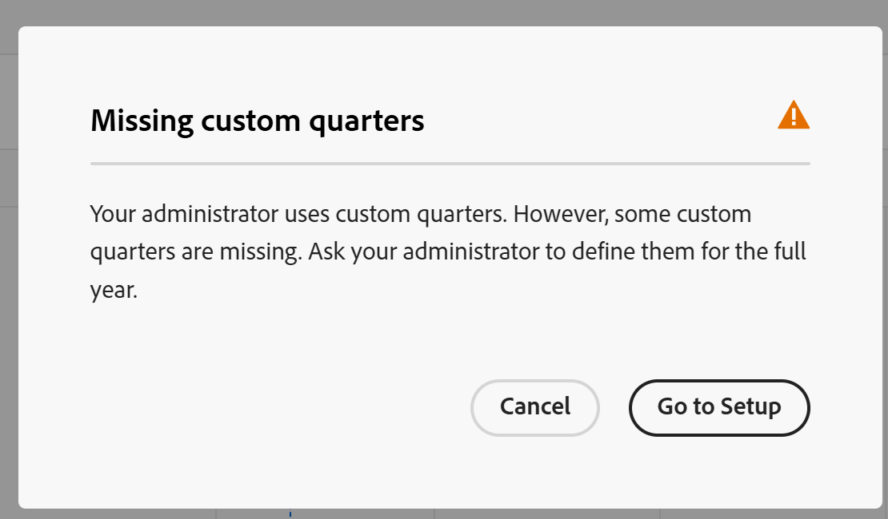

# Gerenciar a exibição de linha do tempo

<!--
The highlighted information on this page refers to functionality not yet generally available. It is available only in the Preview environment for all customers. After the monthly releases to Production, the same features are also available in the Production environment for customers who enabled fast releases.    

For information about fast releases, see [Enable or disable fast releases for your organization](/help/quicksilver/administration-and-setup/set-up-workfront/configure-system-defaults/enable-fast-release-process.md). 

-->

{{planning-important-intro}}

Você pode exibir registros em uma exibição de linha do tempo, ao acessar a página tipo de registro no Adobe Workfront Planning.

Para obter informações sobre exibições de registros, consulte [Gerenciar exibições de registros](/help/quicksilver/planning/views/manage-record-views.md).

## Requisitos de acesso

+++ Expanda para exibir os requisitos de acesso para a funcionalidade neste artigo. 

<table style="table-layout:auto"> 
<col> 
</col> 
<col> 
</col> 
<tbody> 
    <tr> 
<tr> 
</tr>   
<tr> 
   <td role="rowheader">
Pacote do Adobe Workfront
</td> 
   <td> 

Qualquer Workfront e qualquer pacote do Planning

Qualquer fluxo de trabalho e qualquer pacote de planejamento

Para obter mais informações sobre o que está incluído em cada pacote do Workfront Planning, entre em contato com o representante de conta da Workfront. 
 
   </td> 
  <tr> 
   <td role="rowheader">
Licença do Adobe Workfront
</td> 
   <td>
 Padrão para criar e excluir visualizações

   
Colaborador ou superior para atualizar elementos de visualização

  </td> 
  </tr> 
  <tr> 
   <td role="rowheader">
Permissões de objeto
</td> 
   <td>   
Gerenciar permissões para uma exibição
  
   
Exibir permissões de um modo de exibição para alterar temporariamente as configurações de modo de exibição ou duplicá-lo
 </td> 
  </tr> 
<tr>
   <td role="rowheader">
Modelo de layout
</td>
   <td> Os usuários com uma licença Light ou Contributor devem receber um modelo de layout que inclua o Planning.
   
Usuários padrão e Administradores do sistema têm as áreas do Planning habilitadas por padrão.

</li></ul>
</td>
  </tr> 
</tbody> 
</table>

Para obter mais informações sobre requisitos de acesso do Workfront, consulte [Requisitos de acesso na documentação do Workfront](/help/quicksilver/administration-and-setup/add-users/access-levels-and-object-permissions/access-level-requirements-in-documentation.md).

+++ 

<!--Old:
<table style="table-layout:auto"> 
<col> 
</col> 
<col> 
</col> 
<tbody> 
    <tr> 
<tr> 
<td> 
   
 Products
 </td> 
   <td> 
   <ul><li>
 Adobe Workfront
</li> 
   <li>
 Adobe Workfront Planning
</li></ul></td> 
  </tr>   
<tr> 
   <td role="rowheader">
Adobe Workfront plan*
</td> 
   <td> 

Any of the following Workfront plans:
 
<ul><li>Select</li> 
<li>Prime</li> 
<li>Ultimate</li></ul> 

Workfront Planning is not available for legacy Workfront plans
 
   </td> 
<tr> 
   <td role="rowheader">
Adobe Workfront Planning package*
</td> 
   <td> 

Any 
 

For more information about what is included in each Workfront Planning plan, contact your Workfront account manager. 
 
   </td> 
 <tr> 
   <td role="rowheader">
Adobe Workfront platform
</td> 
   <td> 

Your organization's instance of Workfront must be onboarded to the Adobe Unified Experience to be able to access Workfront Planning.
 

For more information, see <a href="/help/quicksilver/workfront-basics/navigate-workfront/workfront-navigation/adobe-unified-experience.md">Adobe Unified Experience for Workfront</a>. 
 
   </td> 
   </tr> 
  </tr> 
    <td role="rowheader">
Adobe Workfront license*
</td> 
   <td>
 Standard to create and delete views

   
Contributor or higher to update view elements

   
Workfront Planning is not available for legacy Workfront licenses
 
  </td> 
  </tr> 
  <tr> 
   <td role="rowheader">
Access level configuration
</td> 
   <td> 
There are no access level controls for Adobe Workfront Planning
   
</td> 
  </tr> 
<tr> 
   <td role="rowheader">
Object permissions
</td> 
   <td>   
Manage permissions to a view
  
   
View permissions to a view to temporarily change the view settings or to duplicate it
 </td> 
  </tr> 
<tr>
   <td role="rowheader">
Layout template
</td>
   <td> Users with a Light or Contributor license must be assigned a layout template that includes Planning.
   
Standard users and System Administrators have the Planning areas enabled by default.

</li></ul>
</td>
  </tr>
</tbody> 
</table> -->

## Gerenciar uma exibição de linha do tempo {#manage-a-timeline-view}

Ao criar uma exibição de linha do tempo, todos os registros do tipo de registro selecionado são exibidos em uma linha do tempo cronológica.

Considere o seguinte:

* Você pode criar um modo de exibição de Linha do tempo somente quando tem pelo menos dois campos de data associados a um tipo de registro. Quando você tem um ou nenhum campo de data associado a um tipo de registro, a opção de exibição Linha do tempo fica esmaecida.

  Você pode selecionar entre os seguintes campos de data ao criar uma exibição de linha do tempo:

   * Registrar datas
   * Registrar campos gerados pelo sistema: Data de criação, Data da última modificação
   * Pesquisar datas de tipos de registro ou objeto conectados (somente quando você adicionou um agregador para eles quando conectou o registro ou tipos de objeto)
* Dependendo das datas associadas aos registros, alguns registros podem não ser exibidos na exibição de linha do tempo nos seguintes cenários:

   * Quando as datas de início e término não têm valores
   * Quando as datas de Início ou Término não têm valor
   * Quando a data inicial for posterior à data final

Para gerenciar uma exibição de linha do tempo:

1. Vá para a página do tipo de registro para a qual deseja exibir a linha do tempo.
1. Crie uma exibição de linha do tempo, conforme descrito no artigo [Gerenciar exibições de registros](/help/quicksilver/planning/views/manage-record-views.md).

   

   Os registros associados ao tipo de registro selecionado são exibidos como barras em uma linha do tempo e são classificados em ordem cronológica de sua Data inicial, por padrão.

   >[!TIP]
   >
   >    A classificação dos registros na linha do tempo não está visível na exibição Compacta.

1. (Condicional) Se o administrador tiver ativado trimestres personalizados e o Workfront detectar problemas na forma como os trimestres personalizados são configurados, você poderá receber um aviso ao abrir a exibição de linha do tempo.

   Existem os seguintes cenários:

   * Se forem detectadas lacunas ou sobreposições entre as datas dos trimestres, você poderá receber uma notificação de que trimestres personalizados agora podem ser configurados e talvez seja necessário editá-los.

     

     >[!TIP]
     >
     >Essa mensagem deve ser exibida somente imediatamente depois que sua organização comprar o Planning e os trimestres personalizados já estiverem habilitados antes da compra. Sobreposições e intervalos entre os trimestres não são permitidos após habilitar o Workfront Planning para sua organização.

   * Se os trimestres tiverem sido parcialmente configurados, com alguns meses no mesmo ano ausentes, você poderá receber uma notificação ao rolar a tela para exibir os trimestres ausentes de que o restante do ano precisa ser configurado com os trimestres ausentes.

   

   As mensagens de aviso sobre os trimestres personalizados são exibidas uma vez para cada usuário.

   >[!NOTE]
   >
   >Sem um trimestre personalizado salvo corretamente, a exibição da linha do tempo exibe os trimestres clássicos.
   >Depois de configurar trimestres personalizados na área Configuração, a exibição de linha do tempo exibe os trimestres personalizados em vez dos trimestres clássicos.
   >Para obter informações, consulte [Habilitar trimestres personalizados](/help/quicksilver/administration-and-setup/set-up-workfront/configure-system-defaults/enable-custom-quarters-projects.md).

1. (Condicional) Se você for um administrador do Workfront, clique em **Ir para a Instalação** para configurar seus trimestres. Caso contrário, clique em **OK** e peça ao administrador do Workfront para configurar os trimestres personalizados.

   >[!TIP]
   >
   >O botão Ir para a configuração é exibido somente para o administrador do Workfront.

1. (Opcional e condicional) Quando o nome do registro estiver truncado, passe o mouse sobre uma barra de registro para exibir o nome completo do registro e informações adicionais. Para obter informações sobre como configurar o truncamento da barra de registros na linha do tempo, consulte a seção [Editar as configurações de exibição da linha do tempo](#edit-the-timeline-view-settings) neste artigo.

1. Siga um destes procedimentos para navegar pela linha do tempo:

   * Clique nos ícones da esquerda e da direita no canto superior esquerdo ou use a rolagem horizontal para mover-se para frente e para trás na linha do tempo. Atualizar a página preserva o intervalo de tempo selecionado.
   * Clique em **Hoje** no canto superior direito para centralizar a linha do tempo para a data de hoje.
   * Selecione uma das seguintes opções no menu drop-down intervalo de tempo para atualizar os incrementos de tempo e atualizar a view:

      * **Ano**: exibe trimestres e meses com indicação de ano.
      * **Trimestre**: exibe meses e semanas com indicação de trimestre.
      * **Mês**: exibe semanas e dias.
1. (Opcional) Clique em **Alternar para o modo de exibição Compacto** para exibir os registros cujas datas não se cruzam na mesma linha. <!--check to see if they updated the name of the setting here-->
1. (Condicional) Se você alterou seu modo para **Compacto**, clique no modo de exibição **Alternar para Padrão** para exibir registros em linhas separadas. A opção **Padrão** é a padrão.  <!--check to see if they updated the name of the setting here-->

1. Faça o seguinte para localizar rapidamente registros que correspondam a uma palavra-chave:

   1. Clique no ícone **Pesquisar**  e comece a digitar uma palavra-chave associada a qualquer campo de um registro exibido na tela. O número de correspondências corretas é exibido ao lado do item de pesquisa e o registro com a correspondência correta é realçado.

      

      Você pode usar qualquer palavra ou caractere especial visível na tela.

      Não é possível usar palavras-chave associadas a campos que não são exibidos na exibição de linha do tempo.

   1. Pressione Enter no teclado para ir para o próximo campo encontrado.
   1. (Opcional) Se houver mais de uma correspondência, clique nas setas para cima e para baixo à direita da palavra-chave de pesquisa para localizar todas as correspondências na tabela.
   1. Clique no ícone **x** na caixa de pesquisa para limpar a palavra-chave de pesquisa.

   1. (Opcional) Clique no ícone **Tela cheia**  para abrir o modo de exibição em tela cheia, em seguida no ícone **Sair da tela cheia**  ou em Escape no teclado para sair da tela cheia.

1. (Opcional) Clique em **Detalhamento** para exibir os registros conectados na linha do tempo.

   Para obter informações, consulte a seção [Usar o recurso de Detalhamento para exibir registros conectados na exibição de linha do tempo](#break-down-connected-records-in-the-timeline-view) neste artigo.
1. Para criar registros na exibição de linha do tempo ou editar suas datas, siga um destes procedimentos:

   * Clique duas vezes em qualquer lugar na linha do tempo para criar um registro.

     Para obter informações, consulte [Criar registros](/help/quicksilver/planning/records/create-records.md).

   >[!TIP]
   >
   >Não é possível clicar duas vezes para criar registros na linha do tempo dentro de um agrupamento.

   * Clique na margem esquerda ou direita de uma barra de registros e, em seguida, arraste e solte-a em uma nova posição. O redimensionamento das barras de registros atualiza as datas de início ou término imediatamente.

   * Arraste e solte registros para atualizar sua posição e datas na linha do tempo. Mover as barras dos registros atualiza as datas de início e término imediatamente.

     Para obter informações, consulte [Editar registros](/help/quicksilver/planning/records/edit-records.md).

   >[!TIP]
   >
   >Não é possível redimensionar, arrastar e soltar registros na linha do tempo para tipos de objetos do Workfront e do AEM Assets exibidos em detalhamentos.

1. Atualize os seguintes elementos de exibição conforme descrito nas subseções abaixo:
   * [Filtros](#add-filters)
   * [Agrupamento](#add-grouping)
   * [Configurações](#edit-the-timeline-view-settings)
     <!--* [Sort](#add-sort) not yet in timeline; also check the anchor and make sure it's correct-->

### Adicionar filtros

Você pode reduzir a quantidade de informações exibidas na tela usando filtros.

Considere o seguinte ao trabalhar com filtros na exibição de linha do tempo:

<!-- this list is almost identical to the one for the table view - update both-->

* Os filtros criados para uma exibição de linha do tempo funcionam independentemente dos filtros em qualquer outra exibição aplicada ao mesmo tipo de registro.

* Os filtros são exclusivos para a exibição selecionada. Duas exibições de linha do tempo do mesmo tipo de registro podem ter filtros diferentes aplicados a elas.

* Dois usuários que visualizam a mesma linha do tempo veem o mesmo filtro aplicado no momento.

* Não é possível nomear os filtros criados para uma exibição de linha do tempo.

* A remoção de filtros os remove de qualquer pessoa que acesse o mesmo tipo de registro que você e que exiba a mesma visualização que você.

* Você pode filtrar por campos de registro conectados ou campos de pesquisa.
* Você pode filtrar por campos de pesquisa que exibem vários valores.

Para adicionar um filtro a uma exibição de linha do tempo:

1. Crie uma exibição de linha do tempo para uma página de tipo de registro, conforme descrito no artigo [Gerenciar exibições de registro](/help/quicksilver/planning/views/manage-record-views.md).
1. Selecione uma exibição de linha do tempo e clique em **Filtros** no canto superior direito da tabela.
1. Clique em **Adicionar condição** e adicione as seguintes informações:

   * **Selecione um campo** que você deseja filtrar por <!-- the tip below might change-->

     <!--replace the bullet above with this at preview release: Search for a field or  click the drop-down menu to display a list of fields and select it from the list-->

   * **Selecione uma opção** (ou um modificador de filtro) para definir que tipo de condição o campo deve atender

     A tabela abaixo exibe os modificadores disponíveis para cada tipo de campo.

     <table>
        <thead>
        <tr>
            <th><b>Tipo de campo</b></th>
            <th><b>Modificadores</b></th>
        </tr>
        </thead>
        <tbody>
        <tr>
            <td>Linha única, Parágrafo, Fórmula </td>
            <td>
Contém

            
Não contém

            
É

            
Não é

            
Está vazio

            
Não está vazio
</td>
        </tr>
        <tr><td>Seleção única</td>
            <td>
É

            
Não é

            
É algum dos

            
Não é nenhum dos

            
Está vazio

            
Não está vazio
</td>
        </tr>
        <tr>
            <td>Multisseleção, Pessoas</td>
            <td>
Tem qualquer um dos

            
Possui todos os

            
É exatamente

            
Não tem nenhum dos

            
Está vazio

            
Não está vazio
</td>
        </tr>
        <tr>
            <td>Número, Porcentagem, Moeda</td>
            <td>
=

            
≠

            
 &lt; 

            
&gt;

            
≤

            
≥

            
Está vazio

            
Não está vazio
</td>
        </tr>
        <tr>
            <td>Data</td>
            <td>
É

            
Não é

            
Está depois

            
Está antes

            
Está entre

Não está entre

            
Está vazio

Não está vazio
</td>
        </tr>

     <tr>
            <td>Caixa de seleção</td>
            <td>
É

        </tr>
        </tbody>
        </table>

   * Selecione um valor para o campo selecionado.

   

   Não há limite para quantas condições de filtragem você pode adicionar.

1. (Opcional) Clique em **Adicionar condição** para adicionar outra opção de filtragem e repita as etapas acima. O número de filtros aplicados é exibido à esquerda do ícone **Filtros**.
1. Clique nos seguintes operadores à esquerda para indicar como as condições de filtro são unidas e devem ser aplicadas:

   * **AND**: todas as condições especificadas devem ser atendidas.
   * **OU**: qualquer uma das condições especificadas deve ser atendida.
Esta é a opção padrão.

   1. (Opcional) Adicione outros agrupamentos de filtros e junte-os com os operadores **AND** ou **OR**.

      

   A lista de registros é filtrada automaticamente com base nos critérios de filtro.  <!--at this time, you can't name and save the filter - but will this change?!-->
   <!-- asked on the task for the simple filters whether there is a limitation for how many statements a filter can have?!-->

1. (Opcional) Clique no ícone **x** para remover uma condição de filtro.
1. (Opcional) Clique em **Filtros** ou em qualquer outro lugar da página para fechar a caixa de filtros. <!--right now you cannot "clear all" for filters, but this might come later-->

### Adicionar agrupamento

<!-- groupings are almost identical between this view and table  but they display a little differently, so I kept the steps for both; update in both places if they make changes to groupings-->

Você pode agrupar registros por informações semelhantes ao aplicar um agrupamento a uma exibição.

Considere o seguinte ao trabalhar com agrupamentos na exibição de linha do tempo:

* Você pode aplicar agrupamentos nas visualizações de tabela e linha do tempo. Os agrupamentos da exibição de tabela são independentes daqueles na exibição de linha do tempo do mesmo tipo de registro.
* Você pode aplicar três níveis de agrupamento em uma visualização. Os registros são agrupados na ordem de agrupamentos selecionada.
&lt;!—* É possível aplicar até 4 níveis de agrupamento ao usar a API. —verificando este por enquanto—>
* Os agrupamentos são exclusivos para a exibição selecionada. Duas exibições de tabela do mesmo tipo de registro podem ter agrupamentos diferentes aplicados a elas. Dois usuários observando a mesma visualização de tabela veem o mesmo agrupamento aplicado no momento.
* Não é possível nomear os agrupamentos criados para uma exibição de tabela.
* A remoção de agrupamentos os remove de qualquer pessoa que acesse o mesmo tipo de registro que você e que exiba a mesma visualização que você.
* É possível editar registros listados em um agrupamento.
* Você pode agrupar por campos de registro conectados ou campos de pesquisa.
* Quando você agrupa por campos de pesquisa com vários valores (que não foram resumidos por um agregador), os registros são agrupados por cada combinação exclusiva de valores de campo.
* Você pode fazer referência a um campo que esteja a até 4 níveis de distância do tipo de registro atual. Por exemplo, se você estiver criando um agrupamento para um tipo de registro de Atividade e a Atividade estiver conectada ao tipo de registro de Produto que está conectado ao tipo de registro de Campanha que está conectado a um Projeto do Workfront, você poderá fazer referência ao Status do projeto no agrupamento que está criando para o tipo de registro de Atividade.
* Os agrupamentos são listados na ordem alfabética de seus valores.
<!--checking into this: * You can apply up to 4 levels of grouping when using the API. -->
<!-- checking also into this: * You cannot group by a Paragraph-type field.-->

Para adicionar um agrupamento na exibição de linha do tempo:

1. Crie uma exibição de linha do tempo para um tipo de registro, conforme descrito no artigo [Gerenciar exibições de registros](/help/quicksilver/planning/views/manage-record-views.md).
1. Clique em **Agrupamento** no canto superior direito do modo de exibição de linha do tempo.

   

1. Clique em um dos campos sugeridos ou clique em **Escolher um campo diferente**, procure um campo diferente e clique nele quando ele for exibido na lista.

   O agrupamento é aplicado automaticamente à linha do tempo e os registros são exibidos dentro da caixa de agrupamento.

1. (Opcional) Repita as etapas acima para adicionar até três agrupamentos.

   O número de campos selecionados para o agrupamento é exibido ao lado do ícone Grouping.

   

1. Na caixa **Agrupar registros por**, arraste e solte os agrupamentos na ordem correta.

1. (Opcional) Dentro da caixa **Agrupar registros por**, clique no ícone **x** à direita de um campo selecionado para o agrupamento para remover o agrupamento

   Ou

   Clique em **Limpar tudo** para remover todos os campos.

1. Clique fora da caixa **Agrupar registros por** para fechá-la.
1. (Opcional) Clique em **Configurações** e depois em **Cor** para agrupar o código de cores. Para obter mais informações, consulte a seção [Editar as configurações de exibição da linha do tempo](#edit-the-timeline-view-settings) neste artigo.

<!-- 

### Add sort

this is not possible right now; if this is the same functionality as the table view, document it there and link from here. 

-->

### Editar as configurações de exibição da linha do tempo {#edit-the-timeline-view-settings}

Atualize as configurações de exibição da linha do tempo para indicar quais informações e como elas são exibidas na seção de linha do tempo da exibição.

1. Crie uma exibição de linha do tempo para um tipo de registro, conforme descrito no artigo [Gerenciar exibições de registros](/help/quicksilver/planning/views/manage-record-views.md).
1. Clique em **Configurações**.
1. Clique em **Data e hora** no painel esquerdo e selecione uma **Data de início** e uma **Data de término** para exibir na linha do tempo. Você pode escolher as datas padrão de Início e Término ou escolher qualquer campo de data disponível.

   As barras que representam os registros começam na data que você indica para a Data inicial e terminam na data correspondente à Data final.

   >[!NOTE]
   >
   >* Os registros que não têm valores para as datas de Início ou Término ou que têm uma data de Início posterior à data de Término não são exibidos na exibição de linha do tempo.
   >
   >* Se você exibir registros adicionais usando a opção Breakdown, as datas Start e End serão as do registro principal. Não é possível escolher datas de Início e Término para os registros conectados nesta área.

1. (Condicional e opcional) Se você for um administrador do Workfront, clique em **Ir para a Instalação** na caixa **Usar trimestres personalizados** para ir para a área Instalação e configurar trimestres personalizados. Depois de configurar trimestres personalizados, você pode exibi-los na exibição de linha do tempo em vez dos trimestres clássicos. Se você não for um administrador do Workfront, poderá solicitar que os trimestres personalizados sejam ativados para sua organização a partir de um administrador.

   Para obter informações, consulte [Habilitar trimestres personalizados](/help/quicksilver/administration-and-setup/set-up-workfront/configure-system-defaults/enable-custom-quarters-projects.md).

   

   >[!TIP]
   >
   >O botão Ir para a configuração é exibido somente para o administrador do Workfront.

1. Clique em **Estilo de barra** no painel esquerdo para indicar quais informações você deseja exibir nas barras de registro.

   Você pode definir o estilo de barra do registro principal, bem como dos registros conectados, ao usar a opção Detalhamento na exibição Padrão.

   O campo principal (ou título) do registro, conforme definido na exibição de tabela do registro, é selecionado por padrão.
   <!--adjust this when the primary field is released??-->

1. (Opcional e condicional) Se você adicionou miniaturas a registros, selecione a opção **Miniatura** para exibir a imagem associada aos registros na barra de registros.

   >[!NOTE]
   >
   >    Você deve primeiro adicionar miniaturas na exibição de tabela antes de exibi-las na exibição de linha do tempo. Para obter mais informações, consulte [Adicionar uma miniatura a um registro](/help/quicksilver/planning/records/add-thumbnails-to-records.md).

1. Clique em **Adicionar campo**, clique dentro da caixa **Pesquisar campos** e clique no campo que deseja adicionar.

   >[!TIP]
   >
   >   * Você deve criar os campos antes de adicioná-los às barras de registro.
   > 
   >   * Você deve ter pelo menos um campo selecionado. O **Nome** está selecionado por padrão.
   >
   >   * Você pode adicionar até 5 campos.

   Uma visualização da aparência das barras na linha do tempo é exibida à direita.

   

1. (Opcional e condicional) Se você exibir a linha do tempo no modo Padrão, selecione a configuração **Truncar detalhes da barra**. Quando selecionada, as informações nas barras de registro são truncadas e são exibidas somente quando você passa o mouse sobre as barras. Essa configuração é desmarcada por padrão e as informações do registro são totalmente exibidas nas barras.

   

   >[!TIP]
   >
   >A configuração Truncar detalhes da barra não está disponível ao exibir a exibição da linha do tempo no modo Compacto.
   >

1. Clique em **Cor** no painel esquerdo para personalizar as cores dos registros e agrupamentos na linha do tempo.

   

   É possível definir a cor do registro principal, bem como dos registros conectados, ao usar a opção Detalhamento na exibição Padrão.

1. (Condicional e opcional) Se você adicionou um agrupamento à exibição de linha do tempo, selecione uma das seguintes opções para definir uma cor para o agrupamento na seção **Definir cor de agrupamento**:

   * **Padrão (cinza)**: a cor dos agrupamentos está definida como cinza. Este é o padrão.
   * **Valores do campo**: a cor dos agrupamentos corresponde à cor do campo pelo qual você faz o agrupamento.

     >[!NOTE]
     >
     >    * É possível corresponder a cor somente a campos com opções codificadas por cores. Por exemplo, é possível corresponder a cor aos campos Status ou aos campos com opções associadas a cores.
     >    
     >    * Não é possível corresponder a cor a campos de pesquisa de tipos de objeto ou registro vinculado.

   Por exemplo, campos de seleção múltipla ou seleção única podem ter opções codificadas por cores.

   Se você agrupar por campos sem opções codificadas por cores, a cor de agrupamento permanecerá cinza.

   >[!TIP]
   >
   >Se você não tiver adicionado agrupamentos à exibição de linha do tempo, esta seção não será exibida.

1. Na seção **Definir cor do registro**, selecione uma das seguintes opções para definir uma cor para os registros:

   * **Tipo de registro**: a cor dos registros corresponde à cor do tipo de registro selecionado. Esta é a opção padrão.
   * **Valores de campo**: a cor dos registros corresponde à cor de um campo especificado. Continue na etapa 10. <!--ensure this stays accurate-->
   * **Agrupamento**: a cor dos registros corresponde à cor indicada para os agrupamentos. Essa opção fica esmaecida quando não há agrupamentos aplicados à exibição de linha do tempo.
   * **Nenhum**: os registros são exibidos em uma barra branca.

1. (Condicional) Se você selecionou **Valores de campo** para as cores do registro, selecione um campo no menu suspenso **Corresponder a cor do registro a**.

   

   Somente campos com opções codificadas por cores são exibidos no menu suspenso.

   Por exemplo, campos de seleção múltipla ou seleção única podem ter opções codificadas por cores.

   Se você não tiver um campo com opções codificadas por cores para o tipo de registro selecionado, essa opção ficará esmaecida.

1. (Opcional) Se você estiver usando a opção **Detalhamento**, repita as etapas que começam com a etapa 4 para cada registro conectado exibido na linha do tempo.

1. Clique em **Salvar**.

   Os registros são exibidos na exibição de linha do tempo com as especificações selecionadas.

### Analisar registros conectados na exibição de linha do tempo

Você pode exibir registros conectados na visualização da linha do tempo de um registro usando o recurso Detalhamento. Detalhar os registros por suas conexões permite visualizar as linhas do tempo de outros registros conectados e entender como elas podem afetar o desempenho e os prazos de conclusão de seus registros.

#### Considerações ao usar o recurso Detalhamento

* Você pode exibir registros ou objetos conectados nos registros do tipo de registro selecionado na exibição de linha do tempo.
* Você pode exibir registros conectados na exibição de linha do tempo somente ao exibir os registros no modo Padrão. Não é possível usar a opção Detalhamento no modo Compacto da exibição de linha do tempo.
* Você pode exibir o seguinte na exibição de linha do tempo, usando o recurso Detalhamento:
   * Registros do Workfront Planning conectados ao tipo de registro selecionado.
   * Tipos de objeto do Workfront ou ativos do Experience Manager conectados ao tipo de registro selecionado.
   * Registros ou objetos do Workfront Planning de outro aplicativo que estão conectados a registros conectados ao tipo de registro selecionado.

     Por exemplo, você pode conectar campanhas a portfólios. Além disso, você pode conectar outro tipo de registro, produtos, a projetos, e a campanhas. Ao criar a visualização da linha do tempo da campanha, você pode detalhar as campanhas por portfólios, produtos e projetos.

* Não é possível exibir tipos de objetos que estão conectados somente a objetos do Workfront no Workfront, mas que não estão conectados a um tipo de registro do Workfront Planning. Você só pode exibir tipos de objeto ou de registro que estejam conectados no Workfront Planning.

  Por exemplo, tarefas, estão conectadas a projetos no Workfront. Usando o recurso Detalhamento, você pode exibir projetos que estão conectados a campanhas no Planning, mas não tarefas conectadas a projetos no Workfront.

  Se você quiser exibir portfólios e projetos na exibição de linha do tempo de um tipo de registro do Workfront Planning, os portfólios e os projetos deverão estar conectados ao registro do Planning ou a um registro conectado ao registro do Planning cuja exibição de linha do tempo você está gerenciando.
* Você só pode exibir tipos de registro associados a pelo menos dois campos de data.
* Os campos de data para os tipos de registro que você deseja exibir na exibição de linha do tempo devem estar visíveis na exibição de tabela do tipo de registro selecionado, como campos de pesquisa.
* As datas de Início e Término dos tipos de registro que você deseja exibir na exibição de linha do tempo devem estar em ordem cronológica. Por exemplo, se um registro tiver uma data de início de 31 de janeiro e uma data de término de 1º de janeiro, ele não será exibido na exibição de linha do tempo. Para obter mais informações, consulte a seção [Gerenciar uma exibição de linha do tempo](#manage-a-timeline-view) neste artigo.
* Há um limite de 5 tipos de registro que você pode incluir no detalhamento de um registro.

#### Analisar registros conectados

1. Crie uma exibição de linha do tempo para um tipo de registro, conforme descrito no artigo [Gerenciar exibições de registros](/help/quicksilver/planning/views/manage-record-views.md).
1. No modo **Padrão** ou **Compacto**, clique em **Detalhamento** no canto superior direito do modo de exibição de linha do tempo.
1. Expanda a caixa **Selecionar um tipo de registro vinculado** e selecione um tipo de registro conectado. <!--add a new screen shot - submitted a bug to remove the "the"-->

   

   >[!TIP]
   >
   >    Se você não tiver registros conectados ou se os registros conectados não tiverem pelo menos dois campos de data, a caixa **Selecionar um tipo de registro vinculado** não estará disponível.

1. Escolha uma **Data de início** e um **Campo de data de término**.

   >[!TIP]
   >
   >    As datas de início e término devem ser sequenciais. Se a Data final for anterior à Data inicial, nenhum registro será exibido na linha do tempo.

   Uma seta apontando para a direita é exibida na barra do registro selecionado na linha do tempo, caso eles estejam conectados a outros registros.
1. Clique na seta à direita para expandir um tipo de registro e exibir suas conexões. <!--update screen shot at production-->

   

   >[!IMPORTANT]
   >
   >    Quando você exibe vários registros conectados no detalhamento, eles não estão em ordem hierárquica.
   >
   >Por exemplo, se você estiver visualizando a linha do tempo das campanhas e adicionar Produtos e Programas ao detalhamento, os Programas não serão necessariamente conectados aos Produtos primeiro.
   >
   >Tanto os Produtos quanto os Programas devem estar conectados às campanhas para serem exibidos como opções para a opção de detalhamento, e você pode adicioná-los ao detalhamento em qualquer ordem.

1. (Condicional) Se você estiver exibindo a linha do tempo no modo Compacto, clique em **Alternar exibição**. O detalhamento não está visível no modo **Compacto**.

   >[!TIP]
   >
   >Selecione **Não mostrar isto novamente** na **Alternar para o modo de exibição Padrão?caixa**, antes de alternar o modo de exibição.
   >
   >Esta preferência é lembrada somente para o navegador atual. Se você alterar navegadores ou computadores, terá que selecionar esta preferência novamente.
   >
   >Você não pode reverter para o modo Compacto depois de alternar a exibição para Padrão e exibir registros conectados na exibição.
1. (Opcional) Repita as etapas acima para adicionar mais registros conectados.

