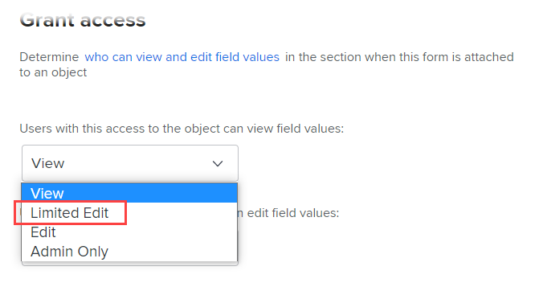

# Aprimoramentos de formulário personalizado

Os seguintes aprimoramentos significativos foram feitos para gerenciar formulários personalizados na versão 2.2.

## Adicionar widgets de ativo

Você pode incorporar imagens em seus formulários personalizados. Isso permite que você se comunique com usuários de formulários personalizados de forma mais interativa e visual. Tipos de widget adicionais serão disponibilizados em breve.


Quando um formulário personalizado contendo um widget é anexado a um objeto, os usuários que trabalham com ele podem vê-lo nas seguintes áreas:

* A área Detalhes do objeto (por exemplo, para um projeto, a área Detalhes do projeto) &#x200B;

   

* A caixa Editar do objeto, se ele tiver a nova aparência da experiência do Adobe Workfront (por exemplo, as caixas Editar projeto e Editar tarefa) &#x200B;

   

Atualmente, os usuários não podem ver o widget nas seguintes áreas: &#x200B;

* Listas e relatórios
* Início e resumo
* A caixa Editar do objeto, se ele não tiver a nova aparência da experiência do Adobe Workfront (por exemplo, a caixa Editar Despesa)
* &#x200B; o aplicativo móvel do Workfront

Para obter mais informações sobre como adicionar widgets a formulários personalizados, consulte [Adicionar ou editar uma imagem ou outro widget de ativo em um formulário personalizado](/help/quicksilver/administration-and-setup/customize-workfront/create-manage-custom-forms/add-widget-or-edit-its-properties-in-a-custom-form.md).

## Associar um formulário personalizado a vários tipos de objeto

É possível associar vários tipos de objetos a qualquer novo formulário personalizado:


Ou qualquer formulário personalizado existente:


Isso permite criar um único formulário personalizado para uso em projetos, tarefas, problemas e qualquer outro tipo de objetos que sejam compatíveis com formulários personalizados.

Isso é especialmente útil na conversão de um problema ou tarefa porque é possível transferir um formulário personalizado e seus dados para o objeto convertido. Não é mais necessário criar e manter cópias exatas do mesmo formulário personalizado para vários tipos de objetos, adicionar o formulário personalizado ao projeto manualmente.

>[!INFO]
>
>**Exemplo:**
>
>Alguém envia uma solicitação interna de TI (edição) e fornece detalhes sobre o que é necessário em um formulário personalizado anexado.
>
>Você converte o problema em um projeto para os usuários que trabalharão nele.
>
>Como o formulário personalizado que contém os detalhes do remetente está associado aos tipos de objeto Problema e Projeto , o formulário personalizado e todos esses detalhes são transferidos para o projeto durante a conversão.

>[!NOTE]
>
>Quando a conversão ocorre, o formulário personalizado já deve estar associado ao tipo de objeto para o qual você está convertendo.

Para obter instruções sobre como adicionar um widget de ativo a um formulário personalizado, consulte [Adicionar ou editar uma imagem ou outro widget de ativo em um formulário personalizado](/help/quicksilver/administration-and-setup/customize-workfront/create-manage-custom-forms/add-widget-or-edit-its-properties-in-a-custom-form.md).

Considere o seguinte ao criar ou editar um formulário personalizado com vários objetos:

* [Opções de permissão para quebras de seção](#permission-options-for-section-breaks)
* [Compatibilidade de campo personalizado calculada](#calculated-custom-field-compatibility)
* [Cuidado ao excluir um tipo de objeto de um formulário personalizado](#caution-about-deleting-an-object-type-from-a-custom-form)

### Opções de permissão para quebras de seção

O conjunto de opções de permissão de quebra de seção disponíveis para os tipos de objeto Problema, Tarefa, Projeto e Usuário tem mais uma opção de permissão do que o conjunto de opções de permissão para todos os outros tipos de objeto: Edição limitada.



O conjunto de permissões de quebra de seção disponíveis para todos os outros tipos de objetos (Portfolio, Documento, Programa, Despesa, Empresa, Iteração, Registro de Faturamento e Grupo) não inclui Edição Limitada:


Em um formulário personalizado associado a tipos de objetos de ambos os grupos, o sistema usa um conjunto comum de permissões de quebra de seção que funcionam para todos os tipos de objetos. Especificamente, em vez de usar a opção de permissão Edição limitada, esse conjunto comum substitui a opção de permissão Editar para a opção de permissão Edição limitada. A opção Editar é compatível com todos os tipos de objetos.

Quando você associa um tipo de objeto que usa opções de permissão diferentes dos outros tipos de objeto já em um formulário personalizado, uma mensagem é exibida e permite que você alterne para o conjunto comum de opções de permissão serão usadas para o formulário. Essa alteração será aplicada a todos os campos, mesmo que eles não estejam em uma quebra de seção.

Para obter mais informações, consulte [Adicionar uma quebra de seção a um formulário personalizado](/help/quicksilver/administration-and-setup/customize-workfront/create-manage-custom-forms/add-a-section-break-to-a-custom-form.md).

### Compatibilidade de campo personalizado calculada

Em um formulário personalizado de vários objetos, se um campo calculado fizer referência a campos que estão disponíveis para uso com todos os tipos de objetos associados do formulário (como {name}, {description} e {entryDate}, que estão disponíveis para vários tipos de objetos), os dados serão calculados corretamente, independentemente do objeto ao qual você os anexe.

Por exemplo, se você tiver um formulário de vários objetos para projetos e problemas e adicionar um campo calculado contendo a expressão {name}, o campo exibirá o nome do projeto quando você adicionar o formulário a um projeto e o nome da tarefa de você adicionar o formulário a uma tarefa.

No entanto, se um campo calculado no formulário fizer referência a um campo que não seja compatível com todos os tipos de objeto do formulário, uma mensagem avisará você para fazer ajustes.

>[!INFO]
>
>**Exemplo:** Em um formulário personalizado associado ao tipo de objeto Task , você cria um campo personalizado calculado que faz referência ao campo incorporado Assigned To: Nome para que ele possa mostrar o nome do destinatário principal responsável sempre que o formulário for anexado a uma tarefa:
>
>
```
>Assigned To: Name{assignedTo}.{name}
>```
>
>Posteriormente, é possível adicionar o tipo de objeto Project ao formulário personalizado. Uma mensagem de aviso informa que o tipo de objeto Projeto é incompatível com o campo personalizado calculado. Isso ocorre porque o campo Atribuído a não está disponível para projetos.

Quando isso ocorrer, você poderá executar um dos seguintes procedimentos:

* Remova um dos dois itens incompatíveis do formulário personalizado, seja o tipo de objeto ou o campo referenciado.
* Manter ambos os itens e usar a variável de filtro curinga `$$OBJCODE` como uma condição em uma expressão IF para criar duas versões diferentes do campo In Charge . Isso permite que o campo funcione com êxito, independentemente do tipo de objeto ao qual o formulário está anexado.

   Usando o exemplo acima, embora não haja um Atribuído a incorporado: Campo Nome para projetos, há um campo Proprietário incorporado (que preenche automaticamente com o nome da pessoa que criou o projeto, a menos que alguém altere isso manualmente). Portanto, em seu campo Personalizado Em Encargo , você pode usar `$$OBJCODE` conforme mostrado abaixo para fazer referência ao campo Proprietário quando o formulário personalizado está anexado a um projeto e o campo Atribuído a: Campo Nome quando o formulário é anexado a uma tarefa:

   ```
   IF($$OBJCODE="PROJ",{owner}.{name},{assignedTo}.{name})
   ```

>[!NOTE]
>
>  Se você adicionar um tipo de objeto na frente de um nome de campo, ele fará referência ao objeto pai do objeto, de modo que não será possível usar `{project}.{name}` com um projeto, mas você pode usá-lo com uma tarefa.

Para obter instruções sobre como adicionar um campo personalizado calculado a um formulário personalizado, consulte [Adicionar dados calculados a um formulário personalizado](/help/quicksilver/administration-and-setup/customize-workfront/create-manage-custom-forms/add-calculated-data-to-custom-form.md).

Para obter mais informações sobre variáveis como `$$OBJCODE`, consulte [Variáveis de filtro curinga](/help/quicksilver/reports-and-dashboards/reports/reporting-elements/understand-wildcard-filter-variables.md).

### Cuidado ao excluir um tipo de objeto de um formulário personalizado

É possível excluir um tipo de objeto em um formulário personalizado a qualquer momento, mas isso deve ser feito com cautela. Se os usuários já tiverem anexado o formulário personalizado a objetos do tipo que você deseja excluir e adicionado dados a ele, esses dados serão excluídos permanentemente ao excluir esse tipo de objeto no formulário.

Além disso, não há um sistema de notificação para alertar as pessoas que usam o formulário personalizado que foi excluído.

Para obter mais informações, consulte [Excluir um campo ou widget personalizado do sistema](/help/quicksilver/administration-and-setup/customize-workfront/create-manage-custom-forms/delete-a-custom-field.md).
