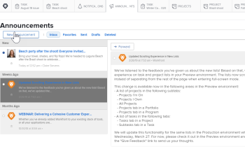

# Cancelar inscrição nas mensagens do Centro de notificações

As mensagens do Centro de notificações são mensagens enviadas do Adobe Workfront para a base de clientes da Workfront. Você pode cancelar a inscrição nos seguintes tipos de mensagens da Central de notificações:

* Anúncios sobre funcionalidades lançadas com base em recursos fora dessas versões principais.

  A maioria das novas funcionalidades introduzidas na plataforma Workfront é lançada em conjunto com uma das quatro principais versões a cada ano. No entanto, algumas funcionalidades são lançadas com base em recursos fora dessas versões principais. Cada vez que um recurso é lançado fora de uma versão principal, você recebe uma mensagem pelo Centro de anúncios. (Para obter mais informações sobre o Centro de Notificações, consulte [Enviar notificações](../../administration-and-setup/get-started-wf-administration/view-send-announcements.md).)

* Anúncios sobre ofertas e eventos de treinamento futuros.

Para cancelar a inscrição do recebimento de mensagens do Centro de notificações:

1. Clique no ícone numerado  no canto superior direito do Workfront para abrir a lista de notificações.
1. Clique em **Todos os comunicados** na parte inferior da lista.

   A página **Avisos** é exibida, listando todos os seus avisos.

   

1. Clique em **Configurações** no canto superior direito da página Anúncios e selecione **Novas versões** ou **Treinamento**, dependendo do tipo de anúncios que você não deseja mais receber.

   

1. Clique em **Salvar configurações**.

   Você não receberá mais mensagens do Centro de Notificações para este tipo de notificação.
