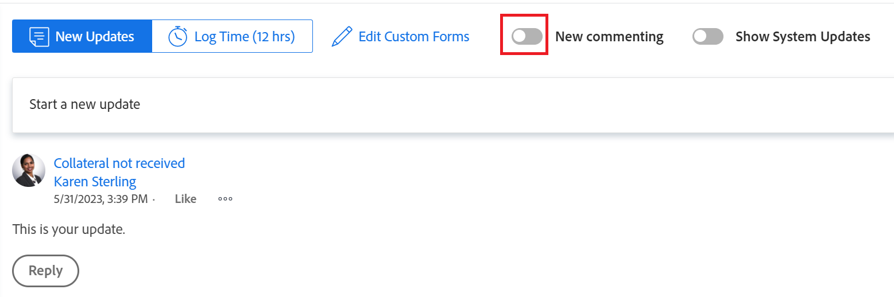

# Nova experiência de comentários

<!--take out legacy, preview, prod references from below-->

As informações destacadas nesta página se referem a funcionalidades ainda não disponíveis no geral. Ela está disponível somente no ambiente de Pré-visualização para todos os clientes.  

Para obter informações sobre a programação de lançamento atual, consulte [Visão geral da versão do segundo trimestre de 2024](/help/quicksilver/product-announcements/product-releases/24-q2-release-activity/24-q2-release-overview.md).

<!--

After the monthly releases to Production, the same features are also available in the Production environment for customers who enabled fast releases.

For information about fast releases, see [Enable or disable fast releases for your organization](../../../administration-and-setup/set-up-workfront/configure-system-defaults/enable-fast-release-process.md)  -->

>[!IMPORTANT]
>
>As informações neste artigo se referem aos recursos que foram lançados para a nova experiência de comentários.
>
>O programa beta para a nova experiência de comentários começou em abril de 2023 e terminou em outubro de 2023. O programa beta para a nova experiência de comentários foi encerrado com a versão de outubro de 2023.
>
>A partir de outubro de 2023, todos os novos recursos da nova experiência de comentários serão lançados para todos os clientes. Para obter mais informações, consulte a página de visão geral da versão atual para cada versão.

<!--An update to the commenting experience in Adobe Workfront is currently in development. This update includes a new interface, new features, and improved performance in the Updates section of select objects. 

The new commenting experience will slowly become available for all the objects with an Updates section in Workfront, and later it will expand to other Adobe Experience Cloud applications.-->

<!--For additional resources for the new commenting experience, also see the following articles:

* [New commenting experience release activity](../new-commenting-experience-beta/new-commenting-beta-experience-release-activity.md)
* [New commenting experience FAQs](../../betas/new-commenting-experience-beta/new-commenting-faq.md)
-->

## Recursos

A nova experiência de comentários inclui melhorias e alterações na seção Atualizações de objetos do Adobe Workfront.

Entre as melhorias incluídas na nova experiência de comentários estão as seguintes:

* Melhor desempenho e experiência do usuário
* Separação dos comentários do usuário das atualizações de atividade do sistema
* Indicador em tempo real quando novos comentários são adicionados a um objeto
* Edição de comentários após o envio

Os seguintes recursos foram removidos ou serão descontinuados da nova experiência:

* Comentar em uma atualização do sistema. Comentários adicionados às atualizações do sistema no passado foram importados como comentários somente leitura na nova guia Atividade do sistema.
* Capacidade de editar Status, Condição, Data de confirmação e Percentual concluído ao comentar tarefas e problemas.

  Como alternativa, recomendamos que você adicione esses campos no painel Resumo de tarefas e problemas para acessá-los facilmente a partir de listas, relatórios, Página inicial, Workfront Balancer ou uma folha de horas.
* Capacidade de editar o formulário personalizado
* A informação &quot;em nome de &lt; user name >&quot; quando um administrador de Workfront ou grupo faz logon como outro usuário e adiciona um comentário em nome dele foi originalmente removida. Ele foi restabelecido em 19 de outubro de 2023.
* A opção &quot;Solicitar aprovação&quot; ao marcar pessoas ao adicionar um comentário a um documento.
* A configuração &quot;Mostrar o percentual concluído na atualização do status&quot; ao editar a caixa de perfil de um usuário será removida. A funcionalidade de atualizar o percentual concluído de uma tarefa ou problema foi removida.

<!--removed this note on November 28, 2023, when this limitation was removed: 

>[!NOTE]
>
>The objects listed below have only the comments and system updates starting with January 1, 2019 available in the new commenting experience.  
>
>You can view comments and system updates on these objects prior to January 1, 2019 when viewing the Updates section in the current experience:
>
>* Issues
>* Projects
>* Tasks
>* Documents

For more information, see the [New commenting experience FAQs](../../betas/new-commenting-experience-beta/new-commenting-faq.md). 
-->

A tabela a seguir ilustra os recursos que estarão disponíveis na nova experiência de comentários, bem como sua disponibilidade em áreas onde são compatíveis:

<table>
  <tr>
   <td><strong>Recurso </strong>
   </td>
   <td><strong>Existe na experiência antiga de comentários </strong>
   </td>
   <td><strong>Existe na nova experiência de comentários </strong>
   </td>
   <td><strong>Será introduzido na nova experiência de comentários </strong>
   </td>
   <td><strong>Quando serão introduzidos na nova experiência de comentários </strong>
   </td>
   <td><strong>Em pesquisa </strong>
   </td>
  </tr>
  <tr>
   <td>Criar/ler/responder/excluir comentários 
   </td>
   <td>✓ µ 
  </td>
   <td>✓ µ 
   </td>
   <td> 
   </td>
   <td> 
   </td>
   <td> 
   </td>
  </tr>
  <tr>
   <td>Rich text (exclui aspas e emojis)
   </td>
   <td>✓ µ 
   </td>
   <td>✓ µ
   </td>
   <td> 
   </td>
   <td> 
   </td>
   <td> 
   </td>
  </tr>

<tr>
   <td>Rich text (emojis)
   </td>
   <td>✓ µ 
   </td>
   <td>✓ µ
   </td>
   <td> 
   </td>
   <td> 
   </td>
   <td> 
   </td>
  </tr>

<tr>
   <td>Rich text (aspas de bloco)
   </td>
   <td>✓ µ 
   </td>
   <td> ✓ µ
   </td>
   <td> 
   </td>
   <td> 2 o trim. de 2023
   </td>
   <td> 
   </td>
  </tr>
  <tr>
<tr>
   <td> Citar comentários
   </td>
   <td>✓ µ 
   </td>
   <td> ✓ µ
   </td>
   <td> 
   </td>
   <td> 2 o trim. de 2023
   </td>
   <td> 
   </td>
  </tr>
  <tr>
   <td>Reagir a comentários (Curtir) 
   </td>
   <td>✓ µ 
   </td>
   <td>✓ µ 
   </td>
   <td> 
   </td>
   <td> 
   </td>
   <td> 
   </td>
  </tr>
  <tr>
   <td>Anexar imagens a comentários 
   </td>
   <td>✓ µ 
   </td>
   <td>✓ µ 
   </td>
   <td> 
   </td>
   <td> 
   </td>
   <td> 
   </td>
  </tr>
  <tr>
   <td>Marcar pessoas em comentários 
   </td>
   <td>✓ µ 
   </td>
   <td>✓ µ 
   </td>
   <td> 
   </td>
   <td> 
   </td>
   <td> 
   </td>
  </tr>
  <tr>
   <td>Remover participantes do thread
   </td>
   <td> 
   </td>
   <td>✓ µ
   </td>
   <td> 
   </td>
   <td> 
   </td>
   <td> 
   </td>
  </tr>

<tr>
   <td>Marcar automaticamente todos os participantes do thread
   </td>
   <td> 
   </td>
   <td>✓ µ
   </td>
   <td> 
   </td>
   <td> 
   </td>
   <td> 
   </td>
  </tr>

<tr>
   <td>Comentários privados de uma empresa 
   </td>
   <td>✓ µ 
   </td>
   <td>✓ µ 
   </td>
   <td> 
   </td>
   <td> 
   </td>
   <td> 
   </td>
  </tr>
  <tr>
   <td>Desfazer postagem de um comentário 
   </td>
   <td>✓ µ 
   </td>
   <td>Substituído pelo comentário de edição 
   </td>
   <td> 
   </td>
   <td> 
   </td>
   <td> 
   </td>
  </tr>
  <tr>
   <td>Desativar atualizações do sistema 
   </td>
   <td>✓ µ 
   </td>
   <td>Substituído pela guia Atividade 
   </td>
   <td> 
   </td>
   <td> 
   </td>
   <td> 
   </td>
  </tr>
  <tr>
   <td>Editar comentários 
   </td>
   <td> 
   </td>
   <td> ✓ µ
   </td>
   <td> 
   </td>
   <td> 
   </td>
   <td> 
   </td>
  </tr>
  <tr>
   <td>Salvar rascunhos de comentários ao sair da página 
   </td>
   <td>✓ µ 
   </td>
   <td>✓ µ 
   </td>
   <td> 
   </td>
   <td> 
   </td>
   <td> 
   </td>
  </tr>
  <tr>
   <td>Ver novos comentários em tempo real (inclui ver quando um comentário é excluído)
   </td>
   <td> 
   </td>
   <td>✓ µ
   </td>
   <td> 
   </td>
   <td> 
   </td>
   <td> 
   </td>
  </tr>
  <tr>
   <td>Registrar de tempo 
   </td>
   <td>✓ µ 
   </td>
   <td>✓ µ
   </td>
   <td> 
   </td>
   <td> 
   </td>
   <td> 
   </td>
  </tr>
    <tr>
   <td>Copiar link da discussão 
   </td>
   <td>✓ µ 
   </td>
   <td> Substituído pelo link Copiar
   </td>
   <td> 
   </td>
   <td>2 o trim. de 2023 
   </td>
   <td> 
   </td>
  </tr>
  <tr>
   <td>Copiar link do comentário 
   </td>
   <td>✓ µ 
   </td>
   <td> Substituído pelo link Copiar
   </td>
   <td> 
   </td>
   <td> 
   </td>
   <td> 
   </td>
  </tr>
  <tr>
   <td>Citar texto de comentário 
   </td>
   <td>✓ µ 
   </td>
   <td>✓ µ
   </td>
   <td> 
   </td>
   <td>2 o trim. de 2023 
   </td>
   <td> 
   </td>
  </tr>
  <tr>
   <td>Copiar texto do corpo 
   </td>
   <td>✓ µ 
   </td>
   <td> ✓ µ
   </td>
   <td> 
   </td>
   <td>
   </td>
   <td> 
   </td>
  </tr>
    <tr>
   <td>Pesquisar em comentários 
   </td>
   <td> 
   </td>
   <td> ✓ µ
   </td>
   <td> 
   </td>
   <td>1º trim. de 2024 
   </td>
   <td> 
   </td>
  </tr>

<tr>
   <td>Copiar e colar imagens em um comentário
   </td>
   <td> 
   </td>
   <td> ✓ µ
   </td>
   <td> 
   </td>
   <td>1º trim. de 2024 
   </td>
   <td> 
   </td>
  </tr>

<tr>
   <td>Arrastar e soltar imagens em um comentário
   </td>
   <td> ✓ µ
   </td>
   <td> ✓ µ
   </td>
   <td> 
   </td>
   <td>1º trim. de 2024 
   </td>
   <td> 
   </td>
  </tr>

<tr>
   <td>Editar formulário personalizado 
   </td>
   <td>✓ µ 
   </td>
   <td> 
   </td>
   <td> 
   </td>
   <td> 
   </td>
   <td> 
   </td>
  </tr>
  <tr>
   <td>Capacidade de editar Status, Condição, Data de confirmação ao comentar 
   </td>
   <td>✓ µ 
   </td>
   <td> 
   </td>
   <td> 
   </td>
   <td> 
   </td>
   <td>
   </td>
  </tr>
<tr>
   <td>Responder a atualizações do sistema 
   </td>
   <td> ✓ µ
   </td>
   <td> 
   </td>
   <td> 
   </td>
   <td>
   </td>
   <td> 
   </td>
  </tr>
<tr>
   <td>Exibir "em nome de" ao adicionar comentários conectados como outro usuário
   </td>
   <td> ✓ µ
   </td>
   <td> ✓ µ
   </td>
   <td> 
   </td>
   <td>
   </td>
   <td> 
   </td>
  </tr>

<tr>
   <td>Capacidade do Proprietário do Projeto de alterar a Data de Conclusão Planejada de uma tarefa quando a Data de Compromisso é alterada na seção Atualizações
   </td>
   <td> ✓ µ
   </td>
   <td> Pode ser lançado em uma data posterior
   </td>
   <td> 
   </td>
   <td>
   </td>
   <td> ✓ µ
   </td>
  </tr>
</table>

## Linha do tempo de lançamento

>[!IMPORTANT]
>
>Para obter informações sobre os recursos lançados para a nova experiência de comentários durante o período beta, consulte [Novo comentário sobre a atividade de lançamento de experiência beta](../../betas/new-commenting-experience-beta/new-commenting-beta-experience-release-activity.md).
>
>Para obter mais informações sobre o gerenciamento de atualizações para objetos do Workfront, consulte [Atualizar trabalho](../../../workfront-basics/updating-work-items-and-viewing-updates/update-work.md).

Veja a seguir uma linha do tempo planejada com marcos importantes para o lançamento da nova experiência de comentários no ambiente de produção. Além dos marcos abaixo, continuaremos a melhorar a experiência de comentários com aprimoramentos menores.

Para obter informações sobre os recursos lançados para a nova experiência de comentários após o encerramento do período beta, consulte a página de visão geral da versão atual.

Esta é uma linha do tempo planejada para o lançamento da nova experiência de comentários:

* Com a versão 23.2 (6 de abril de 2023):
   * Iniciar a experiência de comentários beta para problemas
   * Lançar a nova experiência de comentários para metas (como a única experiência)
* Com a versão 23.3 (20 de julho de 2023):
   * Inicie a experiência de comentários Beta para projetos, tarefas e documentos.
   * Lançar a nova experiência de comentários para cartões na área Quadros (como a única experiência)
* Durante a versão do quarto trimestre de 2023 (versão limitada, disponível somente para clientes que escolhem a versão rápida):
   * Libere a nova experiência de comentários para modelos, tarefas de modelo, programas, portfólios, equipes, usuários e folhas de horas (como a única experiência)
   * Atualize a experiência de comentários Beta para projetos, tarefas, problemas e documentos para se tornar a opção padrão. O rótulo &quot;Beta&quot; é removido.
* Com a versão do quarto trimestre de 2023 (23.10) (26 de outubro de 2023)
   * Libere a nova experiência de comentários para modelos, tarefas de modelo, programas, portfólios, equipes, usuários e folhas de horas (como a única experiência) para todos os clientes.
   * Torne a nova experiência de comentários para projetos, tarefas, problemas e documentos a opção padrão.

  >[!IMPORTANT]
  >
  >    Isso concluirá a etapa beta da nova experiência de comentários.

   * Inclua todos os recursos lançados para a nova experiência de comentários começando com essa data nas versões atuais, mensais e trimestrais.
* Final de 2023:
   * Mantenha a experiência de comentários herdada como uma opção secundária para os seguintes objetos: projetos, tarefas, problemas e documentos. A nova experiência de comentários é a opção padrão para todos os usuários desses objetos.
   * Torne a nova experiência de comentários a única experiência para todos os outros objetos.

  >[!NOTE]
  >
  >    As iterações continuarão tendo a experiência de comentários herdada. A nova experiência de comentários não estará disponível para iterações.

* Com a segunda versão do trimestre de 2024 (11 de abril de 2024):

   * Remova a opção para alternar de volta para o fluxo de comentários herdado e fazer do novo fluxo de comentários a única experiência para todos os objetos, com exceção das Iterações.

## Localizar a nova experiência de comentários

<!--info for April 11: make this commented out text live and hide everything else underneath it, all the way to the end of the article: 

>[!IMPORTANT]
>
>The new commenting experience is available in all Workfront environments on all objects with the exception of Iterations. 
>
>The legacy commenting experience has been removed from all environments for Projects, Tasks, Issues, and Documents. 

For information about accessing the Updates section of Workfront objects, see [Updates section overview](/help/quicksilver/workfront-basics/updating-work-items-and-viewing-updates/updates-tab-overview.md). 

-->

A nova experiência de comentários está disponível atualmente para todos os clientes e ambientes.

Dependendo dos objetos para os quais você acessa a experiência de comentários, você pode ver a seguinte funcionalidade para a seção Atualizações:

* A experiência de comentários nova e herdada para os seguintes objetos:

   * Projeto
   * Tarefa (inclui Histórias)
   * Problema
   * Documento

     >[!NOTE]
     >
     >A experiência de comentários herdada foi removida do ambiente de Pré-visualização desde 1 de abril de 2024. 

* Somente a nova experiência de comentários para os objetos listados abaixo. Não há opção para habilitar a experiência de comentários herdada para estes objetos:

   * Meta

  >[!NOTE]
  >
  >Você deve ter uma licença adicional para acessar o Adobe Workfront Goals para acessar essa área do Workfront. Para obter mais informações, consulte [Requisitos para usar as metas do Workfront](../../../workfront-goals/goal-management/access-needed-for-wf-goals.md).
   * Cartão em um quadro
   * Equipe
   * Modelo
   * Modelo de Tarefa
   * Planilha de horas
   * Programa
   * Portfólio
   * Usuário

* Somente a experiência de comentários herdada para os seguintes objetos:

   * Iterações

     Não há opção para habilitar a nova experiência de comentários para iterações. Somente a experiência de comentários herdada está disponível para iterações.

<!--before August 17: 

The new commenting experience is currently supported for the following objects:

* When enabling the Beta experience in the Updates section for 

    * Issues, projects, tasks, and documents

    For more information about managing updates for Workfront objects, see [Update work](../../../workfront-basics/updating-work-items-and-viewing-updates/update-work.md). 

* By default, as the only commenting experience for

    * Goals, cards on a board

    >[!NOTE]
    >
    >You must have an additional license to Adobe Workfront Goals to be able to access this area of Workfront. For more information, see [Requirements to use Workfront Goals](../../../workfront-goals/goal-management/access-needed-for-wf-goals.md).

-->

<!--Depending on the environment you access the commenting experience you can do one of the following: 

* Enable the commenting experience Beta in the Production environment
* Enable the legacy commenting experience in the Preview  environment 
-->

Para ativar a opção de experiência de comentários para projetos, tarefas, problemas e documentos:

1. (Condicional) No ambiente de Produção, vá para um objeto para o qual deseja ativar a nova experiência de comentários e clique em **Atualizações** no painel esquerdo.
1. (Condicional) Se estiver desativado, ative a opção **Novo comentário** no canto superior direito da área Atualizações para ativá-la. Isso deve ser ativado por padrão.
   A opção Novo comentário foi removida do ambiente de Visualização.

   

1. Comece digitando uma atualização no **Comentários** guia. A guia Comentários é a guia padrão quando a nova experiência é aberta

   Ou

   Clique em  **Atividade do sistema** para exibir as atualizações de atividade geradas pelo Workfront.

1. (Opcional) Para desativar a nova experiência de comentários e retornar aos comentários herdados, desmarque a opção **Novo comentário** opção.

