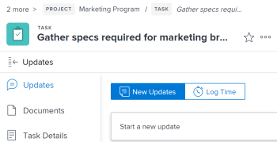

# Outros aprimoramentos na 21.2

Esta página descreve todas as outras melhorias feitas com a versão 21.2 para o ambiente de Pré-visualização. Essas melhorias serão disponibilizadas no ambiente de Produção na semana de 10 de maio de 2021. Para obter uma lista de todas as alterações disponíveis com a versão 21.2, consulte a [Visão geral da versão 21.2](../../../product-announcements/product-releases/21.2-release-activity/21-2-release-overview.md).

## Agora somos oficialmente o Adobe Workfront

A Workfront mudou sua marca para Adobe Workfront.

As áreas mais proeminentes no aplicativo Adobe Workfront e em nossos sites voltados para o cliente foram atualizadas. Outras áreas serão atualizadas em breve.

**Áreas atualizadas**

* Tela de logon, Navegação superior, Prova
* Interface de modelos de layout, menu principal, exportação personalizada do Forms (disponível somente na nova experiência do Adobe Workfront)
* Aplicativo móvel Workfront (iOS e Android)

Áreas atualizadas em breve

* Provas de aplicativos para desktop e dispositivos móveis
* Exportações do PDF para listas e relatórios
* Ícone de favicon na guia do navegador

**Áreas sendo atualizadas mais tarde**

* Notificações de email

## Validação de incluo na lista de permissões de email

>[!NOTE]
>
>Disponível somente na nova experiência do Adobe Workfront.

Se você usar o incluo na lista de permissões de email, os endereços de email de usuário novos e atualizados serão validados em relação ao incluo na lista de permissões. Ao adicionar um novo usuário ou editar um usuário existente e inserir um domínio de email que não esteja no incluo na lista de permissões, uma mensagem notificará que o usuário não receberá mensagens de email. Você ainda pode salvar o perfil de usuário, mas deve adicionar o domínio ao incluo na lista de permissões para que o usuário receba emails.

Para obter mais informações, consulte [Editar perfil de usuário](../../../administration-and-setup/add-users/create-and-manage-users/edit-a-users-profile.md).

## Nova aparência para cabeçalhos de objeto

>[!NOTE]
>
>Esse recurso foi lançado no ambiente de Produção em 10 de março de 2020.
>
>Esse recurso está disponível somente na nova experiência do Adobe Workfront.

Para reforçar ainda mais a hierarquia das informações e ajudar os usuários a entender com mais clareza em que página eles estão, cada cabeçalho de objeto agora tem:

* Ícones coloridos e mais modernos para cada tipo de objeto
* O tipo de objeto listado acima do nome do objeto
* Um estilo de fonte e tamanho de texto atualizados
* Outras pequenas alterações de estilo

Anteriormente, não havia um ícone e um selo com o nome do objeto aparecia à direita do título do objeto.

Os cabeçalhos de página de áreas na nova experiência do Workfront, como Analítica aprimorada, Gerenciamento de recursos e outras, também apresentam essa aparência atualizada.

Para saber mais sobre os novos cabeçalhos de objeto na nova experiência do Workfront, consulte [Novos cabeçalhos de objeto](../../../workfront-basics/the-new-workfront-experience/new-object-headers.md).

## Atualizações para respostas de pesquisa de status de objeto

O Workfront agora armazena status de objetos de uma nova maneira.

Essas alterações não afetam como as solicitações de pesquisa de status são feitas. No entanto, as solicitações de API que contêm uma pesquisa de status de objeto retornarão uma lista incompleta de status de grupo.

Para obter mais informações, consulte [Alterações na API principal: Respostas da pesquisa de status](../../../wf-api/api/api-changes-search.md).

## Cargas de assinatura do evento atualizadas para incluir todos os campos que terminam em ID

Todas as cargas de assinatura de evento agora contêm todos os campos que terminam em &quot;ID&quot;.

É importante observar que cada objeto tem seu próprio conjunto exclusivo de campos associados, que inclui um conjunto exclusivo de campos associados que terminam em ID. Isso significa que, embora cada carga contenha todos os campos associados desse objeto que terminam em ID, cada objeto tem um conjunto diferente de campos que terminam em ID.

## A versão beta de blueprints agora está disponível na Pré-visualização

>[!NOTE]
>
>Essa funcionalidade não estará em disponibilidade geral no ambiente de Produção até a versão 21.3, no final deste ano. Disponível somente na nova experiência do Adobe Workfront.

Os blueprints fornecem elementos básicos para ajudá-lo a criar um sistema de gerenciamento de trabalho que cresce com você. Os administradores do sistema podem navegar pelo catálogo de blueprints e instalar modelos de projeto prontos para uso.

Para obter mais informações, consulte [Blueprints](../../../administration-and-setup/blueprints/blueprints.md).
