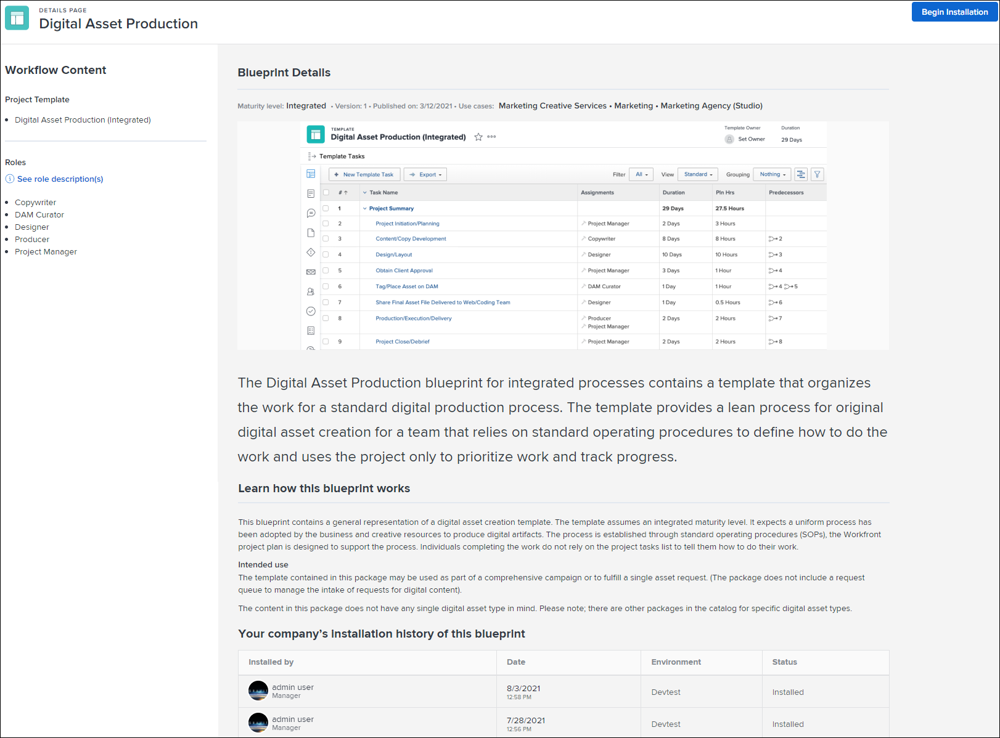

# 21.4 Aprimoramentos do administrador

Esta página descreve todas as melhorias de Administrador feitas com a versão 21.4 para o ambiente de Pré-visualização. Esses aprimoramentos serão disponibilizados no ambiente de Produção na semana de 4 de outubro de 2021.

Para obter uma lista de todas as alterações disponíveis com a versão 21.4, consulte [21.4 Visão geral da versão](../../../product-announcements/product-releases/21.4-release-activity/21.4-release-overview.md).

## Para administradores: veja quais grupos estão associados a um processo de aprovação

Para ajudar você a descobrir quais grupos estão associados aos processos de aprovação no seu sistema, adicionamos uma coluna Nome do grupo à exibição Padrão na página Aprovações em Configuração. Agora você pode visualizar essas informações sem precisar criar uma visualização personalizada.

Para obter informações sobre processos de aprovação, consulte [Visão geral do processo de aprovação](../../../review-and-approve-work/manage-approvals/approval-process-in-workfront.md).

Para obter informações sobre o gerenciamento de processos de aprovação de grupo, consulte [Processos de aprovação de nível de grupo](../../../administration-and-setup/manage-groups/work-with-group-objects/create-and-modify-groups-approval-processes.md).

## Novo para administradores: os grupos podem configurar suas próprias preferências de folha de horas e horas

>[!NOTE]
>
>Inicialmente, na Produção, essa funcionalidade estará disponível como parte de uma implantação em fases somente para clientes do Cluster 4. Esta nota será atualizada à medida que a funcionalidade se tornar disponível para outros clusters.

Em uma organização grande, alguns grupos podem precisar configurar preferências de horas e folha de horas de maneira independente para ajustar seus fluxos de trabalho exclusivos, em vez de herdar as preferências configuradas por um administrador no nível do sistema. Agora, os administradores do Workfront podem desbloquear uma folha de horas e uma preferência de horas para todos os grupos no sistema para que possam configurá-la sozinhos.

Essa capacidade também foi adicionada recentemente para preferências de projeto e para preferências de tarefas e problemas.

Para obter informações sobre como um administrador do Workfront desbloqueia uma folha de horas e uma preferência de horas, consulte a seção [Desbloquear preferências de horas e planilhas de horas para grupos](../../../administration-and-setup/set-up-workfront/configure-timesheets-schedules/timesheet-and-hour-preferences.md#lock) no artigo [Configurar preferências de horas e planilha de horas](../../../administration-and-setup/set-up-workfront/configure-timesheets-schedules/timesheet-and-hour-preferences.md).

Para obter informações sobre como um administrador de grupo configura preferências de tarefas e problemas desbloqueadas para um grupo, consulte [Configurar preferências de horas e planilha de horas para um grupo](../../../administration-and-setup/manage-groups/create-and-manage-groups/configure-timesheet-hour-preferences-group.md).

## Novo para administradores do Workfront: configurar modelos de layout para usuários provisionados automaticamente na nova experiência do Workfront

Agora você pode configurar modelos de layout na nova experiência do Workfront para usuários provisionados automaticamente. No menu suspenso Atributo do usuário do Workfront, onde você mapeia atributos do usuário (Configurar > Sistema > Logon único), um novo item de menu &quot;Novo modelo de layout&quot; agora está disponível para fazer essa configuração. Anteriormente, você podia configurar modelos de layout para usuários provisionados automaticamente somente no Workfront Classic.

Para obter instruções sobre como mapear atributos de usuário, consulte [Mapear atributos do usuário e provisionar automaticamente novos usuários](../../../administration-and-setup/add-users/create-and-manage-users/map-user-attributes.md).

## O novo campo exibe os grupos aos quais seus usuários pertencem

Agora é fácil descobrir a quais grupos seus usuários pertencem. Em um relatório ou exibição que lista usuários, é possível criar uma coluna usando o novo campo Outros Grupos. Este campo lista os grupos dos quais cada usuário é membro.

Para obter informações sobre o uso de relatórios e visualizações, consulte [Criar um relatório personalizado](../../../reports-and-dashboards/reports/creating-and-managing-reports/create-custom-report.md) e [Visão geral das exibições no Adobe Workfront](../../../reports-and-dashboards/reports/reporting-elements/views-overview.md).

## A página de detalhes de blueprints agora exibe uma imagem

A página de detalhes de cada blueprint agora exibe uma imagem do modelo de projeto que é instalado com o blueprint. A imagem fornece uma pré-visualização do conteúdo do blueprint para que você saiba o que está prestes a instalar. Como opção, é possível visualizar a imagem completa no navegador ou baixá-la.

Para obter mais informações, consulte [Visão geral de blueprints](../../../administration-and-setup/blueprints/blueprints-overview.md).

## Preferências de blueprints para novos problemas

Novas preferências de problema agora estão disponíveis para alguns blueprints. Eles são instalados por padrão, mas você pode optar por não instalar as preferências ao configurar os detalhes de instalação.

As preferências incluem grupos de tópicos da fila, tópicos da fila e regras de roteamento para coletar as informações corretas quando uma ocorrência ou solicitação é submetida e enviar a ocorrência ou solicitação à função de trabalho ou equipe correta. Usar as preferências ajuda a criar consistência na maneira como novos problemas ou solicitações são capturados em seus projetos.

Observe que o uso dessas preferências não transforma os projetos criados a partir do modelo em filas de solicitações.

Para obter mais informações, consulte [Configurar um blueprint](../../../administration-and-setup/blueprints/configure-template-package.md).

## Novo para administradores de grupo: visualizar e gerenciar os itens excluídos e restaurados recentemente de um grupo

>[!NOTE]
>
>Esse recurso está disponível somente na nova experiência do Adobe Workfront.

Continuamos a facilitar o gerenciamento de seus grupos e de seus objetos associados em um único local. Agora você pode visualizar e trabalhar com os itens excluídos e restaurados recentemente de um grupo na área Grupos. Isso evita que você tenha que ir para a área Excluídos recentemente ou Restaurados recentemente na Configuração para gerenciar esses itens. E mantém a lista de itens de grupo com os quais você está trabalhando separada dos outros itens excluídos e restaurados no sistema.

Para obter mais informações, consulte [Exibir e gerenciar os itens excluídos recentemente de um grupo](../../../administration-and-setup/manage-groups/work-with-group-objects/view-manage-groups-recently-deleted-objects.md) e [Exibir e gerenciar os itens restaurados recentemente de um grupo](../../../administration-and-setup/manage-groups/work-with-group-objects/view-manage-groups-recently-restored-objects.md).

## Novo para administradores de grupo: as preferências de grupo agora afetam os modelos de grupo

Agora é mais fácil garantir que os modelos de projeto do seu grupo atendam às necessidades do seu grupo. Quando você atribui um novo modelo de projeto a um grupo no momento em que o cria, o modelo herda as seguintes configurações das preferências de projeto e tarefa do grupo:

* Método Índice de desempenho
* Tipo de condição
* Agendar de
* Tempo de folga do usuário
* Tipo de atualização
* Configurações da seção de acesso

Quando você cria uma nova tarefa de modelo em um modelo de projeto que está associado a um grupo, a tarefa de modelo herda as seguintes configurações das preferências de tarefa do grupo:

* Tipo de Duração
* Tipo de Receita
* Tipo de Custo

Anteriormente, os modelos de projeto e as tarefas do modelo de projeto herdavam essas configurações das preferências de projeto e tarefa definidas no nível do sistema.

Se você criar um modelo ou uma tarefa de modelo sem um grupo, por exemplo, na página Modelos principal, as configurações acima serão herdadas das preferências de projeto e tarefa no nível do sistema. No entanto, se posteriormente você atribuir um grupo ao modelo ou à tarefa de modelo, as preferências do grupo não a afetarão.

Para obter mais informações, consulte a seção Como as preferências se aplicam a modelos e tarefas de modelo no artigo [Criar e modificar os modelos de projeto de um grupo](../../../administration-and-setup/manage-groups/work-with-group-objects/create-and-modify-a-groups-templates.md).

## Novo para administradores: Descubra quais formulários personalizados estão usando um campo personalizado

Agora é mais fácil alterar um campo personalizado em um formulário personalizado. Com um único clique no formulário personalizado, você pode descobrir sobre outros formulários personalizados que também estão usando o campo. É importante avaliar se esses formulários precisarão de ajustes para continuar funcionando corretamente depois de fazer a alteração.

Para obter mais informações, consulte [Exibir todos os formulários personalizados que usam um campo ou widget personalizado específico](../../../administration-and-setup/customize-workfront/create-manage-custom-forms/view-all-custom-forms-that-use-a-particular-custom-field.md).

## Novo para administradores de grupo: Bloquear e desbloquear preferências de projetos, tarefas e problemas para um grupo

Agora você pode garantir que todos nos subgrupos abaixo do seu grupo estejam usando as mesmas configurações de preferências, ou pode permitir que eles definam uma configuração de preferências para seus fluxos de trabalho exclusivos.

* Depois que um administrador do Workfront desbloqueia uma preferência no nível do sistema, você pode configurá-la e bloqueá-la para todos os subgrupos abaixo do seu grupo. Embora ainda seja possível reconfigurar a preferência bloqueada, os administradores de subgrupos inferiores não podem fazer isso para seus grupos.

  Por outro lado, você pode desbloquear uma preferência para o seu grupo. Isso permite que administradores de subgrupo a configurem para as necessidades exclusivas de fluxo de trabalho de projetos, tarefas ou problemas de seus usuários.

  Para obter mais informações, consulte [Preferência Bloquear ou desbloquear um projeto, tarefa ou problema para subgrupos](../../../administration-and-setup/manage-groups/create-and-manage-groups/lock-or-unlock-a-group-preference.md).

* Se você for um administrador do Workfront, não será necessário acessar a área Grupos para configurar as preferências de um subgrupo. Na área principal Preferências do projeto, Preferências de tarefas e problemas ou Folhas de horas e preferências de horas, você pode usar a caixa de pesquisa na parte superior da página para localizar o subgrupo e configurar suas preferências.

  Para obter mais informações, consulte [Configurar as preferências do projeto para um grupo](../../../administration-and-setup/manage-groups/create-and-manage-groups/configure-project-preferences-group.md) e [Configurar preferências de tarefas e problemas para um grupo](../../../administration-and-setup/manage-groups/create-and-manage-groups/configure-task-issue-preferences-group.md).

## Novo para administradores de grupo: crie e edite modelos na área Grupos

>[!NOTE]
>
>Esse recurso está disponível somente na nova experiência do Workfront.

Continuamos a facilitar o gerenciamento de grupos e de seus objetos associados em um único local. Agora você pode visualizar e trabalhar com os modelos de um grupo na área Grupos em Configuração. Isso evita que você precise ir para a área Modelos para gerenciar os modelos de um grupo. E mantém a lista de modelos de grupo em que você está trabalhando separada das outras pessoas no sistema.

Para obter mais informações, consulte [Criar e modificar os modelos de projeto de um grupo](../../../administration-and-setup/manage-groups/work-with-group-objects/create-and-modify-a-groups-templates.md).

## Inserir e salvar informações em um formulário personalizado anexado de cada vez

>[!NOTE]
>
>Esse recurso está disponível somente na nova experiência do Adobe Workfront.

Agora é mais fácil fornecer informações na seção Detalhes de um objeto: digite e salve as informações em um único campo personalizado ou área expansível (como Visão geral e Finanças), mesmo que os campos obrigatórios em outros formulários personalizados no objeto ainda não estejam preenchidos.

Anteriormente, ao inserir informações em um formulário personalizado ou em uma área expansível para um objeto, todos os formulários personalizados anexados ao objeto entravam no modo de edição e todos os campos obrigatórios tinham que ser preenchidos antes que as alterações fossem salvas. Isso era um problema se você não pudesse preencher um campo obrigatório porque ele era destinado a outro usuário.

Se você quiser editar todos os formulários personalizados e áreas expansíveis na seção Detalhes de um objeto, clique em Editar tudo no novo menu Editar que adicionamos ao ícone Editar. Ou, no mesmo menu, você pode clicar em um nome para rolar até o formulário ou seção personalizada onde deseja fazer alterações

>[!NOTE]
>
>Este recurso foi originalmente lançado para Pré-visualização com a versão 21.3.

Para facilitar para todos os níveis de uma organização gerenciar e controlar seus fluxos de trabalho de maneira independente, introduzimos a capacidade de criar e gerenciar status para subgrupos. Agora, na seção Grupos da Configuração, você pode fazer o seguinte para grupos que administra em qualquer nível:

* Criar, editar, excluir e ocultar um status para um grupo
* Bloquear um status para qualquer grupo para que todos os subgrupos inferiores a ele possam usá-lo da mesma maneira
* Desbloquear um status para qualquer grupo para que os administradores de subgrupos inferiores possam personalizá-lo para atender às suas necessidades exclusivas
* Definir um status de grupo como um status padrão
* Reordenar e ocultar a exibição dos status de grupo em objetos

Os administradores do Workfront também podem fazer essas coisas (para todos os grupos).

Anteriormente, essa funcionalidade estava disponível somente para grupos de nível superior.

Para obter mais informações, consulte [Gerenciar status do grupo](../../../administration-and-setup/manage-groups/manage-group-statuses/manage-group-statuses.md).

## Novo para administradores do Workfront: migrar modelos de layout do Workfront Classic para a nova experiência do Workfront por conta própria

>[!NOTE]
>
>Esse recurso foi lançado no ambiente de Pré-visualização em 1 de julho de 2021. Ele será lançado no ambiente de Produção em 15 de julho de 2021.

Para ajudar você a gerenciar modelos de layout enquanto seus usuários mudam para o uso da nova experiência do Workfront, criamos um botão que pode ser usado para migrar modelos de layout do Workfront Classic para a nova experiência sem depender do Suporte ao cliente da Workfront.

Anteriormente, somente o Suporte ao cliente da Workfront podia migrar seus modelos de layout do Workfront Classic para a nova experiência do Workfront.

## Ao associar um modelo a um grupo, selecione um processo de aprovação de grupo em Detalhes da fila e Tópicos da fila

Adicionamos uma nova opção ao processo de associação de um modelo a um grupo. Agora é possível selecionar processos de aprovação específicos do grupo para ocorrências nos Detalhes da fila do modelo ou em um de seus Tópicos da fila.

Na versão 21.3, quando adicionamos a capacidade de associar um modelo de grupo a um grupo, você podia selecionar um processo de aprovação específico do grupo no modelo, mas não podia fazê-lo nos Detalhes da fila ou Tópicos da fila do modelo.

Para obter mais informações, consulte [Associar um processo de aprovação novo ou existente ao trabalho](../../../review-and-approve-work/manage-approvals/associate-approval-with-work.md).
