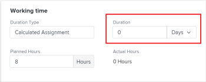

# 21.4 Melhorias do projeto

Esta página descreve todas as melhorias do projeto feitas com a versão 21.4 para o ambiente de Visualização. Esses aprimoramentos serão disponibilizados no ambiente de produção na semana de 4 de outubro de 2021.

Para obter uma lista de todas as alterações disponíveis com a versão 21.4, consulte [Visão geral da versão 21.4](../../../product-announcements/product-releases/21.4-release-activity/21.4-release-overview.md).

## Incluir imagens em atualizações

Na guia Atualizações de um objeto, agora é possível adicionar imagens clicando no ícone Imagem na barra de ferramentas. Você também pode arrastar e soltar uma imagem na área de atualização. Observe que o administrador do Workfront deve ativar a adição de imagens antes de visualizar o ícone Imagem.

Você pode adicionar imagens em atualizações e respostas. Uma miniatura de imagem na atualização indica que os recipients podem visualizar a imagem no navegador ou baixá-la, e as notificações por email e no aplicativo mostram que as imagens estão anexadas à atualização.

Anteriormente, a única maneira de compartilhar uma imagem no Workfront era anexá-la a um objeto como um documento. As imagens adicionadas na guia Atualizações só estão disponíveis nessa guia e não na guia Documentos.

Para obter mais informações, consulte [Atualizar trabalho](../../../workfront-basics/updating-work-items-and-viewing-updates/update-work.md).

Antes que os usuários do Workfront possam incluir imagens em atualizações, esse recurso deve ser ativado primeiro pelo administrador do Adobe Workfront, conforme descrito em [Configurar preferências para atualizações do usuário](../../../administration-and-setup/set-up-workfront/system-tracked-update-feeds/configure-preferences-user-updates.md).

## Algoritmo atualizado para atribuições inteligentes

Melhoramos o algoritmo usado ao fazer atribuições inteligentes. Com o novo aprimoramento, a Workfront observa as 30 atribuições mais recentes feitas pelo usuário conectado para fazer sugestões ao atribuir tarefas e problemas. A lista de sugestões pode conter até 50 usuários.

Antes desse aprimoramento, a Workfront estava considerando as atribuições nas tarefas pai e outros atributos de usuário relacionados a essas atribuições ao sugerir usuários.

Para obter informações sobre atribuições inteligentes, consulte [Visão geral de atribuições inteligentes](../../../manage-work/tasks/assign-tasks/smart-assignments.md).

## Nova experiência ao criar um projeto a partir de um modelo

Para tornar seu uso do Workfront consistente com a nova experiência do Workfront, reprojetamos a interface para criar um projeto a partir de um modelo. A funcionalidade para criar um projeto usando um modelo não foi alterada. No entanto, algumas das melhorias dessa interface recém-reprojetada incluem o seguinte:

* Visualizar informações do modelo antes de anexá-lo
* Adicionar modelos a uma lista de favoritos durante o processo de criação do projeto

Atualizamos a interface para criar o projeto ao criá-lo a partir da área Projetos e Modelos .

Para obter informações, [Criar um projeto usando um modelo](../../../manage-work/projects/create-projects/create-project-from-template.md).

## Nova experiência ao anexar modelos a projetos

>[!NOTE]
>
>Esse recurso está disponível somente na nova experiência do Adobe Workfront.

Para tornar seu uso do Workfront consistente com a nova experiência do Workfront, reprojetamos a interface para anexar um modelo a um projeto. A funcionalidade para anexar um modelo não foi alterada. No entanto, há algumas melhorias nessa interface recém-reprojetada que incluem o seguinte:

* Visualizar informações do modelo antes de anexá-lo
* Adicionar modelos a uma lista de favoritos durante o processo de anexo
* Exibir todas as opções para gerenciar configurações de modelo e projeto em uma página contínua

Para obter mais informações, consulte [Anexar um modelo a um projeto](../../../manage-work/projects/create-and-manage-templates/attach-template-to-project.md).

## Valores de unidade de duração e duração unificados para tarefas

Para uma experiência do usuário mais limpa e simplificada, unimos o valor do campo Duration com a unidade de tempo de duração. Antes desse aprimoramento, a unidade de tempo era exibida em um campo suspenso separado após o campo Duration .

Além dos campos Duração nas caixas Detalhes da tarefa, Editar tarefas e Nova tarefa, também estamos atualizando os seguintes campos para corresponder a esta experiência:

* Campo de duração ao fazer atribuições avançadas
* Campo Atraso de Nivelamento ao criar ou editar uma tarefa
* Campo de frequência ao criar uma tarefa recorrente (disponível em breve)
* Campo Atraso ao adicionar um antecessor (disponível em breve)

Para obter mais informações, consulte [Editar tarefas](../../../manage-work/tasks/manage-tasks/edit-tasks.md).

## Desativar a adição de problemas em linha em projetos

Para garantir que os usuários forneçam informações precisas ao adicionar problemas a projetos, preenchendo um formulário de problema, introduzimos uma nova configuração que permite gerenciar se eles podem adicionar problemas a um projeto ou suas tarefas em linha. Essa configuração é ativada por padrão na nova área Configurações da ocorrência da caixa Editar projeto . Desativá-la esvazia a opção Adicionar mais problemas na seção Problemas de um projeto para que os usuários não possam adicionar mais problemas na lista. Os usuários ainda podem adicionar problemas aos projetos usando a opção Novo problema na seção Problemas ou usando uma fila de solicitações se uma estiver configurada para o projeto.

>[!NOTE]
>
>Essa configuração está disponível somente na nova experiência do Workfront. Os usuários que trabalham no Workfront Classic ainda podem adicionar problemas em linha a um projeto ou a suas tarefas, mesmo que essa configuração tenha sido desativada para o projeto por um usuário que trabalha na nova experiência do Workfront.

Para obter mais informações, consulte [Editar projetos](../../../manage-work/projects/manage-projects/edit-projects.md).

## Aprimoramento de exibição de campo personalizado para caixas de seleção e botões de opção

A visualização e seleção das opções de caixa de seleção e botão de opção em formulários personalizados ficou mais fácil — um campo personalizado com muitas opções de caixa de seleção ou botão de opção agora é exibido em várias colunas na página. Anteriormente, eles eram exibidos em uma única coluna, o que exigia rolagem extra para os usuários que preenchiam o formulário.

Isso depende de como os campos são posicionados no formulário personalizado. Se você colocar outro campo na mesma linha com o campo de caixa de seleção ou botão de opção, as opções poderão ter apenas espaço horizontal suficiente para exibir em uma única coluna.

Para obter informações sobre como preencher um formulário personalizado, consulte [Editar informações em campos de formulário personalizados](../../../workfront-basics/work-with-custom-forms/edit-custom-forms.md).

Para obter informações sobre como criar uma caixa de seleção ou um campo de botão de opção em um formulário personalizado, consulte as seções [Criar ou editar um formulário personalizado](../../../administration-and-setup/customize-workfront/create-manage-custom-forms/create-or-edit-a-custom-form.md#create) e [Criar ou editar um formulário personalizado](../../../administration-and-setup/customize-workfront/create-manage-custom-forms/create-or-edit-a-custom-form.md#configur) no artigo [Criar ou editar um formulário personalizado](../../../administration-and-setup/customize-workfront/create-manage-custom-forms/create-or-edit-a-custom-form.md).

