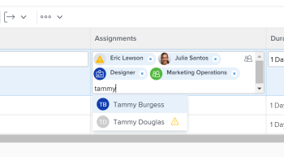

# Aprimoramentos nos relatórios na 21.4

Esta página descreve todas as melhorias de Relatórios feitas com a versão 21.4 para o ambiente de Pré-visualização. Esses aprimoramentos serão disponibilizados no ambiente de Produção na semana de 4 de outubro de 2021.

Para obter uma lista de todas as alterações disponíveis com a versão 21.4, consulte a [Visão geral da versão 21.4](../../../product-announcements/product-releases/21.4-release-activity/21-4-release-overview.md).

## Nova aparência para o campo Atribuições em listas e relatórios atualizados

>[!NOTE]
>
>Anteriormente disponível no ambiente de produção com a versão 21.2 do e temporariamente removido do ambiente de produção do em 20 de maio de 2021.

>[!NOTE]
>
>Esse recurso está disponível somente na nova experiência do Adobe Workfront.

Para corresponder à aparência moderna de outras áreas na nova experiência do Workfront, o estilo foi alterado para o campo Atribuições em listas e relatórios atualizados. Esse novo design inclui:

* Um avatar arredondado para as imagens do perfil do usuário, funções de trabalho e equipes
* Exibição de iniciais para usuários sem imagens de perfil
* Um novo ícone Função
* Um novo ícone Pessoas para atribuições avançadas
* Um novo ícone de Acesso Restrito
* Outras pequenas alterações de design

Para obter mais informações sobre atribuições em listas, consulte [Atribuir tarefas](../../../manage-work/tasks/assign-tasks/assign-tasks.md) ou [Atribuir problemas](../../../manage-work/issues/manage-issues/assign-issues.md).

## Nova aparência para campos de digitação antecipada em listas e relatórios atualizados

>[!NOTE]
>
>Anteriormente disponível no ambiente de produção com a versão 21.2 do e temporariamente removido do ambiente de produção do em 20 de maio de 2021.

>[!NOTE]
>
>Esse recurso está disponível somente na nova experiência do Adobe Workfront.

Para corresponder à aparência moderna de outras áreas na nova experiência do Workfront, o estilo foi alterado para campos de digitação antecipada em listas e relatórios atualizados. Essas alterações incluem:

* O ícone Typeahead foi removido do campo.
* Ao clicar em um campo de digitação antecipada, o menu de sugestões agora é exibido antes da inserção do texto.
* O menu de sugestões é mais responsivo ao comprimento dos valores e esses valores agora são truncados no final quando o limite de caracteres é atingido, em vez de no meio do valor.

Para obter informações sobre listas atualizadas, consulte a seção [A diferença entre as listas atualizadas e herdadas](../../../workfront-basics/navigate-workfront/use-lists/view-items-in-a-list.md#updated) no artigo [Introdução a listas no Adobe Workfront](../../../workfront-basics/navigate-workfront/use-lists/view-items-in-a-list.md).

