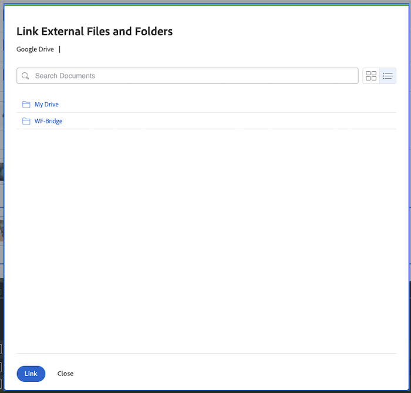

# Atualizações de aparência durante o período de lançamento do segundo trimestre de 2025

Esta página descreve pequenas atualizações na aparência de várias áreas do aplicativo Adobe Workfront que foram feitas durante o período de lançamento do segundo trimestre de 2025.

Para obter uma lista de todas as alterações disponíveis na versão do Segundo Trimestre de 2025, consulte [Visão geral da versão do Segundo Trimestre de 2025](/help/quicksilver/product-announcements/product-releases/25-q2-release-activity/25-q2-release-overview.md).

## Relatórios atualizados com novo estilo

>[!NOTE]
>
>Visualização e produção para todos os clientes: 9 de abril de 2025

Atualizamos a aparência de vários relatórios para corresponder ao design de outras áreas do Workfront.

Esta atualização inclui alterações visuais nas listas e barras de ferramentas dos seguintes relatórios. Nenhuma funcionalidade foi alterada.

* Parâmetro
* Grupo de Parâmetros
* Formulários personalizados
* Folga

Para obter informações, consulte [Criar um relatório personalizado](/help/quicksilver/reports-and-dashboards/reports/creating-and-managing-reports/create-custom-report.md).

## Atualização da aparência para a caixa de diálogo de integração de documentos do Google Drive

>[!NOTE]
>
>Versão prévia: 26 de março de 2025; Versão de produção para todos os clientes: com a versão 25.4 (10 de abril de 2025)

Atualizamos a aparência ao usar a integração de documentos do Google Drive para criar uma nova versão de um documento. Esta atualização traz a caixa de diálogo Versão > Do Google Drive para a paridade com a caixa de diálogo Adicionar novo > Do Google Drive.

Anteriormente, você tinha a opção de escolher entre Meu Drive ou um Drive compartilhado se sua conta estivesse associada a um. Agora, a caixa de diálogo vai diretamente para a área Meu Drive do Google Drive.

+++ Expandir para exibir esta alteração

<table>
 <thead>
    <tr>
        <th>Anterior</th>
        <th>Novo(a)</th>
    </tr>
  </thead>
 <tr>
        <td></td>
         <td></td>
    </tr>
</table>

+++

## Experiência atualizada na área Níveis de acesso em Configuração

>[!NOTE]
>
>Versão prévia: 27 de março de 2025; Versão de produção para todos os clientes: com a versão 25.4 (10 de abril de 2025)

Para aprimorar o desempenho, fizemos algumas atualizações visuais na área Níveis de acesso na Configuração.

Uma pequena alteração na funcionalidade foi aplicada à lista Níveis de acesso. Para copiar, editar ou excluir um nível de acesso, selecione o nível e clique no ícone apropriado.

## Atualizações de aparência para a caixa de diálogo Tipos de Despesa

>[!NOTE]
>
>Versão prévia: 27 de março de 2025; Versão de produção para todos os clientes: com a versão 25.4 (10 de abril de 2025)

Atualizamos a aparência das caixas de diálogo para adicionar e editar Tipos de Despesa na área Configuração para corresponder ao design de outras áreas do Workfront.

Para obter informações, consulte [Criar tipos de despesas personalizados](/help/quicksilver/administration-and-setup/set-up-workfront/configure-system-defaults/create-custom-expense-types.md).

## Atualizações de aparência para a caixa Editar Tipo de Risco

>[!NOTE]
>
>Versão de pré-visualização: 27 de março de 2025; Versão de produção para todos os clientes: com a versão 25.4 (10 de abril de 2025)

Atualizamos a aparência da caixa Editar tipo de risco ao atualizar um Tipo de risco existente na área Configuração do Workfront. O novo design agora corresponde a outras áreas do Workfront.

Para obter informações, consulte [Editar e criar tipos de risco](/help/quicksilver/administration-and-setup/set-up-workfront/configure-system-defaults/edit-create-risk-types.md).

## Atualizações de aparência para a caixa Novo tipo de risco

>[!NOTE]
>
>Versão prévia: 27 de março de 2025; Versão de produção para todos os clientes: com a versão 25.4 (10 de abril de 2025)

Atualizamos a aparência da caixa Novo tipo de risco ao adicionar um novo Tipo de risco na área Configuração do Workfront. O novo design agora corresponde a outras áreas do Workfront.

Para obter informações, consulte [Editar e criar tipos de risco](/help/quicksilver/administration-and-setup/set-up-workfront/configure-system-defaults/edit-create-risk-types.md).

## Atualizações de aparência da área Detalhes da fila de um projeto

>[!NOTE]
>
>Versão prévia: 27 de março de 2025; Versão de produção para todos os clientes: com a versão 25.4 (10 de abril de 2025)

Atualizamos a aparência da área Detalhes da fila em um projeto para corresponder ao design de outras áreas do Workfront.

Com esta atualização, a aparência da área Detalhes da fila de um modelo não foi alterada.

Para obter mais informações, consulte [Criar uma Fila de Solicitações](/help/quicksilver/manage-work/requests/create-and-manage-request-queues/create-request-queue.md).

## Os avatares não são mais exibidos em determinadas notificações por email

>[!NOTE]
>
>Versão prévia: 13 de março de 2025; Versão de produção para todos os clientes: 13 de março de 2025

Os avatares não serão mais exibidos nas seguintes notificações por email:

* Todas as notificações de evento de comunicação
* Novas notificações de atribuição
* Todas as notificações de conclusão de tarefas predecessoras

## Atualizações de aparência para uma lista de Caminho de Etapas

>[!NOTE]
>
>Versão prévia: 6 de março de 2025; Versão de produção para todos os clientes: com a versão 25.4 (10 de abril de 2025)

Atualizamos a aparência da lista de Caminhos de etapa na área de Configuração para corresponder ao design de outras áreas do Workfront.

Para obter mais informações, consulte [Criar um caminho de marco](/help/quicksilver/administration-and-setup/customize-workfront/configure-approval-milestone-processes/create-milestone-path.md).

## Exibição atualizada de um caminho de etapa de projeto em uma exibição de projeto

>[!NOTE]
>
>Versão prévia: 13 de março de 2025; Versão de produção para todos os clientes: com a versão 25.4 (10 de abril de 2025)

Ao acessar o caminho de etapas a partir de uma lista de projeto ou de um relatório, a página de detalhes da etapa agora tem uma nova aparência. Você deve adicionar o campo Nome do caminho do marco à exibição da lista ou relatório para poder acessar a página de detalhes do caminho do marco.

Com esta atualização, também adicionamos informações sobre as cores e os códigos de cores de cada etapa.

Para obter mais informações, consulte [Criar um caminho de marco](/help/quicksilver/administration-and-setup/customize-workfront/configure-approval-milestone-processes/create-milestone-path.md).

## Alterações temporárias de aparência e funcionalidade nos emails do documento

>[!NOTE]
>
>Versão prévia: 13 de fevereiro de 2025; Versão de produção para todos os clientes: 13 de fevereiro de 2025

Os emails relacionados à adição ou compartilhamento de documentos não terão mais uma imagem em miniatura no corpo do email.

Alguns clientes também verão a tarefa herdada e o email de atribuição de problema, que mostra apenas o avatar do destinatário.

Essas alterações são temporárias à medida que investigamos atrasos de e-mail.

## Nova aparência da caixa de diálogo Compartilhar

>[!NOTE]
>
>Versão prévia: 13 de fevereiro de 2025; Versão de produção para todos os clientes: com a versão 25.4 (10 de abril de 2025)

Atualizamos a aparência da caixa de diálogo Compartilhar para um design moderno consistente com outras áreas do Workfront. Há pequenas diferenças visuais, incluindo:

* A opção &quot;Visível em todo o sistema&quot; agora exibe &quot;Todos no sistema podem visualizar&quot;. Essa opção ainda funciona como antes.
* Há um novo ícone para acessar configurações de compartilhamento avançadas.

Para obter mais informações sobre onde encontrar a caixa de diálogo Compartilhar, consulte [Conceder e solicitar permissões para objetos](/help/quicksilver/workfront-basics/grant-and-request-access-to-objects/grant-and-request-access-to-objects.md)
