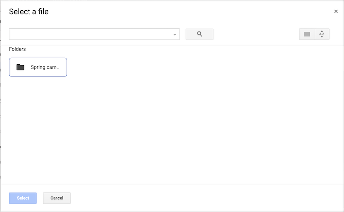

# Atualizações de aparência durante o período do segundo trimestre de 2025

Esta página descreve pequenas atualizações na aparência de várias áreas do aplicativo Adobe Workfront que foram feitas dentro do período do segundo trimestre de 2025.

Para obter uma lista de todas as alterações disponíveis com a versão do Segundo trimestre de 2025, consulte [Visão geral da versão do Segundo trimestre de 2025](/help/quicksilver/product-announcements/product-releases/25-q2-release-activity/25-q2-release-overview.md).

## Atualização da aparência para a caixa de diálogo de integração de documentos do Google Drive

>[!NOTE]
>
>Versão de pré-visualização: 26 de março de 2025; Versão de produção para todos os clientes: com a versão 25.4 (10 de abril de 2025)

Atualizamos a aparência ao usar a integração de documentos do Google Drive para criar uma nova versão de um documento. Essa atualização faz com que a caixa de diálogo Versão > Do Google Drive fique igual à caixa de diálogo Adicionar novo > Do Google Drive.

Anteriormente, você tinha a opção de escolher Meu Drive ou um Drive Compartilhado se sua conta estivesse associada a um. Agora, a caixa de diálogo vai diretamente para a área Meu Drive da sua Google Drive.

+++ Expandir para exibir esta alteração

<table>
 <thead>
    <tr>
        <th>Anterior</th>
        <th>Novo(a)</th>
    </tr>
  </thead>
 <tr>
        <td></td>
         <td></td>
    </tr>
</table>

+++

## Experiência atualizada na área Níveis de acesso em Configuração

>[!NOTE]
>
>Versão de pré-visualização: 27 de março de 2025; Versão de produção para todos os clientes: com a versão 25.4 (10 de abril de 2025)

Para aprimorar o desempenho, fizemos algumas atualizações visuais na área Níveis de acesso em Configuração.

Uma pequena alteração de funcionalidade foi aplicada à lista de Níveis de acesso. Para copiar, editar ou deletar um nível de acesso, selecione o nível e clique no ícone apropriado.

## Atualizações da aparência das caixas de diálogo Tipos de despesas

>[!NOTE]
>
>Versão de pré-visualização: 27 de março de 2025; Versão de produção para todos os clientes: com a versão 25.4 (10 de abril de 2025)

Atualizamos a aparência das caixas de diálogo para adicionar e editar Tipos de Despesas na área Configuração, para corresponder ao design de outras áreas do Workfront.

Para obter informações, consulte [Criar tipos de despesas personalizados](/help/quicksilver/administration-and-setup/set-up-workfront/configure-system-defaults/create-custom-expense-types.md).

## Atualizações de aparência para a caixa Editar Tipo de Risco

>[!NOTE]
>
>Versão de pré-visualização: 27 de março de 2025; Versão de produção para todos os clientes: com a versão 25.4 (10 de abril de 2025)

Atualizamos a aparência da caixa Editar tipo de risco ao atualizar um Tipo de risco existente na área Configuração do Workfront. O novo design agora corresponde a outras áreas do Workfront.

Para obter informações, consulte [Editar e criar tipos de risco](/help/quicksilver/administration-and-setup/set-up-workfront/configure-system-defaults/edit-create-risk-types.md).

## Atualizações de aparência para a caixa Novo Tipo de Risco

>[!NOTE]
>
>Versão de pré-visualização: 27 de março de 2025; Versão de produção para todos os clientes: com a versão 25.4 (10 de abril de 2025)

Atualizamos a aparência da caixa Novo tipo de risco ao adicionar um novo Tipo de risco na área Configuração do Workfront. O novo design agora corresponde a outras áreas do Workfront.

Para obter informações, consulte [Editar e criar tipos de risco](/help/quicksilver/administration-and-setup/set-up-workfront/configure-system-defaults/edit-create-risk-types.md).

## Atualizações de aparência da área Detalhes da fila de um projeto

>[!NOTE]
>
>Versão de pré-visualização: 27 de março de 2025; Versão de produção para todos os clientes: com a versão 25.4 (10 de abril de 2025)

Atualizamos a aparência da área Detalhes da fila em um projeto para corresponder ao design de outras áreas do Workfront.

Com essa atualização, a aparência da área Detalhes da fila de um modelo não foi alterada.

Para obter informações, consulte [Criar uma fila de solicitações](/help/quicksilver/manage-work/requests/create-and-manage-request-queues/create-request-queue.md).

## Os avatares não são mais exibidos em determinadas notificações por email

>[!NOTE]
>
>Versão de pré-visualização: 13 de março de 2025; Versão de produção para todos os clientes: 13 de março de 2025

Os avatares não serão mais exibidos nas seguintes notificações por email:

* Todas as notificações de evento de comunicação
* Novas notificações de atribuição
* Todas as notificações de conclusão de tarefas predecessoras

## Atualizações de aparência para uma lista de Caminho de Etapas

>[!NOTE]
>
>Versão de pré-visualização: 6 de março de 2025; Versão de produção para todos os clientes: com a versão 25.4 (10 de abril de 2025)

Atualizamos a aparência da lista Caminho de etapas na área Configuração para corresponder ao design de outras áreas do Workfront.

Para obter informações, consulte [Criar um caminho de etapas](/help/quicksilver/administration-and-setup/customize-workfront/configure-approval-milestone-processes/create-milestone-path.md).

## Exibição atualizada de um caminho de etapas de projeto em uma exibição de projeto

>[!NOTE]
>
>Versão de pré-visualização: 13 de março de 2025; Versão de produção para todos os clientes: com a versão 25.4 (10 de abril de 2025)

Ao acessar o caminho de etapas a partir de uma lista de projeto ou de um relatório, a página de detalhes da etapa agora tem uma nova aparência. Você deve adicionar o campo Nome do caminho de marcos à exibição da lista ou do relatório para acessar a página de detalhes do caminho de marcos.

Com esta atualização, também adicionamos informações sobre as cores e os códigos de cor de cada marco.

Para obter informações, consulte [Criar um caminho de etapas](/help/quicksilver/administration-and-setup/customize-workfront/configure-approval-milestone-processes/create-milestone-path.md).

## Alterações temporárias de aparência e comportamento em emails de documentos

>[!NOTE]
>
>Versão de pré-visualização: 13 de fevereiro de 2025; Versão de produção para todos os clientes: 13 de fevereiro de 2025

Os emails relacionados à adição ou ao compartilhamento de documentos não terão mais uma imagem em miniatura no corpo do email.

Alguns clientes também verão o email herdado de atribuição de tarefas e problemas, que mostra somente o avatar do destinatário.

Essas alterações são temporárias à medida que investigamos atrasos de email.

## Nova aparência para a caixa de diálogo Compartilhar

>[!NOTE]
>
>Versão de pré-visualização: 13 de fevereiro de 2025; Versão de produção para todos os clientes: com a versão 25.4 (10 de abril de 2025)

Atualizamos a aparência da caixa de diálogo Compartilhar para um design moderno que é consistente com outras áreas do Workfront. Há pequenas diferenças visuais, incluindo:

* A opção &quot;Visível em todo o sistema&quot; agora exibe &quot;Todos no sistema podem visualizar&quot;. Essa opção ainda funciona como antes.
* Há um novo ícone para acessar configurações de compartilhamento avançadas.

Para obter mais informações sobre onde encontrar a caixa de diálogo Compartilhar, consulte [Conceder e solicitar permissões para objetos](/help/quicksilver/workfront-basics/grant-and-request-access-to-objects/grant-and-request-access-to-objects.md)
