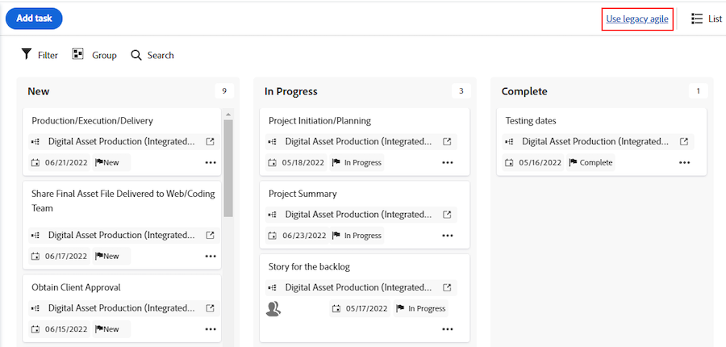

# Visão geral da versão do segundo trimestre de 2025

Esta página fornece informações sobre a funcionalidade incluída na versão do Segundo trimestre de 2025. Essas melhorias estão planejadas para serem disponibilizadas no ambiente de produção durante todo o trimestre.

Os recursos fora do ciclo (aqueles que foram lançados para produção antes da data de lançamento do Segundo trimestre de 2025) estão destacados em amarelo.

## Programação de lançamento

As versões do Workfront são numeradas para considerar as faixas de lançamento mensais e trimestrais. O primeiro número designa o ano e o segundo número significa o mês da versão. Exemplo: a versão de abril de 2025 é numerada como 25.4.

Os lançamentos mensais e trimestrais devem estar disponíveis na quinta-feira da segunda semana completa do mês, a menos que especificado de outra forma.

| Lançamento mensal | Versão trimestral |
| ----------------- | ----------------- |
| <ul><li>25.2 (13 de fevereiro de 2025)</li><li>25.3 (13 de março de 2025)</li><li>25.4 (10 de abril de 2025)</li></ul> | <ul><li>25.4 (10 de abril de 2025)</li></ul> |

>[!NOTE]
>
>Para o lançamento final de cada trimestre (25,4 neste trimestre), os usuários no cronograma de lançamento rápido receberão o lançamento um dia antes.
>
>Para obter mais informações sobre o processo de lançamento rápido, consulte [Habilitar ou desabilitar o processo de lançamento rápido](/help/quicksilver/administration-and-setup/set-up-workfront/configure-system-defaults/enable-fast-release-process.md).

## Aprimoramentos do Adobe Workfront

* [Melhorias do administrador](#administrator-enhancements)
* [Aprimoramentos no gerenciamento de documentos](#document-management-enhancements)
* [Melhorias na mobilidade](#mobile-enhancements)
* [Aprimoramentos do projeto](#project-enhancements)
* [Melhorias nos relatórios](#reporting-enhacements)
* [Outras melhorias](#other-enhancements)

### Melhorias do administrador

<table>
<col style="width: 50%;" />
<col style="width: 50%;" />
<tbody>
<tbody>
    <tr>
        <td>
            
<a href="/help/quicksilver/product-announcements/product-releases/25-q2-release-activity/25-q2-administrator-enhancements.md" class="MCXref xref" xrefformat="{para}">
            Melhorias na lógica de formulários personalizados</a>

[!BADGE Na produção &#x200B;]{type=Informative}

            
O construtor de lógica de formulários personalizados tem uma interface atualizada para fornecer mais espaço para a criação de regras de lógica. Esse novo design pode acomodar mais facilmente outros tipos de lógica que poderão ser adicionados no futuro.

Além das opções atuais de exibição e lógica de salto, a lógica de validação também está disponível.

        </td>
        <td>
            
<b>Disponível nas seguintes datas:</b>

            <ul>
                <li>Versão de pré-visualização: 13 de março de 2025</li>
                <li>Versão de produção para todos os clientes: com a versão 25.4 (abril de 2025)</li>
            </ul>
        </td>
    </tr>                          
    <tr>
        <td>
            
<a href="/help/quicksilver/product-announcements/product-releases/25-q2-release-activity/25-q2-administrator-enhancements.md" class="MCXref xref" xrefformat="{para}">
            Expressões adicionadas a campos personalizados calculados</a>

            [!BADGE Na produção &#x200B;]{type=Informative}
            
As seguintes expressões agora estão disponíveis nos campos personalizados calculados do Workfront: ARRAY, FORMAT, SWITCH, SORTASCARRAY, SORTDESCARRAY, ARRAYLENGTH, ARRAYELEMENT e ADDHOUR. As definições e exemplos de cada expressão estão disponíveis no editor de cálculo e no Experience League.

        </td>
        <td>
            
<b>Disponível nas seguintes datas:</b>

            <ul>
                <li>Versão de pré-visualização: 31 de janeiro de 2025</li>
                <li>Versão de produção para todos os clientes: 31 de janeiro de 2025</li>
            </ul>
        </td>
    </tr>                          
</tbody>
</table>

### Aprimoramentos no gerenciamento de documentos

<table>
<col style="width: 50%;" />
<col style="width: 50%;" />
<tbody>
<!--    <tr>
        <td>
            
<a href="/help/quicksilver/product-announcements/product-releases/25-q2-release-activity/25-q2-document-mgmt-enhancements.md" class="MCXref xref" xrefformat="{para}">
            New document approval decision buttons available in proofing viewer</a>

            
The new document approval decision buttons now appear in the proofing viewer. Now, when you create a simple proof and then add approvers and reviewers from the Document summary, they can make their decision directly inside the proofing viewer.

        </td>
        <td>
            
<b>Available on these dates:</b>

            <ul>
                <li>Preview release: April 9, 2025</li>
                <li>Production release for a limited set of customers: With the 25.4 release (April 2025)</li>
            </ul>
        </td>
    </tr>   -->                     
    <tr>
        <td>
            
<a href="/help/quicksilver/product-announcements/product-releases/25-q2-release-activity/25-q2-document-mgmt-enhancements.md" class="MCXref xref" xrefformat="{para}">
            Atualização do Visualizador de provas de desktop </a>
[!BADGE Na produção &#x200B;]{type=Informative}
            
O Desktop Proofing Viewer foi atualizado para a versão 2.1.45. Essa atualização permite que o visualizador use
            <ul><li>Elétron versão 35</li><li>Crômio versão 134</li><ul>

        </td>
        <td>
            
<b>Disponível nas seguintes datas:</b>

            <ul>
                <li>Versão de pré-visualização: 20 de março de 2025</li>
                <li>Versão de produção para todos os clientes: 20 de março de 2025</li>
            </ul>
        </td>
    </tr>                          
    <tr>
        <td>
            
<a href="/help/quicksilver/product-announcements/product-releases/25-q2-release-activity/25-q2-document-mgmt-enhancements.md" class="MCXref xref" xrefformat="{para}">
            Editar vários documentos de uma só vez em um Relatório de documentos </a>
[!BADGE Na produção &#x200B;]{type=Informative}
            
Agora é possível editar vários documentos de uma só vez em um Relatório de documentos. É possível editar as descrições e atualizar formulários personalizados.

        </td>
        <td>
            
<b>Disponível nas seguintes datas:</b>

            <ul>
                <li>Versão de pré-visualização: 6 de fevereiro de 2025</li>
                <li>Versão de produção para todos os clientes: 13 de março de 2025</li>
            </ul>
        </td>
    </tr>                          
</tbody>
</table>

### Melhorias na mobilidade

<table>
<col style="width: 50%;" />
<col style="width: 50%;" />
<tbody>
    <tr>
        <td>
            
<a href="/help/quicksilver/product-announcements/product-releases/25-q2-release-activity/25-q2-mobile-enhancements.md" class="MCXref xref" xrefformat="{para}">
            Aprimoramentos nas provas no aplicativo móvel (somente iOS)</a>
[!BADGE Na produção &#x200B;]{type=Informative}

            
Vários aprimoramentos estão disponíveis para a funcionalidade de prova no aplicativo móvel do Adobe Workfront:
            <ul>
            <li>Agora é possível abrir um arquivo de prova no aplicativo de email móvel, em um link que foi compartilhado com você. Anteriormente, os links de emails não eram compatíveis e você tinha que acessar provas do aplicativo móvel do Workfront.</li>
            <li>Os arquivos de prova de multimídia agora são compatíveis com o aplicativo móvel.</li>
            </ul>
            

        </td>
        <td>
            
<b>Disponível nas seguintes datas:</b>

            <ul>
                <li>Versão de pré-visualização: N/D</li>
                <li>Versão de produção para todos os clientes: 12 de março de 2025</li> 
            </ul>
            
<b>Disponível nestes ambientes:</b>

            <ul>
                <li>aplicativo móvel iOS</li>
            </ul>
        </td>
    </tr>                          
</tbody>
</table>

### Aprimoramentos do projeto

<table>
<col style="width: 50%;" />
<col style="width: 50%;" />
<tbody>
    <tr>
        <td>
            
<a href="/help/quicksilver/product-announcements/product-releases/25-q2-release-activity/25-q2-project-enhancements.md" class="MCXref xref" xrefformat="{para}">
            Adicionar um comentário aos projetos ao editá-los na caixa Editar projeto</a>
[!BADGE Na produção &#x200B;]{type=Informative}

            
Agora é possível adicionar um comentário a um projeto ao editá-lo na caixa Editar projeto. Você também pode adicionar um comentário a vários projetos ao editá-los em massa. Antes dessa atualização, essa funcionalidade não existia ao editar projetos.

        </td>
        <td>
            
<b>Disponível nas seguintes datas:</b>

            <ul>
                <li>Versão de pré-visualização: 13 de fevereiro de 2025</li>
                <li>Produção para lançamento rápido: com o lançamento 25.3 (março de 2025)</li>
                <li>Versão de produção para todos os clientes: com a versão 25.4 (abril de 2025)</li>
            </ul>
        </td>
    </tr>                          
</tbody>
</table>

### Melhorias nos relatórios

<table>
<col style="width: 50%;" />
<col style="width: 50%;" />
<tbody>
    <tr>
        <td>
            
<a href="/help/quicksilver/product-announcements/product-releases/25-q2-release-activity/25-q2-reporting-enhancements.md" class="MCXref xref" xrefformat="{para}">
            Os dados de aprovação e decisão de documentos agora estão disponíveis no Data Connect</a>
[!BADGE Na produção &#x200B;]{type=Informative}

            
Agora você pode acessar dados para aprovações e decisões de documentos no Data Connect. Este conjunto de dados une aprovações de documentos de recursos de prova do Workfront e aprovações do Frame.io que estão acontecendo em documentos do Workfront. Agora é possível ilustrar o tempo do ciclo, o número de ciclos e os impactos da linha do tempo de aprovações atrasadas por meio das visualizações de BI.

        </td>
        <td>
            
<b>Disponível nas seguintes datas:</b>

            <ul>
                <li>Versão de pré-visualização: 25 de março de 2025</li>
                <li>Versão de produção para todos os clientes: 25 de março de 2025</li>
            </ul>
        </td>
    </tr>                          
    <tr>
        <td>
            
<a href="/help/quicksilver/product-announcements/product-releases/25-q2-release-activity/25-q2-reporting-enhancements.md" class="MCXref xref" xrefformat="{para}">Atualizações no Calendário do Workfront</a>

[!BADGE Na produção &#x200B;]{type=Informative}

            
Atualizamos a aparência do Calendário do Workfront para um design moderno consistente com outras áreas do Workfront. Há pequenas diferenças de funcionalidade em relação ao Calendário atual do Workfront, incluindo:
            <ul>
            <li>Como adicionar itens ad-hoc ao calendário</li>
            <li>Como você cria e renomeia o calendário</li>
            <li>As ações do calendário foram movidas para um menu Mais ao lado do nome do calendário</li>
            <li>Um novo painel lateral para exibir informações do calendário</li>
            <li>E muito mais</li>
            <ul>        </td>
        <td>
            
<b>Disponível nas seguintes datas:</b>

            <ul>
                <li>Versão de pré-visualização: 27 de fevereiro de 2025</li>
                <li>Esse recurso será lançado para produção em uma implantação em três fases: a partir da versão 25.4 (10 de abril de 2025) e concluindo em 17 de abril de 2024</li>
            </ul>
        </td>
    </tr>                          
</tbody>
</table>

### Outras melhorias

<table>
<col style="width: 50%;" />
<col style="width: 50%;" />
<tbody>
    <tr>
        <td>
            
<a href="/help/quicksilver/product-announcements/product-releases/25-q2-release-activity/25-q2-other-enhancements.md" class="MCXref xref" xrefformat="{para}">
            Atualize para a nova versão de assinatura de evento com pontos de extremidade de atualização de versão</a>

            [!BADGE Na produção &#x200B;]{type=Informative}
            
O Workfront agora tem versões de assinaturas de eventos. A nova versão não é uma alteração na API do Workfront, mas uma alteração na funcionalidade de assinatura do evento. É possível alternar as assinaturas do evento para a nova versão sem criar uma lacuna na assinatura do evento

        </td>
        <td>
            
<b>Disponível nas seguintes datas:</b>

            <ul>
                <li>Versão de produção para todos os clientes: 6 de março de 2025</li>
            </ul>
        </td>
    </tr>
    <tr>
        <td>
            
<a href="/help/quicksilver/product-announcements/product-releases/25-q2-release-activity/25-q2-other-enhancements.md" class="MCXref xref" xrefformat="{para}">
            Representar as alterações de usuário do Adobe Admin Console como "Sistema" no feed de atualização do Workfront</a>

[!BADGE Na produção &#x200B;]{type=Informative}

Agora, quando o administrador do Adobe Admin Console faz uma alteração nas informações de usuário de um usuário do Workfront, o Workfront registra essa alteração na guia Atividade do sistema da área Atualizações do usuário, como pertencente ao "Sistema". Refere-se ao administrador do Adobe Admin Console.

        </td>
        <td>
            
<b>Disponível nas seguintes datas:</b>

            <ul>
                <li>Versão de pré-visualização: 23 de janeiro de 2025</li>
                <li>Produção para lançamento rápido: com o lançamento 25.2 (13 de fevereiro de 2025)</li>
                <li>Versão de produção para todos os clientes: com a versão 25.4 (abril de 2025)</li>
            </ul>
        </td>
    </tr>
    <tr>
        <td>
            
<a href="/help/quicksilver/product-announcements/product-releases/25-q2-release-activity/25-q2-look-and-feel-updates.md" class="MCXref xref" xrefformat="{para}">
            Atualizações da aparência durante o segundo trimestre de 2025</a>

            
Pequenas atualizações na aparência de várias áreas do aplicativo Adobe Workfront estão sendo feitas no período do Segundo trimestre de 2025. Revise as notas de versão individuais para datas de lançamento específicas.

        </td>
        <td>
            
<b>Disponível nas seguintes datas:</b>

            <ul>
                <li>Versão de pré-visualização: durante todo o período da versão do segundo trimestre de 2025</li>
                <li>Versão de produção: revise as notas de versão para datas específicas</li>
            </ul>
        </td>
    </tr>
</tbody>
</table>

### Funcionalidade que será removida em breve do Workfront

A seguinte funcionalidade será removida do Workfront em breve:

#### Descontinuação da API versão 2-15

À medida que continuamos a aprimorar a plataforma do Workfront, é crucial manter nossas APIs atualizadas. Isso garante desempenho e segurança ideais, além de oferecer suporte a novos recursos. Portanto, estamos descontinuando as versões 2 a 15 da API do Workfront.

* **setembro de 2025**: as versões de API 2-14, que não têm suporte no momento, serão descontinuadas. Após essa data, essas versões não estarão mais acessíveis.
* **dezembro de 2025**: a versão 15 da API será substituída.

#### Estamos removendo a visualização Agile herdada em um projeto

A visualização Agile herdada em um projeto será removida do Workfront com a versão 25.3 em 13 de março de 2025. Você ainda poderá exibir suas tarefas em uma visualização Agile em um projeto clicando no ícone Quadros. As ferramentas ágeis herdadas ainda estão disponíveis na área Equipes.

A imagem abaixo mostra a opção ágil herdada que será removida:

#### Substituição aprimorada do Analytics

Devido ao uso baixo e decrescente, tomamos a decisão de descontinuar o produto Enhanced Analytics na semana de 25 de maio de 2025.
Recomendamos considerar nosso produto Data Connect como uma substituição. A Conexão de dados permite criar visualizações personalizáveis semelhantes usando suas ferramentas de business intelligence preferidas.
Para obter mais informações sobre esta descontinuação, consulte o [Guia de descontinuação do Enhanced Analytics](/help/quicksilver/product-announcements/announcements/enhanced-analytics-deprecation.md).

## Anúncios

### Modernização da interface

Estamos atualizando a interface em todo o Adobe Workfront para melhorar a experiência do usuário e unificá-la com outros aplicativos da Adobe. Essas alterações são liberadas fora da programação de liberação padrão. Para obter uma lista dessas alterações, consulte [Modernização de Interface](/help/quicksilver/product-announcements/product-releases/interface-modernization/interface-modernization.md).

### Aprimoramentos do Workfront Fusion

>[!IMPORTANT]
>
>A documentação do Workfront Fusion foi movida para um novo local. Para obter informações, instruções e versões do Fusion, visite a [documentação do Workfront Fusion](https://experienceleague.adobe.com/en/docs/workfront-fusion/using/home).
>
>Cada artigo de documentação atual do Fusion contém um link para o artigo correspondente no novo local. Atualize seus marcadores.
>
>O conjunto atual de documentação do Fusion não está mais sendo atualizado e será removido em breve.

Novos recursos no Workfront Fusion estão disponíveis na Produção em uma cadência fora da programação de lançamento padrão. Para obter mais informações sobre os recursos mais recentes, consulte [atividade de versão do Adobe Workfront Fusion](https://experienceleague.adobe.com/en/docs/workfront-fusion/using/fusion-release-activity/fusion-release-activity).

### Melhorias no planejamento do Workfront

Novos recursos no Workfront Planning estão disponíveis na Produção. Para obter mais informações sobre os recursos mais recentes, consulte [Atividade da versão do Adobe Workfront Planning Second Quarter 2025](/help/quicksilver/product-announcements/product-releases/planning-release-activity/planning-release-activity-25-q2.md).

### Aprimoramentos no Planejador de cenários do Workfront

Não há atualizações do Planejador de cenários neste momento na versão. Esta área será atualizada quando houver atualizações disponíveis.

### Aprimoramentos do Workfront Proof

Não há atualizações do Workfront Proof neste momento na versão. Esta área será atualizada quando houver atualizações disponíveis.

### Aprimoramentos das metas do Workfront

Não há atualizações do Workfront Goals neste momento na versão. Esta área será atualizada quando houver atualizações disponíveis.

### API versão 19

Para a API versão 19, modificamos alguns recursos e endpoints. Algumas das alterações são compatíveis com a nova funcionalidade, enquanto outras facilitam o uso das informações disponíveis por meio da API.

Para obter informações sobre novidades e atualizações, consulte [Novidades na API versão 19](/help/quicksilver/wf-api/api/new-api-version-19.md).

Para obter informações sobre quais versões de API são atualmente compatíveis, consulte [Controle de versão de API e agendamento de suporte](/help/quicksilver/wf-api/api/api-version-support-schedule.md).

### Atualizações de manutenção do Workfront 

Para obter informações sobre as atualizações de manutenção feitas durante a versão do Segundo trimestre de 2025, consulte [Atualizações de manutenção do Workfront](https://experienceleague.adobe.com/en/docs/workfront-known-issues/releases/current-updates).

### Atualizações de treinamento

Explore as atualizações mais recentes feitas em programas de aprendizado, caminhos de aprendizado, vídeos e guias para cada versão de produto do Adobe Workfront. Para obter mais informações, consulte a seção &quot;Novidades&quot; da [página Tutoriais do Workfront](https://experienceleague.adobe.com/en/docs/workfront-learn/tutorials-workfront/home).
