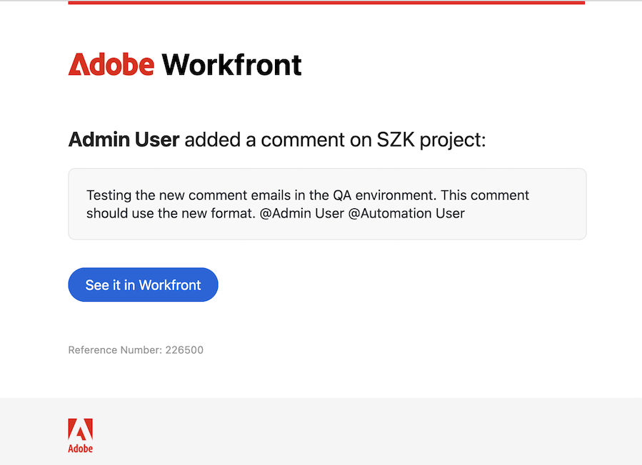

# Outras melhorias durante o período do terceiro trimestre de 2026

Esta página descreve as melhorias feitas com a versão do terceiro trimestre de 2026 no ambiente de Pré-visualização. Essas melhorias serão disponibilizadas no ambiente de produção, conforme indicado.

Para obter uma lista de todas as alterações disponíveis neste momento no ciclo de lançamento do terceiro trimestre de 2026, consulte [Visão geral da versão do terceiro trimestre de 2026](/help/quicksilver/product-announcements/product-releases/26-q3-release-activity/26-q3-release-overview.md).

## Aparência e comportamento atualizados para emails de notificação de comentários

>[!NOTE]
>
>Versão de produção para clientes: implantação em fases, data a ser anunciada

As notificações por email para comentários na área Atualizações têm uma nova aparência que se alinha ao design de email mais amplo da Adobe.

O formato de email atualizado inclui:

* Um novo cabeçalho do Adobe Workfront que substitui a marca Workfront anterior.
* Um layout simplificado que focaliza o comentário mais recente.
* Um **botão principal Ver no Workfront** para abrir o item diretamente.

O thread dos comentários anteriores não está mais incluído no corpo do email. Para exibir comentários anteriores sobre o item, use **Ver no Workfront** para abrir a conversa no Workfront.

Essa alteração está sendo implementada para os clientes em fases. Essa página será atualizada quando o cronograma de implantação for confirmado.

## Conectar o Workfront às ferramentas de IA com o servidor MCP do Workfront

>[!NOTE]
>
>Visualização: 28 de maio de 2026>Versão rápida de produção: 11 de junho de 2026>Produção para todos: 16 de julho de 2026

O contexto operacional da sua equipe reside no Workfront. Agora, com o servidor MCP do Workfront, esse contexto torna-se acionável nas ferramentas de IA que sua equipe já usa.

Conecte o Workfront a qualquer plataforma de IA compatível com MCP, incluindo Claude, ChatGPT, Copilot, Gemini e muito mais, e use a linguagem natural para localizar, criar, atualizar e gerenciar itens do Workfront sem deixar a ferramenta de IA de sua escolha. Solicite suas tarefas atrasadas, empurre a data de término de um projeto, envie um lembrete para os aprovadores, atualize um orçamento de campanha e sua plataforma de IA faz o trabalho para você no Workfront.

E com as habilidades de IA do Claude e as tarefas agendadas, você pode ir ainda mais longe, automatizando fluxos de trabalho recorrentes que são executados de forma proativa em relação aos dados dinâmicos do Workfront. Por exemplo, uma coletiva de segunda-feira pela manhã, um relatório de capacidade semanal, uma verificação mensal de integridade da campanha — uma vez e a IA o trata automaticamente, com base no contexto completo de sua operação.

Essa é a base de um sistema de gerenciamento de trabalho agênico, no qual a IA é baseada em seus dados operacionais mais avançados e os humanos e a IA colaboram juntos para manter o trabalho em movimento em velocidade total.

>[!IMPORTANT]
>
>Atualmente, o servidor MCP do Workfront está disponível somente para clientes na região dos EUA que usam o AWS.

Para obter mais informações, consulte [visão geral do servidor MCP do Adobe Workfront](/help/quicksilver/workfront-basics/workfront-mcp-server/workfront-mcp-server-overview.md).

## Atualizações da lista aprimorada

>[!NOTE]
>
>Visualização: 28 de maio de 2026>Versão rápida de produção: 11 de junho de 2026>Produção para todos: 16 de julho de 2026

Vários tipos de campo em listas aprimoradas foram atualizados para incluir navegação pelo teclado e outros aprimoramentos.

Os campos de Responsáveis nas listas aprimoradas agora oferecem navegação pelo teclado:

* Use as setas para cima e para baixo do teclado para percorrer a lista de pessoas.
* Pressione a barra de espaços para selecionar uma pessoa ou \&lt;Delete\> para remover uma pessoa selecionada.

Em campos de seleção única e múltipla em listas aprimoradas:

* A interação de campo agora pode ser acessada pelo teclado. Isso inclui a navegação entre as tags, as opções de pesquisa e a lista usando as setas para cima e para baixo. Pressione a barra de espaços para selecionar um item ou \&lt;Delete\> para remover um item selecionado.
* Você pode criar novas opções diretamente no editor quando nenhum resultado for encontrado. Observe que esse recurso pode não estar disponível em todas as listas.

Campos de referência como digitação antecipada e campos de pesquisa externa receberam algumas melhorias de interface.

Além disso, a experiência de arrastar e soltar colunas (em listas onde a opção arrastar e soltar está disponível) foi aprimorada visualmente.

Para obter mais informações, consulte [Usar listas aprimoradas](/help/quicksilver/workfront-basics/navigate-workfront/use-lists/enhanced-lists.md).