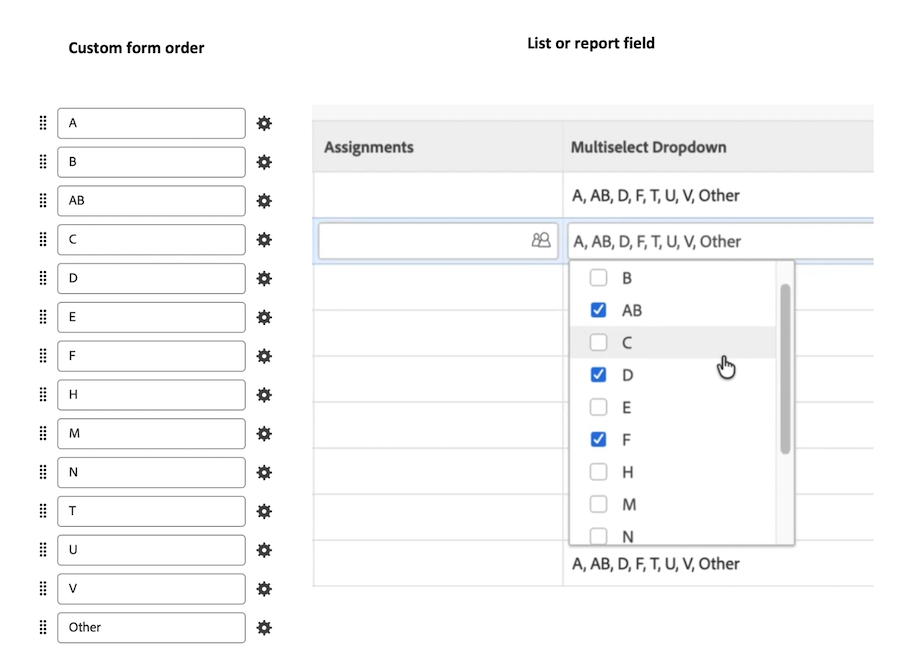

# Melhorias na emissão de relatórios no quarto trimestre de 2026

Esta página descreve as melhorias de relatórios feitas com a versão do quarto trimestre de 2026 para o ambiente de Pré-visualização. Essas melhorias serão disponibilizadas no ambiente de produção, conforme indicado.

Para obter uma lista de todas as alterações disponíveis neste momento do ciclo de lançamento do quarto trimestre de 2026, consulte [Visão geral da versão do quarto trimestre de 2026](/help/quicksilver/product-announcements/product-releases/26-q4-release-activity/26-q4-release-overview.md).

## Campos de referência nativos estão disponíveis para listas e relatórios

>[!NOTE]
>
>Visualização: 30 de julho de 2026>Versão rápida de produção: 13 de agosto de 2026>Produção para todos: 15 de outubro de 2026

Agora é possível adicionar campos de referência nativos a listas e relatórios no Workfront.

Um campo de referência nativo é um campo personalizado. Quando o campo está em um formulário personalizado anexado a um objeto, o campo é preenchido a partir dos dados do objeto. Por exemplo, se o campo fizer referência ao campo Descrição e estiver em um formulário personalizado anexado a um projeto, ele extrairá a descrição do projeto. (O campo pode mostrar “N/A” se não houver dados disponíveis.)

Para obter informações sobre como criar campos de referência nativos, incluindo a lista de campos nativos com suporte, consulte [Criar um formulário personalizado](/help/quicksilver/administration-and-setup/customize-workfront/create-manage-custom-forms/form-designer/design-a-form/design-a-form.md).
Para obter informações sobre como adicionar campos a relatórios, consulte [Criar um relatório personalizado](/help/quicksilver/reports-and-dashboards/reports/creating-and-managing-reports/create-custom-report.md).

## Ordem consistente para valores de campo de seleção múltipla em listas e relatórios herdados

>[!NOTE]
>
>Visualização: 30 de julho de 2026>Versão rápida de produção: 13 de agosto de 2026>Produção para todos: 15 de outubro de 2026

Agora você vê as opções selecionadas para seleção múltipla de campos personalizados em uma ordem consistente e previsível em listas e relatórios herdados. A ordem dos campos é determinada pela organização dos campos no formulário personalizado.

Anteriormente, as opções selecionadas eram exibidas na ordem em que você as escolhia ou em uma ordem inconsistente, o que tornava as linhas mais difíceis de serem digitalizadas e comparadas.

Observação: a nova classificação não se aplica se o campo estiver usando o modo de texto.
