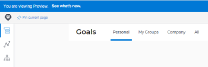

# Atividade de lançamento do Adobe Workfront Goals 21.1: semana de 16 de novembro de 2020

Esta página descreve todas as melhorias feitas com a versão 21.1 do Adobe Workfront Goals para o ambiente de Pré-visualização na semana de 30 de novembro de 2020. Essas melhorias serão disponibilizadas no ambiente de Produção no primeiro trimestre de 21.1.

Para obter uma lista de todas as alterações disponíveis para o Workfront Goals neste momento do ciclo de versão 21.1, consulte [Adobe Workfront Goals com a versão 21.1](../../../../product-announcements/product-releases/goals-release-activity/goals-release-21-1.md).

Para obter uma lista de todas as alterações disponíveis para todas as áreas do Workfront neste momento do ciclo de versão 21.1, consulte [visão geral da versão 21.1](../../../../product-announcements/product-releases/21.1-release-activity/21-1-release-overview.md).

## Visualizar a contagem de licenças do Workfront Goals na área Configuração

Como administrador do Workfront, agora você pode exibir o número de licenças do Workfront Goals na área Sistema da Configuração. Você pode exibir as seguintes informações:

O número total de licenças do Workfront Goals que sua empresa adquiriu

O número de licenças do Workfront Goals associadas aos usuários. Este é o número de usuários aos quais foi concedido acesso de Visualização a Metas em seus respectivos níveis de acesso.

Para obter informações sobre como gerenciar sua contagem de licenças, consulte [Gerenciar licenças disponíveis em seu sistema](../../../../administration-and-setup/get-started-wf-administration/manage-available-licenses-in-your-system.md).

## Eliminar a guia &quot;Minhas equipes&quot; para usuários sem equipes

Para eliminar a confusão de exibir uma guia vazia, removemos a guia &quot;Minhas equipes&quot; dos usuários que não estão atribuídos a nenhuma equipe. Antes dessa alteração, se um usuário não pertencia a nenhuma equipe, a guia Minhas equipes estava vazia.

Para obter informações sobre quais informações são exibidas nos Workfront Goals, consulte [Filtrar informações nos Adobe Workfront Goals](../../../../workfront-goals/goal-management/filter-information-wf-goals.md).

