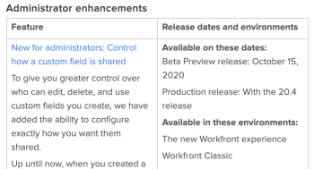

# Cronograma e processo de lançamento do Adobe Workfront

## Atualizar programação para Pré-visualização

O ambiente de pré-visualização é atualizado uma vez por semana com novos recursos. Esses recursos são comunicados nas notas de versão da próxima versão trimestral.

As versões normalmente são lançadas por volta das 20h–22h (horário da Montanha dos EUA).

## Atualizar o cronograma para produção

### Recursos do produto

O Adobe Workfront possui dois modelos para lançar novos recursos e atualizações. Sua organização pode escolher se deseja receber novas funcionalidades trimestralmente ou em um cronograma de lançamentos mais rápido.

As versões mensais e trimestrais estão previstas para serem disponibilizadas na quinta-feira da segunda semana completa do mês, salvo indicação em contrário. Para datas futuras, consulte a [Visão geral da versão](/help/quicksilver/product-announcements/product-releases/product-releases.md) mais recente.

Os lançamentos normalmente ocorrem por volta das 20h–22h (horário da Montanha dos EUA) na noite anterior à data de lançamento.

Normalmente, os recursos em pré-visualização são disponibilizados em seu ambiente de produção com a próxima versão. No entanto, em alguns casos, recursos são disponibilizados no ambiente de produção fora de uma versão programada. Normalmente, essas alterações permanecem em pré-visualização por um mínimo de 2 semanas para fornecer tempo adequado para que você se familiarize com as alterações.

Para obter mais informações sobre processos trimestrais e de versões rápidas, consulte [Habilitar ou desabilitar versões rápidas para sua organização](/help/quicksilver/administration-and-setup/set-up-workfront/configure-system-defaults/enable-fast-release-process.md).

### Atualizações de manutenção

As correções de problemas no produto Adobe Workfront são disponibilizadas no ambiente de produção todas as semanas. Consulte a página [Atualizações de manutenção do Workfront](https://experienceleague.adobe.com/pt-br/docs/workfront-known-issues/releases/current-updates) para ver o que foi corrigido recentemente.

## Recursos removidos de uma versão programada

Todos os recursos associados a uma determinada versão (mensal ou trimestral) estão disponíveis para teste em pré-visualização por um período mínimo de 2 a 4 semanas antes do lançamento final para produção. Se os recursos forem removidos da versão agendada antes desse prazo, as seguintes ações serão tomadas para informar os clientes:

* As notas de versão para a versão agendada (encontradas na página [Versões do produto](../../product-announcements/product-releases/product-releases.md)) foram atualizadas para indicar que o recurso foi removido.

Se os recursos forem removidos da versão agendada após todos os recursos estarem disponíveis para teste em pré-visualização, as seguintes ações serão tomadas para informar os clientes:

* As notas de versão (encontradas na página [Lançamentos de produtos](../../product-announcements/product-releases/product-releases.md)) são atualizadas para indicar que o recurso foi removido.
* Uma publicação é adicionada à Comunidade do Workfront informando que o recurso foi removido.
* Uma mensagem é enviada a todos os clientes através da Central de Anúncios informando que o recurso foi removido. (A Central de Anúncios é o centro de notificações no aplicativo Workfront. Para obter mais informações, consulte [Enviar avisos](../../administration-and-setup/get-started-wf-administration/view-send-announcements.md)).

## Versões beta

Às vezes, a Workfront lança novos recursos como parte de um programa beta.
As informações específicas sobre cada beta, incluindo como participar, versões quando cada programa beta é iniciado e todos os programas beta são diferentes.

Os seguintes programas beta estão disponíveis no Workfront:

* **Beta fechado ou privado**: as características a seguir são de uma versão beta fechada ou privada:

   * Os recursos estão disponíveis para um pequeno grupo de clientes, cuidadosamente selecionados pelo Workfront.
   * Os participantes normalmente trabalham com um gerente de produto e fornecem feedback regularmente.
   * Os novos recursos que fazem parte do beta podem ser lançados em pré-visualização ou produção, ou em um ambiente separado disponibilizado para fins do programa beta. Os recursos beta fechados são lançados em intervalos aleatórios e sem aviso.
   * Não há informações de lançamento para betas fechados nas páginas de lançamentos do produto.

* **Beta aberto ou público**: as características a seguir são de uma versão beta aberta ou pública:

   * Os recursos estão disponíveis para todos os clientes do Workfront, mas estão em estado beta. Eles podem nem sempre ser totalmente funcionais e o feedback é sempre bem-vindo.
   * A participação em um beta público é opcional e os clientes podem decidir se ativam os recursos beta.
   * Os novos recursos que fazem parte do beta podem ser lançados em pré-visualização ou produção.
   * Os recursos podem ser lançados com mais frequência do que os padrões de lançamento normais do Workfront.
   * As informações sobre quando os recursos são liberados para um beta público são incluídas nas páginas de versão do produto.

Para obter informações sobre as notas de versão do produto, consulte [Versões do produto](../../product-announcements/product-releases/product-releases.md).

## Outras versões

Às vezes, o Workfront pode liberar recursos que não estejam documentados nas notas de versão, nas atualizações de manutenção ou em artigos da documentação. Isso acontece com o objetivo de testar novos recursos antes de torná-los permanentes. Geralmente, esses testes são liberados para um número limitado de clientes, mas às vezes podem ser liberados para todos. Eles podem ser liberados para os ambientes de Pré-visualização ou Produção.

Se você encontrar algo no sistema que não corresponda à documentação e sobre o qual possa ter dúvidas, pedimos que entre em contato com nossa equipe de suporte ao cliente. Para obter mais informações, consulte [Falar com o suporte ao cliente](../../workfront-basics/tips-tricks-and-troubleshooting/contact-customer-support.md).

## Notas de versão

Use as notas de versão referentes à próxima versão agendada para ver quais novos recursos estão disponíveis em pré-visualização e quando serão liberados para produção.

Para encontrar as notas de versão da próxima versão programada, consulte [Versões do produto](../../product-announcements/product-releases/product-releases.md) e clique no link para acessar a página de visão geral da próxima versão.

As notas de versão fornecem uma tabela com uma lista de recursos na coluna à esquerda, com uma breve descrição de cada recurso. Você pode clicar em um link de recurso para ver um vídeo de demonstração do novo recurso, bem como acessar a documentação sobre o novo recurso. Na coluna à direita, você verá as seguintes informações referentes a cada recurso:

* Data de lançamento para pré-visualização
* Data de lançamento para produção

Por exemplo:

