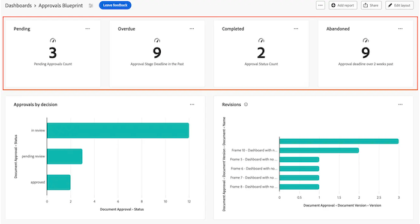
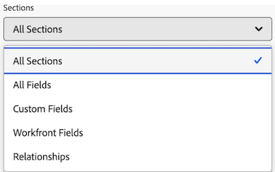

# Criar um relatório de KPI em um painel da tela

>[!IMPORTANT]
>
>No momento, o recurso Painéis de controle do Canvas está disponível apenas para usuários que participam do estágio beta. Partes do recurso podem não estar completas ou funcionar como esperado durante essa etapa. Envie comentários sobre sua experiência seguindo as instruções na seção [Fornecer comentários](/help/quicksilver/product-announcements/betas/canvas-dashboards-beta/canvas-dashboards-beta-information.md#provide-feedback) do artigo de visão geral da versão beta dos Painéis de Tela. 
>Se você tiver comentários sobre um possível erro ou problema técnico, envie um chamado para o Suporte da Workfront. Para obter mais informações, consulte [Contatar o suporte ao cliente](/help/quicksilver/workfront-basics/tips-tricks-and-troubleshooting/contact-customer-support.md). 
>Observe que esta versão beta não está disponível nos seguintes provedores de nuvem:
>
>* Traga sua própria chave para o Amazon Web Services
>* Azure
>* Google Cloud Platform

Você pode criar e adicionar um relatório de KPI a um Painel de Controle de Tela que represente visualmente os dados do indicador chave de desempenho como um número, que você pode usar para ver como seus projetos e equipes estão se saindo.

## Requisitos de acesso

+++ Expanda para visualizar os requisitos de acesso da funcionalidade neste artigo.

<table style="table-layout:auto"> 
<col> 
</col> 
<col> 
</col> 
<tbody> 
<tr> 
   <td role="rowheader">
Pacote do Adobe Workfront
</td> 
   <td> 

Qualquer 
 
   </td> 
<tr> 
 <tr> 
   <td role="rowheader">
Licença do Adobe Workfront
</td> 
   <td> 

Padrão
 

Plano
 
   </td> 
   </tr> 
  </tr> 
  <tr> 
   <td role="rowheader">
Configurações de nível de acesso
</td> 
   <td>
Acesso de edição a relatórios, painéis e calendários

  </td> 
  </tr>  
</tbody> 
</table>

Para obter mais detalhes sobre as informações contidas nesta tabela, consulte [Requisitos de acesso na documentação do Workfront](/help/quicksilver/administration-and-setup/add-users/access-levels-and-object-permissions/access-level-requirements-in-documentation.md).
+++

## Pré-requisitos

Você deve criar um painel antes de criar um relatório de KPI.

## Criar um relatório de KPI em um painel da tela

Há muitas opções de configuração disponíveis para criar um relatório de KPI. Nesta seção, explicaremos o processo geral de criação de um.

{{step1-to-dashboards}}

1. No painel esquerdo, clique em **Painéis do Canvas**.

1. Clique em **Novo Painel** no canto superior direito.

1. Na caixa **Criar painel**, insira o **Nome** e a **Descrição** do painel.

1. Clique em **Criar**.

1. Na caixa **Adicionar relatório**, selecione **Criar relatório**.

1. No lado esquerdo, selecione **KPI**.

1. No canto superior direito, clique em **Criar relatório**.

1. Siga as etapas abaixo para configurar a seção **Detalhes**:

   1. Insira um relatório **Nome**.
   1. Insira uma **Descrição** do relatório.

      >[!NOTE]
      >
      >A descrição será usada como uma legenda abaixo do valor do KPI. Se você não inserir uma descrição, será gerada uma legenda com base no agregador e no tipo de agregação selecionados nas etapas a seguir.

1. Siga as etapas abaixo para configurar a seção **Build KPI**:

   1. No painel esquerdo, clique no ícone **Criar KPI** .

   1. Clique em **Selecionar campo** e especifique o campo que deseja adicionar ao relatório.

   1. Na lista suspensa **Tipo de agregação**, selecione como os dados serão acumulados para produzir a saída do KPI. As opções nesse campo variam de acordo com o tipo de campo selecionado na etapa anterior.

1. Siga as etapas abaixo para configurar a seção **Filtro**:

   1. No painel esquerdo, clique no ícone de **Filtro** .

   1. Selecione **Editar filtro**.

   1. Clique em **Adicionar condição** e especifique o campo pelo qual deseja filtrar e o modificador que define o tipo de condição que o campo deve atender.

   1. (Opcional) Clique em **Adicionar grupo de filtros** para adicionar outro conjunto de critérios de filtragem. O operador padrão entre os conjuntos é AND. Clique no operador para alterá-lo para OR.

      Para obter mais informações sobre filtros, consulte [Editar filtros de relatório em um Painel de Tela](/help/quicksilver/reports-and-dashboards/canvas-dashboards/manage-reports/edit-report-filters.md).

1. Siga as etapas abaixo para definir a seção **Configurações de Coluna de Aprofundamento**:

   1. No painel esquerdo, clique no ícone **Colunas de Aprofundamento** . Os campos do gráfico aparecem automaticamente como colunas na seção de visualização à direita.

   1. (Opcional) Para atualizar qualquer uma das configurações de coluna existentes, selecione a coluna que deseja atualizar na seção **Colunas atuais** e atualize as informações desejadas (por exemplo, rótulo, status vinculado e regras de formatação).

   1. Clique em **Adicionar coluna** e selecione o campo que deseja exibir como uma coluna na tabela. Repita esse processo para cada coluna que você deseja adicionar.

1. Siga as etapas abaixo para definir a seção **Configurações do Grupo de Aprofundamento**:

   1. No painel esquerdo, clique no ícone do **Grupo de configurações** do .

   1. Clique no botão **Adicionar agrupamento** e selecione o campo que deseja criar como um agrupamento.

1. Clique em **Salvar** para criar o relatório e adicioná-lo ao painel.

## Exemplo de relatório de KPI

Nesta seção, passaremos pelas etapas para criar um relatório de KPI que exibe aprovações de documentos pendentes.

Para obter mais informações sobre exemplos de relatório de KPI, consulte [Criar um painel de relatório para revisão e aprovações](/help/quicksilver/review-and-approve-work/document-reviews-and-approvals/create-review-and-approval-dashboard.md).

{{step1-to-dashboards}}

1. No painel esquerdo, clique em **Painéis do Canvas**.

1. Clique em **Novo Painel** no canto superior direito.

1. Na caixa **Criar painel**, insira o **Nome** e a **Descrição** do painel.

1. Clique em **Criar**.

1. Na caixa **Adicionar relatório**, selecione **Criar relatório**.

1. No lado esquerdo, selecione **KPI**.

1. No canto superior direito, clique em **Criar relatório**.

1. Siga as etapas abaixo para configurar a seção **Detalhes**:

   1. Digite *Pendente* no campo **Nome**.
   1. Digite *Aprovações pendentes* no campo **Descrição**. Isso é exibido como uma legenda abaixo do valor do KPI.

1. Siga as etapas abaixo para configurar a seção **Build KPI**:

   1. No painel esquerdo, clique no **Ícone de** Build KPI.

   1. Clique em **Selecionar campo**.

   1. Localize e selecione a pasta **Aprovação de documentos**.

   1. Selecione **Status**.

   1. Na lista suspensa **Tipo de agregação**, selecione **Contagem**.

1. Siga as etapas abaixo para configurar a seção **Filtro**:

   1. No painel esquerdo, clique no ícone de **Filtro** .

   1. Selecione **Editar filtro**.

   1. Clique em **Adicionar condição**.

   1. Clique no filtro de condição vazio, clique em **Escolher um Campo** e escolha **Status**.
   1. Deixe o operador como **Igual** e digite _revisão pendente_ na caixa de texto.
      
1. Clique em **Salvar** no canto superior direito da tela.

## Considerações ao criar um relatório de KPI

### Relatórios com dados financeiros

Os usuários com acesso de Exibição ou Edição a Dados Financeiros em seu nível de acesso ainda verão os dados financeiros nas visualizações do Painel de Controle do Canvas, mesmo se a permissão Exibir financiamento for removida no nível da tarefa ou do projeto.

* Os usuários sem direitos referentes a dados financeiros no nível de acesso não verão dados financeiros nos relatórios.
* Os usuários que veem dados financeiros estão limitados a registros para os quais já têm permissão de visualização (projetos, tarefas, problemas, etc.). Eles não verão valores financeiros correspondentes a registros que não podem acessar.
* Os criadores de relatórios devem ter cuidado ao incluir dados financeiros nos painéis e estar cientes de com quem compartilham painéis para evitar acessos não intencionais.

Esse é um limite conhecido e planejamos solucioná-lo o mais rápido possível.

### Utilização do seletor de campo

O menu suspenso **Seções** da seção **Criar KPI** foi criado para restringir as opções em um seletor de campos para facilitar a localização de um objeto durante a criação de um relatório de tabelas. Para começar, selecione um objeto de entidade base.

* **Todas as Seções**: todos os tipos de objeto no Workfront Workflow e no Workfront Planning.
* **Objetos do Workfront**: objetos nativos do fluxo de trabalho do Workfront.
* **Tipos de Registros do Planning**: tipos de registros personalizados definidos no Workfront Planning.

Depois que o objeto de entidade base for selecionado, o menu suspenso **Seções** será atualizado com as opções de tipo de campo aplicáveis para escolher.

* **Todas as seções**: campos nativos, campos personalizados e objetos relacionados.
* **Todos os campos**: campos nativos e personalizados (exclui relações).
* **Campos Personalizados**: campos definidos pelo cliente em um formulário personalizado ou registro do Planning.
* **Campos do Workfront**: somente campos nativos.
* **Relações**: registros conectados.

### Fazendo referência a objetos filho

Os relacionamentos disponíveis para colunas adicionais, opções de filtro e atributos de agrupamento geralmente são limitados a objetos superiores na hierarquia de objetos do Workfront ou têm uma única seleção no objeto da entidade base do relatório. Há algumas exceções, como:

* Projeto > Tarefas
* Aprovação do Documento > Fases de Aprovação do Documento
* Estágios de Aprovação do Documento > Participantes do Estágio de Aprovação do Documento

Ao utilizar qualquer uma das relações pai-filho listadas acima, você verá uma linha na tabela para cada registro filho conectado ao objeto pai.

