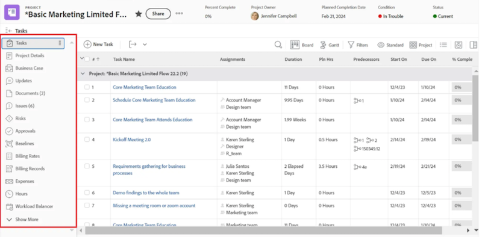

# Adicionar um painel de tela de desenho a um modelo de layout

>[!IMPORTANT]
>
>No momento, o recurso Painéis do Canvas está disponível apenas para usuários que participam da fase beta. Partes do recurso podem não estar completas ou não funcionar conforme o esperado durante essa etapa. Envie seus comentários sobre a experiência seguindo as instruções na seção [Fornecer feedback](/help/quicksilver/product-announcements/betas/canvas-dashboards-beta/canvas-dashboards-beta-information.md#provide-feedback) do artigo de visão geral sobre a versão beta dos Painéis da Tela. 
>&#x200B;>Observe que esse beta não está disponível nos seguintes provedores de nuvem:
>
>* Traga sua própria chave para o Amazon Web Services
>* Azure
>* Google Cloud Platform

É possível adicionar um Painel da tela de desenho a um modelo de layout para que ele substitua a página inicial de aterrissagem, apareça no painel esquerdo de um objeto ou seja fixado à barra superior em todo o Adobe Workfront.

## Requisitos de acesso

+++ Expanda para visualizar os requisitos de acesso. 

<table style="table-layout:auto"> 
<col> 
</col> 
<col> 
</col> 
<tbody> 
<tr> 
   <td role="rowheader">
plano do Adobe Workfront
</td> 
   <td> 

Qualquer 
 
   </td> 
<tr> 
 <tr> 
   <td role="rowheader">
Licença do Adobe Workfront
</td> 
   <td> 

Atual: Plano 
 

Novo: Padrão
 
   </td> 
   </tr> 
  </tr> 
  <tr> 
   <td role="rowheader">
Configurações de nível de acesso
</td> 
   <td>
Editar acesso a relatórios, painéis e calendários

  </td> 
  </tr> 
    </tr>  
        <tr> 
   <td role="rowheader">
Permissões de objeto
</td> 
   <td>
Gerenciar permissões do painel

  </td> 
  </tr> 
</tbody> 
</table>

Para obter mais detalhes sobre as informações nesta tabela, consulte [Requisitos de acesso na documentação do Workfront](/help/quicksilver/administration-and-setup/add-users/access-levels-and-object-permissions/access-level-requirements-in-documentation.md).
+++

## Adicionar um painel da tela de desenho ao painel esquerdo

{{step-1-to-setup}}

1. No painel esquerdo, selecione **Interface**, depois **Modelos de Layout**.

1. Na página **Modelos de layout**, selecione um modelo.

1. Na página de detalhes do modelo, selecione o objeto ao qual deseja adicionar o painel no menu suspenso **Personalizar o que os usuários veem**.

   

1. Role para baixo até a parte inferior da seção **Painel esquerdo** e clique em **Adicionar painel**.

1. Na caixa **Adicionar painel personalizado**, digite o nome de **Link rápido**.

1. No menu suspenso **Escolher um painel**, selecione **Painéis do Canvas**.

1. No menu suspenso à direita de **Escolher um painel**, selecione o Painel da Tela de Pintura que deseja adicionar ao painel esquerdo.

1. Clique em **Adicionar**. O painel é exibido na seção do painel esquerdo.

1. Clique em **Salvar**.

   >[!NOTE]
   >
   >Quando colocados em um objeto de trabalho, como um Projeto, Tarefa, Problema, Portfolio ou Programa, os resultados exibidos em cada relatório serão limitados aos registros disponíveis nesse objeto.

## Adicionar um painel da tela de desenho à barra superior

{{step-1-to-setup}}

1. No painel esquerdo, selecione **Interface**, depois **Modelos de Layout**.

1. Na página **Modelos de layout**, selecione um modelo.

1. Na seção **Área de navegação superior**, clique em **Adicionar novo pino** e selecione **Adicionar um painel** no menu suspenso.

1. Na caixa **Fixar uma página**, digite um **Nome de link rápido**.

1. No menu suspenso **Escolher um painel**, selecione **Painéis do Canvas**.

1. No menu suspenso à direita de **Escolher um painel**, selecione o Painel da Tela de Pintura que deseja adicionar à barra superior.

1. Clique em **Adicionar**. O painel é exibido na barra superior.

1. Clique em **Salvar**.

## Adicionar um painel da tela de desenho como a página inicial da página inicial

{{step-1-to-setup}}

1. No painel esquerdo, selecione **Interface**, depois **Modelos de Layout**.

1. Na página **Modelos de layout**, selecione um modelo.

1. Na seção **Área de navegação superior**, clique em **Selecionar página de aterrissagem** e selecione **Adicionar um painel** no menu suspenso.

1. Na caixa **Adicionar painel personalizado**, digite um **Nome de link rápido**.

1. No menu suspenso **Escolher um painel**, selecione **Painéis do Canvas**.

1. No menu suspenso à direita de **Escolher um painel**, selecione o Painel da Tela de Pintura que deseja adicionar como página inicial.

1. Clique em **Adicionar**.

1. Clique em **Salvar**.
