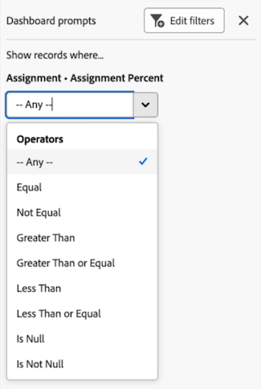

# Filtrar um painel da tela

>[!IMPORTANT]
>
>No momento, o recurso Painéis de controle do Canvas está disponível apenas para usuários que participam do estágio beta. Partes do recurso podem não estar completas ou funcionar como esperado durante essa etapa. Envie comentários sobre sua experiência seguindo as instruções na seção [Fornecer comentários](/help/quicksilver/product-announcements/betas/canvas-dashboards-beta/canvas-dashboards-beta-information.md#provide-feedback) do artigo de visão geral da versão beta dos Painéis de Tela. 
>Se você tiver comentários sobre um possível erro ou problema técnico, envie um chamado para o Suporte da Workfront. Para obter mais informações, consulte [Contatar o suporte ao cliente](/help/quicksilver/workfront-basics/tips-tricks-and-troubleshooting/contact-customer-support.md). 
>Observe que esta versão beta não está disponível nos seguintes provedores de nuvem:
>
>* Traga sua própria chave para o Amazon Web Services
>* Azure
>* Google Cloud Platform

Você pode aplicar um filtro a um Painel de controle de tela que contenha prompts. Um prompt funciona como um modificador de filtro que aplica critérios de filtragem adicionais para que você possa reduzir ainda mais os resultados. Esses prompts podem ser modificados toda vez que você aplicar o filtro, permitindo ajustar os resultados exibidos sem precisar editar os principais critérios de filtro do painel ou de cada relatório individual.

## Requisitos de acesso

+++ Expanda para visualizar os requisitos de acesso da funcionalidade neste artigo. 

<table style="table-layout:auto"> 
<col> 
</col> 
<col> 
</col> 
<tbody> 
<tr> 
   <td role="rowheader">
Pacote do Adobe Workfront
</td> 
   <td> 

Qualquer 
 
   </td> 
<tr> 
 <tr> 
   <td role="rowheader">
Licença do Adobe Workfront
</td> 
   <td> 

Padrão
 

Plano
 
   </td> 
   </tr> 
  </tr> 
  <tr> 
   <td role="rowheader">
Configurações de nível de acesso
</td> 
   <td>
Acesso de edição a relatórios, painéis e calendários

  </td> 
  </tr> 
    </tr>  
        <tr> 
   <td role="rowheader">
Permissões de objeto
</td> 
   <td>
Gerenciar permissões para o painel

  </td> 
  </tr> 
</tbody> 
</table>

Para obter mais detalhes sobre as informações contidas nesta tabela, consulte [Requisitos de acesso na documentação do Workfront](/help/quicksilver/administration-and-setup/add-users/access-levels-and-object-permissions/access-level-requirements-in-documentation.md).
+++

## Pré-requisitos

Você deve criar um painel para que ele possa ser filtrado.

Para obter mais informações, consulte [Criar um Painel de Tela](/help/quicksilver/reports-and-dashboards/canvas-dashboards/create-dashboards/create-dashboards.md).

## Filtrar um painel

Execute as seguintes etapas na ordem listada para filtrar um painel:

* [Parte 1: Criar um filtro de painel](#part-1-create-a-dashboard-filter)
* [Parte 2: Criar um prompt do painel](#part-2-define-a-dashboard-prompt)
* [Parte 3: Aplicar um prompt do painel](#step-3-apply-a-dashboard-prompt)

>[!NOTE]
>
>O filtro do painel de controle será aplicado a todos os relatórios em que os filtros no nível do painel não estão desabilitados.  Você pode excluir relatórios individuais da aplicação de filtros no nível do painel, expandindo o menu de ações para cada relatório e selecionando a opção **Desabilitar Filtros**.

### Parte 1: Criar um filtro de painel

Com um filtro de painel de controle, você pode aplicar um filtro comum a todos os relatórios disponíveis em um painel de controle sem ter que modificar os filtros de cada relatório individual.

>[!NOTE]
>
>Esses filtros só podem ser configurados por um usuário com acesso de Gerenciamento ao painel.

{{step1-to-dashboards}}

1. No painel esquerdo, clique em **Painéis do Canvas**.

1. Na página **Painéis de Tela**, selecione o painel ao qual deseja aplicar um filtro.

1. No canto superior esquerdo da página de detalhes do painel, clique em **Filtros**. O painel lateral Filtros é aberto.

1. Selecione **Editar filtros**. A caixa de diálogo **Filtros do Painel** é aberta.

1. (Opcional) Para adicionar uma regra, siga as etapas abaixo:

   1. Selecione o ícone **Editar** à direita da caixa de regras.

      

   1. Clique em **Adicionar condição** e adicione as seguintes informações:
      * Selecione um campo pelo qual deseja filtrar.
      * Selecione uma opção (ou modificador de filtro) para definir que tipo de condição o campo deve atender.

   1. (Opcional) Clique em **Adicionar grupo de filtros** para adicionar outro conjunto de critérios de filtragem. O operador padrão entre os conjuntos é AND. Clique no operador para alterá-lo para OR.

1. Prossiga para a [Parte 2: Criar um prompt do painel](#part-2-define-a-dashboard-prompt).

### Parte 2: Definir um prompt do painel

Um prompt do painel de controle oferece aos usuários a opção de aplicar filtros personalizados adicionais aos relatórios disponíveis no painel de controle.

>[!NOTE]
>
>As opções de prompt do painel só podem ser configuradas por um usuário com o acesso Gerenciar ao painel.

1. Para adicionar um prompt, siga as etapas abaixo:

   1. Selecione **Adicionar prompt**. Novos campos são exibidos no lado direito da tela.

   1. Insira um rótulo no campo **Personalizar rótulo**.

   1. Selecione o campo no qual você deseja que o prompt se baseie digitando o nome do campo e selecionando-o quando ele aparecer na lista. 

1. Para adicionar um prompt personalizado, siga as etapas abaixo:

   1. Selecione **Adicionar prompt personalizado**. Novos campos são exibidos no lado direito da tela.

   1. (Opcional) Insira um novo rótulo no campo **Personalizar rótulo**. Por padrão, o rótulo *Novo prompt personalizado* é atribuído.

   1. Clique em **Adicionar nova opção**.

   1. Insira o nome do prompt no campo **Valor da Opção**.

   1. Clique em **Adicionar condição** e especifique o campo pelo qual deseja filtrar e o modificador que define o tipo de condição que o campo deve atender.

      >[!NOTE]
      >
      >A condição de um prompt personalizado só pode ser editada usando o modo de texto. Isso permite que várias condições sejam aplicadas em um único campo.

   1. (Opcional) Clique em **Adicionar grupo de filtros** para adicionar outro conjunto de critérios de filtragem. O operador padrão entre os conjuntos é AND. Clique no operador para alterá-lo para OR.

1. Clique em **Salvar** para aplicar o filtro ao painel.

1. Prossiga para a [Parte 3: aplicar um prompt do painel](#step-3-apply-a-dashboard-prompt).

### Etapa 3: Aplicar um prompt do painel

Todos os usuários com acesso a um painel de controle podem aplicar um prompt de painel de controle a um Painel de controle do Canvas depois que o filtro e os prompts forem criados.

{{step1-to-dashboards}}

1. No painel esquerdo, clique em **Painéis do Canvas**.

1. Na página **Painéis de Tela**, selecione o painel ao qual deseja aplicar o prompt.

1. No canto superior esquerdo da página de detalhes do painel, clique em **Filtros**. O painel lateral Filtros é aberto.

1. Na seção **Mostrar registros onde...**, escolha uma condição para um ou todos os prompts exibidos. O prompt é aplicado e uma marca **Filtros de painel aplicados** aparece no canto do widget de relatório.
   

1. Clique no ícone **Fechar**  no canto superior direito para ocultar o painel.

