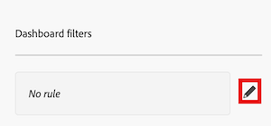

# Filtrar um painel da tela

>[!IMPORTANT]
>
>No momento, o recurso Painéis do Canvas está disponível apenas para usuários que participam da fase beta. Para obter mais informações, consulte [informações beta de Painéis do Canvas](/help/quicksilver/product-announcements/betas/canvas-dashboards-beta/canvas-dashboards-beta-information.md).

É possível aplicar um filtro ao painel que contém prompts _________

+++ Expanda para visualizar os requisitos de acesso.

<table style="table-layout:auto"> 
<col> 
</col> 
<col> 
</col> 
<tbody> 
<tr> 
   <td role="rowheader">
plano do Adobe Workfront
</td> 
   <td> 

Qualquer 
 
   </td> 
<tr> 
 <tr> 
   <td role="rowheader">
Licença do Adobe Workfront
</td> 
   <td> 

Atual: Plano 
 

Novo: Padrão
 
   </td> 
   </tr> 
  </tr> 
  <tr> 
   <td role="rowheader">
Configurações de nível de acesso
</td> 
   <td>
Editar acesso a relatórios, painéis e calendários

  </td> 
  </tr> 
    </tr>  
        <tr> 
   <td role="rowheader">
Permissões de objeto
</td> 
   <td>
Gerenciar permissões do painel

  </td> 
  </tr> 
</tbody> 
</table>

Para obter mais detalhes sobre as informações nesta tabela, consulte [Requisitos de acesso na documentação do Workfront](/help/quicksilver/administration-and-setup/add-users/access-levels-and-object-permissions/access-level-requirements-in-documentation.md).
+++

## Pré-requisitos

Você deve criar um painel antes que ele possa ser filtrado.

Para obter mais informações, consulte [Criar um Painel da Tela](/help/quicksilver/reports-and-dashboards/canvas-dashboards/create-dashboards/create-dashboards.md).

## Filtrar um painel

{{step1-to-dashboards}}

1. No painel esquerdo, clique em **Painéis do Canvas**.

1. Na página **Painéis da Tela de Pintura**, selecione o painel ao qual deseja aplicar um filtro.

1. No canto superior esquerdo da página de detalhes do painel, clique em **Filtros**. O painel lateral Filtros se abre.

1. Selecione **Editar filtros**. A caixa de diálogo **Filtros do painel** é aberta.

1. (Opcional) Para adicionar uma regra, siga as etapas abaixo:

   1. Selecione o ícone **Editar** à direita da caixa de regras.

      

   1. Clique em **Adicionar condição** e especifique o campo pelo qual deseja filtrar e o modificador que define o tipo de condição que o campo deve atender.

   1. (Opcional) Clique em **Adicionar grupo de filtros** para adicionar outro conjunto de critérios de filtragem. O operador padrão entre os conjuntos é AND. Clique no operador para alterá-lo para OU.

1. Para adicionar um prompt, siga as etapas abaixo:

   1. Selecione **Adicionar prompt**. Novos campos são exibidos no lado direito da tela.

   1. Insira um rótulo no campo **Personalizar rótulo**.

   1. Clique em **Selecionar campo** e especifique o campo que deseja _______.

1. Para adicionar um prompt personalizado, siga as etapas abaixo:

   1. Selecione **Adicionar prompt personalizado**. Novos campos são exibidos no lado direito da tela.

   1. (Opcional) Insira um novo rótulo no campo **Personalizar rótulo**. Por padrão, o rótulo *Novo prompt personalizado* é atribuído.

   1. Clique em **Adicionar nova opção**.

   1. Digite _____ no campo **Valor da opção**.

   1. Clique em **Adicionar condição** e especifique o campo pelo qual deseja filtrar e o modificador que define o tipo de condição que o campo deve atender.

   1. (Opcional) Clique em **Adicionar grupo de filtros** para adicionar outro conjunto de critérios de filtragem. O operador padrão entre os conjuntos é AND. Clique no operador para alterá-lo para OU.

1. Clique em **Salvar** para aplicar o filtro ao painel.