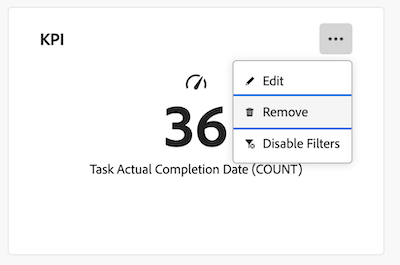

# Remover relatórios de um painel

>[!IMPORTANT]
>
>No momento, o recurso Painéis do Canvas está disponível apenas para usuários que participam da fase beta. Para obter mais informações, consulte [informações beta de Painéis do Canvas](/help/quicksilver/product-announcements/betas/canvas-dashboards-beta/canvas-dashboards-beta-information.md).

Depois que um painel é criado e você adiciona relatórios a ele, é possível remover relatórios mais antigos que não são mais aplicáveis a esse painel específico.

Remover um relatório de um painel é permanente. Se for necessário adicionar novamente um relatório depois de excluí-lo, será necessário recriar o relatório.

+++ Expanda para visualizar os requisitos de acesso. 

<table style="table-layout:auto"> 
<col> 
</col> 
<col> 
</col> 
<tbody> 
<tr> 
   <td role="rowheader">
Plano Adobe Workfront
</td> 
   <td> 

Qualquer 
 
   </td> 
<tr> 
 <tr> 
   <td role="rowheader">
Licença do Adobe Workfront
</td> 
   <td> 

Atual: Plano 
 

Novo: padrão
 
   </td> 
   </tr> 
  </tr> 
  <tr> 
   <td role="rowheader">
Configurações de nível de acesso
</td> 
   <td>
Editar acesso a relatórios, painéis e calendários

  </td> 
  </tr>  
    </tr>  
        <tr> 
   <td role="rowheader">
Permissões de objeto
</td> 
   <td>
Gerenciar permissões do painel

  </td> 
  </tr>
</tbody> 
</table>

Para obter mais detalhes sobre as informações contidas nesta tabela, consulte [Requisitos de acesso na documentação do Workfront](/help/quicksilver/administration-and-setup/add-users/access-levels-and-object-permissions/access-level-requirements-in-documentation.md).
+++

## Pré-requisitos

Você deve adicionar relatórios a um painel antes que eles possam ser removidos.

## Remover um relatório de um painel

>[!WARNING]
>
>Depois que um relatório é excluído, ele não pode ser recuperado.

{{step1-to-dashboards}}

1. No painel esquerdo, clique em **Painéis do Canvas**.

1. Na página **Painéis da Tela**, selecione o ícone **Mais**  no canto superior direito do painel que você deseja atualizar e selecione **Remover**.

   

1. Na caixa de diálogo **Excluir relatório** exibida, clique em **Excluir**. O relatório é excluído e removido do painel.