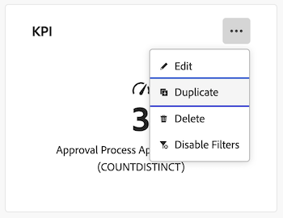

# Copiar e mover relatórios nos Painéis do Canvas

{{highlighted-preview}}

>[!IMPORTANT]
>
>No momento, o recurso Painéis do Canvas está disponível apenas para usuários que participam da fase beta. Partes do recurso podem não estar completas ou não funcionar conforme o esperado durante essa etapa. Envie seus comentários sobre a experiência seguindo as instruções na seção [Fornecer feedback](/help/quicksilver/product-announcements/betas/canvas-dashboards-beta/canvas-dashboards-beta-information.md#provide-feedback) do artigo de visão geral sobre a versão beta dos Painéis da Tela. 
>Se você tiver feedback sobre um possível erro ou problema técnico, envie um tíquete ao Suporte da Workfront. Para obter mais informações, consulte [Falar com o suporte ao cliente](/help/quicksilver/workfront-basics/tips-tricks-and-troubleshooting/contact-customer-support.md). 
>Observe que esse beta não está disponível nos seguintes provedores de nuvem:
>
>* Traga sua própria chave para o Amazon Web Services
>* Azure
>* Google Cloud Platform

Você pode duplicar um relatório de KPI, tabela ou gráfico em um Painel da tela após sua criação. Após a duplicação, é possível editar o relatório conforme necessário antes de salvar.

## Requisitos de acesso

+++ Expanda para visualizar os requisitos de acesso da funcionalidade neste artigo. 

<table style="table-layout:auto"> 
<col> 
</col> 
<col> 
</col> 
<tbody> 
<tr> 
   <td role="rowheader">
Pacote do Adobe Workfront
</td> 
   <td> 

Qualquer 
 
   </td> 
<tr> 
 <tr> 
   <td role="rowheader">
Licença do Adobe Workfront
</td> 
   <td> 

Padrão 
 

Plano
 
   </td> 
   </tr> 
  </tr> 
  <tr> 
   <td role="rowheader">
Configurações de nível de acesso
</td> 
   <td>
Editar acesso a relatórios, painéis e calendários

  </td> 
  </tr>  
      <tr> 
   <td role="rowheader">
Permissões de objeto
</td> 
   <td>
Gerenciar permissões do painel

  </td> 
  </tr>
</tbody> 
</table>

Para obter mais detalhes sobre as informações contidas nesta tabela, consulte [Requisitos de acesso na documentação do Workfront](/help/quicksilver/administration-and-setup/add-users/access-levels-and-object-permissions/access-level-requirements-in-documentation.md).
+++

## Pré-requisitos

É necessário adicionar um relatório a um painel antes de duplicá-lo.

Para obter mais informações, consulte [Criar um painel da Tela](/help/quicksilver/reports-and-dashboards/canvas-dashboards/create-dashboards/create-dashboards.md).

## Duplicação de um relatório na produção

{{step1-to-dashboards}}

1. No painel esquerdo, clique em **Painéis do Canvas**.
1. Na página **Painéis da Tela**, clique no ícone **Mais**  no canto superior direito do relatório que você deseja duplicar e selecione **Duplicar**.

   

1. (Opcional) Na caixa **Configurar** exibida, insira um novo relatório **Nome** na guia **Detalhes**.

1. (Opcional) Faça os ajustes necessários nas configurações usando as guias no lado esquerdo.

   >[!NOTE]
   >
   >Essas guias variam dependendo se você duplicou um relatório de KPI, tabela ou gráfico.  Para obter mais informações, consulte [Criar um relatório de KPI em um Painel da Tela](/help/quicksilver/reports-and-dashboards/canvas-dashboards/add-reports/build-kpi-report.md), [Criar um relatório de gráfico em um Painel da Tela](/help/quicksilver/reports-and-dashboards/canvas-dashboards/add-reports/build-chart-report.md) e [Criar um relatório de tabela em um Painel da Tela](/help/quicksilver/reports-and-dashboards/canvas-dashboards/add-reports/build-table-report.md).

1. Clique em **Salvar**. O relatório duplicado é exibido no painel.

## Copiar ou mover um relatório na Visualização

Você pode copiar um relatório para o painel atual, copiá-lo para outro painel ou movê-lo para outro painel. Copiar cria uma duplicata do relatório no destino; mover realoca-o do painel atual.

>[!IMPORTANT]
>
>* Para copiar um relatório, você precisa de permissões de Gerenciamento para o painel de destino.
>* Para mover um relatório, você precisa do acesso de Gerenciar aos painéis de origem e destino.
>* Se o relatório tiver uma configuração Executar como usuário e você não for um Administrador do sistema ou o Executar como usuário, você ainda poderá copiá-lo ou movê-lo, mas a opção Executar como usuário será removida do relatório resultante.

Para copiar ou mover um relatório:

{{step1-to-dashboards}}

1. No painel esquerdo, clique em **Painéis do Canvas**.
1. Abra o painel que contém o relatório.
1. Clique no ícone do **Mais**  no canto superior direito do relatório e selecione **Copiar relatório**.

   

1. Na caixa de diálogo **Copiar relatório**, escolha uma das seguintes opções:

   <table>
   <tr>
   <td><strong>Copiar</strong></td>
   <td>Clique em <strong>Copiar</strong> na parte inferior da tela para copiar o relatório. O painel atual é selecionado por padrão. Você precisa de acesso de Gerenciar ao painel para copiar um relatório.</td>
   </tr>
   <tr>
   <td><strong>Copiar e mover</strong></td>
   <td>Selecione um painel de destino diferente para copiar o relatório e movê-lo para um novo painel. O relatório original permanece no painel atual.Você precisa de acesso de Gerenciamento ao painel de destino para copiar e mover um relatório. </td>
   </tr>
   <tr>
   <td><strong>Mover</strong></td>
   <td>Selecione um painel de destino diferente para o qual mover o relatório. Isso realoca o relatório no painel de destino e o remove do painel atual. Você precisa de acesso de Gerenciar aos painéis de origem e destino para mover um relatório.</td>
   </tr>
   </table>

   >[!NOTE]
   >
   >Se o relatório tiver uma configuração Executar como usuário e você não for um Administrador do sistema ou o usuário definido como Executar como usuário, você ainda poderá copiar ou mover o relatório. A opção Executar como usuário é removida do relatório resultante.

1. Clique em **Salvar**.

   

