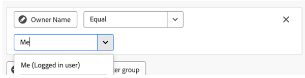
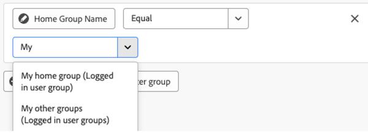

# Editar filtros de relatório em um painel da tela

>[!IMPORTANT]
>
>No momento, o recurso Painéis do Canvas está disponível apenas para usuários que participam da fase beta. Partes do recurso podem não estar completas ou não funcionar conforme o esperado durante essa etapa. Envie seus comentários sobre a experiência seguindo as instruções na seção [Fornecer feedback](/help/quicksilver/product-announcements/betas/canvas-dashboards-beta/canvas-dashboards-beta-information.md#provide-feedback) do artigo de visão geral sobre a versão beta dos Painéis da Tela. 
>Se você tiver feedback sobre um possível erro ou problema técnico, envie um tíquete ao Suporte da Workfront. Para obter mais informações, consulte [Contate o Suporte ao Cliente](/help/quicksilver/workfront-basics/tips-tricks-and-troubleshooting/contact-customer-support.md). 
>Observe que esse beta não está disponível nos seguintes provedores de nuvem:
>
>* Traga sua própria chave para o Amazon Web Services
>* Azure
>* Google Cloud Platform

É possível editar filtros de relatório depois de aplicá-los a um Painel da tela para atualizar os dados exibidos conforme o projeto avança.

## Requisitos de acesso

+++ Expanda para visualizar os requisitos de acesso da funcionalidade neste artigo.

<table style="table-layout:auto"> 
<col> 
</col> 
<col> 
</col> 
<tbody> 
<tr> 
   <td role="rowheader">
Pacote do Adobe Workfront
</td> 
   <td> 

Qualquer 
 
   </td> 
<tr> 
 <tr> 
   <td role="rowheader">
Licença do Adobe Workfront
</td> 
   <td> 

Padrão
 

Plano
 
   </td> 
   </tr> 
  </tr> 
  <tr> 
   <td role="rowheader">
Configurações de nível de acesso
</td> 
   <td>
Editar acesso a relatórios, painéis e calendários

  </td> 
  </tr>  
        <tr> 
   <td role="rowheader">
Permissões de objeto
</td> 
   <td>
Gerenciar permissões do painel

  </td> 
  </tr>
</tbody> 
</table>

Para obter mais detalhes sobre as informações contidas nesta tabela, consulte [Requisitos de acesso na documentação do Workfront](/help/quicksilver/administration-and-setup/add-users/access-levels-and-object-permissions/access-level-requirements-in-documentation.md).
+++

## Pré-requisitos

É necessário adicionar um filtro a um relatório antes de editá-lo.

## Editar um filtro de relatório

>[!NOTE]
>
>Há muitas ferramentas de configuração disponíveis para criar e editar um filtro de relatório. Para obter mais informações sobre essas ferramentas, consulte a seguinte seção neste artigo: [Considerações ao editar um filtro de relatório](#considerations-when-editing-a-report-filter).

{{step1-to-dashboards}}

1. No painel esquerdo, clique em **Painéis do Canvas**.

1. Na página **Painéis da Tela**, clique no ícone **Mais**  no canto superior direito do relatório que contém o filtro que você deseja editar e selecione **Editar**.

   

1. No lado esquerdo da caixa de diálogo **Configurar**, selecione o painel **Filtros**.

1. Clique em **Editar filtro**.

1. Selecione o campo ou o modificador que deseja editar e ajuste as seleções atuais conforme necessário.

   

1. (Opcional) Clique em **Adicionar grupo de filtros** para adicionar outro conjunto de critérios de filtragem. O operador padrão entre os conjuntos é AND. Clique no operador para alterá-lo para OU.

1. Clique em **Salvar**.

## Considerações ao editar um filtro de relatório

### Variáveis de filtro de curingas com base em data

As opções de curinga baseado em data podem ser usadas em combinação com qualquer atributo de filtro de data. Para obter informações sobre como adicionar um curinga baseado em data a um relatório, consulte o artigo [Usar curingas baseados em data para generalizar relatórios](../../../reports-and-dashboards/reports/reporting-elements/use-date-based-wildcards-generalize-reports.md).

>[!NOTE]
>
>Se você criar um cálculo de data e hora que não inclua uma parte de hora ou que use os curingas de data $$TODAY ou $$NOW, o sistema usará a data de acordo com o fuso horário do Tempo Universal Coordenado (UTC), e não de acordo com o seu fuso horário local. Isso pode causar um resultado inesperado na data.

Você pode escolher entre os seguintes curingas baseados em data:

<table style="table-layout:auto"> 
 <col> 
 <col> 
 <tbody> 
  <tr valign="top"> 
   <td width="100" role="rowheader"> 
<strong>$$TODAY</strong> 
 </td> 
   <td> 
Recomendamos que você crie filtros sensíveis à data usando esse curinga para evitar ter que criar o filtro novamente amanhã, na próxima semana ou no próximo mês.
 
Por exemplo, se você quiser exibir todas as tarefas que vencem antes de hoje, use a seguinte regra em um filtro de tarefas: <em>Data de início planejada anterior a $$TODAY</em>.
 
$$TODAY é sempre igual à meia-noite do dia atual.
 </td> 
  </tr> 
  <tr valign="top"> 
   <td width="100" role="rowheader"> 
<strong>$$NOW</strong> 
 </td> 
   <td> 
Semelhante ao curinga $$TODAY, mas inclui a data e a hora atuais. $$NOW é igual à data e hora atuais.
 
Por exemplo, se você quiser exibir todas as entradas de horas fornecidas até a hora atual, pode fazer isso usando a seguinte regra em um filtro de horas: <em>Data de início planejada anterior a $$NOW</em>.
 
Nota: esse curinga não é compatível com o planejador de recursos.
 </td> 
  </tr> 
 </tbody> 
</table>

Para indicar vários períodos e vários pontos no tempo (futuros ou passados), você pode combinar os curingas acima com o seguinte:

| Atributos |   |
|---|---|
| **q** | trimestre do calendário |
| **h** | hora |
| **d** | dia |
| **w** | semana |
| **m** | mês |
| **y** | ano |

{style="table-layout:auto"}

| **Qualificadores** | |
|---|---|
| **b** | início do período (sem um atributo especificado, o padrão é início da semana: domingo) |
| **e** | fim do período (sem um atributo especificado, o padrão é fim da semana: sábado) |

{style="table-layout:auto"}

| **Operadores** | |
|---|---|
| **+** | adicionar valor ao curinga |
| **-** | subtrair valor do curinga |

{style="table-layout:auto"}

Por exemplo, o curinga `$$TODAYb+2w` se refere a “2 semanas a partir do início desta semana”. O curinga *`$$NOW+2h` se refere a “daqui a 2 horas”.

### Variáveis de filtro curinga do usuário conectado

* Ao filtrar no atributo do usuário `name`, você visualizará a opção **Eu (usuário conectado)**.

  

* Ao filtrar em um atributo de grupo `name`, você visualizará as opções **Meu grupo inicial (grupo de usuários conectado)** e **Meus outros grupos (grupos de usuários conectados)** para usar em uma condição de filtro.

  

* Ao filtrar por um atributo de equipe `name`, você visualizará as opções **Minha equipe padrão (Equipe de usuários conectada)** e **Minhas outras equipes (Equipes de usuários conectadas)** para escolher na condição de filtro.

  

### Fazendo referência a objetos filho

Os relacionamentos disponíveis para colunas adicionais, opções de filtro e atributos de agrupamento geralmente são limitados a objetos superiores na hierarquia de objetos do Workfront ou têm uma única seleção no objeto de entidade base do relatório. Há algumas exceções a isso, que incluem:

* Projeto > Tarefas
* Aprovação de documento > Estágios de aprovação de documento
* Estágios de aprovação de documento > Participantes do estágio de aprovação de documento

Ao utilizar qualquer uma das relações pai-filho listadas acima, você verá uma linha na tabela para cada registro filho conectado ao objeto pai.

### Operadores de campo por tipo de campo

+++ Expanda para exibir a lista de operadores de campo por tipo de campo. 

<table>
    <tr>
        <td><b>Tipo de campo</b></td>
        <td><b>Exemplo</b></td>
       <td><b>Operadores</b></td>
        <td><b>Caractereeeeeeeees curinga</b></td>
    </tr>
    <tr>
        <td>Nome do objeto/referência</td>
        <td>Qualquer atributo de nome nativo ou pesquisa personalizada</td>
              <td><ul>
        <li>Igual</li>
        <li>Não igual</li>
        <li>Contém</li>
          <li>Não contém</li>
            <li>É nulo</li>
              <li>Não é nulo</li>
        </ul></td>
        <td>Usuário: Nome
        <ul>
        <li>Eu (usuário conectado)</li>
        </ul>
        Grupo: Nome
        <ul>
          <li>Meu grupo doméstico (grupo de usuários conectados)</li>
            <li>Meus outros grupos (grupos de usuários conectados)</li>
          </ul>
          Equipe: Nome
                  <ul>
          <li>Minha equipe padrão (equipe de usuários conectados)</li>
            <li>Minhas outras equipes (equipes de usuários conectados)</li>
          </ul>
        </td>
    </tr>
    <tr>
        <td>Entrada de string/texto </td>
                <td>Projeto: Descrição</td>
                      <td><ul>
             <li>Igual</li>
        <li>Não igual</li>
        <li>Contém</li>
          <li>Não contém</li>
            <li>É nulo</li>
              <li>Não é nulo</li>
        </ul></td>
        <td></td>
    </tr>
    <tr>
        <td>Inteiro / Duplo</td>
             <td>Projeto: Trabalho de Horas Planejado
         Tarefa: porcentagem concluída</td>
              <td><ul>
        <li>Igual</li>
        <li>Não igual</li>
        <li>Maior que</li>
          <li>Maior ou igual a</li>
          <li>Menor que</li>
          <li>Menor ou igual a</li>
            <li>É nulo</li>
              <li>Não é nulo</li>
        </ul></td>
        <td></td>
    </tr>
       <tr>
        <td> Data / Data e hora </td>
                    <td>Projeto: Data de Início Planejada
         Hora: Data de Entrada</td>
              <td><ul>
        <li>Igual</li>
        <li>Não igual</li>
        </ul></td>
        <td>Ao alternar a opção <b>Definir data relativa</b>, é possível aplicar curingas de data relativos para tornar o relatório mais dinâmico e autoajustado com base em períodos de data comuns. 
         <ul><li>$$TODAY</li>
         <li>$$NOW</li>
         </ul>
        </td>
    </tr>
       <tr>
        <td>Booleano </td>
                  <td>Projeto: tem documentos
         Tarefa: É Crítica
          Usuário: Está Ativo</td>
        <td><ul>
        <li>Igual</li>
        <li>Não igual</li>
        </ul></td>
        <td> </td>
    </tr>
   </table>

+++
