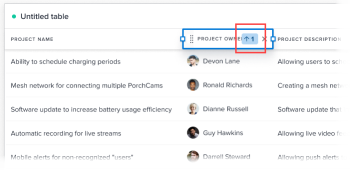

# Configurar uma coluna de tabela na Tela de relatório

As colunas em uma tabela podem ser configuradas para exibição. Você pode modificar os seguintes aspectos de uma coluna:

* Nome
* Classificar
* Editar permissão
* Texto em foco
* Agregação
* Formatação condicional

## Pré-requisitos

Antes de começar, você deve se inscrever na versão beta da Tela de relatório. Para obter mais informações, consulte [Versão beta do relatório do Canvas: visão geral](/help/quicksilver/product-announcements/betas/canvas-dashboards-beta/reporting-canvas-beta-overview.md).

## Modificar colunas em uma tabela

1. Vá para um relatório existente, clique no link **Menu Mais** ícone  no cabeçalho do relatório, selecione **Editar**.
1. No cabeçalho da tabela do relatório, clique na guia **Editar** ícone .

   

   >[!NOTE]
   >
   >Se você acabou de criar a tabela e ainda não adicionou nenhum campo, clique no botão Editar no centro da tabela.

1. (Opcional) Adicione, reposicione ou exclua colunas na tabela. Para obter mais informações sobre edição de campos em uma tabela, consulte [Adicionar ou editar um bloco de tabela na Tela de relatório](../../../reports-and-dashboards/reporting-canvas/table-blocks/add-or-edit-report-table.md)

   | Adicionar uma nova coluna | Para adicionar uma coluna a uma tabela, clique e arraste um campo da **Campos** à direita da página na tabela em que você deseja colocá-lo ou clique duas vezes em um campo para adicioná-lo como a coluna mais à direita. |
   |---|---|
   | Mover uma coluna | Para reorganizar a ordem das colunas em uma tabela, clique em um nome de coluna e arraste-o para um novo local. |
   | Excluir uma coluna | Para excluir uma coluna de uma tabela, clique na coluna que deseja excluir e clique no x no lado direito do nome da coluna. |

   {style="table-layout:auto"}

1. Para configurar uma coluna, clique no nome da coluna que deseja modificar na linha de cabeçalho da tabela e, em seguida, em uma das guias a seguir no painel direito:

   <table style="table-layout:auto"> 
    <col> class="TableStyle-TableStyle-List-options-in-steps-Column-Column1" /&gt;
    <tbody>
     <tr data-mc-conditions="">
      <th role="rowheader" colspan="2">Guia Dados</th>
     </tr>
     <tr data-mc-conditions="">
      <td role="rowheader">Agregação com base em</td>
      <td>
 Para agregar (resumir no cabeçalho) as informações em uma coluna, selecione o tipo de agregação desejado na <strong>Agregação com base em</strong> menu suspenso. As opções disponíveis dependem do tipo de dados contidos na coluna.

Se você estiver usando grupos na tabela, o valor agregado será exibido na linha de grupo acima do nome da coluna, em vez de ao lado do nome da coluna.
</td>
     </tr>
     <tr data-mc-conditions="">
      <td role="rowheader">Formato do campo</td>
      <td>
(Disponível somente quando a coluna contém dados de data, porcentagem, moeda ou hora, não texto.) Selecione o formato desejado para os dados na <b>Formato do campo</b> menu suspenso. Por exemplo, você pode exibir sinais de porcentagem depois dos números em uma coluna ou alterar a forma como as datas são exibidas.
</td>
     </tr>
     <tr data-mc-conditions="">
      <td role="rowheader">O campo é editável</td>
      <td>Ativar o <strong>O campo é editável</strong> se quiser permitir que os usuários que visualizam a tabela editem o nome da coluna.</td>
     </tr>
     <tr>
      <td role="rowheader"><strong>Ordenar</strong></td>
      <td>
Por padrão, a tabela é classificada de acordo com os dados em sua coluna mais à esquerda, em ordem crescente. Para classificar pela coluna selecionada, clique na seta para baixo ao lado de <strong>Ordenar</strong>, depois clique na caixa de seleção <b>Classificar por esta coluna</b>. Em seguida, você pode selecionar um <strong>Classificação</strong> direção (valores crescentes ou decrescentes) e uma <strong>Ordem de classificação</strong> (a prioridade de classificação relativa dessa coluna em comparação a outras colunas de classificação na tabela).

Você pode repetir esse processo para classificar a tabela por até 5 colunas diferentes. Verifique se cada coluna tem o formato correto <strong>Ordem de classificação</strong> em relação a quaisquer novas colunas selecionadas para classificação.

Observação: Se você deletar uma coluna selecionada para classificar uma tabela e outra coluna também for selecionada para classificação, essa coluna será usada para classificar a tabela em ordem decrescente. Se não houver outras colunas selecionadas para classificação, a tabela retornará ao padrão: classificação por sua primeira coluna.

Quando você designa uma coluna para classificar a tabela, uma pequena caixa é exibida ao lado do nome da coluna com um número que indica a prioridade relativa dessa coluna na classificação da tabela (a tabela é classificada primeiro por 1, depois por 2 e assim por diante) e uma seta para indicar se a direção da classificação é crescente ou decrescente. 

</td>
     </tr>
    </tbody>
   </table>

   <table style="table-layout:auto"> 
    <col> 
    <col> 
    <tbody> 
     <tr> 
      <th role="rowheader" colspan="2">Guia Estilo</th> 
     </tr> 
     <tr> 
      <td role="rowheader"><strong>Personalizar rótulo da coluna</strong> </td> 
      <td>Insira um novo nome de exibição para a coluna (limite de 100 caracteres).</td> 
     </tr> 
     <tr> 
      <td role="rowheader">Mostrar texto em foco</td> 
      <td> 
Determine se você deseja que o texto explicativo seja exibido quando alguém passar o mouse sobre um nome de coluna.
 
Essa opção está desabilitada por padrão.
 </td> 
     </tr> 
     <tr> 
      <td role="rowheader">Texto em foco</td> 
      <td>(Disponível somente quando <strong>Mostrar texto em foco</strong> está ativado.) Personalize o texto explicativo que é exibido quando alguém passa o mouse sobre um nome de coluna.</td> 
     </tr> 
     <tr> 
      <td role="rowheader"><strong>Formatação condicional</strong> </td> 
      <td> 
       <ol data-mc-continue="false"> 
        <li value="1"> 
Adicionar , editar ou excluir  uma regra que formata células na coluna quando seus valores atendem aos critérios especificados.
 
Por exemplo, você pode criar uma regra que altere a fonte no campo "Status do projeto" para roxo em negrito quando o valor desse campo for igual a "Criação".
 
Ou você pode usar <b>Mostrar um ícone</b> para adicionar um ícone verde de sinalizador a cada item na coluna que tem o status "Atual".
 
  
 
Observação: se você usar <strong>Mostrar um ícone</strong>, as outras opções de formatação não estarão disponíveis.
 
É possível selecionar <strong>Aplicar a toda a linha</strong> se quiser que a formatação afete toda a linha de uma célula que atenda à condição da regra. Por exemplo, você pode realçar projetos com data de vencimento posterior a uma determinada data aplicando uma cor de plano de fundo amarela não apenas às células de data na coluna "Data de vencimento", mas também à linha inteira em que essas datas ocorrem.
 
Dica: Conforme você adiciona opções de formatação a uma regra, o formato de célula resultante é exibido em <strong>Visualizar</strong> na parte inferior do painel.
 </li> 
        <li value="2">Quando terminar de adicionar uma regra, clique em <strong>Salvar</strong>.</li> 
        <li value="3"> 
(Opcional) Clique em <b>+ Adicionar regra</b> para adicionar outras regras à mesma coluna.
 
Várias regras de formatação condicional em uma tabela são aplicadas na seguinte ordem:
 
         <ul> 
          <li> 
As regras que se aplicam a linhas inteiras são avaliadas primeiro, da esquerda para a direita para cada coluna e de cima para baixo dentro de uma coluna.
 
Observação: A formatação de linha substituirá outra formatação condicional para células nessa linha, mesmo que elas atendam à condição da regra de outra coluna.
 </li> 
          <li> 
Outras regras são avaliadas em seguida, de cima para baixo, pois são listadas no painel direito de uma coluna. Você pode arrastar  regras salvas nesse painel para alterar sua ordem.
 
Observação: As células são formatadas com base na primeira condição que atendem, e não serão formatadas ainda que atendam a outras condições.
 </li> 
         </ul> </li> 
       </ol> </td> 
     </tr> 
    </tbody> 
   </table>

1. Clique em **Voltar** seta no canto superior esquerdo da tela para retornar ao relatório.
