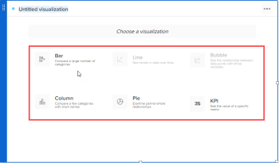

# Adicionar ou editar um bloco de visualização na Tela de relatório

Uma visualização pode ajudá-lo a contar uma história com seus dados, destacando informações importantes de uma maneira fácil de entender.

Você pode adicionar os seguintes tipos de visualizações a um relatório:

* Barra
* Coluna
* Torta
* KPI

## Pré-requisitos

Antes de começar, você deve se inscrever na versão beta da Tela de relatório. Para obter mais informações, consulte [Versão beta da tela de relatório: visão geral](/help/quicksilver/product-announcements/betas/canvas-dashboards-beta/reporting-canvas-beta-overview.md).

## Adicionar ou editar um bloco de visualização

>[!TIP]
>
>Todas as alterações são salvas automaticamente à medida que você cria e edita os blocos no relatório.

1. Clique no ícone  do **Menu principal** no canto superior direito do Adobe Workfront e em **Relatórios**.
1. Clique em **Novo relatório** e crie um relatório com tabelas que contenham dados, conforme descrito em [Criar um relatório na Tela de Relatório](../../../reports-and-dashboards/reporting-canvas/manage-reports/build-report.md) e [Adicionar ou editar um bloco de tabela na Tela de Relatório](../../../reports-and-dashboards/reporting-canvas/table-blocks/add-or-edit-report-table.md).

   Ou

   Em um relatório existente com tabelas contendo dados, clique no ícone  do **Mais Menu** no cabeçalho do relatório e selecione **Editar**.

1. No lado direito da tela, em **Adicionar um Bloco**:

   Arraste o ícone **Visualização** **** para a tela diretamente para o local desejado.

   Ou

   Clique duas vezes no ícone **Visualização** **** para adicionar uma visualização à parte superior da tela.

   Ou

   Selecione o ícone **Visualizar** **** na parte superior de uma tabela existente na tela.

   >[!TIP]
   >
   >Você pode alterar o tamanho do bloco depois de inseri-lo arrastando suas alças de canto.

1. (Condicional) Se o relatório contiver mais de uma tabela, na caixa **Criar sua visualização** que é exibida, selecione a tabela de origem para a visualização.

   

   >[!NOTE]
   >
   >Se você selecionar **+ Adicionar nova tabela**, um novo bloco de tabela será criado abaixo do bloco de visualização. É necessário preencher a tabela com dados antes de adicionar uma visualização para ela. Para obter mais informações sobre criação e edição de tabelas, consulte [ [Adicionar ou editar um bloco de tabela na Tela de Relatório](../../../reports-and-dashboards/reporting-canvas/table-blocks/add-or-edit-report-table.md)](../../../reports-and-dashboards/reporting-canvas/table-blocks/add-or-edit-report-table.md)

1. Selecione o tipo de visualização que deseja adicionar.

   

   Sua visualização é exibida, representando os dados da tabela selecionada.

   >[!TIP]
   >
   >As cores dos pontos ao lado do título da visualização e do título da tabela de origem correspondem. Em um relatório com várias tabelas, isso ajuda a combinar facilmente as visualizações com suas tabelas associadas.

1. Continue para configurar a visualização:

   * Visualização de **Barra**: para obter instruções, consulte [Configurar uma visualização de barra na Tela de Relatório](../../../reports-and-dashboards/reporting-canvas/visualization-blocks/configure-bar-visualization.md#bar).
   * Visualização de **Coluna**: para obter instruções, consulte [Configurar uma visualização de coluna na Tela de Relatório](../../../reports-and-dashboards/reporting-canvas/visualization-blocks/configure-column-visualization.md).
   * Visualização de **Pizza**: para obter instruções, consulte [Configurar visualização de pizza na Tela de Relatório](../../../reports-and-dashboards/reporting-canvas/visualization-blocks/configure-pie-visualization.md).
   * Visualização de **KPI**: para obter instruções, consulte [Configurar uma visualização de KPI na Tela de Relatório](../../../reports-and-dashboards/reporting-canvas/visualization-blocks/configure-kpi-visualization.md).
