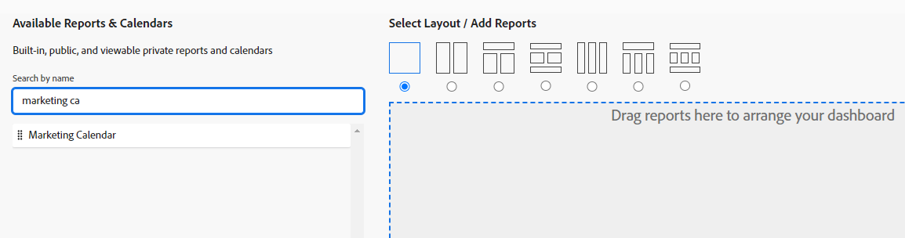

# Criar um painel

<!--Audited: 01/2025-->

As informações destacadas nesta página referem-se a funcionalidades que ainda não estão disponíveis. Ele está disponível somente no ambiente de Visualização para todos os clientes.

Você pode criar painéis para acessar informações rapidamente no Adobe Workfront. Até 25 relatórios, calendários e páginas externas podem ser adicionados a painéis que podem ser compartilhados com outras pessoas para colaboração ideal.

Para saber mais sobre painéis, consulte [Introdução aos painéis](../../../reports-and-dashboards/dashboards/understanding-dashboards/get-started-dashboards.md).

## Requisitos de acesso

+++ Expanda para visualizar os requisitos de acesso da funcionalidade neste artigo.

<table style="table-layout:auto"> 
 <col> 
 <col> 
 <tbody> 
  <tr> 
   <td role="rowheader">Pacote do Adobe Workfront</td> 
   <td> 
Qualquer
 </td> 
  </tr> 
  <tr> 
   <td role="rowheader">Licença do Adobe Workfront</td> 
   <td> 
      
Padrão

      
Plano

   </td> 
  </tr> 
  <tr> 
   <td role="rowheader">Configurações de nível de acesso</td> 
   <td> 
Editar acesso a relatórios, painéis e calendários
</td> 
  </tr>  
  <tr> 
   <td role="rowheader">Permissões de objeto</td> 
   <td> 
Você obterá permissões de gerenciamento para os painéis que criar
 </td> 
  </tr> 
 </tbody> 
</table>

Para obter mais detalhes sobre as informações nesta tabela, consulte [Requisitos de acesso na documentação do Workfront](/help/quicksilver/administration-and-setup/add-users/access-levels-and-object-permissions/access-level-requirements-in-documentation.md).

+++

## Pré-requisitos

Você deve criar qualquer um dos seguintes objetos antes de adicioná-los a um painel:

* **Relatórios**: Para obter informações sobre como criar relatórios, consulte [Criar um relatório personalizado](../../../reports-and-dashboards/reports/creating-and-managing-reports/create-custom-report.md).

* **Calendários**: para obter informações sobre como criar calendários, consulte [Visão geral dos relatórios de calendário](../../../reports-and-dashboards/reports/calendars/calendar-reports-overview.md).

Você pode adicionar páginas externas existentes a um painel ou criar uma a partir do novo painel. Para obter informações sobre como criar páginas externas, consulte [Incorporar uma página da Web externa em um painel](../../../reports-and-dashboards/dashboards/creating-and-managing-dashboards/embed-external-web-page-dashboard.md).

## Criar um painel

{{step1-to-dashboards}}

1. Clique em **Novo Painel**.\
   A caixa de diálogo Novo Painel é exibida.

1. Especifique o seguinte:

   <table style="table-layout:auto">
    <col>
    <col>
    <tbody>
     <tr>
      <td role="rowheader"><strong>Nome</strong></td>
      <td>
Este é o nome do seu painel. Recomendamos usar somente caracteres UTF-8 para evitar problemas de compatibilidade.

Se você não especificar um nome, o nome do primeiro relatório no painel se tornará o nome do painel, por padrão.
</td>
     </tr>
     <tr>
      <td role="rowheader"><strong>Descrição (opcional)</strong></td>
      <td>Esta é uma descrição do seu painel.</td>
     </tr>
      <tr>
      <td role="rowheader"><strong>Moeda</strong></td>
      <td>Esse é o tipo de moeda padrão para o painel.  
       Os usuários podem alternar entre diferentes tipos de moeda ao filtrar o painel. Para obter mais informações, consulte <a href="/help/quicksilver/reports-and-dashboards/canvas-dashboards/manage-canvas-dashboards/filter-canvas-dashboard.md">Filtrar um painel por tipo de moeda</a>.</td>
     </tr>
    </tbody>
   </table>

1. Selecione um layout clicando no botão de opção correspondente a ele na parte superior da seção **Selecionar layout/Adicionar relatórios/Adicionar calendários**. Esse é o layout no qual os relatórios, calendários ou páginas externas serão exibidos no painel.

   O layout de coluna única é o padrão.

   Para obter informações sobre o layout de relatórios em painéis, consulte [Entender como os relatórios são exibidos em um painel](../../../reports-and-dashboards/dashboards/understanding-dashboards/understand-how-reports-display-dashboard.md).

   <!--
   Consider adding the information from this article above here, at some point, instead of linking to it.)
   -->

1. Na seção **Relatórios e Calendários Disponíveis**, comece digitando o nome de um relatório, calendário ou página externa na barra de pesquisa e, em seguida, arraste e solte o relatório, o calendário ou a página externa no painel de layout à direita.

   >[!NOTE]
   >
   >Ao pesquisar por um item, a pesquisa retorna qualquer um dos 2.000 relatórios criados mais recentemente. Os nomes de relatório que incluem caracteres unicode não são retornados nos resultados da pesquisa. Como prática recomendada, evite incluir caracteres unicode ao nomear objetos no Workfront digitando nomes em vez de copiar e colar nomes de outra fonte.

   

1. (Opcional) Clique em **Adicionar página externa** para adicionar uma nova Página externa ao painel.

   Para obter mais informações sobre como criar páginas externas e incorporá-las aos painéis, consulte [Incorporar uma página da Web externa em um painel](../../../reports-and-dashboards/dashboards/creating-and-managing-dashboards/embed-external-web-page-dashboard.md).

1. Clique em **Salvar + Fechar**.

   Um carimbo de data e hora é exibido no canto superior direito do painel. O carimbo de data e hora inclui a data, a hora e o fuso horário quando o painel foi atualizado pela última vez.
