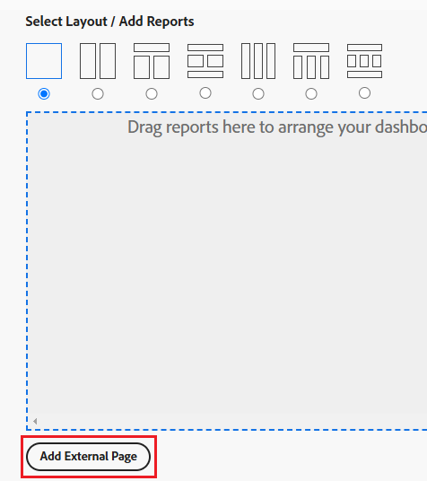
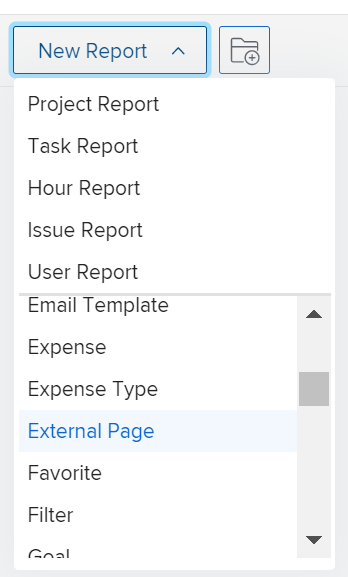

# Incorporar uma página externa da Web em um painel

<!--Audited: 01/2024-->

É possível incorporar uma página externa da Web em um painel para fornecer acesso a informações relacionadas de outros sistemas ou no Adobe Workfront.

Por exemplo, se sua organização tiver um repositório de documentos baseado na Web, um wiki ou outro sistema de gerenciamento de conteúdo que contenha informações do projeto que são acessadas regularmente por meio de um URL, é possível exibir essas informações no Workfront criando uma página externa em um painel.

>[!IMPORTANT]
>
>* Por motivos de segurança, alguns sites não permitem que você incorpore páginas da Web como um iframe. Se a página da Web que você deseja incorporar em um painel não permitir, a página não será exibida no painel. No entanto, ainda é possível acessar a página externa clicando no nome do painel.\
>\
>Para permitir a incorporação de um site que você possui, consulte o administrador da Web para ajustar a **X-Frame-Options** configuração. Para obter mais informações, consulte [X-Frame-Options](https://developer.mozilla.org/en-US/docs/Web/HTTP/Headers/X-Frame-Options).
>
>
>* Páginas de painel não são mais suportadas como páginas externas incorporadas em Painéis. Embora os painéis existentes não sejam modificados automaticamente para remover essas páginas externas, qualquer modificação em um painel que inclua essa referência não poderá ser salva até que a referência seja removida ou alterada.
> Especificamente, os seguintes subdomínios Workfront.com não são mais compatíveis:
>
>     * /dashboards&#x200B;
>     * /dashboard/:ID&#x200B;
>     * /portfolio/:ID/content-dashboard__:dashboardID&#x200B;
>     * /program/:ID/content-dashboard__:dashboardID&#x200B;
>     * /project/:ID/content-dashboard__:dashboardID&#x200B;
>     * /task/:ID/content-dashboard__:dashboardID&#x200B;
>     * /template/:ID/content-dashboard__:dashboardID&#x200B;
>     * /templatetask/:ID/content-dashboard__:dashboardID&#x200B;
>     * /resourcemanagement/:ID/
>     * content-dashboard__:dashboardID&#x200B;
>     * /team/:ID/content-dashboard__:dashboardID&#x200B;
>     * /iteration/:ID/content-dashboard__&#x200B;:dashboardID
>     * /requests/:ID/content-dashboard__:dashboardID&#x200B;
>     * /group/:ID/content-dashboard__:dashboardID&#x200B;
>     * /billingrecord/:ID/content-dashboard__:dashboardID
>
>Como solução alternativa, considere incluir um relatório de lista no painel, conforme explicado em [Adicionar um relatório a um painel](/help/quicksilver/reports-and-dashboards/dashboards/creating-and-managing-dashboards/add-report-dashboard.md)

## Requisitos de acesso

+++ Expanda para visualizar os requisitos de acesso para a funcionalidade neste artigo.

Você deve ter o seguinte:

<table style="table-layout:auto"> 
 <col> 
 <col> 
 <tbody> 
  <tr> 
   <td role="rowheader"><strong>plano do Adobe Workfront</strong></td> 
   <td> 
Qualquer
 </td> 
  </tr> 
  <tr> 
   <td role="rowheader"><strong>Licença da Adobe Workfront*</strong></td> 
   <td> 
Atual: Plano 

   Ou
   
Novo: Padrão 
 </td> 
  </tr> 
  <tr> 
   <td role="rowheader"><strong>Configurações de nível de acesso</strong></td> 
   <td> 
Editar acesso a relatórios, painéis e calendários
 </td> 
  </tr> 
  <tr> 
   <td role="rowheader"><strong>Permissões de objeto</strong></td> 
   <td> </td> 
  </tr> 
 </tbody> 
</table>

*Para descobrir que plano, tipo de licença ou acesso você tem, entre em contato com o administrador do Workfront. Para obter mais informações, consulte [Requisitos de acesso na documentação do Workfront](/help/quicksilver/administration-and-setup/add-users/access-levels-and-object-permissions/access-level-requirements-in-documentation.md).

+++

## Pré-requisitos

Você deve criar um painel antes de incorporar uma página externa a ele.

Para obter informações sobre como criar painéis, consulte [Criar um painel](../../../reports-and-dashboards/dashboards/creating-and-managing-dashboards/create-dashboard.md).

## Incorporar uma página externa em um painel

>[!IMPORTANT]
>
>Você pode remover uma Página externa de um painel se ela não for mais necessária. No entanto, não é possível excluir uma página externa após sua criação no Workfront. Você pode excluir uma página externa somente usando a API. Para obter mais informações, consulte [Remover uma Página Externa de um painel](../../../reports-and-dashboards/dashboards/creating-and-managing-dashboards/remove-external-page-from-dashboard.md).

1. Localize o URL da página a ser exibida no Workfront e copie o URL localizado na barra de endereços.

   >[!NOTE]
   >
   >Se você estiver compartilhando URLs para objetos do Workfront, lembre-se de que alguns URLs expiram ao longo do tempo. Por exemplo, URLs de documentos expiram depois de serem abertos. Isso é configurado como uma medida de segurança e, por design, são considerados URLs não estáticos e não devem ser compartilhados.

{{step1-to-dashboards}}

1. Para editar um painel existente, selecione o painel no qual deseja incorporar a página do site e clique em **Ações do painel** e, em seguida, clique em **Editar**
Ou\
   Para criar um novo painel, clique em **Novo painel**.\
   Para obter mais informações sobre como criar um painel, consulte [Criar um painel](../../../reports-and-dashboards/dashboards/creating-and-managing-dashboards/create-dashboard.md).

1. Clique em **Adicionar página externa** no **Selecionar layout/adicionar relatórios/adicionar calendários** área.

   

   A variável **Adicionar página externa** é exibida.

1. Especifique as seguintes informações sobre a página externa:

   * **Nome**: adicione um nome ao painel.
   * **Descrição**: adicione mais informações sobre o painel para identificar as informações que ele contém. A descrição é exibida no painel para todos que têm acesso para exibi-la, depois que você a salva.
   * **URL**: cole o URL copiado anteriormente neste campo.

     Você pode especificar os seguintes tipos de URLs:

      * Um URL https (criptografado) para uma página da Web.\
        Somente páginas https (criptografadas) são carregadas com o URL.\
        

      * Um URL de modelo que contém informações de sessão de um site específico.\
        Por exemplo: *https://localhost/?session={!$$SESSION}*
Você deve estar conectado ao site especificado para exibir a Página externa.\
        Para obter informações sobre como obter uma ID de sessão do Workfront, consulte [Noções básicas sobre API](../../../wf-api/general/api-basics.md).\
        O administrador do Workfront pode configurar as preferências do sistema de uma forma que não permita o uso de informações da sessão em suas páginas externas, por motivos de segurança. Nesse caso, a página externa não é carregada no painel.\
        Para obter mais informações sobre as preferências de segurança do sistema, consulte [Configurar preferências de segurança do sistema](../../../administration-and-setup/manage-workfront/security/configure-security-preferences.md).\
        

     >[!WARNING]
     >
     >O uso de SessionID não é seguro e não é recomendado.
     >

   * **Altura**: digite um número maior que 0 para definir o espaço que a página externa ocupa no painel. A altura padrão é 500.

1. Clique em **Salvar**.

   A página é adicionada automaticamente ao painel.

   Se você criar painéis adicionais, poderá encontrar essa página externa e adicioná-la a outros painéis. Você pode encontrar todas as páginas externas existentes na lista de Relatórios e calendários disponíveis ao criar ou editar um painel.

   <!--
    *** This is linked to: Creating Dashboards, and Editing Dashboards.
   -->

## Atualizar uma página externa em um painel

Para atualizar as informações de uma página externa usada em um painel:

{{step1-to-dashboards}}

1. Clique no nome do painel que deseja atualizar para abri-lo e clique em **Ações do painel**, depois **Editar**.

   A variável **Detalhes do painel** é aberta.

1. No **Selecionar layout / Adicionar relatórios / Adicionar calendários** área do **Detalhes do painel** localize a página externa que deseja atualizar, passe o mouse sobre ela e clique no link **Editar** ícone.\
   

1. No **Editar Página Externa** , atualize os campos que deseja alterar e clique em **Salvar**.
1. (Opcional) Clique no link **Excluir** ícone  para remover a página externa do painel. Para obter mais informações, consulte [Remover uma Página Externa de um painel](../../../reports-and-dashboards/dashboards/creating-and-managing-dashboards/remove-external-page-from-dashboard.md).
1. Clique em **Salvar + Fechar**.

## Visualizar páginas externas em um relatório

Você pode exibir todas as páginas externas no Workfront em um relatório de Página externa.

{{step1-to-reports}}

1. Clique em **Novo Relatório** > selecionar **Página externa**.

   

1. (Opcional) Atualize as guias Exibição, Filtros ou Agrupamentos do relatório.

   Para obter mais informações, consulte [Criar um relatório personalizado](../../../reports-and-dashboards/reports/creating-and-managing-reports/create-custom-report.md).

1. Clique em **Salvar+Fechar**.

   Você pode exibir o nome e o URL associados às páginas externas em seu sistema no novo relatório.

   
