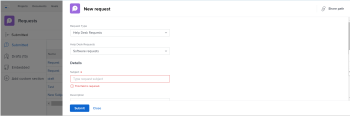

# Incorporar uma fila de solicitações em um painel

<!-- Audited: 1/2025 -->

Você pode incorporar uma nova fila de solicitações em um painel para fornecer acesso direto à fila de solicitações aos seus usuários, sem precisar acessar a área Solicitações.

Por exemplo, se você tiver uma fila de solicitações aberta para toda a organização, como uma Fila de Help Desk ou uma fila de Solicitação PTO que todos devem acessar regularmente, pode ser conveniente inserir a fila de solicitações diretamente em um de seus painéis para acesso rápido e fácil. O processo de configuração é semelhante ao de criação de uma página externa em um painel.

Primeiro, você precisa obter um URL para a fila de solicitações. Em segundo lugar, você pode incorporar o URL a um painel adicionando uma página externa.

## Requisitos de acesso

+++ Expanda para visualizar os requisitos de acesso para a funcionalidade neste artigo.

Você deve ter o seguinte acesso para executar as etapas deste artigo:

<table style="table-layout:auto"> 
 <col> 
 <col> 
 <tbody> 
  <tr> 
   <td role="rowheader"><strong>plano do Adobe Workfront</strong></td> 
   <td> 
Qualquer
 </td> 
  </tr> 
  <tr> 
   <td role="rowheader"><strong>Licença do Adobe Workfront</strong></td> 
   <td> 
      
Novo:

         <ul>
         <li>
Padrão
</li>
         </ul>
      
Atual:

         <ul>
         <li>
Plano
</li>
         </ul>
   </td> 
  </tr> 
  <tr> 
   <td role="rowheader"><strong>Configurações de nível de acesso</strong></td> 
   <td> 
Editar acesso a relatórios, painéis, calendários
 </td> 
  </tr> 
  <tr> 
   <td role="rowheader"><strong>Permissões de objeto</strong></td> 
   <td> 
Gerenciar permissões no painel
 </td> 
  </tr> 
 </tbody> 
</table>

Para obter informações, consulte [Requisitos de acesso na documentação do Workfront](/help/quicksilver/administration-and-setup/add-users/access-levels-and-object-permissions/access-level-requirements-in-documentation.md).

+++

## Pré-requisitos

Ambos os itens a seguir devem ser criados antes de você poder incorporar uma fila de solicitações em um painel:

* **Painel**: Para obter informações sobre como criar painéis, consulte [Criar um painel](../../../reports-and-dashboards/dashboards/creating-and-managing-dashboards/create-dashboard.md).

* **A fila de solicitações**: Para obter informações sobre como criar filas de solicitações, consulte [Criar uma Fila de Solicitações](../../../manage-work/requests/create-and-manage-request-queues/create-request-queue.md)

## Obter o URL da fila de solicitações {#obtain-the-url-of-the-request-queue}

Você pode obter o URL de uma fila de solicitações de várias maneiras, dependendo de qual parte da fila de solicitações você deseja expor aos usuários quando eles acessarem o URL a partir de um painel.

* [Obter um link para um tópico de fila específico com capacidade para alterar o tipo de solicitação](#obtain-a-link-to-a-specific-queue-topic-with-ability-to-change-the-request-type)

* [Obter um link para uma fila de solicitações e capacidade de alterar o tipo de solicitação](#obtain-a-link-to-a-request-queue-and-ability-to-change-the-request-type)

* [Obter um link para uma fila de solicitações sem a capacidade de alterar o tipo de solicitação](#obtain-a-link-to-a-request-queue-with-no-ability-to-change-the-request-type)

### Obter um link para um tópico de fila específico com capacidade para alterar o tipo de solicitação {#obtain-a-link-to-a-specific-queue-topic-with-ability-to-change-the-request-type}

Quando você compartilha um link para um tópico da fila específico com outros usuários, o formulário de solicitação é aberto no tópico da fila exato que eles precisam usar para enviar a solicitação. Isso é útil quando os usuários podem não ter certeza de qual tópico da fila escolher ao registrar solicitações para uma fila de solicitações específica.

Os usuários podem alterar o tipo de solicitação ou escolher outro tópico, se necessário. A navegação da área Solicitações também é exibida.

1. Clique no **Menu principal** > **Solicitações** > **Nova solicitação**.
1. Continue selecionando grupos de tópicos e tópicos da fila até chegar à fila que você deseja compartilhar no painel, caso deseje compartilhar uma fila específica. Para obter informações sobre o envio de solicitações, consulte [Criar e enviar solicitações do Adobe Workfront](../../../manage-work/requests/create-requests/create-submit-requests.md).

   >[!TIP]
   >
   >A seleção de grupos de tópicos e tópicos da fila é opcional.

1. Clique em **Compartilhar caminho** no canto superior direito da área Nova solicitação.

   Isso copia o link para a fila de solicitações ou para o tópico da fila conforme você o exibe na tela. Os usuários podem atualizar o Tipo de solicitação ou qualquer um dos grupos de tópicos e tópicos da fila disponíveis.

   

### Obter um link para uma fila de solicitações e capacidade de alterar o tipo de solicitação {#obtain-a-link-to-a-request-queue-and-ability-to-change-the-request-type}

Ao compartilhar um link para um tipo de solicitação, o tipo de solicitação é selecionado para o usuário. Isso é útil quando os usuários precisam escolher entre vários grupos de tópicos ou tópicos da fila para o mesmo tipo de solicitação. Os usuários podem alterar o tipo de solicitação e escolher outro. A navegação da área Solicitações também é exibida.

1. Vá para um projeto designado como uma fila de solicitações.

   Para obter informações sobre como criar uma fila de solicitações a partir de um projeto, vá para [Criar uma fila de solicitações](../../../manage-work/requests/create-and-manage-request-queues/create-request-queue.md).

1. Ir para **Detalhes da Fila**.
1. Copie o código localizado no campo **URL de Acesso Direto**.

   O código deve ser semelhante ao seguinte:

   `https://<yourdomain>.my.workfront.com/requests/new?activeTab=tab-new-helpRequest&projectID=50062d6f000849c95ab3513c0e84a51e&path=`

   Esse é o link para a fila de solicitações associada ao projeto selecionado. O Tipo de solicitação é pré-selecionado.

   Os usuários podem selecionar qualquer grupo de tópicos ou tópico da fila de que precisam, ou podem escolher outro tipo de solicitação.

   

### Obter um link para uma fila de solicitações sem a capacidade de alterar o tipo de solicitação {#obtain-a-link-to-a-request-queue-with-no-ability-to-change-the-request-type}

Ao compartilhar um link para um tipo de solicitação pré-selecionado, o tipo de solicitação é selecionado para o usuário e não pode ser alterado (está esmaecido). Os usuários podem escolher os grupos de tópicos ou os tópicos da fila de que precisam. Isso é útil quando você não deseja que os usuários visualizem e selecionem outros tipos de solicitação. A navegação da área Solicitações não é exibida.

1. Vá para um projeto designado como uma fila de solicitações.

   Para obter informações sobre como criar uma fila de solicitações a partir de um projeto, vá para [Criar uma fila de solicitações](../../../manage-work/requests/create-and-manage-request-queues/create-request-queue.md).

1. Ir para **Detalhes da Fila**.
1. Copie o código encontrado no campo **Código incorporado**.

   O código deve ser semelhante ao seguinte:

   `<iframe src="https://<yourdomain>my.workfront.com/requests/newRequestEmbedded?projectID=612518c7000404462d3bc9a0bc09fa71" frameborder="0" width="500" height="600"></iframe>`

1. Edite o código para preservar apenas as informações abaixo:

   `https://<yourdomain>.my.workfront.com/requests/newRequestEmbedded?projectID=612518c7000404462d3bc9a0bc09fa71`

   >[!TIP]
   >
   >Você pode adicionar uma tag `<samp>iframe </samp>` ao incorporar o código em um aplicativo diferente do Workfront.

   Esse é o link para a fila de solicitações associada ao projeto selecionado. O tipo de solicitação é pré-selecionado e não pode ser alterado.

   Os usuários podem selecionar qualquer grupo de tópicos ou tópico da fila de que precisam para o tipo de solicitação selecionado. Os usuários não podem selecionar outro tipo de solicitação.

   

## Incorporar uma fila de solicitações em um painel

Você pode incorporar um link à fila de solicitações ou a um tópico da fila aninhado em uma fila de solicitações em um painel para conceder aos usuários acesso direto às solicitações de entrada.

1. Obtenha uma URL da fila de solicitações usando um dos métodos descritos na seção [Obter a URL da fila de solicitações](#obtain-the-url-of-the-request-queue) deste artigo.

1. Clique no **Menu Principal** > **Painéis** > **Novo Painel**.

1. Digite um **Nome** para o painel. Este campo é obrigatório.

1. Clique em **Adicionar Página Externa**.

   

1. Na caixa **Adicionar Página Externa**, edite os seguintes campos:

   * **Nome**: digite o nome da fila de solicitações como deseja que ela apareça no painel. Este campo é obrigatório.

   * **Descrição**: digite uma descrição sobre a exibição desta página externa. Este campo não é obrigatório e é importante apenas para fins de relatório. Ele não é exibido no painel.

   * **URL**: cole a URL que você obteve usando um dos métodos descritos na Etapa 1.

   * **Altura**: digite a altura da página externa. Isso define quanto espaço a página externa que contém a fila de solicitações ocupa no painel. Este campo é obrigatório e o valor padrão é 500.

1. Clique em **Salvar**.

1. Clique em **Salvar + Fechar**.

   A fila de solicitações é exibida no painel como um componente separado do painel.

1. (Opcional) Clique em **Ações do Painel** e em **Editar** para adicionar relatórios, calendários ou páginas externas adicionais ao mesmo painel.

   Para obter informações sobre como adicionar componentes a um painel, consulte [Criar um painel](../../../reports-and-dashboards/dashboards/creating-and-managing-dashboards/create-dashboard.md).

<!--
<ol data-mc-conditions="QuicksilverOrClassic.Draft mode">
<li value="1"> 
Click the <strong>Main Menu</strong> > Requests >&nbsp;<strong>New Request</strong>. 
 </li>
<li class="preview" value="2" data-mc-conditions="QuicksilverOrClassic.Quicksilver"> 
Continue entering the request.&nbsp;For information about submitting requests, see <a href="../../../manage-work/requests/create-requests/create-submit-requests.md" class="MCXref xref">Create and submit Adobe Workfront requests</a>. 
 </li>
<li value="3"> 
Select the <strong>Request Type</strong> for the queue you would like added to the dashboard.
 </li>
<li value="4"> 
(Optional) Select a Queue Topic and a Topic Group. Depending on how the project manager set up the request queue, the names of these fields are different in each Workfront instance.
 </li>
<li class="preview" value="5" data-mc-conditions="QuicksilverOrClassic.Quicksilver"> 
Click <strong>Share path</strong> to obtain a shared link from the request queue you want to embed on a dashboard.
 
For information about sharing a request queue, see <a href="../../../manage-work/requests/create-requests/share-link-to-request-queue.md" class="MCXref xref">Share a link to a request queue</a>
 </li>
<li value="6"> 
For example, enter a URL similar to one of the following: 
 </li>
</ol>
-->
