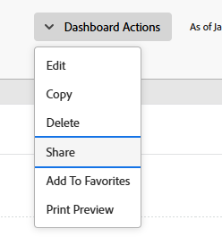

# Compartilhar um painel

<!-- Audited: 1/2025 -->

O administrador do Adobe Workfront concede aos usuários acesso para exibir ou editar painéis quando eles atribuem níveis de acesso. Para obter mais informações sobre como conceder acesso a problemas, consulte [Conceder acesso a relatórios, painéis e calendários](../../../administration-and-setup/add-users/configure-and-grant-access/grant-access-reports-dashboards-calendars.md).

Além do nível de acesso que os usuários recebem, você também pode conceder a eles permissões para Exibir ou Gerenciar painéis específicos que você tem acesso para compartilhar. Para obter mais informações sobre níveis de acesso e permissões, consulte [Como níveis de acesso e permissões funcionam juntos](../../../administration-and-setup/add-users/access-levels-and-object-permissions/how-access-levels-permissions-work-together.md).

As permissões são específicas a um item no Workfront e definem quais ações podem ser executadas nesse item.

>[!NOTE]
>
>Um administrador do Workfront pode adicionar ou remover permissões a todos os itens no sistema, para todos os usuários, sem ser o proprietário desses itens.

## Requisitos de acesso

+++ Expanda para visualizar os requisitos de acesso da funcionalidade neste artigo.

<table style="table-layout:auto"> 
 <col> 
 <col> 
 <tbody> 
  <tr> 
   <td role="rowheader">Pacote do Adobe Workfront</td> 
   <td> 
Qualquer
 </td> 
  </tr> 
  <tr> 
   <td role="rowheader">Licença do Adobe Workfront</td> 
    <td> 
   
Claro ou superior

   
Revisar ou superior

   </td> 
  </tr> 
  <tr> 
   <td role="rowheader">Configurações de nível de acesso</td> 
   <td> 
Acesso de exibição ou superior a Relatórios, Painéis, Calendários
 </td> 
  </tr> 
  <tr> 
   <td role="rowheader">Permissões de objeto</td> 
   <td> 
Exibir permissões ou mais no painel
 </td> 
  </tr> 
 </tbody> 
</table>

Para obter mais detalhes sobre as informações contidas nesta tabela, consulte [Requisitos de acesso na documentação do Workfront](/help/quicksilver/administration-and-setup/add-users/access-levels-and-object-permissions/access-level-requirements-in-documentation.md).

+++

## Pré-requisitos

O painel deve ser criado para que você possa compartilhá-lo.

Para obter informações sobre como criar painéis, consulte [Criar um painel](../../../reports-and-dashboards/dashboards/creating-and-managing-dashboards/create-dashboard.md).

## Considerações sobre compartilhamento de painéis

Além das considerações abaixo, veja também [Compartilhar relatórios, painéis e calendários](../../../workfront-basics/grant-and-request-access-to-objects/permissions-reports-dashboards-calendars.md).

* O criador de um painel tem permissões Gerenciar para ele, por padrão.

* Você pode compartilhar painéis que cria com outros indivíduos, equipes, grupos, funções de cargo ou empresas. Você também pode compartilhar painéis que outras pessoas criaram e que foram compartilhados com você.
* Você também pode compartilhá-los com toda a organização, tornando-a visível em todo o sistema.
* Você pode compartilhar um painel individual ou vários painéis de uma lista.
* Quando você compartilha um painel, os usuários herdam permissões de Exibição para todos os objetos de relatórios no painel, por padrão.

  Para obter mais informações sobre a hierarquia de objetos no Workfront, consulte [Compreender os objetos no Adobe Workfront](../../../workfront-basics/navigate-workfront/workfront-navigation/understand-objects.md).

  Para obter informações sobre como exibir permissões herdadas, consulte [Exibir permissões herdadas em objetos](../../../workfront-basics/grant-and-request-access-to-objects/view-inherited-permissions-on-objects.md).

## Compartilhar um painel

Compartilhar um painel ou vários painéis de uma lista é idêntico.

1. Vá para uma lista de painéis, selecione um ou vários painéis e clique em **Compartilhar** .

   Ou

   Clique no nome de um painel e clique em **Ações do Painel** > **Compartilhamento**.

   

1. No campo **Adicionar pessoas, equipes, funções, grupos ou empresas**, comece a digitar o nome do usuário, equipe, função, grupo ou empresa com a qual deseja compartilhar o painel e clique no nome quando ele aparecer na lista suspensa.
1. (Opcional) Para tornar o painel acessível a todos os usuários no sistema, clique no menu suspenso **Somente convidados podem acessar** da caixa de diálogo de compartilhamento e selecione **Todos no sistema podem exibir**.

1. Clique em **Salvar**.
