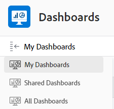

# Introdução aos painéis

<!-- Audited: 1/2024 -->

O objetivo de um painel é fornecer acesso rápido às informações provenientes de vários relatórios. Primeiro, você pode coletar informações em relatórios e colocar vários relatórios nos painéis para facilitar o acesso às informações.

## Requisitos de acesso

+++ Expanda para visualizar os requisitos de acesso para a funcionalidade neste artigo.

Você deve ter o seguinte:

<table style="table-layout:auto">
 <col> 
 </col> 
 <col> 
 </col> 
 <tbody> 
  <tr> 
   <td> 
<strong>plano do Adobe Workfront</strong>
 </td> 
   <td>Qualquer</td> 
  </tr> 
  <tr> 
   <td> 
<strong>Licença do Adobe Workfront</strong>
 </td> 
   <td> 
Novo: Colaborador ou superior

Ou

Atual: revisão ou superior
 </td> 
  </tr> 
  <tr> 
   <td><strong>Nível de acesso</strong> </td> 
   <td> 
Acesso maior ou igual a relatórios, painéis e calendários
 </td> 
  </tr> 
  <tr> 
   <td> 
<strong>Permissões de objeto</strong> 
 </td> 
   <td> 
Exibir permissões para o painel
  </td> 
  </tr> 
 </tbody> 
</table>

Para obter mais detalhes sobre as informações nesta tabela, consulte [Requisitos de acesso na documentação do Workfront](/help/quicksilver/administration-and-setup/add-users/access-levels-and-object-permissions/access-level-requirements-in-documentation.md).

+++

## Objetos que você pode adicionar a um painel

Você pode preencher um painel com os seguintes itens no Adobe Workfront:

* Relatórios\
  Para obter mais informações sobre como criar relatórios, consulte [Criar um relatório personalizado](../../../reports-and-dashboards/reports/creating-and-managing-reports/create-custom-report.md).

* Calendários\
  Para obter mais informações sobre como criar calendários, consulte [Visão geral dos relatórios do calendário](../../../reports-and-dashboards/reports/calendars/calendar-reports-overview.md).

* Páginas Externas\
  Para obter mais informações sobre como criar páginas externas, consulte [Incorporar uma página da Web externa em um painel](../../../reports-and-dashboards/dashboards/creating-and-managing-dashboards/embed-external-web-page-dashboard.md).

Para obter mais informações sobre como criar um painel, consulte [Criar um painel](../../../reports-and-dashboards/dashboards/creating-and-managing-dashboards/create-dashboard.md).

## Compartilhar painéis

Você pode compartilhar um painel com os usuários das seguintes maneiras:

* Compartilhamento individual.\
  Para obter mais informações sobre como compartilhar painéis, consulte [Compartilhar relatórios, painéis e calendários](../../../workfront-basics/grant-and-request-access-to-objects/permissions-reports-dashboards-calendars.md) e [Compartilhar um painel](../../../reports-and-dashboards/dashboards/creating-and-managing-dashboards/share-dashboard.md).

* Adicione um painel a qualquer área ou objeto no Workfront com uma seção personalizada.\
  Para obter mais informações sobre como criar seções personalizadas, consulte [Navegação à esquerda na Adobe Workfront](../../../workfront-basics/the-new-workfront-experience/simplified-left-navigation.md).

* Coloque os painéis em modelos de layout, que você pode compartilhar com os usuários.\
  Para obter mais informações sobre como compartilhar painéis por meio de modelos de layout, consulte [Personalizar o painel esquerdo usando um modelo de layout](../../../administration-and-setup/customize-workfront/use-layout-templates/customize-left-panel.md).

* Imprima uma cópia impressa deles para compartilhar com os usuários.\
  Para obter mais informações sobre como imprimir painéis, consulte [Imprimir um painel](../../../reports-and-dashboards/dashboards/creating-and-managing-dashboards/print-dashboard.md).

* Exporte-os como um arquivo PDF para que você possa enviá-los por email aos usuários.\
  Para obter mais informações sobre como exportar um painel para um arquivo PDF, consulte [Exportar um painel](../../../reports-and-dashboards/dashboards/creating-and-managing-dashboards/export-dashboard.md).

Quando você compartilha um painel com usuários, todos os relatórios, calendários e páginas externas que estão no painel também são compartilhados com os mesmos usuários por padrão.

>[!IMPORTANT]
>
>Se um usuário for excluído, os painéis criados por ele não estarão mais acessíveis. Para saber mais, consulte [Excluir usuários](../../../administration-and-setup/add-users/create-and-manage-users/delete-a-user.md).

## Exibir painéis

Você pode exibir um painel das seguintes maneiras:

* Acesse a seção personalizada onde o painel é colocado.\
  Para obter mais informações sobre como colocar painéis em seções personalizadas, consulte [Navegação à esquerda no Adobe Workfront](../../../workfront-basics/the-new-workfront-experience/simplified-left-navigation.md).

* Procure e acesse manualmente o painel.

## Acessar um painel

1. Clique no ícone **[!UICONTROL Menu Principal]**  no canto superior direito do Adobe Workfront ou (se disponível) clique no ícone **[!UICONTROL Menu Principal]**  no canto superior esquerdo e clique em **Painéis**.
1. Passe o mouse sobre a barra lateral esquerda e selecione uma das seguintes opções:

   * **Meus Painéis**: os painéis que você criou estão listados aqui.

     >[!TIP]
     >
     >Se você não tiver o acesso para Editar a Relatórios, Painéis e Calendários no seu nível de acesso, não será possível criar painéis. Nesse caso, a lista Meus painéis está vazia.

   * **Painéis compartilhados**: os painéis criados por outros usuários e compartilhados com você são listados aqui.
   * **Todos os Painéis**: seus painéis e painéis que outros usuários compartilharam com você estão listados aqui.

   

1. Clique no nome de um painel para exibi-lo.\
   O painel exibe as informações incluídas nos relatórios, calendários ou páginas externas que os preenchem.
1. (Opcional e condicional) Clique no ícone **Recarregar** na parte superior direita do painel para atualizar as informações no painel.\
   As informações no painel são sincronizadas em tempo real quando você as acessa pela primeira vez. Se você exibir o painel por algum tempo em seu navegador, as informações contidas nos relatórios no painel poderão se tornar desatualizadas. A data e a hora em que o painel foi atualizado pela última vez são listadas à esquerda deste ícone.\
   

## Excluir painéis

Se quiser remover um painel do Workfront, você poderá excluí-lo.

Para saber mais, consulte [Excluir um painel](../../../reports-and-dashboards/dashboards/creating-and-managing-dashboards/delete-dashboard.md).
