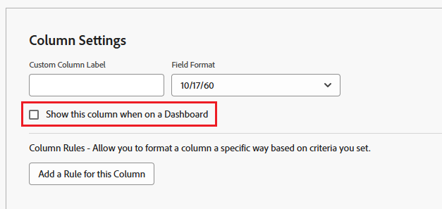

# Entender como os relatórios são exibidos em um painel

<!-- Audited: 1/2025 -->

É possível gerenciar como os relatórios adicionados aos painéis são exibidos nos painéis.

Para obter informações sobre como editar o layout de relatórios em um painel, consulte [Criar um painel](../../../reports-and-dashboards/dashboards/creating-and-managing-dashboards/create-dashboard.md).

Você pode selecionar quais colunas de relatório devem ser exibidas em um painel ao criar ou editar um relatório clicando em [!UICONTROL **Opções Avançadas**] em [!UICONTROL **Configurações de Coluna**]. Se quiser mostrar todas as colunas do relatório em um painel, certifique-se de especificar isso para cada coluna do relatório.

Para obter mais informações sobre como selecionar quais colunas de um relatório devem ser exibidas em um painel, consulte [Criar um relatório personalizado](../../../reports-and-dashboards/reports/creating-and-managing-reports/create-custom-report.md).

## Mostrar todas as colunas do relatório em um painel

Quando o relatório é selecionado para uma área do painel que ocupa toda a largura do painel, então, por padrão, todas as colunas do relatório são exibidas no painel.\

## Mostrar apenas a primeira coluna do relatório em um painel

Quando o relatório é selecionado para uma área do painel que ocupa menos do que a largura total do painel, então, por padrão, somente a primeira coluna do relatório é exibida no painel.\

