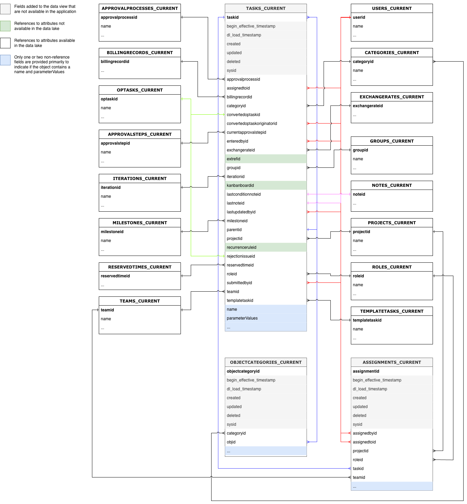
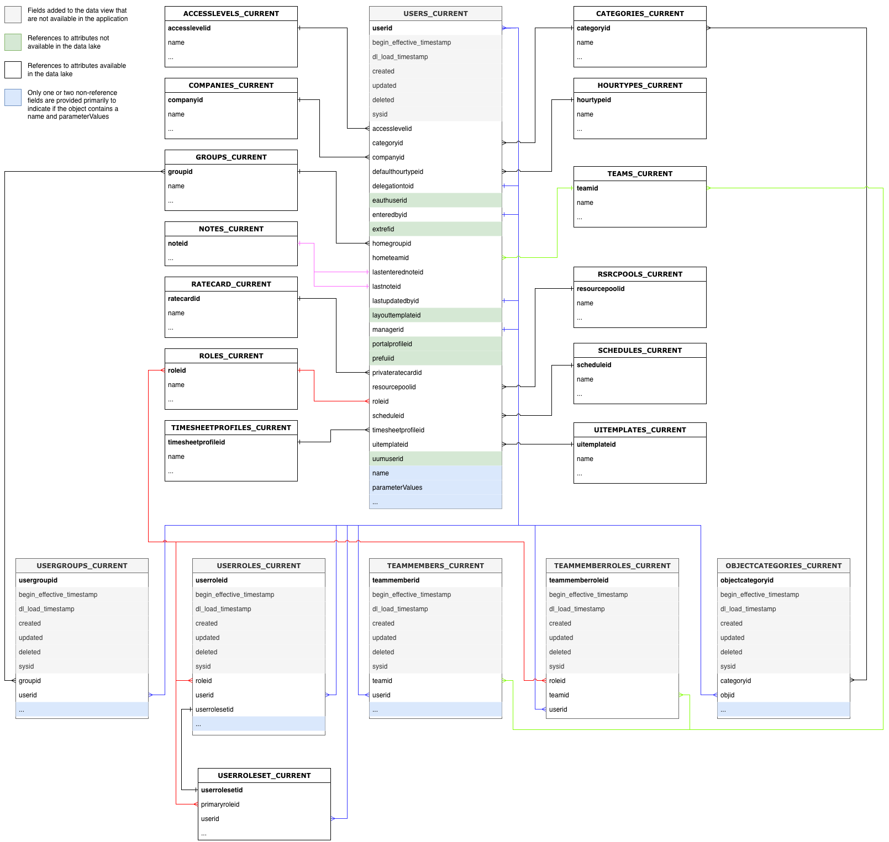

# Dicionário de dados da conexão de dados do Workfront

Esta página contém informações sobre a estrutura e o conteúdo dos dados no Workfront Data Connect.

>[!NOTE]
>
>Os dados no Data Connect são atualizados a cada 4 horas, portanto, as alterações recentes podem não ser refletidas imediatamente.

## Exibir tipos

Há vários tipos de exibição que você pode usar no Data Connect para exibir seus dados do Workfront de uma maneira que forneça mais insight.

* **Modo de exibição atual**

  A visualização Atual reflete os dados de forma semelhante a como eles existem no Workfront, em cada objeto e em seu estado atual. No entanto, ela pode ser navegada com latência muito mais baixa do que no Workfront.

* **Modo de exibição de evento**

  A visualização Evento rastreia cada registro de alteração no Workfront: ou seja, sempre que um objeto muda de estado, um registro é criado para mostrar quando a alteração aconteceu, quem fez a alteração e o que foi alterado. Portanto, essa visualização é útil para comparações point-in-time. Essa exibição inclui apenas registros dos últimos três anos.

* **exibição do Histórico Diário**

  A visualização Daily History oferece uma versão abreviada da visualização Event, na medida em que mostra o estado de cada objeto diariamente em vez de quando cada evento individual ocorreu. Dessa forma, essa exibição é útil para a análise de tendências.

<!-- Custom view -->

## Diagramas de relacionamento de entidade

Os objetos no Workfront (e, portanto, no data lake da Data Connect) são definidos não apenas por seus valores individuais, mas por suas relações com outros objetos.

Os diagramas de relacionamento de entidade (ERDs) abaixo fornecem um mapeamento de alto nível de relacionamentos de objetos no Data Connect para objetos Workfront principais.

>[!IMPORTANT]
>
>Os diagramas são centralizados em objetos únicos e não representam um diagrama completo de relacionamento de entidade para todo o aplicativo do Workfront.  
>Esses diagramas destinam-se a fornecer exemplos de como as relações podem ser usadas para unir dados a objetos adjacentes.

### Exemplo de diagramas de relacionamento de entidade

+++ Expandir para exibir os diagramas de exemplo

>[!TIP]
>
>Para exibir um diagrama com mais detalhes, clique com o botão direito na imagem e selecione **Abrir imagem em nova guia**.

### Atribuições

### Documentos e aprovações de documentos

### Horas e planilhas de horas

### Problemas

### Projetos

### Tarefas

### Usuários

+++

## Tipos de data

Há vários objetos de data que fornecem informações sobre quando eventos específicos ocorrem.

* `DL_LOAD_TIMESTAMP`: Essa data é atualizada após a conclusão de uma atualização de dados bem-sucedida e inclui o carimbo de data e hora de quando o trabalho de atualização que forneceu a versão mais recente de um registro começou.
* `CALENDAR_DATE`: essa data está presente apenas na exibição do Histórico Diário. A exibição Histórico Diário fornece um registro de como os dados eram às 11h59 UTC para cada data especificada em `CALENDAR_DATE`.
* `BEGIN_EFFECTIVE_TIMESTAMP`: essa data está presente nas exibições Evento e Histórico Diário e representa o tempo em que um registro se torna o valor atual no aplicativo.
* `END_EFFECTIVE_TIMESTAMP`: essa data está presente nos modos de exibição Evento e Histórico Diário e registra exatamente quando um registro alterou _de_ o valor na linha atual para um valor em uma linha diferente. Para permitir entre consultas em `BEGIN_EFFECTIVE_TIMESTAMP` e `END_EFFECTIVE_TIMESTAMP`, esse valor nunca é nulo, mesmo que não haja um novo valor. Caso um registro ainda seja válido (o que significa que o valor não foi alterado), `END_EFFECTIVE_TIMESTAMP` terá um valor 2300-01-01.

## Tabela de terminologia e descrições do Workfront

A tabela a seguir correlaciona nomes de objetos no Workfront (bem como seus nomes na interface e na API) com seus nomes equivalentes no Data Connect e inclui campos de referência para cada objeto a outros objetos do Workfront.

>[!NOTE]
>
>Novos campos podem ser adicionados às visualizações de objetos sem aviso prévio para suportar as necessidades de dados em evolução do aplicativo Workfront. Atenção ao uso de consultas &quot;SELECT&quot; em que o destinatário de dados downstream não esteja preparado para lidar com colunas adicionais à medida que são adicionadas. 
>Se for necessário renomear ou remover uma coluna, informaremos com antecedência essas alterações.

### Nível de acesso

<table>
    <thead>
        <tr>
            <th>Nome da entidade Workfront</th>
            <th>Referências da interface</th>
            <th>Referência da API</th>
            <th>Rótulo da API</th>
            <th>Visualizações do Data Lake</th>
        </tr>
      </thead>
      <tbody>
        <tr>
            <td>Nível de acesso</td>
            <td>Nível de acesso</td>
            <td>ACSLVL</td>
            <td>Nível de acesso</td>
            <td>ACCESSLEVELS_CURRENT ACCESSLEVELS_DAILY_HISTORY ACCESSLEVELS_EVENT</td>
        </tr>
      </tbody>
</table>
<table>
    <thead>
        <tr>
            <th>Chave primária/estrangeira</th>
            <th>Tipo</th>
            <th>Tabela Relacionada</th>
            <th>Campo relacionado</th>
        </tr>
    </thead>
    <tbody>
        <tr>
             <td>ACCESSLEVELID</td>
             <td>PK</td>
             <td>-</td>
             <td>-</td>
        </tr>
        <tr>
             <td>APPGLOBALID</td>
             <td>-</td>
             <td colspan="2">Não é um relacionamento; usado para fins de aplicação interna</td>
        </tr>
        <tr>
             <td>LASTUPDATEDBYID</td>
             <td>FK</td>
             <td>USERS_CURRENT</td>
             <td>USERID</td>
        </tr>
        <tr>
             <td>LEGACYACCESSLEVELID</td>
             <td>-</td>
             <td colspan="2">Não é um relacionamento; usado para fins de aplicação interna</td>
        </tr>
        <tr>
             <td>OBJID</td>
             <td>FK</td>
             <td>Variável, com base em OBJCODE</td>
             <td>A chave/ID primária do objeto identificado no campo OBJCODE</td>
        </tr>
        <tr>
             <td>SYSID</td>
             <td>-</td>
             <td colspan="2">Não é um relacionamento; usado para fins de aplicação interna</td>
        </tr>
    </tbody>
</table>

### Regra de acesso

<table>
    <thead>
        <tr>
            <th>Nome da entidade Workfront</th>
            <th>Referências da interface</th>
            <th>Referência da API</th>
            <th>Rótulo da API</th>
            <th>Visualizações do Data Lake</th>
        </tr>
      </thead>
      <tbody>
        <tr>
            <td>Regra de acesso</td>
            <td>Compartilhar</td>
            <td>ACSRUL</td>
            <td>Compartilhar</td>
            <td>ACCESSRULES_CURRENT ACCESSRULES_DAILY_HISTORY ACCESSRULES_EVENT</td>
        </tr>
      </tbody>
</table>
<table>
    <thead>
        <tr>
            <th>Chave primária/estrangeira</th>
            <th>Tipo</th>
            <th>Tabela Relacionada</th>
            <th>Campo relacionado</th>
        </tr>
    </thead>
    <tbody>
        <tr>
             <td>ACCESSORID</td>
             <td>FK</td>
             <td>Variável, com base em ACCESSOROBJCODE</td>
             <td>A chave/ID primária do objeto identificado no campo ACCESSOROBJCODE</td>
        </tr>
        <tr>
             <td>ACCESSRULEID</td>
             <td>PK</td>
             <td>-</td>
             <td>-</td>
        </tr>
        <tr>
             <td>ANCESTORID</td>
             <td>PK</td>
             <td>Variável, com base em ANCESTOROBJCODE</td>
             <td>A chave/ID primária do objeto identificado no campo ANCESTOROBJCODE</td>
        </tr>
        <tr>
             <td>LASTUPDATEDBYID</td>
             <td>FK</td>
             <td>USERS_CURRENT</td>
             <td>USERID</td>
        </tr>
        <tr>
             <td>SECURITYOBJID</td>
             <td>FK</td>
             <td>Variável, com base em SECURITYOBJCODE</td>
             <td>A chave/ID primária do objeto identificado no campo SECURITYOBJCODE</td>
        </tr>
        <tr>
             <td>SYSID</td>
             <td>-</td>
             <td colspan="2">Não é um relacionamento; usado para fins de aplicação interna</td>
        </tr>
    </tbody>
</table>

### Caminho de aprovação

<table>
    <thead>
        <tr>
            <th>Nome da entidade Workfront</th>
            <th>Referências da interface</th>
            <th>Referência da API</th>
            <th>Rótulo da API</th>
            <th>Visualizações do Data Lake</th>
        </tr>
      </thead>
      <tbody>
        <tr>
            <td>Caminho de aprovação</td>
            <td>Caminho de aprovação</td>
            <td>ARVPTH</td>
            <td>Aprovação</td>
            <td>APPROVALPATHS_CURRENT APPROVALPATHS_DAILY_HISTORY APPROVALPATHS_EVENT</td>
        </tr>
      </tbody>
</table>
<table>
    <thead>
        <tr>
            <th>Chave primária/estrangeira</th>
            <th>Tipo</th>
            <th>Tabela Relacionada</th>
            <th>Campo relacionado</th>
        </tr>
    </thead>
    <tbody>
        <tr>
             <td>APPROVALPATHID</td>
             <td>PK</td>
             <td>-</td>
             <td>-</td>
        </tr>
        <tr>
             <td>APPROVALPROCESSID</td>
             <td>FK</td>
             <td>APPROVALPROCESSES_CURRENT</td>
             <td>APPROVALPROCESSID</td>
        </tr>
        <tr>
             <td>ENTEREDBY ID</td>
             <td>FK</td>
             <td>USERS_CURRENT</td>
             <td>USERID</td>
        </tr>
        <tr>
             <td>GLOBALPATHID</td>
             <td>-</td>
             <td colspan="2">Não é um relacionamento; usado para fins de aplicação interna</td>
        </tr>
        <tr>
             <td>LASTUPDATEDBYID</td>
             <td>FK</td>
             <td>USERS_CURRENT</td>
             <td>USERID</td>
        </tr>
        <tr>
             <td>SYSID</td>
             <td>-</td>
             <td colspan="2">Não é um relacionamento; usado para fins de aplicação interna</td>
        </tr>
    </tbody>
</table>

### Processo de aprovação

<table>
    <thead>
        <tr>
            <th>Nome da entidade Workfront</th>
            <th>Referências da interface</th>
            <th>Referência da API</th>
            <th>Rótulo da API</th>
            <th>Visualizações do Data Lake</th>
        </tr>
      </thead>
      <tbody>
        <tr>
            <td>Processo de aprovação</td>
            <td>Processo de aprovação</td>
            <td>ARVPRC</td>
            <td>Processo de aprovação</td>
            <td>APPROVALPROCESSES_CURRENT APPROVALPROCESSES_DAILY_HISTORY APPROVALPROCESSES_EVENT</td>
        </tr>
      </tbody>
</table>
<table>
    <thead>
        <tr>
            <th>Chave primária/estrangeira</th>
            <th>Tipo</th>
            <th>Tabela Relacionada</th>
            <th>Campo relacionado</th>
        </tr>
    </thead>
    <tbody>
        <tr>
             <td>APPROVALPROCESSID</td>
             <td>PK</td>
             <td>-</td>
             <td>-</td>
        </tr>
        <tr>
             <td>ENTEREDBY ID</td>
             <td>FK</td>
             <td>USERS_CURRENT</td>
             <td>USERID</td>
        </tr>
        <tr>
             <td>LASTUPDATEDBYID</td>
             <td>FK</td>
             <td>USERS_CURRENT</td>
             <td>USERID</td>
        </tr>
        <tr>
             <td>SYSID</td>
             <td>-</td>
             <td colspan="2">Não é um relacionamento; usado para fins de aplicação interna</td>
        </tr>
    </tbody>
</table>

### Etapa de aprovação

<table>
    <thead>
        <tr>
            <th>Nome da entidade Workfront</th>
            <th>Referências da interface</th>
            <th>Referência da API</th>
            <th>Rótulo da API</th>
            <th>Visualizações do Data Lake</th>
        </tr>
      </thead>
      <tbody>
        <tr>
            <td>Etapa de aprovação</td>
            <td>Etapa de aprovação</td>
            <td>ARVSTP</td>
            <td>Estágio de aprovação</td>
            <td>APPROVALSTEPS_CURRENT APPROVALSTEPS_DAILY_HISTORY APPROVALSTEPS_EVENT</td>
        </tr>
      </tbody>
</table>
<table>
    <thead>
        <tr>
            <th>Chave primária/estrangeira</th>
            <th>Tipo</th>
            <th>Tabela Relacionada</th>
            <th>Campo relacionado</th>
        </tr>
    </thead>
    <tbody>
        <tr>
             <td>APPROVALPATHID</td>
             <td>FK</td>
             <td>APPROVALPATHS_CURRENT</td>
             <td>APPROVALPATHID</td>
        </tr>
        <tr>
             <td>APPROVALSTEPID</td>
             <td>PK</td>
             <td>-</td>
             <td>-</td>
        </tr>
        <tr>
             <td>SYSID</td>
             <td>-</td>
             <td colspan="2">Não é um relacionamento; usado para fins de aplicação interna</td>
        </tr>
    </tbody>
</table>

### Status do aprovador

<table>
    <thead>
        <tr>
            <th>Nome da entidade Workfront</th>
            <th>Referências da interface</th>
            <th>Referência da API</th>
            <th>Rótulo da API</th>
            <th>Visualizações do Data Lake</th>
        </tr>
      </thead>
      <tbody>
        <tr>
            <td>Status do aprovador</td>
            <td>Status do aprovador</td>
            <td>ARVSTS</td>
            <td>Status do aprovador</td>
            <td>APPROVERSTATUSES_CURRENT APPROVERSTATUSES_DAILY_HISTORY APPROVERSTATUSES_EVENT</td>
        </tr>
      </tbody>
</table>
<table>
    <thead>
        <tr>
            <th>Chave primária/estrangeira</th>
            <th>Tipo</th>
            <th>Tabela Relacionada</th>
            <th>Campo relacionado</th>
        </tr>
    </thead>
    <tbody>
        <tr>
             <td>APPROVERSTATUSID</td>
             <td>PK</td>
             <td>-</td>
             <td>-</td>
        </tr>
        <tr>
             <td>APPROVABLEOBJID</td>
             <td>FK</td>
             <td>Variável, com base em APPROVABLEOBJCODE</td>
             <td>A chave primária/ID do objeto identificado no campo APPROVABLEOBJCODE</td>
        </tr>
        <tr>
             <td>APPROVALSTEPID</td>
             <td>FK</td>
             <td>APPROVALSTEPS_CURRENT</td>
             <td>APPROVALSTEPID</td>
        </tr>
        <tr>
             <td>APPROVEDBYID</td>
             <td>FK</td>
             <td>USERS_CURRENT</td>
             <td>USERID</td>
        </tr>
        <tr>
             <td>DELEGATEUSERID</td>
             <td>FK</td>
             <td>USERS_CURRENT</td>
             <td>USERID</td>
        </tr>
        <tr>
             <td>LASTUPDATEDBYID</td>
             <td>FK</td>
             <td>USERS_CURRENT</td>
             <td>USERID</td>
        </tr>
        <tr>
             <td>OPTASKID</td>
             <td>FK</td>
             <td>OPTASKS_CURRENT</td>
             <td>OPTASKID</td>
        </tr>
        <tr>
             <td>OVERRIDDENUSERID</td>
             <td>FK</td>
             <td>USERS_CURRENT</td>
             <td>USERID</td>
        </tr>
        <tr>
             <td>PROJECTID</td>
             <td>FK</td>
             <td>PROJETOS_ATUAIS</td>
             <td>PROJECTID</td>
        </tr>
        <tr>
             <td>STEPAPPROVERID</td>
             <td>FK</td>
             <td>USERS_CURRENT</td>
             <td>USERID</td>
        </tr>
        <tr>
             <td>SYSYSYID</td>
             <td>-</td>
             <td colspan="2">Não é um relacionamento; usado para fins de aplicação interna</td>
        </tr>
        <tr>
             <td>TASKID</td>
             <td>FK</td>
             <td>TAREFAS_ATUAIS</td>
             <td>TASKID</td>
        </tr>
        <tr>
             <td>WILDCARDUSERID</td>
             <td>FK</td>
             <td>USERS_CURRENT</td>
             <td>USERID</td>
        </tr>
    </tbody>
</table>

### Atribuição

<table>
    <thead>
        <tr>
            <th>Nome da entidade Workfront</th>
            <th>Referências da interface</th>
            <th>Referência da API</th>
            <th>Rótulo da API</th>
            <th>Visualizações do Data Lake</th>
        </tr>
      </thead>
      <tbody>
        <tr>
            <td>Atribuição</td>
            <td>Atribuição</td>
            <td>ASSGN</td>
            <td>Atribuição</td>
            <td>ASSIGNMENTS_CURRENT ASSIGNMENTS_DAILY_HISTORY ASSIGNMENTS_EVENT</td>
        </tr>
      </tbody>
</table>
<table>
    <thead>
        <tr>
            <th>Chave primária/estrangeira</th>
            <th>Tipo</th>
            <th>Tabela Relacionada</th>
            <th>Campo relacionado</th>
        </tr>
    </thead>
    <tbody>
        <tr>
             <td>ASSIGNEDBYID</td>
             <td>FK</td>
             <td>USERS_CURRENT</td>
             <td>USERID</td>
        </tr>
        <tr>
             <td>ASSIGNEDTOID</td>
             <td>FK</td>
             <td>USERS_CURRENT</td>
             <td>USERID</td>
        </tr>
        <tr>
             <td>ASSIGNMENTID</td>
             <td>PK</td>
             <td>-</td>
             <td>-</td>
        </tr>
        <tr>
             <td>CATEGORYID</td>
             <td>FK</td>
             <td>CATEGORIES_CURRENT</td>
             <td>CATEGORYID</td>
        </tr>
        <tr>
             <td>CLASSIFIERID</td>
             <td>FK</td>
             <td>CLASSIFIER_CURRENT</td>
             <td>CLASSIFIERID</td>
        </tr>
      <tr>
             <td>LASTUPDATEDBYID</td>
             <td>FK</td>
             <td>USERS_CURRENT</td>
             <td>USERID</td>
        </tr>
        <tr>
             <td>OPTASKID</td>
             <td>FK</td>
             <td>OPTASKS_CURRENT</td>
             <td>OPTASKID</td>
        </tr>
        <tr>
             <td>PRIVATERATECARDID</td>
             <td>FK</td>
             <td>RATECARD_CURRENT</td>
             <td>RATECARDID</td>
        </tr>
        <tr>
             <td>PROJECTID</td>
             <td>FK</td>
             <td>PROJETOS_ATUAIS</td>
             <td>PROJECTID</td>
        </tr>
        <tr>
             <td>ROLEID</td>
             <td>FK</td>
             <td>FUNÇÕES_ATUAIS</td>
             <td>ROLEID</td>
        </tr>
        <tr>
             <td>TASKID</td>
             <td>FK</td>
             <td>TAREFAS_ATUAIS</td>
             <td>TASKID</td>
        </tr>
        <tr>
             <td>TEAMID</td>
             <td>FK</td>
             <td>TEAMS_CURRENT</td>
             <td>TEAMID</td>
        </tr>
    </tbody>
</table>

### Aguardando aprovações

<table>
    <thead>
        <tr>
            <th>Nome da entidade Workfront</th>
            <th>Referências da interface</th>
            <th>Referência da API</th>
            <th>Rótulo da API</th>
            <th>Visualizações do Data Lake</th>
        </tr>
      </thead>
      <tbody>
        <tr>
            <td>Aguardando aprovações</td>
            <td>Aguardando aprovações</td>
            <td>AWAPVL</td>
            <td>Aguardando aprovações</td>
            <td>AWAITINGAPPROVALS_CURRENT AWAITINGAPPROVALS_DAILY_HISTORY AWAITINGAPPROVALS_EVENT</td>
        </tr>
      </tbody>
</table>
<table>
    <thead>
        <tr>
            <th>Chave primária/estrangeira</th>
            <th>Tipo</th>
            <th>Tabela Relacionada</th>
            <th>Campo relacionado</th>
        </tr>
    </thead>
    <tbody>
        <tr>
             <td>ACCESSREQUESTID</td>
             <td>-</td>
             <td colspan="2">Atualmente, a tabela de Solicitação de Acesso não é suportada</td>
        </tr>
        <tr>
             <td>APPROVABLEID</td>
             <td>FK</td>
             <td>-</td>
             <td colspan="2">Não é um relacionamento; usado para fins de aplicação interna</td>
        </tr>
        <tr>
             <td>APPROVERID</td>
             <td>FK</td>
             <td>USERS_CURRENT</td>
             <td>USERID</td>
        </tr>
        <tr>
             <td>AGUARDANDO APROVAÇÃO</td>
             <td>PK</td>
             <td>-</td>
             <td>-</td>
        </tr>
        <tr>
             <td>DOCUMENTID</td>
             <td>FK</td>
             <td>DOCUMENTS_CURRENT</td>
             <td>DOCUMENTID</td>
        </tr>
        <tr>
             <td>DOCUMENTVERSIONID</td>
             <td>FK</td>
             <td>DOCUMENTVERSIONS_CURRENT</td>
             <td>DOCUMENTVERSIONID</td>
        </tr>
        <tr>
             <td>OPTASKID</td>
             <td>FK</td>
             <td>OPTASKS_CURRENT</td>
             <td>OPTASKID</td>
        </tr>
        <tr>
             <td>PROJECTID</td>
             <td>FK</td>
             <td>PROJETOS_ATUAIS</td>
             <td>PROJECTID</td>
        </tr>
        <tr>
             <td>ROLEID</td>
             <td>FK</td>
             <td>FUNÇÕES_ATUAIS</td>
             <td>ROLEID</td>
        </tr>
        <tr>
             <td>SUBMITTEDBYID</td>
             <td>FK</td>
             <td>USERS_CURRENT</td>
             <td>USERID</td>
        </tr>
        <tr>
             <td>SYSID</td>
             <td>-</td>
             <td colspan="2">Não é um relacionamento; usado para fins de aplicação interna</td>
        </tr>
        <tr>
             <td>TASKID</td>
             <td>FK</td>
             <td>TAREFAS_ATUAIS</td>
             <td>TASKID</td>
        </tr>
        <tr>
             <td>TEAMID</td>
             <td>FK</td>
             <td>TEAMS_CURRENT</td>
             <td>TEAMID</td>
        </tr>
        <tr>
             <td>TIMESHEETID</td>
             <td>FK</td>
             <td>PLANILHA_DE_HORAS_ATUAL</td>
             <td>TIMESHEETID</td>
        </tr>
        <tr>
             <td>USERID</td>
             <td>FK</td>
             <td>USERS_CURRENT</td>
             <td>USERID</td>
        </tr>
    </tbody>
</table>

### Linha de base

<table>
    <thead>
        <tr>
            <th>Nome da entidade Workfront</th>
            <th>Referências da interface</th>
            <th>Referência da API</th>
            <th>Rótulo da API</th>
            <th>Visualizações do Data Lake</th>
        </tr>
      </thead>
      <tbody>
        <tr>
            <td>Linha de base</td>
            <td>Linha de base</td>
            <td>BLIN</td>
            <td>Linha de base</td>
            <td>LINHAS_BASE_CURRENT LINHAS_BASE_DAILY_HISTORY LINHAS_BASE_EVENT</td>
        </tr>
      </tbody>
</table>
<table>
    <thead>
        <tr>
            <th>Chave primária/estrangeira</th>
            <th>Tipo</th>
            <th>Tabela Relacionada</th>
            <th>Campo relacionado</th>
        </tr>
    </thead>
    <tbody>
        <tr>
             <td>BASELINEID</td>
             <td>PK</td>
             <td>-</td>
             <td>-</td>
        </tr>
        <tr>
             <td>EXCHANGERATEID</td>
             <td>FK</td>
             <td>EXCHANGERATES_CURRENT</td>
             <td>EXCHANGERATEID</td>
        </tr>
        <tr>
             <td>PROJECTID</td>
             <td>FK</td>
             <td>PROJETOS_ATUAIS</td>
             <td>PROJECTID</td>
        </tr>
        <tr>
             <td>SYSID</td>
             <td>-</td>
             <td colspan="2">Não é um relacionamento; usado para fins de aplicação interna</td>
        </tr>
    </tbody>
</table>

### Tarefa da Linha de Base

<table>
    <thead>
        <tr>
            <th>Nome da entidade Workfront</th>
            <th>Referências da interface</th>
            <th>Referência da API</th>
            <th>Rótulo da API</th>
            <th>Visualizações do Data Lake</th>
        </tr>
      </thead>
      <tbody>
        <tr>
            <td>Tarefa da Linha de Base</td>
            <td>Tarefa da Linha de Base</td>
            <td>BSTSK</td>
            <td>Tarefa da Linha de Base</td>
            <td>BASELINETASKS_CURRENT BASELINETASKS_DAILY_HISTORY BASELINETASKS_EVENT</td>
        </tr>
      </tbody>
</table>
<table>
    <thead>
        <tr>
            <th>Chave primária/estrangeira</th>
            <th>Tipo</th>
            <th>Tabela Relacionada</th>
            <th>Campo relacionado</th>
        </tr>
    </thead>
    <tbody>
        <tr>
             <td>BASELINEID</td>
             <td>FK</td>
             <td>LINHAS_DE_BASE_ATUAIS</td>
             <td>BASELINEID</td>
        </tr>
        <tr>
             <td>BASELINETASKID</td>
             <td>PK</td>
             <td>-</td>
             <td>-</td>
        </tr>
        <tr>
             <td>EXCHANGERATEID</td>
             <td>FK</td>
             <td>EXCHANGERATES_CURRENT</td>
             <td>EXCHANGERATEID</td>
        </tr>
        <tr>
             <td>PROJECTID</td>
             <td>FK</td>
             <td>PROJETOS_ATUAIS</td>
             <td>PROJECTID</td>
        </tr>
        <tr>
             <td>SYSID</td>
             <td>-</td>
             <td colspan="2">Não é um relacionamento; usado para fins de aplicação interna</td>
        </tr>
        <tr>
             <td>TASKID</td>
             <td>FK</td>
             <td>TAREFAS_ATUAIS</td>
             <td>TASKID</td>
        </tr>
    </tbody>
</table>

### Taxa de faturamento

<table>
    <thead>
        <tr>
            <th>Nome da entidade Workfront</th>
            <th>Referências da interface</th>
            <th>Referência da API</th>
            <th>Rótulo da API</th>
            <th>Visualizações do Data Lake</th>
        </tr>
      </thead>
      <tbody>
        <tr>
            <td>Taxa de faturamento</td>
            <td>Taxa ou Taxa de Sobreposição</td>
            <td>TAXA</td>
            <td>Taxa de faturamento</td>
            <td>RATES_CURRENT RATES_DAILY_HISTORY RATES_EVENT</td>
        </tr>
      </tbody>
</table>
<table>
    <thead>
        <tr>
            <th>Chave primária/estrangeira</th>
            <th>Tipo</th>
            <th>Tabela Relacionada</th>
            <th>Campo relacionado</th>
        </tr>
    </thead>
    <tbody>
        <tr>
             <td>ASSIGNMENTID</td>
             <td>FK</td>
             <td>ATRIBUIÇÕES_ATUAIS</td>
             <td>ASSIGNMENTID</td>
        </tr>
        <tr>
             <td>CLASSIFIERID</td>
             <td>FK</td>
             <td>CLASSIFIER_CURRENT</td>
             <td>CLASSIFIERID</td>
        </tr>
        <tr>
             <td>EXCHANGERATEID</td>
             <td>FK</td>
             <td>EXCHANGERATES_CURRENT</td>
             <td>EXCHANGERATEID</td>
        </tr>
        <tr>
             <td>NLBRCATEGORYID</td>
             <td>FK</td>
             <td>NLBRCATEGORIES_CURRENT</td>
             <td>NLBRCATEGORYID</td>
        </tr>
        <tr>
             <td>NONLABORRESOURCEID</td>
             <td>FK</td>
             <td>NONLABORRESOURCES_CURRENT</td>
             <td>NONLABORRESOURCEID</td>
        </tr>
        <tr>
             <td>OBJID</td>
             <td>FK</td>
             <td>Variável, com base em OBJCODE</td>
             <td>A chave/ID primária do objeto identificado no campo OBJCODE</td>
        </tr>
        <tr>
             <td>PROJECTID</td>
             <td>FK</td>
             <td>PROJETOS_ATUAIS</td>
             <td>PROJECTID</td>
        </tr>
        <tr>
             <td>RATECARDID</td>
             <td>FK</td>
             <td>RATECARD_CURRENT</td>
             <td>RATECARDID</td>
        </tr>
        <tr>
             <td>RATEID</td>
             <td>PK</td>
             <td>-</td>
             <td>-</td>
        </tr>
        <tr>
             <td>ROLEID</td>
             <td>FK</td>
             <td>FUNÇÕES_ATUAIS</td>
             <td>ROLEID</td>
        </tr>
        <tr>
             <td>SOURCERATECARDID</td>
             <td>FK</td>
             <td>RATECARD_CURRENT</td>
             <td>RATECARDID</td>
        </tr>
        <tr>
             <td>SYSID</td>
             <td>-</td>
             <td colspan="2">Não é um relacionamento; usado para fins de aplicação interna</td>
        </tr>
        <tr>
             <td>TEMPLATEID</td>
             <td>FK</td>
             <td>TEMPLATES_CURRENT</td>
             <td>TEMPLATEID</td>
        </tr>
        <tr>
             <td>USERID</td>
             <td>FK</td>
             <td>USERS_CURRENT</td>
             <td>USERID</td>
        </tr>
    </tbody>
</table>

### Registro de cobrança

<table>
    <thead>
        <tr>
            <th>Nome da entidade Workfront</th>
            <th>Referências da interface</th>
            <th>Referência da API</th>
            <th>Rótulo da API</th>
            <th>Visualizações do Data Lake</th>
        </tr>
      </thead>
      <tbody>
        <tr>
            <td>Registro de cobrança</td>
            <td>Registro de cobrança</td>
            <td>FATURA</td>
            <td>Registro de cobrança</td>
            <td>BILLINGRECORDS_CURRENT BILLINGRECORDS_DAILY_HISTORY BILLINGRECORDS_EVENT</td>
        </tr>
      </tbody>
</table>
<table>
    <thead>
        <tr>
            <th>Chave primária/estrangeira</th>
            <th>Tipo</th>
            <th>Tabela Relacionada</th>
            <th>Campo relacionado</th>
        </tr>
    </thead>
    <tbody>
        <tr>
             <td>BILLINGRECORDID</td>
             <td>PK</td>
             <td>-</td>
             <td>-</td>
        </tr>
        <tr>
             <td>CATEGORYID</td>
             <td>FK</td>
             <td>CATEGORIES_CURRENT</td>
             <td>CATEGORYID</td>
        </tr>
        <tr>
             <td>EXCHANGERATEID</td>
             <td>FK</td>
             <td>EXCHANGERATES_CURRENT</td>
             <td>EXCHANGERATEID</td>
        </tr>
        <tr>
             <td>INVOICEID</td>
             <td>-</td>
             <td colspan="2">Atualmente, a tabela de faturas não tem suporte</td>
        </tr>
        <tr>
             <td>LASTUPDATEDBYID</td>
             <td>FK</td>
             <td>USERS_CURRENT</td>
             <td>USERID</td>
        </tr>
        <tr>
             <td>PROJECTID</td>
             <td>FK</td>
             <td>PROJETOS_ATUAIS</td>
             <td>PROJECTID</td>
        </tr>
        <tr>
             <td>SYSID</td>
             <td>-</td>
             <td colspan="2">Não é um relacionamento; usado para fins de aplicação interna</td>
        </tr>
    </tbody>
</table>

### Reserva

<table>
    <thead>
        <tr>
            <th>Nome da entidade Workfront</th>
            <th>Referências da interface</th>
            <th>Referência da API</th>
            <th>Rótulo da API</th>
            <th>Visualizações do Data Lake</th>
        </tr>
      </thead>
      <tbody>
        <tr>
            <td>Reserva</td>
            <td>Reserva</td>
            <td>RESERVA</td>
            <td>Reserva</td>
            <td>BOOKINGS_CURRENT BOOKINGS_DAILY_HISTORY BOOKINGS_EVENT</td>
        </tr>
      </tbody>
</table>
<table>
    <thead>
        <tr>
            <th>Chave primária/estrangeira</th>
            <th>Tipo</th>
            <th>Tabela Relacionada</th>
            <th>Campo relacionado</th>
        </tr>
    </thead>
    <tbody>
        <tr>
             <td>BOOKINGID</td>
             <td>PK</td>
             <td>-</td>
             <td>-</td>
        </tr>
        <tr>
             <td>ENTEREDBY ID</td>
             <td>FK</td>
             <td>USERS_CURRENT</td>
             <td>USERID</td>
        </tr>
        <tr>
             <td>LASTUPDATEDBYID</td>
             <td>FK</td>
             <td>USERS_CURRENT</td>
             <td>USERID</td>
        </tr>
        <tr>
             <td>NLBRCATEGORYID</td>
             <td>FK</td>
             <td>NLBRCATEGORIES_CURRENT</td>
             <td>NLBRCATEGORYID</td>
        </tr>
        <tr>
             <td>NONLABORRESOURCEID</td>
             <td>FK</td>
             <td>NONLABORRESOURCES_CURRENT</td>
             <td>NONLABORRESOURCEID</td>
        </tr>
        <tr>
             <td>OBJID</td>
             <td>FK</td>
             <td>Variável, com base em OBJCODE</td>
             <td>A chave/ID primária do objeto identificado no campo OBJCODE</td>
        </tr>
        <tr>
             <td>PROJECTID</td>
             <td>FK</td>
             <td>PROJETOS_ATUAIS</td>
             <td>PROJECTID</td>
        </tr>
        <tr>
             <td>SYSID</td>
             <td>-</td>
             <td colspan="2">Não é um relacionamento; usado para fins de aplicação interna</td>
        </tr>
        <tr>
             <td>TASKID</td>
             <td>FK</td>
             <td>TAREFAS_ATUAIS</td>
             <td>TASKID</td>
        </tr>
        <tr>
             <td>TEMPLATEID</td>
             <td>FK</td>
             <td>TEMPLATES_CURRENT</td>
             <td>TEMPLATEID</td>
        </tr>
        <tr>
             <td>TEMPLATETASKID</td>
             <td>FK</td>
             <td>TEMPLATETASKS_CURRENT</td>
             <td>TEMPLATETASKID</td>
        </tr>
        <tr>
             <td>TOPOBJID</td>
             <td>FK</td>
             <td>Variável, com base em TOPOBJCODE</td>
             <td>A chave/ID primária do objeto identificado no campo TOPOBJCODE</td>
        </tr>
    </tbody>
</table>

### Perfis comerciais

<table>
    <thead>
        <tr>
            <th>Nome da entidade Workfront</th>
            <th>Referências da interface</th>
            <th>Referência da API</th>
            <th>Rótulo da API</th>
            <th>Visualizações do Data Lake</th>
        </tr>
      </thead>
      <tbody>
        <tr>
            <td>Perfis comerciais</td>
            <td>Perfis comerciais</td>
            <td>BSNPRF</td>
            <td>Perfil da empresa</td>
            <td>BUSINESSPROFILE_CURRENT BUSINESSPROFILE_DAILY_HISTORY BUSINESSPROFILE_EVENT</td>
        </tr>
      </tbody>
</table>
<table>
    <thead>
        <tr>
            <th>Chave primária/estrangeira</th>
            <th>Tipo</th>
            <th>Tabela Relacionada</th>
            <th>Campo relacionado</th>
        </tr>
    </thead>
    <tbody>
        <tr>
             <td>ACCESSLEVELID</td>
             <td>FK</td>
             <td>ACCESSLEVELS_CURRENT</td>
             <td>ACCESSLEVELID</td>
        </tr>
        <tr>
             <td>BUSINESSPROFILEID</td>
             <td>PK</td>
             <td>-</td>
             <td>-</td>
        </tr>
        <tr>
             <td>ENTEREDBY ID</td>
             <td>FK</td>
             <td>USERS_CURRENT</td>
             <td>USERID</td>
        </tr>
        <tr>
             <td>GROUPID</td>
             <td>FK</td>
             <td>GROUPS_CURRENT</td>
             <td>GROUPID</td>
        </tr>
        <tr>
             <td>LASTUPDATEDBYID</td>
             <td>FK</td>
             <td>USERS_CURRENT</td>
             <td>USERID</td>
        </tr>
        <tr>
             <td>SYSID</td>
             <td>-</td>
             <td colspan="2">Não é um relacionamento; usado para fins de aplicação interna</td>
        </tr>
    </tbody>
</table>

### Regra de negócios

<table>
    <thead>
        <tr>
            <th>Nome da entidade Workfront</th>
            <th>Referências da interface</th>
            <th>Referência da API</th>
            <th>Rótulo da API</th>
            <th>Visualizações do Data Lake</th>
        </tr>
      </thead>
      <tbody>
        <tr>
            <td>Regra de negócios</td>
            <td>Regra de negócios</td>
            <td>BSNRUL</td>
            <td>Regra de negócios</td>
            <td>BUSINESSRULE_CURRENT BUSINESSRULE_DAILY_HISTORY BUSINESSRULE_EVENT</td>
        </tr>
      </tbody>
</table>
<table>
    <thead>
        <tr>
            <th>Chave primária/estrangeira</th>
            <th>Tipo</th>
            <th>Tabela Relacionada</th>
            <th>Campo relacionado</th>
        </tr>
    </thead>
    <tbody>
        <tr>
             <td>BUSINESSRULEID</td>
             <td>PK</td>
             <td>-</td>
             <td>-</td>
        </tr>
        <tr>
             <td>ENTEREDBY ID</td>
             <td>FK</td>
             <td>USERS_CURRENT</td>
             <td>USERID</td>
        </tr>
        <tr>
             <td>LASTUPDATEDBYID</td>
             <td>FK</td>
             <td>USERS_CURRENT</td>
             <td>USERID</td>
        </tr>
        <tr>
             <td>SYSID</td>
             <td>-</td>
             <td colspan="2">Não é um relacionamento; usado para fins de aplicação interna</td>
        </tr>
    </tbody>
</table>

### Categoria

<table>
    <thead>
        <tr>
            <th>Nome da entidade Workfront</th>
            <th>Referências da interface</th>
            <th>Referência da API</th>
            <th>Rótulo da API</th>
            <th>Visualizações do Data Lake</th>
        </tr>
      </thead>
      <tbody>
        <tr>
            <td>Categoria</td>
            <td>Formulário personalizado</td>
            <td>CTGY</td>
            <td>Categoria</td>
            <td>CATEGORIES_CURRENT CATEGORIES_DAILY_HISTORY CATEGORIES_EVENT</td>
        </tr>
      </tbody>
</table>
<table>
    <thead>
        <tr>
            <th>Chave primária/estrangeira</th>
            <th>Tipo</th>
            <th>Tabela Relacionada</th>
            <th>Campo relacionado</th>
        </tr>
    </thead>
    <tbody>
        <tr>
             <td>CATEGORYID</td>
             <td>PK</td>
             <td>-</td>
             <td>-</td>
        </tr>
        <tr>
             <td>ENTEREDBY ID</td>
             <td>FK</td>
             <td>USERS_CURRENT</td>
             <td>USERID</td>
        </tr>
        <tr>
             <td>GROUPID</td>
             <td>FK</td>
             <td>GROUPS_CURRENT</td>
             <td>GROUPID</td>
        </tr>
        <tr>
             <td>LASTUPDATEDBYID</td>
             <td>FK</td>
             <td>USERS_CURRENT</td>
             <td>USERID</td>
        </tr>
        <tr>
             <td>SYSID</td>
             <td>-</td>
             <td colspan="2">Não é um relacionamento; usado para fins de aplicação interna</td>
        </tr>
    </tbody>
</table>

### Parâmetro da Categoria

<table>
    <thead>
        <tr>
            <th>Nome da entidade Workfront</th>
            <th>Referências da interface</th>
            <th>Referência da API</th>
            <th>Rótulo da API</th>
            <th>Visualizações do Data Lake</th>
        </tr>
      </thead>
      <tbody>
        <tr>
            <td>Parâmetro da Categoria</td>
            <td>Campos de formulário personalizado</td>
            <td>CTGYPA</td>
            <td>Parâmetro da Categoria</td>
            <td>CATEGORIESPARAMETERS_CURRENT CATEGORIESPARAMETERS_DAILY_HISTORY CATEGORIESPARAMETERS_EVENT</td>
        </tr>
      </tbody>
</table>
<table>
    <thead>
        <tr>
            <th>Chave primária/estrangeira</th>
            <th>Tipo</th>
            <th>Tabela Relacionada</th>
            <th>Campo relacionado</th>
        </tr>
    </thead>
    <tbody>
        <tr>
             <td>CATEGORIESPARAMETERID</td>
             <td>PK</td>
             <td>-</td>
             <td>-</td>
        </tr>
        <tr>
             <td>CATEGORYID</td>
             <td>FK</td>
             <td>CATEGORIES_CURRENT</td>
             <td>CATEGORYID</td>
        </tr>
        <tr>
             <td>PARAMETERGROUPID</td>
             <td>FK</td>
             <td>PARAMETERGROUPS_CURRENT</td>
             <td>PARAMETERGROUPID</td>
        </tr>
        <tr>
             <td>PARAMETERID</td>
             <td>FK</td>
             <td>PARAMETERS_CURRENT</td>
             <td>PARAMETERID</td>
        </tr>
        <tr>
             <td>SYSID</td>
             <td>-</td>
             <td colspan="2">Não é um relacionamento; usado para fins de aplicação interna</td>
        </tr>
    </tbody>
</table>

### Classificador

<table>
    <thead>
        <tr>
            <th>Nome da entidade Workfront</th>
            <th>Referências da interface</th>
            <th>Referência da API</th>
            <th>Rótulo da API</th>
            <th>Visualizações do Data Lake</th>
        </tr>
      </thead>
      <tbody>
        <tr>
            <td>Classificador</td>
            <td>Localização</td>
            <td>CLSF</td>
            <td>Localização</td>
            <td>CLASSIFIER_CURRENT CLASSIFIER_DAILY_HISTORY CLASSIFIER_EVENT</td>
        </tr>
      </tbody>
</table>
<table>
    <thead>
        <tr>
            <th>Chave primária/estrangeira</th>
            <th>Tipo</th>
            <th>Tabela Relacionada</th>
            <th>Campo relacionado</th>
        </tr>
    </thead>
    <tbody>
        <tr>
             <td>CLASSIFIERID</td>
             <td>PK</td>
             <td>-</td>
             <td>-</td>
        </tr>
        <tr>
             <td>ENTEREDBY ID</td>
             <td>FK</td>
             <td>USERS_CURRENT</td>
             <td>USERID</td>
        </tr>
        <tr>
             <td>LASTUPDATEDBYID</td>
             <td>FK</td>
             <td>USERS_CURRENT</td>
             <td>USERID</td>
        </tr>
        <tr>
             <td>PARENTID</td>
             <td>FK</td>
             <td>CLASSIFIER_CURRENT</td>
             <td>CLASSIFIERID</td>
        </tr>
        <tr>
             <td>SYSID</td>
             <td>-</td>
             <td colspan="2">Não é um relacionamento; usado para fins de aplicação interna</td>
        </tr>
    </tbody>
</table>

### Empresa

<table>
    <thead>
        <tr>
            <th>Nome da entidade Workfront</th>
            <th>Referências da interface</th>
            <th>Referência da API</th>
            <th>Rótulo da API</th>
            <th>Visualizações do Data Lake</th>
        </tr>
      </thead>
      <tbody>
        <tr>
            <td>Empresa</td>
            <td>Empresa</td>
            <td>CMPY</td>
            <td>Empresa</td>
            <td>COMPANIES_CURRENT COMPANIES_DAILY_HISTORY COMPANHIAS_EVENT</td>
        </tr>
      </tbody>
</table>
<table>
    <thead>
        <tr>
            <th>Chave primária/estrangeira</th>
            <th>Tipo</th>
            <th>Tabela Relacionada</th>
            <th>Campo relacionado</th>
        </tr>
    </thead>
    <tbody>
        <tr>
             <td>CATEGORYID</td>
             <td>FK</td>
             <td>CATEGORIES_CURRENT</td>
             <td>CATEGORYID</td>
        </tr>
        <tr>
             <td>COMPANYID</td>
             <td>PK</td>
             <td>-</td>
             <td>-</td>
        </tr>
        <tr>
             <td>ENTEREDBY ID</td>
             <td>FK</td>
             <td>USERS_CURRENT</td>
             <td>USERID</td>
        </tr>
        <tr>
             <td>GROUPID</td>
             <td>FK</td>
             <td>GROUPS_CURRENT</td>
             <td>GROUPID</td>
        </tr>
        <tr>
             <td>LASTUPDATEDBYID</td>
             <td>FK</td>
             <td>USERS_CURRENT</td>
             <td>USERID</td>
        </tr>
        <tr>
             <td>PRIVATERATECARDID</td>
             <td>FK</td>
             <td>RATECARD_CURRENT</td>
             <td>RATECARDID</td>
        </tr>
        <tr>
             <td>SYSID</td>
             <td>-</td>
             <td colspan="2">Não é um relacionamento; usado para fins de aplicação interna</td>
        </tr>
    </tbody>
</table>

### Trimestre personalizado

<table>
    <thead>
        <tr>
            <th>Nome da entidade Workfront</th>
            <th>Referências da interface</th>
            <th>Referência da API</th>
            <th>Rótulo da API</th>
            <th>Visualizações do Data Lake</th>
        </tr>
      </thead>
      <tbody>
        <tr>
            <td>Trimestre personalizado</td>
            <td>Trimestre personalizado</td>
            <td>CSTQRT</td>
            <td>Trimestre personalizado</td>
            <td>CUSTOMQUARTERS_CURRENT CUSTOMQUARTERS_DAILY_HISTORY CUSTOMQUARTERS_EVENT</td>
        </tr>
      </tbody>
</table>
<table>
    <thead>
        <tr>
            <th>Chave primária/estrangeira</th>
            <th>Tipo</th>
            <th>Tabela Relacionada</th>
            <th>Campo relacionado</th>
        </tr>
    </thead>
    <tbody>
        <tr>
             <td>CUSTOMQUARTERID</td>
             <td>PK</td>
             <td>-</td>
             <td>-</td>
        </tr>
        <tr>
             <td>SYSID</td>
             <td>-</td>
             <td colspan="2">Não é um relacionamento; usado para fins de aplicação interna</td>
        </tr>
    </tbody>
</table>

### Lista Discriminada Personalizada

<table>
    <thead>
        <tr>
            <th>Nome da entidade Workfront</th>
            <th>Referências da interface</th>
            <th>Referência da API</th>
            <th>Rótulo da API</th>
            <th>Visualizações do Data Lake</th>
        </tr>
      </thead>
      <tbody>
        <tr>
            <td>CustomEnum</td>
            <td>Condição, Prioridade, Severidade, Status</td>
            <td>CSTEM</td>
            <td>Lista Discriminada Personalizada</td>
            <td>CUSTOMENUMS_CURRENT CUSTOMENUMS_DAILY_HISTORY CUSTOMENUMS_EVENT</td>
        </tr>
      </tbody>
</table>
<table>
    <thead>
        <tr>
            <th>Chave primária/estrangeira</th>
            <th>Tipo</th>
            <th>Tabela Relacionada</th>
            <th>Campo relacionado</th>
        </tr>
    </thead>
    <tbody>
        <tr>
             <td>CUSTOMENUMID</td>
             <td>PK</td>
             <td>-</td>
             <td>-</td>
        </tr>
        <tr>
             <td>ENTEREDBY ID</td>
             <td>FK</td>
             <td>USERS_CURRENT</td>
             <td>USERID</td>
        </tr>
        <tr>
             <td>GROUPID</td>
             <td>FK</td>
             <td>GROUPS_CURRENT</td>
             <td>GROUPID</td>
        </tr>
        <tr>
             <td>LASTUPDATEDBYID</td>
             <td>FK</td>
             <td>USERS_CURRENT</td>
             <td>USERID</td>
        </tr>
        <tr>
             <td>SYSID</td>
             <td>-</td>
             <td colspan="2">Não é um relacionamento; usado para fins de aplicação interna</td>
        </tr>
    </tbody>
</table>

>[!NOTE]
>
>O tipo de registro é identificado por meio da propriedade `enumClass`. Estes são os tipos esperados: 
><ul><li>CONDITION_OPTASK</li>
>&gt;<li>CONDITION_PROJ</li>
>&gt;<li>CONDITION_TASK</li>
>&gt;<li>PRIORITY_OPTASK</li>
>&gt;<li>PRIORITY_PROJ</li>
>&gt;<li>PRIORITY_TASK</li>
>&gt;<li>SEVERITY_OPTASK</li>
>&gt;<li>STATUS_OPTASK</li>
>&gt;<li>STATUS_PROJ</li>
>&gt;<li>STATUS_TASK</li></ul>

### Documento

<table>
    <thead>
        <tr>
            <th>Nome da entidade Workfront</th>
            <th>Referências da interface</th>
            <th>Referência da API</th>
            <th>Rótulo da API</th>
            <th>Visualizações do Data Lake</th>
        </tr>
      </thead>
      <tbody>
        <tr>
            <td>Documento</td>
            <td>Documento</td>
            <td>DOCU</td>
            <td>Documento</td>
            <td>DOCUMENTS_CURRENT DOCUMENTS_DAILY_HISTORY DOCUMENTS_EVENT</td>
        </tr>
      </tbody>
</table>
<table>
    <thead>
        <tr>
            <th>Chave primária/estrangeira</th>
            <th>Tipo</th>
            <th>Tabela Relacionada</th>
            <th>Campo relacionado</th>
        </tr>
    </thead>
    <tbody>
        <tr>
             <td>CATEGORYID</td>
             <td>FK</td>
             <td>CATEGORIES_CURRENT</td>
             <td>CATEGORYID</td>
        </tr>
        <tr>
             <td>CHECKEDOUTBYID</td>
             <td>FK</td>
             <td>USERS_CURRENT</td>
             <td>USERID</td>
        </tr>
        <tr>
             <td>DOCUMENTID</td>
             <td>PK</td>
             <td>-</td>
             <td>-</td>
        </tr>
        <tr>
             <td>DOCUMENTREQUESTID</td>
             <td>-</td>
             <td colspan="2">Atualmente, não há suporte para a tabela de Solicitação de Documento</td>
        </tr>
        <tr>
             <td>EXCHANGERATEID</td>
             <td>FK</td>
             <td>EXCHANGERATES_CURRENT</td>
             <td>EXCHANGERATEID</td>
        </tr>
        <tr>
             <td>ITERATIONID</td>
             <td>FK</td>
             <td>ITERATIONS_CURRENT</td>
             <td>ITERATIONID</td>
        </tr>
        <tr>
             <td>LASTNOTEID</td>
             <td>FK</td>
             <td>NOTAS_ATUAIS</td>
             <td>NOTEID</td>
        </tr>
        <tr>
             <td>LASTUPDATEDBYID</td>
             <td>FK</td>
             <td>USERS_CURRENT</td>
             <td>USERID</td>
        </tr>
        <tr>
             <td>NOTEID</td>
             <td>FK</td>
             <td>NOTAS_ATUAIS</td>
             <td>NOTEID</td>
        </tr>
        <tr>
             <td>OBJID</td>
             <td>FK</td>
             <td>Variável, com base em OBJCODE</td>
             <td>A chave/ID primária do objeto identificado no campo OBJCODE</td>
        </tr>
        <tr>
             <td>OPTASKID</td>
             <td>FK</td>
             <td>OPTASKS_CURRENT</td>
             <td>OPTASKID</td>
        </tr>
        <tr>
             <td>OWNERID</td>
             <td>FK</td>
             <td>USERS_CURRENT</td>
             <td>USERID</td>
        </tr>
        <tr>
             <td>PORTFOLIOID</td>
             <td>FK</td>
             <td>PORTFOLIOS_CURRENT</td>
             <td>PORTFOLIOID</td>
        </tr>
        <tr>
             <td>PROGRAMID</td>
             <td>FK</td>
             <td>PROGRAMAS_ATUAIS</td>
             <td>PROGRAMID</td>
        </tr>
        <tr>
             <td>PROJECTID</td>
             <td>FK</td>
             <td>PROJETOS_ATUAIS</td>
             <td>PROJECTID</td>
        </tr>
        <tr>
             <td>RELEASEVERSIONID</td>
             <td>-</td>
             <td colspan="2">No momento, não há suporte para a tabela Versão de lançamento</td>
        </tr>
        <tr>
             <td>SYSID</td>
             <td>-</td>
             <td colspan="2">Não é um relacionamento; usado para fins de aplicação interna</td>
        </tr>
        <tr>
             <td>TASKID</td>
             <td>FK</td>
             <td>TAREFAS_ATUAIS</td>
             <td>TASKID</td>
        </tr>
        <tr>
             <td>TEMPLATEID</td>
             <td>FK</td>
             <td>TEMPLATES_CURRENT</td>
             <td>TEMPLATEID</td>
        </tr>
        <tr>
             <td>TEMPLATETASKID</td>
             <td>FK</td>
             <td>TEMPLATETASKS_CURRENT</td>
             <td>TEMPLATETASKID</td>
        </tr>
        <tr>
             <td>TOPOBJID</td>
             <td>FK</td>
             <td>Variável, com base em TOPOBJCODE</td>
             <td>A chave/ID primária do objeto identificado no campo TOPOBJCODE</td>
        </tr>
        <tr>
             <td>USERID</td>
             <td>FK</td>
             <td>USERS_CURRENT</td>
             <td>USERID</td>
        </tr>
    </tbody>
</table>

### Aprovação de documento

<table>
    <thead>
        <tr>
            <th>Nome da entidade Workfront</th>
            <th>Referências da interface</th>
            <th>Referência da API</th>
            <th>Rótulo da API</th>
            <th>Visualizações do Data Lake</th>
        </tr>
      </thead>
      <tbody>
        <tr>
            <td>Aprovação de documento</td>
            <td>Aprovação de documento</td>
            <td>DOCAPL</td>
            <td>Aprovação de documento</td>
            <td>DOCAPPROVALS_CURRENT DOCAPPROVALS_DAILY_HISTORY DOCAPPROVALS_EVENT</td>
        </tr>
      </tbody>
</table>
<table>
    <thead>
        <tr>
            <th>Chave primária/estrangeira</th>
            <th>Tipo</th>
            <th>Tabela Relacionada</th>
            <th>Campo relacionado</th>
        </tr>
    </thead>
    <tbody>
        <tr>
             <td>APPROVERID</td>
             <td>FK</td>
             <td>USERS_CURRENT</td>
             <td>USERID</td>
        </tr>
        <tr>
             <td>DOCAPPROVALID</td>
             <td>PK</td>
             <td>-</td>
             <td>-</td>
        </tr>
        <tr>
             <td>DOCUMENTID</td>
             <td>FK</td>
             <td>DOCUMENTS_CURRENT</td>
             <td>DOCUMENTID</td>
        </tr>
        <tr>
             <td>NOTEID</td>
             <td>FK</td>
             <td>NOTAS_ATUAIS</td>
             <td>NOTEID</td>
        </tr>
        <tr>
             <td>REQUESTORID</td>
             <td>FK</td>
             <td>USERS_CURRENT</td>
             <td>USERID</td>
        </tr>
        <tr>
             <td>SYSID</td>
             <td>-</td>
             <td colspan="2">Não é um relacionamento; usado para fins de aplicação interna</td>
        </tr>
    </tbody>
</table>

### Aprovação de documento (NOVA)

Disponibilidade limitada para o cliente

<table>
    <thead>
        <tr>
            <th>Nome da entidade Workfront</th>
            <th>Referências da interface</th>
            <th>Referência da API</th>
            <th>Rótulo da API</th>
            <th>Visualizações do Data Lake</th>
        </tr>
      </thead>
      <tbody>
        <tr>
            <td>Aprovação de documento</td>
            <td>Aprovação</td>
            <td>N/D</td>
            <td>N/D</td>
            <td>APPROVAL_CURRENT APPROVAL_DAILY_HISTORY APPROVAL_EVENT</td>
        </tr>
      </tbody>
</table>
<table>
    <thead>
        <tr>
            <th>Chave primária/estrangeira</th>
            <th>Tipo</th>
            <th>Tabela Relacionada</th>
            <th>Campo relacionado</th>
        </tr>
    </thead>
    <tbody>
        <tr>
             <td class="key">APPROVALID</td>
             <td>PK</td>
             <td>-</td>
             <td>OBSERVAÇÃO: essa também é a ID do objeto DOCUMENTVERSION ao qual a aprovação está associada.</td>
        </tr>
        <tr>
             <td class="key">ASSETID</td>
             <td>FK</td>
             <td>Variável, com base em ASSETTYPE</td>
             <td>A chave primária/ID do objeto identificado no campo ASSETTYPE</td>
        </tr>
        <tr>
             <td class="key">CREATORID</td>
             <td>FK</td>
             <td>USERS_CURRENT</td>
             <td>USERID</td>
        </tr>
        <tr>
             <td class="key">EAUTHTENANTID</td>
             <td>-</td>
             <td colspan="2">Não é um relacionamento; usado para fins de aplicação interna</td>
        </tr>
        <tr>
             <td class="key">PRODUCTID</td>
             <td>-</td>
             <td colspan="2">Não é um relacionamento; usado para fins de aplicação interna</td>
        </tr>
        <tr>
             <td class="key">REALCREATORID</td>
             <td>FK</td>
             <td>USERS_CURRENT</td>
             <td>USERID</td>
        </tr>
    </tbody>
</table>

### Estágio de aprovação de documento (NOVO)

Disponibilidade limitada para o cliente

<table>
    <thead>
        <tr>
            <th>Nome da entidade Workfront</th>
            <th>Referências da interface</th>
            <th>Referência da API</th>
            <th>Rótulo da API</th>
            <th>Visualizações do Data Lake</th>
        </tr>
      </thead>
      <tbody>
        <tr>
            <td>Estágio de aprovação do documento</td>
            <td>Estágio de aprovação</td>
            <td>N/D</td>
            <td>N/D</td>
            <td>APPROVAL_STAGE_CURRENT APPROVAL_STAGE_DAILY_HISTORY APPROVAL_STAGE_EVENT</td>
        </tr>
      </tbody>
</table>
<table>
    <thead>
        <tr>
            <th>Chave primária/estrangeira</th>
            <th>Tipo</th>
            <th>Tabela Relacionada</th>
            <th>Campo relacionado</th>
        </tr>
    </thead>
    <tbody>
        <tr>
             <td class="key">APPROVALID</td>
             <td>FK</td>
             <td>APPROVAL_CURRENT</td>
             <td>APPROVALID</td>
        </tr>
        <tr>
             <td class="key">APPROVALSTAGEID</td>
             <td>PK</td>
             <td>-</td>
             <td>-</td>
        </tr>
        <tr>
             <td class="key">CREATORID</td>
             <td>FK</td>
             <td>USERS_CURRENT</td>
             <td>USERID</td>
        </tr>
        <tr>
             <td class="key">OBJID</td>
             <td class="type">FK</td>
             <td class="relatedtable">Variável, com base em OBJCODE</td>
             <td>A chave/ID primária do objeto identificado no campo OBJCODE</td>
        </tr>
    </tbody>
</table>

### Participantes do estágio de aprovação de documento (NOVO)

Disponibilidade limitada para o cliente

<table>
    <thead>
        <tr>
            <th>Nome da entidade Workfront</th>
            <th>Referências da interface</th>
            <th>Referência da API</th>
            <th>Rótulo da API</th>
            <th>Visualizações do Data Lake</th>
        </tr>
      </thead>
      <tbody>
        <tr>
            <td>Participante do estágio de aprovação do documento</td>
            <td>Decisões de aprovação</td>
            <td>N/D</td>
            <td>N/D</td>
            <td>APPROVAL_STAGE_PARTICIPANT_CURRENT APPROVAL_STAGE_PARTICIPANT_DAILY_HISTORY APPROVAL_STAGE_PARTICIPANT_EVENT</td>
        </tr>
      </tbody>
</table>
<table>
    <thead>
        <tr>
            <th>Chave primária/estrangeira</th>
            <th>Tipo</th>
            <th>Tabela Relacionada</th>
            <th>Campo relacionado</th>
        </tr>
    </thead>
    <tbody>
        <tr>
             <td class="key">APPROVALID</td>
             <td>FK</td>
             <td>APPROVAL_CURRENT</td>
             <td>APPROVALID</td>
        </tr>
        <tr>
             <td class="key">APPROVALSTAGEPARTICIPANTID/td&gt;
             <td>PK</td>
             <td>-</td>
             <td>-</td>
        </tr>
        <tr>
             <td class="key">ASSETID</td>
             <td>FK</td>
             <td>Variável, com base em ASSETTYPE</td>
             <td>A chave primária/ID do objeto identificado no campo ASSETTYPE</td>
        </tr>
        <tr>
             <td class="key">DECISIONUSERID</td>
             <td>FK</td>
             <td>USERS_CURRENT</td>
             <td>USERID</td>
        </tr>
        <tr>
             <td class="key">OBJID</td>
             <td class="type">FK</td>
             <td class="relatedtable">Variável, com base em OBJCODE</td>
             <td>A chave/ID primária do objeto identificado no campo OBJCODE</td>
        </tr>
        <tr>
             <td class="key">PARTICIPANTID</td>
             <td>FK</td>
             <td class="relatedtable">Variável, baseada em PARTICIPANTTYPE</td>
             <td>A chave primária/ID do objeto identificado no campo PARTICIPANTTYPE</td>
        </tr>
        <tr>
             <td class="key">REALREQUESTORID</td>
             <td>FK</td>
             <td>USERS_CURRENT</td>
             <td>USERID</td>
        </tr>
        <tr>
             <td class="key">REALUSERID</td>
             <td>FK</td>
             <td>USERS_CURRENT</td>
             <td>USERID</td>
        </tr>
        <tr>
             <td class="key">REQUESTORID</td>
             <td>FK</td>
             <td>USERS_CURRENT</td>
             <td>USERID</td>
        </tr>
        <tr>
             <td class="key">STAGEID</td>
             <td>FK</td>
             <td>APPROVAL_STAGE_CURRENT</td>
             <td>STAGEID</td>
        </tr>
    </tbody>
</table>

### Pasta de documento

<table>
    <thead>
        <tr>
            <th>Nome da entidade Workfront</th>
            <th>Referências da interface</th>
            <th>Referência da API</th>
            <th>Rótulo da API</th>
            <th>Visualizações do Data Lake</th>
        </tr>
      </thead>
      <tbody>
        <tr>
            <td>Pasta de documento</td>
            <td>Pasta de documento</td>
            <td>DOCFLD</td>
            <td>DocsFolders</td>
            <td>DOCFOLDERS_CURRENT DOCFOLDERS_DAILY_HISTORY DOCFOLDERS_EVENT</td>
        </tr>
      </tbody>
</table>
<table>
    <thead>
        <tr>
            <th>Chave primária/estrangeira</th>
            <th>Tipo</th>
            <th>Tabela Relacionada</th>
            <th>Campo relacionado</th>
        </tr>
    </thead>
    <tbody>
        <tr>
             <td>DOCFOLDERID</td>
             <td>PK</td>
             <td>-</td>
             <td>-</td>
        </tr>
        <tr>
             <td>ENTEREDBY ID</td>
             <td>FK</td>
             <td>USERS_CURRENT</td>
             <td>USERID</td>
        </tr>
        <tr>
             <td>ISSUEID</td>
             <td>FK</td>
             <td>OPTASKS_CURRENT</td>
             <td>OPTASKID</td>
        </tr>
        <tr>
             <td>ITERATIONID</td>
             <td>FK</td>
             <td>ITERATIONS_CURRENT</td>
             <td>ITERATIONID</td>
        </tr>
        <tr>
             <td>LINKEDFOLDERID</td>
             <td>FK</td>
             <td>LINKEDFOLDERS_CURRENT</td>
             <td>LINKEDFOLDERID</td>
        </tr>
        <tr>
             <td>PARENTID</td>
             <td>FK</td>
             <td>DOCFOLDERS_CURRENT</td>
             <td>DOCFOLDERID</td>
        </tr>
        <tr>
             <td>PORTFOLIOID</td>
             <td>FK</td>
             <td>PORTFOLIOS_CURRENT</td>
             <td>PORTFOLIOID</td>
        </tr>
        <tr>
             <td>PROGRAMID</td>
             <td>FK</td>
             <td>PROGRAMAS_ATUAIS</td>
             <td>PROGRAMID</td>
        </tr>
        <tr>
             <td>PROJECTID</td>
             <td>FK</td>
             <td>PROJETOS_ATUAIS</td>
             <td>PROJECTID</td>
        </tr>
        <tr>
             <td>SYSID</td>
             <td>-</td>
             <td colspan="2">Não é um relacionamento; usado para fins de aplicação interna</td>
        </tr>
        <tr>
             <td>TASKID</td>
             <td>FK</td>
             <td>TAREFAS_ATUAIS</td>
             <td>TASKID</td>
        </tr>
        <tr>
             <td>TEMPLATEID</td>
             <td>FK</td>
             <td>TEMPLATES_CURRENT</td>
             <td>TEMPLATEID</td>
        </tr>
        <tr>
             <td>TEMPLATETASKID</td>
             <td>FK</td>
             <td>TEMPLATETASKS_CURRENT</td>
             <td>TEMPLATETASKID</td>
        </tr>
        <tr>
             <td>USERID</td>
             <td>FK</td>
             <td>USERS_CURRENT</td>
             <td>USERID</td>
        </tr>
    </tbody>
</table>

### Metadados do provedor de documentos

<table>
    <thead>
        <tr>
            <th>Nome da entidade Workfront</th>
            <th>Referências da interface</th>
            <th>Referência da API</th>
            <th>Rótulo da API</th>
            <th>Visualizações do Data Lake</th>
        </tr>
      </thead>
      <tbody>
        <tr>
            <td>Metadados do provedor de documentos</td>
            <td>Metadados do provedor de documentos</td>
            <td>DOCMET</td>
            <td>MetadadosDoProvedorDeDocumentos</td>
            <td>DOCPROVIDERMETA_CURRENT DOCPROVIDERMETA_DAILY_HISTORY DOCPROVIDERMETA_EVENT</td>
        </tr>
      </tbody>
</table>
<table>
    <thead>
        <tr>
            <th>Chave primária/estrangeira</th>
            <th>Tipo</th>
            <th>Tabela Relacionada</th>
            <th>Campo relacionado</th>
        </tr>
    </thead>
    <tbody>
        <tr>
             <td>DOCPROVIDERMETAID</td>
             <td>PK</td>
             <td>-</td>
             <td>-</td>
        </tr>
        <tr>
             <td>SYSID</td>
             <td>-</td>
             <td colspan="2">Não é um relacionamento; usado para fins de aplicação interna</td>
        </tr>
    </tbody>
</table>

### Provedor do Documento

<table>
    <thead>
        <tr>
            <th>Nome da entidade Workfront</th>
            <th>Referências da interface</th>
            <th>Referência da API</th>
            <th>Rótulo da API</th>
            <th>Visualizações do Data Lake</th>
        </tr>
      </thead>
      <tbody>
        <tr>
            <td>Provedor do Documento</td>
            <td>Provedor do Documento</td>
            <td>DOCPRO</td>
            <td>Provedor do Documento</td>
            <td>DOCPROVIDERS_CURRENT DOCPROVIDERS_DAILY_HISTORY DOCPROVIDERS_EVENT</td>
        </tr>
      </tbody>
</table>
<table>
    <thead>
        <tr>
            <th>Chave primária/estrangeira</th>
            <th>Tipo</th>
            <th>Tabela Relacionada</th>
            <th>Campo relacionado</th>
        </tr>
    </thead>
    <tbody>
        <tr>
             <td>DOCPROVIDERCONFIGID</td>
             <td>FK</td>
             <td>DOCPROVIDERCONFIG_CURRENT</td>
             <td>DOCPROVIDERCONFIGID</td>
        </tr>
        <tr>
             <td>DOCPROVIDERID</td>
             <td>PK</td>
             <td>-</td>
             <td>-</td>
        </tr>
        <tr>
             <td>OWNERID</td>
             <td>FK</td>
             <td>USERS_CURRENT</td>
             <td>USERID</td>
        </tr>
        <tr>
             <td>SYSID</td>
             <td>-</td>
             <td colspan="2">Não é um relacionamento; usado para fins de aplicação interna</td>
        </tr>
    </tbody>
</table>

### Configuração do provedor de documentos

<table>
    <thead>
        <tr>
            <th>Nome da entidade Workfront</th>
            <th>Referências da interface</th>
            <th>Referência da API</th>
            <th>Rótulo da API</th>
            <th>Visualizações do Data Lake</th>
        </tr>
      </thead>
      <tbody>
        <tr>
            <td>Configuração do provedor de documentos</td>
            <td>Configuração do provedor de documentos</td>
            <td>DOCCFG</td>
            <td>DocumentProviderConfig</td>
            <td>DOCPROVIDERCONFIG_CURRENT DOCPROVIDERCONFIG_DAILY_HISTORY DOCPROVIDERCONFIG_EVENT</td>
        </tr>
      </tbody>
</table>
<table>
    <thead>
        <tr>
            <th>Chave primária/estrangeira</th>
            <th>Tipo</th>
            <th>Tabela Relacionada</th>
            <th>Campo relacionado</th>
        </tr>
    </thead>
    <tbody>
        <tr>
             <td>DOCPROVIDERCONFIGID</td>
             <td>PK</td>
             <td>-</td>
             <td>-</td>
        </tr>
        <tr>
             <td>SYSID</td>
             <td>-</td>
             <td colspan="2">Não é um relacionamento; usado para fins de aplicação interna</td>
        </tr>
    </tbody>
</table>

### Versão do documento

<table>
    <thead>
        <tr>
            <th>Nome da entidade Workfront</th>
            <th>Referências da interface</th>
            <th>Referência da API</th>
            <th>Rótulo da API</th>
            <th>Visualizações do Data Lake</th>
        </tr>
      </thead>
      <tbody>
        <tr>
            <td>Versão do documento</td>
            <td>Versão do documento</td>
            <td>DOCV</td>
            <td>Versão do documento</td>
            <td>DOCUMENTVERSIONS_CURRENT DOCUMENTVERSIONS_DAILY_HISTORY DOCUMENTVERSIONS_EVENT</td>
        </tr>
      </tbody>
</table>
<table>
    <thead>
        <tr>
            <th>Chave primária/estrangeira</th>
            <th>Tipo</th>
            <th>Tabela Relacionada</th>
            <th>Campo relacionado</th>
        </tr>
    </thead>
    <tbody>
        <tr>
             <td>DOCUMENTID</td>
             <td>FK</td>
             <td>DOCUMENTS_CURRENT</td>
             <td>DOCUMENTID</td>
        </tr>
        <tr>
             <td>DOCUMENTPROVIDERID</td>
             <td>FK</td>
             <td>DOCPROVIDERS_CURRENT</td>
             <td>DOCUMENTPROVIDERID</td>
        </tr>
        <tr>
             <td>DOCUMENTVERSIONID</td>
             <td>PK</td>
             <td>-</td>
             <td>-</td>
        </tr>
        <tr>
             <td>ENTEREDBY ID</td>
             <td>FK</td>
             <td>USERS_CURRENT</td>
             <td>USERID</td>
        </tr>
        <tr>
             <td>EXTERNALSTORAGEID</td>
             <td>-</td>
             <td colspan="2">A ID externa no sistema de armazenamento externo</td>
        </tr>
        <tr>
             <td>PROOFAPPROVALSTATUSID</td>
             <td>-</td>
             <td colspan="2">A tabela Status de aprovação de prova não é suportada no momento</td>
        </tr>
        <tr>
             <td>PROOFEDBYUSERID</td>
             <td>FK</td>
             <td>USERS_CURRENT</td>
             <td>USERID</td>
        </tr>
        <tr>
             <td>PROOFID</td>
             <td>-</td>
             <td colspan="2">Tabela de prova não suportada no momento</td>
        </tr>
        <tr>
             <td>PROOFOWNERID</td>
             <td>FK</td>
             <td>USERS_CURRENT</td>
             <td>USERID</td>
        </tr>
        <tr>
             <td>PROOFSTAGEID</td>
             <td>FK</td>
             <td>-</td>
             <td colspan="2">Atualmente, a tabela Estágio de prova não é compatível</td>
        </tr>
        <tr>
             <td>SYSID</td>
             <td>-</td>
             <td colspan="2">Não é um relacionamento; usado para fins de aplicação interna</td>
        </tr>
    </tbody>
</table>

### Taxa de câmbio

<table>
    <thead>
        <tr>
            <th>Nome da entidade Workfront</th>
            <th>Referências da interface</th>
            <th>Referência da API</th>
            <th>Rótulo da API</th>
            <th>Visualizações do Data Lake</th>
        </tr>
      </thead>
      <tbody>
        <tr>
            <td>Taxa de câmbio</td>
            <td>Taxa de câmbio</td>
            <td>EXTRAIR</td>
            <td>Taxa de câmbio</td>
            <td>EXCHANGERATES_CURRENT EXCHANGERATES_DAILY_HISTORY EXCHANGERATES_EVENT</td>
        </tr>
      </tbody>
</table>
<table>
    <thead>
        <tr>
            <th>Chave primária/estrangeira</th>
            <th>Tipo</th>
            <th>Tabela Relacionada</th>
            <th>Campo relacionado</th>
        </tr>
    </thead>
    <tbody>
        <tr>
             <td>EXCHANGERATEID</td>
             <td>PK</td>
             <td>-</td>
             <td>-</td>
        </tr>
        <tr>
             <td>PROJECTID</td>
             <td>FK</td>
             <td>PROJETOS_ATUAIS</td>
             <td>PROJECTID</td>
        </tr>
        <tr>
             <td>SYSID</td>
             <td>-</td>
             <td colspan="2">Não é um relacionamento; usado para fins de aplicação interna</td>
        </tr>
        <tr>
             <td>TEMPLATEID</td>
             <td>FK</td>
             <td>TEMPLATES_CURRENT</td>
             <td>TEMPLATEID</td>
        </tr>
    </tbody>
</table>

### Despesa

<table>
    <thead>
        <tr>
            <th>Nome da entidade Workfront</th>
            <th>Referências da interface</th>
            <th>Referência da API</th>
            <th>Rótulo da API</th>
            <th>Visualizações do Data Lake</th>
        </tr>
      </thead>
      <tbody>
        <tr>
            <td>Despesa</td>
            <td>Despesa</td>
            <td>EXPNS</td>
            <td>Despesa</td>
            <td>EXPENSES_CURRENT EXPENSES_DAILY_HISTORY EXPENSES_EVENT</td>
        </tr>
      </tbody>
</table>
<table>
    <thead>
        <tr>
            <th>Chave primária/estrangeira</th>
            <th>Tipo</th>
            <th>Tabela Relacionada</th>
            <th>Campo relacionado</th>
        </tr>
    </thead>
    <tbody>
        <tr>
             <td>BILLINGRECORDID</td>
             <td>FK</td>
             <td>BILLINGRECORDS_CURRENT</td>
             <td>BILLINGRECORDID</td>
        </tr>
        <tr>
             <td>CATEGORYID</td>
             <td>FK</td>
             <td>CATEGORIES_CURRENT</td>
             <td>CATEGORYID</td>
        </tr>
        <tr>
             <td>ENTEREDBY ID</td>
             <td>FK</td>
             <td>USERS_CURRENT</td>
             <td>USERID</td>
        </tr>
        <tr>
             <td>EXCHANGERATEID</td>
             <td>FK</td>
             <td>EXCHANGERATES_CURRENT</td>
             <td>EXCHANGERATEID</td>
        </tr>
        <tr>
             <td>EXPENSEID</td>
             <td>PK</td>
             <td>-</td>
             <td>-</td>
        </tr>
        <tr>
             <td>EXPENSETYPEID</td>
             <td>FK</td>
             <td>EXPENSETYPES_CURRENT</td>
             <td>EXPENSETYPEID</td>
        </tr>
        <tr>
             <td>LASTUPDATEDBYID</td>
             <td>FK</td>
             <td>USERS_CURRENT</td>
             <td>USERID</td>
        </tr>
        <tr>
             <td>OBJID</td>
             <td>FK</td>
             <td>Variável, com base em OBJCODE</td>
             <td>A chave/ID primária do objeto identificado no campo OBJCODE</td>
        </tr>
        <tr>
             <td>PROJECTID</td>
             <td>FK</td>
             <td>PROJETOS_ATUAIS</td>
             <td>PROJECTID</td>
        </tr>
        <tr>
             <td>SYSID</td>
             <td>-</td>
             <td colspan="2">Não é um relacionamento; usado para fins de aplicação interna</td>
        </tr>
        <tr>
             <td>TASKID</td>
             <td>FK</td>
             <td>TAREFAS_ATUAIS</td>
             <td>TASKID</td>
        </tr>
        <tr>
             <td>TEMPLATEID</td>
             <td>FK</td>
             <td>TEMPLATES_CURRENT</td>
             <td>TEMPLATEID</td>
        </tr>
        <tr>
             <td>TEMPLATETASKID</td>
             <td>FK</td>
             <td>TEMPLATETASKS_CURRENT</td>
             <td>TEMPLATETASKID</td>
        </tr>
        <tr>
             <td>TOPOBJID</td>
             <td>FK</td>
             <td>Variável, com base em TOPBJCODE</td>
             <td>A chave/ID primária do objeto identificado no campo TOPBJCODE</td>
        </tr>
    </tbody>
</table>

### Tipo de despesa

<table>
    <thead>
        <tr>
            <th>Nome da entidade Workfront</th>
            <th>Referências da interface</th>
            <th>Referência da API</th>
            <th>Rótulo da API</th>
            <th>Visualizações do Data Lake</th>
        </tr>
      </thead>
      <tbody>
        <tr>
            <td>Tipo de despesa</td>
            <td>Tipo de despesa</td>
            <td>EXPTYP</td>
            <td>Tipo de despesa</td>
            <td>EXPENSETYPES_CURRENT EXPENSETYPES_DAILY_HISTORY EXPENSETYPES_EVENT</td>
        </tr>
      </tbody>
</table>
<table>
    <thead>
        <tr>
            <th>Chave primária/estrangeira</th>
            <th>Tipo</th>
            <th>Tabela Relacionada</th>
            <th>Campo relacionado</th>
        </tr>
    </thead>
    <tbody>
        <tr>
             <td>APPGLOBALID</td>
             <td>-</td>
             <td colspan="2">Não é um relacionamento; usado para fins de aplicação interna</td>
        </tr>
        <tr>
             <td>EXPENSETYPEID</td>
             <td>PK</td>
             <td>-</td>
             <td>-</td>
        </tr>
        <tr>
             <td>OBJID</td>
             <td>FK</td>
             <td>Variável, com base em OBJCODE</td>
             <td>A chave/ID primária do objeto identificado no campo OBJCODE</td>
        </tr>
        <tr>
             <td>SYSID</td>
             <td>-</td>
             <td colspan="2">Não é um relacionamento; usado para fins de aplicação interna</td>
        </tr>
    </tbody>
</table>

### Grupo

<table>
    <thead>
        <tr>
            <th>Nome da entidade Workfront</th>
            <th>Referências da interface</th>
            <th>Referência da API</th>
            <th>Rótulo da API</th>
            <th>Visualizações do Data Lake</th>
        </tr>
      </thead>
      <tbody>
        <tr>
            <td>Grupo</td>
            <td>Grupo</td>
            <td>GRUPO</td>
            <td>Grupo</td>
            <td>GROUPS_CURRENT GROUPS_DAILY_HISTORY GROUPS_EVENT</td>
        </tr>
      </tbody>
</table>
<table>
    <thead>
        <tr>
            <th>Chave primária/estrangeira</th>
            <th>Tipo</th>
            <th>Tabela Relacionada</th>
            <th>Campo relacionado</th>
        </tr>
    </thead>
    <tbody>
        <tr>
             <td>BUSINESSLEADERID</td>
             <td>FK</td>
             <td>USERS_CURRENT</td>
             <td>USERID</td>
        </tr>
        <tr>
             <td>CATEGORYID</td>
             <td>FK</td>
             <td>CATEGORIES_CURRENT</td>
             <td>CATEGORYID</td>
        </tr>
        <tr>
             <td>ENTEREDBY ID</td>
             <td>FK</td>
             <td>USERS_CURRENT</td>
             <td>USERID</td>
        </tr>
        <tr>
             <td>GROUPID</td>
             <td>PK</td>
             <td>-</td>
             <td>-</td>
        </tr>
        <tr>
             <td>LAYOUTTEMPLATEID</td>
             <td>-</td>
             <td colspan="2">Não é um relacionamento; usado para fins de aplicação interna</td>
        </tr>
        <tr>
             <td>PARENTID</td>
             <td>FK</td>
             <td>GROUPS_CURRENT</td>
             <td>GROUPID</td>
        </tr>
        <tr>
             <td>ROOTID</td>
             <td>FK</td>
             <td>GROUPS_CURRENT</td>
             <td>GROUPID</td>
        </tr>
        <tr>
             <td>SYSID</td>
             <td>-</td>
             <td colspan="2">Não é um relacionamento; usado para fins de aplicação interna</td>
        </tr>
        <tr>
             <td>UITEMPLATEID</td>
             <td>FK</td>
             <td>UITEMPLATES_CURRENT</td>
             <td>UITEMPLATEID</td>
        </tr>
    </tbody>
</table>

### Hora

<table>
    <thead>
        <tr>
            <th>Nome da entidade Workfront</th>
            <th>Referências da interface</th>
            <th>Referência da API</th>
            <th>Rótulo da API</th>
            <th>Visualizações do Data Lake</th>
        </tr>
      </thead>
      <tbody>
        <tr>
            <td>Hora</td>
            <td>Hora</td>
            <td>HORA</td>
            <td>Hora</td>
            <td>HOURS_CURRENT HOURS_DAILY_HISTORY HOURS_EVENT</td>
        </tr>
      </tbody>
</table>
<table>
    <thead>
        <tr>
            <th>Chave primária/estrangeira</th>
            <th>Tipo</th>
            <th>Tabela Relacionada</th>
            <th>Campo relacionado</th>
        </tr>
    </thead>
    <tbody>
        <tr>
             <td>APPROVEDBYID</td>
             <td>FK</td>
             <td>USERS_CURRENT</td>
             <td>USERID</td>
        </tr>
        <tr>
             <td>BILLINGRECORDID</td>
             <td>FK</td>
             <td>BILLINGRECORDS_CURRENT</td>
             <td>BILLINGRECORDID</td>
        </tr>
        <tr>
             <td>CATEGORYID</td>
             <td>FK</td>
             <td>CATEGORIES_CURRENT</td>
             <td>CATEGORYID</td>
        </tr>
        <tr>
             <td>CLASSIFIERID</td>
             <td>FK</td>
             <td>CLASSIFIER_CURRENT</td>
             <td>CLASSIFIERID</td>
        </tr>
        <tr>
             <td>DUPID</td>
             <td>-</td>
             <td colspan="2">Não é um relacionamento; usado para fins de aplicação interna</td>
        </tr>
        <tr>
             <td>EXCHANGERATEID</td>
             <td>FK</td>
             <td>EXCHANGERATES_CURRENT</td>
             <td>EXCHANGERATEID</td>
        </tr>
        <tr>
             <td>EXTERNALTIMESHEETID</td>
             <td>-</td>
             <td colspan="2">Não é um relacionamento com a Workfront; usado para integração a sistemas externos
Auto</td>
        </tr>
        <tr>
             <td>HOURID</td>
             <td>PK</td>
             <td>-</td>
             <td>-</td>
        </tr>
        <tr>
             <td>HOURTYPEID</td>
             <td>FK</td>
             <td>HOURTYPES_CURRENT</td>
             <td>HOURTYPEID</td>
        </tr>
        <tr>
             <td>LASTUPDATEDBYID</td>
             <td>FK</td>
             <td>USERS_CURRENT</td>
             <td>USERID</td>
        </tr>
        <tr>
             <td>OPTASKID</td>
             <td>FK</td>
             <td>OPTASKS_CURRENT</td>
             <td>OPTASKID</td>
        </tr>
        <tr>
             <td>OWNERID</td>
             <td>FK</td>
             <td>USERS_CURRENT</td>
             <td>USERID</td>
        </tr>
        <tr>
             <td>PROJECTID</td>
             <td>FK</td>
             <td>PROJETOS_ATUAIS</td>
             <td>PROJECTID</td>
        </tr>
        <tr>
             <td>PROJECTOVERHEADID</td>
             <td>-</td>
             <td colspan="2">Não é um relacionamento; usado para fins de aplicação interna</td>
        </tr>
        <tr>
             <td>ROLEID</td>
             <td>FK</td>
             <td>FUNÇÕES_ATUAIS</td>
             <td>ROLEID</td>
        </tr>
        <tr>
             <td>SYSID</td>
             <td>-</td>
             <td colspan="2">Não é um relacionamento; usado para fins de aplicação interna</td>
        </tr>
        <tr>
             <td>TASKID</td>
             <td>FK</td>
             <td>TAREFAS_ATUAIS</td>
             <td>TASKID</td>
        </tr>
        <tr>
             <td>TIMESHEETID</td>
             <td>FK</td>
             <td>PLANILHA_DE_HORAS_ATUAL</td>
             <td>TIMESHEETID</td>
        </tr>
    </tbody>
</table>

### Tipo de hora

<table>
    <thead>
        <tr>
            <th>Nome da entidade Workfront</th>
            <th>Referências da interface</th>
            <th>Referência da API</th>
            <th>Rótulo da API</th>
            <th>Visualizações do Data Lake</th>
        </tr>
      </thead>
      <tbody>
        <tr>
            <td>Tipo de hora</td>
            <td>Tipo de hora</td>
            <td>HORA</td>
            <td>Tipo de hora</td>
            <td>HOURTYPES_CURRENT HOURTYPES_DAILY_HISTORY HOURTYPES_EVENT</td>
        </tr>
      </tbody>
</table>
<table>
    <thead>
        <tr>
            <th>Chave primária/estrangeira</th>
            <th>Tipo</th>
            <th>Tabela Relacionada</th>
            <th>Campo relacionado</th>
        </tr>
    </thead>
    <tbody>
        <tr>
             <td>APPGLOBALID</td>
             <td>-</td>
             <td colspan="2">Não é um relacionamento; usado para fins de aplicação interna</td>
        </tr>
        <tr>
             <td>HOURTYPEID</td>
             <td>PK</td>
             <td>-</td>
             <td>-</td>
        </tr>
        <tr>
             <td>OBJID</td>
             <td>FK</td>
             <td>Variável, com base em OBJCODE</td>
             <td>A chave/ID primária do objeto identificado no campo OBJCODE</td>
        </tr>
        <tr>
             <td>SYSID</td>
             <td>-</td>
             <td colspan="2">Não é um relacionamento; usado para fins de aplicação interna</td>
        </tr>
    </tbody>
</table>

### Iteração

<table>
    <thead>
        <tr>
            <th>Nome da entidade Workfront</th>
            <th>Referências da interface</th>
            <th>Referência da API</th>
            <th>Rótulo da API</th>
            <th>Visualizações do Data Lake</th>
        </tr>
      </thead>
      <tbody>
        <tr>
            <td>Iteração</td>
            <td>Iteração</td>
            <td>ITRN</td>
            <td>Iteração</td>
            <td>ITERATIONS_CURRENT ITERATIONS_DAILY_HISTORY ITERATIONS_EVENT</td>
        </tr>
      </tbody>
</table>
<table>
    <thead>
        <tr>
            <th>Chave primária/estrangeira</th>
            <th>Tipo</th>
            <th>Tabela Relacionada</th>
            <th>Campo relacionado</th>
        </tr>
    </thead>
    <tbody>
        <tr>
             <td>CATEGORYID</td>
             <td>FK</td>
             <td>CATEGORIES_CURRENT</td>
             <td>CATEGORYID</td>
        </tr>
        <tr>
             <td>ENTEREDBY ID</td>
             <td>FK</td>
             <td>USERS_CURRENT</td>
             <td>USERID</td>
        </tr>
        <tr>
             <td>ITERATIONID</td>
             <td>PK</td>
             <td>-</td>
             <td>-</td>
        </tr>
        <tr>
             <td>LASTUPDATEDBYID</td>
             <td>FK</td>
             <td>USERS_CURRENT</td>
             <td>USERID</td>
        </tr>
        <tr>
             <td>OWNERID</td>
             <td>FK</td>
             <td>USERS_CURRENT</td>
             <td>USERID</td>
        </tr>
        <tr>
             <td>SYSID</td>
             <td>-</td>
             <td colspan="2">Não é um relacionamento; usado para fins de aplicação interna</td>
        </tr>
        <tr>
             <td>TEAMID</td>
             <td>FK</td>
             <td>TEAMS_CURRENT</td>
             <td>TEAMID</td>
        </tr>
    </tbody>
</table>

### Lançamento documentado

<table>
    <thead>
        <tr>
            <th>Nome da entidade Workfront</th>
            <th>Referências da interface</th>
            <th>Referência da API</th>
            <th>Rótulo da API</th>
            <th>Visualizações do Data Lake</th>
        </tr>
      </thead>
      <tbody>
        <tr>
            <td>Lançamento documentado</td>
            <td>Lançamento documentado</td>
            <td>JRNLE</td>
            <td>Lançamento documentado</td>
            <td>JOURNALENTRIES_CURRENT JOURNALENTRIES_DAILY_HISTORY JOURNALENTRIES_EVENT</td>
        </tr>
      </tbody>
</table>
<table>
    <thead>
        <tr>
            <th>Chave primária/estrangeira</th>
            <th>Tipo</th>
            <th>Tabela Relacionada</th>
            <th>Campo relacionado</th>
        </tr>
    </thead>
    <tbody>
        <tr>
             <td>APPROVERSTATUSID</td>
             <td>FK</td>
             <td>APPROVERSTATUSES_CURRENT</td>
             <td>APPROVERSTATUSID</td>
        </tr>
        <tr>
             <td>ASSIGNMENTID</td>
             <td>FK</td>
             <td>ATRIBUIÇÕES_ATUAIS</td>
             <td>ASSIGNMENTID</td>
        </tr>
        <tr>
             <td>AUDITRECORDID</td>
             <td>-</td>
             <td colspan="2">A tabela de registro de auditoria não tem suporte no momento</td>
        </tr>
        <tr>
             <td>BASELINEID</td>
             <td>FK</td>
             <td>LINHAS_DE_BASE_ATUAIS</td>
             <td>BASELINEID</td>
        </tr>
        <tr>
             <td>BILLINGRECORDID</td>
             <td>FK</td>
             <td>BILLINGRECORDS_CURRENT</td>
             <td>BILLINGRECORDID</td>
        </tr>
        <tr>
             <td>COMPANYID</td>
             <td>FK</td>
             <td>COMPANIES_CURRENT</td>
             <td>COMPANYID</td>
        </tr>
        <tr>
             <td>DOCUMENTID</td>
             <td>FK</td>
             <td>DOCUMENTS_CURRENT</td>
             <td>DOCUMENTID</td>
        </tr>
        <tr>
             <td>DOCUMENTSHAREID</td>
             <td>-</td>
             <td colspan="2">A tabela de Compartilhamento de documentos não tem suporte no momento</td>
        </tr>
        <tr>
             <td>EDITEDBYID</td>
             <td>FK</td>
             <td>USERS_CURRENT</td>
             <td>USERID</td>
        </tr>
        <tr>
             <td>EXPENSEID</td>
             <td>FK</td>
             <td>EXPENSES_CURRENT</td>
             <td>EXPENSEID</td>
        </tr>
        <tr>
             <td>HOURID</td>
             <td>FK</td>
             <td>HOURS_CURRENT</td>
             <td>HOURID</td>
        </tr>
        <tr>
             <td>INITIATIVEID</td>
             <td>-</td>
             <td colspan="2">Tabela de iniciativas não suportada no momento</td>
        </tr>
        <tr>
             <td>JOURNALENTRIESID</td>
             <td>PK</td>
             <td>-</td>
             <td>-</td>
        </tr>
        <tr>
             <td>OBJID</td>
             <td>FK</td>
             <td>Variável, com base em OBJCODE</td>
             <td>A chave/ID primária do objeto identificado no campo OBJCODE</td>
        </tr>
        <tr>
             <td>OPTASKID</td>
             <td>FK</td>
             <td>OPTASKS_CURRENT</td>
             <td>OPTASKID</td>
        </tr>
        <tr>
             <td>PORTFOLIOID</td>
             <td>FK</td>
             <td>PORTFOLIOS_CURRENT</td>
             <td>PORTFOLIOID</td>
        </tr>
        <tr>
             <td>PROGRAMID</td>
             <td>FK</td>
             <td>PROGRAMAS_ATUAIS</td>
             <td>PROGRAMID</td>
        </tr>
        <tr>
             <td>PROJECTID</td>
             <td>FK</td>
             <td>PROJETOS_ATUAIS</td>
             <td>PROJECTID</td>
        </tr>
        <tr>
             <td>SUBOBJID</td>
             <td>FK</td>
             <td>Variável, com base em SUBOBJCODE</td>
             <td>A chave primária/ID do objeto identificado no campo SUBOBJCODE</td>
        </tr>
        <tr>
             <td>SUBSCRIBEID</td>
             <td>-</td>
             <td colspan="2">Não é um relacionamento; usado para fins de aplicação interna</td>
        </tr>
        <tr>
             <td>SYSID</td>
             <td>-</td>
             <td colspan="2">Não é um relacionamento; usado para fins de aplicação interna</td>
        </tr>
        <tr>
             <td>TASKID</td>
             <td>FK</td>
             <td>TAREFAS_ATUAIS</td>
             <td>TASKID</td>
        </tr>
        <tr>
             <td>TEMPLATEID</td>
             <td>FK</td>
             <td>TEMPLATES_CURRENT</td>
             <td>TEMPLATEID</td>
        </tr>
        <tr>
             <td>TIMESHEETID</td>
             <td>FK</td>
             <td>PLANILHA_DE_HORAS_ATUAL</td>
             <td>TIMESHEETID</td>
        </tr>
        <tr>
             <td>TOPOBJID</td>
             <td>FK</td>
             <td>Variável, com base em TOPOBJCODE</td>
             <td>A chave/ID primária do objeto identificado no campo TOPOBJCODE</td>
        </tr>
        <tr>
             <td>USERID</td>
             <td>FK</td>
             <td>USERS_CURRENT</td>
             <td>USERID</td>
        </tr>
    </tbody>
</table>

### Pasta vinculada

<table>
    <thead>
        <tr>
            <th>Nome da entidade Workfront</th>
            <th>Referências da interface</th>
            <th>Referência da API</th>
            <th>Rótulo da API</th>
            <th>Visualizações do Data Lake</th>
        </tr>
      </thead>
      <tbody>
        <tr>
            <td>Pasta vinculada</td>
            <td>Pasta vinculada</td>
            <td>LNKFDR</td>
            <td>LinkedFolder</td>
            <td>LINKEDFOLDERS_CURRENT LINKEDFOLDERS_DAILY_HISTORY LINKEDFOLDERS_EVENT</td>
        </tr>
      </tbody>
</table>
<table>
    <thead>
        <tr>
            <th>Chave primária/estrangeira</th>
            <th>Tipo</th>
            <th>Tabela Relacionada</th>
            <th>Campo relacionado</th>
        </tr>
    </thead>
    <tbody>
        <tr>
             <td>DOCUMENTPROVIDERID</td>
             <td>FK</td>
             <td>DOCPROVIDERS_CURRENT</td>
             <td>DOCUMENTPROVIDERID</td>
        </tr>
        <tr>
             <td>EXTERNALSTORAGEID</td>
             <td>-</td>
             <td colspan="2">A ID externa no sistema de armazenamento externo</td>
        </tr>
        <tr>
             <td>FOLDERID</td>
             <td>FK</td>
             <td>DOCFOLDERS_CURRENT</td>
             <td>FOLDERID</td>
        </tr>
        <tr>
             <td>LINKEDBYID</td>
             <td>FK</td>
             <td>USERS_CURRENT</td>
             <td>USERID</td>
        </tr>
        <tr>
             <td>LINKEDFOLDERID</td>
             <td>PK</td>
             <td>-</td>
             <td>-</td>
        </tr>
        <tr>
             <td>SYSID</td>
             <td>-</td>
             <td colspan="2">Não é um relacionamento; usado para fins de aplicação interna</td>
        </tr>
    </tbody>
</table>

### Marco

<table>
    <thead>
        <tr>
            <th>Nome da entidade Workfront</th>
            <th>Referências da interface</th>
            <th>Referência da API</th>
            <th>Rótulo da API</th>
            <th>Visualizações do Data Lake</th>
        </tr>
      </thead>
      <tbody>
        <tr>
            <td>Marco</td>
            <td>Marco</td>
            <td>MILHA</td>
            <td>Marco</td>
            <td>MARCOS_ATUAIS MARCOS_HISTÓRICO_DIÁRIO MARCOS_EVENTO</td>
        </tr>
      </tbody>
</table>
<table>
    <thead>
        <tr>
            <th>Chave primária/estrangeira</th>
            <th>Tipo</th>
            <th>Tabela Relacionada</th>
            <th>Campo relacionado</th>
        </tr>
    </thead>
    <tbody>
        <tr>
             <td>LASTUPDATEDBYID</td>
             <td>FK</td>
             <td>USERS_CURRENT</td>
             <td>USERID</td>
        </tr>
        <tr>
             <td>MILESTONE ID</td>
             <td>PK</td>
             <td>-</td>
             <td>-</td>
        </tr>
        <tr>
             <td>MILESTONEPATHID</td>
             <td>FK</td>
             <td>MILESTONEPATHS_CURRENT</td>
             <td>MILESTONEPATHID</td>
        </tr>
        <tr>
             <td>SYSID</td>
             <td>-</td>
             <td colspan="2">Não é um relacionamento; usado para fins de aplicação interna</td>
        </tr>
    </tbody>
</table>

### Caminho de marcos

<table>
    <thead>
        <tr>
            <th>Nome da entidade Workfront</th>
            <th>Referências da interface</th>
            <th>Referência da API</th>
            <th>Rótulo da API</th>
            <th>Visualizações do Data Lake</th>
        </tr>
      </thead>
      <tbody>
        <tr>
            <td>Caminho de marcos</td>
            <td>Caminho de marcos</td>
            <td>MPATH</td>
            <td>Caminho de marcos</td>
            <td>MILESTONEPATHS_CURRENT MILESTONEPATHS_DAILY_HISTORY MILESTONEPATHS_EVENT</td>
        </tr>
      </tbody>
</table>
<table>
    <thead>
        <tr>
            <th>Chave primária/estrangeira</th>
            <th>Tipo</th>
            <th>Tabela Relacionada</th>
            <th>Campo relacionado</th>
        </tr>
    </thead>
    <tbody>
        <tr>
             <td>ENTEREDBY ID</td>
             <td>FK</td>
             <td>USERS_CURRENT</td>
             <td>USERID</td>
        </tr>
        <tr>
             <td>LASTUPDATEDBYID</td>
             <td>FK</td>
             <td>USERS_CURRENT</td>
             <td>USERID</td>
        </tr>
        <tr>
             <td>MILESTONEPATHID</td>
             <td>PK</td>
             <td>-</td>
             <td>-</td>
        </tr>
        <tr>
             <td>SYSID</td>
             <td>-</td>
             <td colspan="2">Não é um relacionamento; usado para fins de aplicação interna</td>
        </tr>
    </tbody>
</table>

### Recurso não trabalhista

<table>
    <thead>
        <tr>
            <th>Nome da entidade Workfront</th>
            <th>Referências da interface</th>
            <th>Referência da API</th>
            <th>Rótulo da API</th>
            <th>Visualizações do Data Lake</th>
        </tr>
      </thead>
      <tbody>
        <tr>
            <td>Recurso não trabalhista</td>
            <td>Recurso não trabalhista</td>
            <td>NLBR</td>
            <td>Recurso não trabalhista</td>
            <td>NONLABORRESOURCES_CURRENT NONLABORRESOURCES_DAILY_HISTORY NONLABORRESOURCES_EVENT</td>
        </tr>
      </tbody>
</table>
<table>
    <thead>
        <tr>
            <th>Chave primária/estrangeira</th>
            <th>Tipo</th>
            <th>Tabela Relacionada</th>
            <th>Campo relacionado</th>
        </tr>
    </thead>
    <tbody>
        <tr>
             <td>CATEGORYID</td>
             <td>FK</td>
             <td>CATEGORIES_CURRENT</td>
             <td>CATEGORYID</td>
        </tr>
        <tr>
             <td>NONLABORRESOURCEID</td>
             <td>PK</td>
             <td>-</td>
             <td>-</td>
        </tr>
        <tr>
             <td>ENTEREDBY ID</td>
             <td>FK</td>
             <td>USERS_CURRENT</td>
             <td>USERID</td>
        </tr>
        <tr>
             <td>HOMEGROUPID</td>
             <td>FK</td>
             <td>GROUPS_CURRENT</td>
             <td>GROUPID</td>
        </tr>
        <tr>
             <td>LASTUPDATEDBYID</td>
             <td>FK</td>
             <td>USERS_CURRENT</td>
             <td>USERID</td>
        </tr>
        <tr>
             <td>NONLABORRESOURCECATEGORYID</td>
             <td>FK</td>
             <td>NLBRCATEGORIES_CURRENT</td>
             <td>NLBRCATEGORYID</td>
        </tr>
        <tr>
             <td>SYSID</td>
             <td>-</td>
             <td colspan="2">Não é um relacionamento; usado para fins de aplicação interna</td>
        </tr>
    </tbody>
</table>

### Categoria de recurso não trabalhista

<table>
    <thead>
        <tr>
            <th>Nome da entidade Workfront</th>
            <th>Referências da interface</th>
            <th>Referência da API</th>
            <th>Rótulo da API</th>
            <th>Visualizações do Data Lake</th>
        </tr>
      </thead>
      <tbody>
        <tr>
            <td>Categoria de recurso não trabalhista</td>
            <td>Categoria de recurso não trabalhista</td>
            <td>NLBRCY</td>
            <td>Categoria de recurso não trabalhista</td>
            <td>NLBRCATEGORIES_CURRENT NLBRCATEGORIES_DAILY_HISTORY NLBRCATEGORIES_EVENT</td>
        </tr>
      </tbody>
</table>
<table>
    <thead>
        <tr>
            <th>Chave primária/estrangeira</th>
            <th>Tipo</th>
            <th>Tabela Relacionada</th>
            <th>Campo relacionado</th>
        </tr>
    </thead>
    <tbody>
        <tr>
             <td>CATEGORYID</td>
             <td>FK</td>
             <td>CATEGORIES_CURRENT</td>
             <td>CATEGORYID</td>
        </tr>
        <tr>
             <td>ENTEREDBY ID</td>
             <td>FK</td>
             <td>USERS_CURRENT</td>
             <td>USERID</td>
        </tr>
        <tr>
             <td>LASTUPDATEDBYID</td>
             <td>FK</td>
             <td>USERS_CURRENT</td>
             <td>USERID</td>
        </tr>
        <tr>
             <td>NLBRCATEGORYID</td>
             <td>PK</td>
             <td>-</td>
             <td>-</td>
        </tr>
        <tr>
             <td>PRIVATERATECARDID</td>
             <td>FK</td>
             <td>RATECARD_CURRENT</td>
             <td>RATECARDID</td>
        </tr>
        <tr>
             <td>SCHEDULEID</td>
             <td>FK</td>
             <td>SCHEDULES_CURRENT</td>
             <td>SCHEDULEID</td>
        </tr>
        <tr>
             <td>SYSID</td>
             <td>-</td>
             <td colspan="2">Não é um relacionamento; usado para fins de aplicação interna</td>
        </tr>
    </tbody>
</table>

### Dia Não Útil

<table>
    <thead>
        <tr>
            <th>Nome da entidade Workfront</th>
            <th>Referências da interface</th>
            <th>Referência da API</th>
            <th>Rótulo da API</th>
            <th>Visualizações do Data Lake</th>
        </tr>
      </thead>
      <tbody>
        <tr>
            <td>Dia Não Útil</td>
            <td>Exceção de programação</td>
            <td>NONWKD</td>
            <td>Dia Não Útil</td>
            <td>NONWORKDAYS_CURRENT NONWORKDAYS_DAILY_HISTORY NONWORKDAYS_EVENT</td>
        </tr>
      </tbody>
</table>
<table>
    <thead>
        <tr>
            <th>Chave primária/estrangeira</th>
            <th>Tipo</th>
            <th>Tabela Relacionada</th>
            <th>Campo relacionado</th>
        </tr>
    </thead>
    <tbody>
        <tr>
             <td>NONWORKDAYID</td>
             <td>PK</td>
             <td>-</td>
             <td>-</td>
        </tr>
        <tr>
             <td>OBJID</td>
             <td>FK</td>
             <td>Variável, com base em OBJCODE</td>
             <td>A chave/ID primária do objeto identificado no campo OBJCODE</td>
        </tr>
        <tr>
             <td>SCHEDULEID</td>
             <td>FK</td>
             <td>SCHEDULES_CURRENT</td>
             <td>SCHEDULEID</td>
        </tr>
        <tr>
             <td>SYSID</td>
             <td>-</td>
             <td colspan="2">Não é um relacionamento; usado para fins de aplicação interna</td>
        </tr>
        <tr>
             <td>USERID</td>
             <td>FK</td>
             <td>USERS_CURRENT</td>
             <td>USERID</td>
        </tr>
    </tbody>
</table>

### Nota

<table>
    <thead>
        <tr>
            <th>Nome da entidade Workfront</th>
            <th>Referências da interface</th>
            <th>Referência da API</th>
            <th>Rótulo da API</th>
            <th>Visualizações do Data Lake</th>
        </tr>
      </thead>
      <tbody>
        <tr>
            <td>Nota</td>
            <td>Nota</td>
            <td>NOTA</td>
            <td>Nota</td>
            <td>NOTES_CURRENT NOTES_DAILY_HISTORY NOTES_EVENT</td>
        </tr>
      </tbody>
</table>
<table>
    <thead>
        <tr>
            <th>Chave primária/estrangeira</th>
            <th>Tipo</th>
            <th>Tabela Relacionada</th>
            <th>Campo relacionado</th>
        </tr>
    </thead>
    <tbody>
        <tr>
             <td>ATTACHDOCUMENTID</td>
             <td>FK</td>
             <td>DOCUMENTS_CURRENT</td>
             <td>DOCUMENTID</td>
        </tr>
        <tr>
             <td>ATTACHOBJID</td>
             <td>FK</td>
             <td>Variável, com base em ATTACHOBJCODE</td>
             <td>A chave/ID primária do objeto identificado no OBJCODE ATTACHOBJCODE</td>
        </tr>
        <tr>
             <td>ATTACHOPTASKID</td>
             <td>FK</td>
             <td>OPTASKS_CURRENT</td>
             <td>OPTASKID</td>
        </tr>
        <tr>
             <td>ATTACHWORKID</td>
             <td>FK</td>
             <td>ITENS_DE_TRABALHO ATUAIS</td>
             <td>WORKITEMID</td>
        </tr>
        <tr>
             <td>ATTACHWORKUSERID</td>
             <td>FK</td>
             <td>USERS_CURRENT</td>
             <td>USERID</td>
        </tr>
        <tr>
             <td>AUDITRECORDID</td>
             <td>-</td>
             <td colspan="2">A tabela de Registro de Auditoria não tem suporte no momento</td>
        </tr>
        <tr>
             <td>COMPANYID</td>
             <td>FK</td>
             <td>COMPANIES_CURRENT</td>
             <td>COMPANYID</td>
        </tr>
        <tr>
             <td>DOCUMENTID</td>
             <td>FK</td>
             <td>DOCUMENTS_CURRENT</td>
             <td>DOCUMENTID</td>
        </tr>
        <tr>
             <td>EXTERNALSERVICEID</td>
             <td>-</td>
             <td colspan="2">Não é um relacionamento com a Workfront; usado para integração a sistemas externos</td>
        </tr>
        <tr>
             <td>ITERATIONID</td>
             <td>FK</td>
             <td>ITERATIONS_CURRENT</td>
             <td>ITERATIONID</td>
        </tr>
        <tr>
             <td>NOTEID</td>
             <td>PK</td>
             <td>-</td>
             <td>-</td>
        </tr>
        <tr>
             <td>OBJID</td>
             <td>FK</td>
             <td>Variável, com base em NOTEOBJCODE</td>
             <td>A chave primária/ID do objeto identificado no campo NOTEOBJCODE</td>
        </tr>
        <tr>
             <td>OPTASKID</td>
             <td>FK</td>
             <td>OPTASKS_CURRENT</td>
             <td>OPTASKID</td>
        </tr>
        <tr>
             <td>OWNERID</td>
             <td>FK</td>
             <td>USERS_CURRENT</td>
             <td>USERID</td>
        </tr>
        <tr>
             <td>PARENTENDORSEMENTID</td>
             <td>-</td>
             <td colspan="2">Tabela de endosso não suportada no momento</td>
        </tr>
        <tr>
             <td>PARENTJOURNALENTRYID</td>
             <td>FK</td>
             <td>JOURNALENTRIES_CURRENT</td>
             <td>JOURNALENTRYID</td>
        </tr>
        <tr>
             <td>PAI/NOTA</td>
             <td>FK</td>
             <td>NOTAS_ATUAIS</td>
             <td>NOTEID</td>
        </tr>
        <tr>
             <td>PORTFOLIOID</td>
             <td>FK</td>
             <td>PORTFOLIOS_CURRENT</td>
             <td>PORTFOLIOID</td>
        </tr>
        <tr>
             <td>PROGRAMID</td>
             <td>FK</td>
             <td>PROGRAMAS_ATUAIS</td>
             <td>PROGRAMID</td>
        </tr>
        <tr>
             <td>PROJECTID</td>
             <td>FK</td>
             <td>PROJETOS_ATUAIS</td>
             <td>PROJECTID</td>
        </tr>
        <tr>
             <td>PROOFACTIONID</td>
             <td>-</td>
             <td colspan="2">Atualmente, a tabela Ação de prova não é suportada</td>
        </tr>
        <tr>
             <td>PROOFID</td>
             <td>-</td>
             <td colspan="2">Tabela de prova não suportada no momento</td>
        </tr>
        <tr>
             <td>RICHTEXTNOTEID</td>
             <td>FK</td>
             <td>RESERVEDTEXTNOTES_CURRENT</td>
             <td>RICHTEXTNOTEID</td>
        </tr>
        <tr>
             <td>SYSID</td>
             <td>-</td>
             <td colspan="2">Não é um relacionamento; usado para fins de aplicação interna</td>
        </tr>
        <tr>
             <td>TASKID</td>
             <td>FK</td>
             <td>TAREFAS_ATUAIS</td>
             <td>TASKID</td>
        </tr>
        <tr>
             <td>TEMPLATEID</td>
             <td>FK</td>
             <td>TEMPLATES_CURRENT</td>
             <td>TEMPLATEID</td>
        </tr>
        <tr>
             <td>TEMPLATETASKID</td>
             <td>FK</td>
             <td>TEMPLATETASKS_CURRENT</td>
             <td>TEMPLATETASKID</td>
        </tr>
        <tr>
             <td>THREADID</td>
             <td>FK</td>
             <td>NOTAS_ATUAIS</td>
             <td>NOTEID</td>
        </tr>
        <tr>
             <td>TIMESHEETID</td>
             <td>FK</td>
             <td>PLANILHA_DE_HORAS_ATUAL</td>
             <td>TIMESHEETID</td>
        </tr>
        <tr>
             <td>TOPOBJID</td>
             <td>FK</td>
             <td>Variável, com base em TOPOBJCODE</td>
             <td>A chave/ID primária do objeto identificado no campo TOPOBJCODE</td>
        </tr>
        <tr>
             <td>USERID</td>
             <td>FK</td>
             <td>USERS_CURRENT</td>
             <td>USERID</td>
        </tr>

</table>

### Integração de objetos

<table>
    <thead>
        <tr>
            <th>Nome da entidade Workfront</th>
            <th>Referências da interface</th>
            <th>Referência da API</th>
            <th>Rótulo da API</th>
            <th>Visualizações do Data Lake</th>
        </tr>
      </thead>
      <tbody>
        <tr>
            <td>Integração de objetos</td>
            <td>Integração de objetos</td>
            <td>OBJINT</td>
            <td>ObjectIntegration</td>
            <td>OBJECTINTEGRATION_CURRENT OBJECTINTEGRATION_DAILY_HISTORY OBJECTINTEGRATION_EVENT</td>
        </tr>
      </tbody>
</table>
<table>
    <thead>
        <tr>
            <th>Chave primária/estrangeira</th>
            <th>Tipo</th>
            <th>Tabela Relacionada</th>
            <th>Campo relacionado</th>
        </tr>
    </thead>
    <tbody>
        <tr>
             <td>LINKEDOBJECTID</td>
             <td>FK</td>
             <td>Variável, com base em LINKEDOBJECTCODE</td>
             <td>A chave primária/ID do objeto identificado no campo LINKEDOBJECTCODE</td>
        </tr>
        <tr>
             <td>OBJECTINTEGRATIONID</td>
             <td>PK</td>
             <td>-</td>
             <td>-</td>
        </tr>
        <tr>
             <td>OBJID</td>
             <td>FK</td>
             <td>Variável, com base em OBJCODE</td>
             <td>A chave/ID primária do objeto identificado no campo OBJCODE</td>
        </tr>
        <tr>
             <td>SYSID</td>
             <td>-</td>
             <td colspan="2">Não é um relacionamento; usado para fins de aplicação interna</td>
        </tr>

</table>

### Categoria de objetos

<table>
    <thead>
        <tr>
            <th>Nome da entidade Workfront</th>
            <th>Referências da interface</th>
            <th>Referência da API</th>
            <th>Rótulo da API</th>
            <th>Visualizações do Data Lake</th>
        </tr>
      </thead>
      <tbody>
        <tr>
            <td>Categoria de objetos</td>
            <td>Categorias de objeto</td>
            <td>OBJCAT</td>
            <td>Categoria de objetos</td>
            <td>OBJECTSCATEGORIES_CURRENT OBJECTSCATEGORIES_DAILY_HISTORY OBJECTSCATEGORIES_EVENT</td>
        </tr>
      </tbody>
</table>
<table>
    <thead>
        <tr>
            <th>Chave primária/estrangeira</th>
            <th>Tipo</th>
            <th>Tabela Relacionada</th>
            <th>Campo relacionado</th>
        </tr>
    </thead>
    <tbody>
        <tr>
             <td>CATEGORYID</td>
             <td>FK</td>
             <td>CATEGORIES_CURRENT</td>
             <td>CATEGORYID</td>
        </tr>
        <tr>
             <td>OBJECTSCATEGORYID</td>
             <td>PK</td>
             <td>-</td>
             <td>-</td>
        </tr>
        <tr>
             <td>OBJID</td>
             <td>FK</td>
             <td>Variável, com base em OBJCODE</td>
             <td>A chave/ID primária do objeto identificado no campo OBJCODE</td>
        </tr>
        <tr>
             <td>SYSID</td>
             <td>-</td>
             <td colspan="2">Não é um relacionamento; usado para fins de aplicação interna</td>
        </tr>
    </tbody>
</table>

### OpTask/Problema

<table>
    <thead>
        <tr>
            <th>Nome da entidade Workfront</th>
            <th>Referências da interface</th>
            <th>Referência da API</th>
            <th>Rótulo da API</th>
            <th>Visualizações do Data Lake</th>
        </tr>
      </thead>
      <tbody>
        <tr>
            <td>OpTask</td>
            <td>Problema, Solicitação</td>
            <td>OPTASK</td>
            <td>Problema</td>
            <td>OPTASKS_CURRENT OPTASKS_DAILY_HISTORY OPTASKS_EVENT</td>
        </tr>
      </tbody>
</table>
<table>
    <thead>
        <tr>
            <th>Chave primária/estrangeira</th>
            <th>Tipo</th>
            <th>Tabela Relacionada</th>
            <th>Campo relacionado</th>
        </tr>
    </thead>
    <tbody>
        <tr>
             <td>APPROVALPROCESSID</td>
             <td>FK</td>
             <td>APPROVALPROCESSES_CURRENT</td>
             <td>APPROVALPROCESSID</td>
        </tr>
        <tr>
             <td>ASSIGNEDTOID</td>
             <td>FK</td>
             <td>USERS_CURRENT</td>
             <td>USERID</td>
        </tr>
        <tr>
             <td>CATEGORYID</td>
             <td>FK</td>
             <td>CATEGORIES_CURRENT</td>
             <td>CATEGORYID</td>
        </tr>
        <tr>
             <td>CURRENTAPPROVALSTEPID</td>
             <td>FK</td>
             <td>APPROVALSTEPS_CURRENT</td>
             <td>APPROVALSTEPID</td>
        </tr>
        <tr>
             <td>ENTEREDBY ID</td>
             <td>FK</td>
             <td>USERS_CURRENT</td>
             <td>USERID</td>
        </tr>
        <tr>
             <td>EXCHANGERATEID</td>
             <td>FK</td>
             <td>EXCHANGERATES_CURRENT</td>
             <td>EXCHANGERATEID</td>
        </tr>
        <tr>
             <td>ITERATIONID</td>
             <td>FK</td>
             <td>ITERATIONS_CURRENT</td>
             <td>ITERATIONID</td>
        </tr>
        <tr>
             <td>KANBANBOARDID</td>
             <td>-</td>
             <td colspan="2">Atualmente, a tabela do Quadro Kanban não é suportada</td>
        </tr>
        <tr>
             <td>LASTCONDITIONNOTEID</td>
             <td>FK</td>
             <td>NOTAS_ATUAIS</td>
             <td>NOTEID</td>
        </tr>
        <tr>
             <td>LASTNOTEID</td>
             <td>FK</td>
             <td>NOTAS_ATUAIS</td>
             <td>NOTEID</td>
        </tr>
        <tr>
             <td>LASTUPDATEDBYID</td>
             <td>FK</td>
             <td>USERS_CURRENT</td>
             <td>USERID</td>
        </tr>
        <tr>
             <td>OPTASKID</td>
             <td>PK</td>
             <td>-</td>
             <td>-</td>
        </tr>
        <tr>
             <td>OWNERID</td>
             <td>FK</td>
             <td>USERS_CURRENT</td>
             <td>USERID</td>
        </tr>
        <tr>
             <td>PROJECTID</td>
             <td>FK</td>
             <td>PROJETOS_ATUAIS</td>
             <td>PROJECTID</td>
        </tr>
        <tr>
             <td>QUEUEDEFID</td>
             <td>-</td>
             <td colspan="2">Atualmente, a tabela Definição de Fila não tem suporte</td>
        </tr>
        <tr>
             <td>QUEUETOPICID</td>
             <td>-</td>
             <td colspan="2">Tabela de Tópicos de Fila não suportada no momento</td>
        </tr>
        <tr>
             <td>RESOLVEOPTASKID</td>
             <td>FK</td>
             <td>OPTASKS_CURRENT</td>
             <td>OPTASKID</td>
        </tr>
        <tr>
             <td>RESOLVEPROJECTID</td>
             <td>FK</td>
             <td>PROJETOS_ATUAIS</td>
             <td>PROJECTID</td>
        </tr>
        <tr>
             <td>RESOLVETASKID</td>
             <td>FK</td>
             <td>TAREFAS_ATUAIS</td>
             <td>TASKID</td>
        </tr>
        <tr>
             <td>RESOLVENDOBJID</td>
             <td>FK</td>
             <td>Variável, com base em RESOLVINGOBJCODE</td>
             <td>A chave/ID primária do objeto identificado no campo RESOLVINGOBJCODE</td>
        </tr>
        <tr>
             <td>ROLEID</td>
             <td>FK</td>
             <td>FUNÇÕES_ATUAIS</td>
             <td>ROLEID</td>
        </tr>
        <tr>
             <td>SOURCEOBJID</td>
             <td>FK</td>
             <td>Variável, com base em SOURCEOBJCODE</td>
             <td>A chave/ID primária do objeto identificado no campo SOURCEOBJCODE</td>
        </tr>
        <tr>
             <td>SOURCETASKID</td>
             <td>FK</td>
             <td>TAREFAS_ATUAIS</td>
             <td>TASKID</td>
        </tr>
        <tr>
             <td>SUBMITTEDBYID</td>
             <td>FK</td>
             <td>USERS_CURRENT</td>
             <td>USERID</td>
        </tr>
        <tr>
             <td>SYSID</td>
             <td>-</td>
             <td colspan="2">Não é um relacionamento; usado para fins de aplicação interna</td>
        </tr>
        <tr>
             <td>TEAMID</td>
             <td>FK</td>
             <td>TEAMS_CURRENT</td>
             <td>TEAMID</td>
        </tr>
    </tbody>
</table>

### Parâmetro

<table>
    <thead>
        <tr>
            <th>Nome da entidade Workfront</th>
            <th>Referências da interface</th>
            <th>Referência da API</th>
            <th>Rótulo da API</th>
            <th>Visualizações do Data Lake</th>
        </tr>
      </thead>
      <tbody>
        <tr>
            <td>Parâmetro</td>
            <td>Campo personalizado</td>
            <td>PARAM</td>
            <td>Parâmetro</td>
            <td>PARAMETERS_CURRENT PARAMETERS_DAILY_HISTORY PARAMETERS_EVENT</td>
        </tr>
      </tbody>
</table>
<table>
    <thead>
        <tr>
            <th>Chave primária/estrangeira</th>
            <th>Tipo</th>
            <th>Tabela Relacionada</th>
            <th>Campo relacionado</th>
        </tr>
    </thead>
    <tbody>
        <tr>
             <td>LASTUPDATEDBYID</td>
             <td>FK</td>
             <td>USERS_CURRENT</td>
             <td>USERID</td>
        </tr>
        <tr>
             <td>PARAMETERFILTERID</td>
             <td>-</td>
             <td colspan="2">A tabela de Filtro de Parâmetros não tem suporte no momento</td>
        </tr>
        <tr>
             <td>PARAMETERID</td>
             <td>PK</td>
             <td>-</td>
             <td>-</td>
        </tr>
        <tr>
             <td>SYSID</td>
             <td>-</td>
             <td colspan="2">Não é um relacionamento; usado para fins de aplicação interna</td>
        </tr>
    </tbody>
</table>

### Grupo de Parâmetros

<table>
    <thead>
        <tr>
            <th>Nome da entidade Workfront</th>
            <th>Referências da interface</th>
            <th>Referência da API</th>
            <th>Rótulo da API</th>
            <th>Visualizações do Data Lake</th>
        </tr>
      </thead>
      <tbody>
        <tr>
            <td>Grupo de Parâmetros</td>
            <td>Seção de formulários</td>
            <td>PARAM</td>
            <td>Grupo de Parâmetros</td>
            <td>PARAMETERGROUPS_CURRENT PARAMETERGROUPS_DAILY_HISTORY PARAMETERGROUPS_EVENT</td>
        </tr>
      </tbody>
</table>
<table>
    <thead>
        <tr>
            <th>Chave primária/estrangeira</th>
            <th>Tipo</th>
            <th>Tabela Relacionada</th>
            <th>Campo relacionado</th>
        </tr>
    </thead>
    <tbody>
        <tr>
             <td>LASTUPDATEDBYID</td>
             <td>FK</td>
             <td>USERS_CURRENT</td>
             <td>USERID</td>
        </tr>
        <tr>
             <td>PARAMETERGROUPID</td>
             <td>PK</td>
             <td>-</td>
             <td>-</td>
        </tr>
        <tr>
             <td>SYSID</td>
             <td>-</td>
             <td colspan="2">Não é um relacionamento; usado para fins de aplicação interna</td>
        </tr>
    </tbody>
</table>

### Opção de parâmetro

<table>
    <thead>
        <tr>
            <th>Nome da entidade Workfront</th>
            <th>Referências da interface</th>
            <th>Referência da API</th>
            <th>Rótulo da API</th>
            <th>Visualizações do Data Lake</th>
        </tr>
      </thead>
      <tbody>
        <tr>
            <td>Opção de parâmetro</td>
            <td>Opção de parâmetro</td>
            <td>POPT</td>
            <td>Opção de parâmetro</td>
            <td>PARAMETEROPTIONS_CURRENT PARAMETEROPTIONS_DAILY_HISTORY PARAMETEROPTIONS_EVENT</td>
        </tr>
      </tbody>
</table>
<table>
    <thead>
        <tr>
            <th>Chave primária/estrangeira</th>
            <th>Tipo</th>
            <th>Tabela Relacionada</th>
            <th>Campo relacionado</th>
        </tr>
    </thead>
    <tbody>
        <tr>
             <td>PARAMETERID</td>
             <td>FK</td>
             <td>PARAMETERS_CURRENT</td>
             <td>PARAMETERID</td>
        </tr>
        <tr>
             <td>PARAMETEROPTIONID</td>
             <td>PK</td>
             <td>-</td>
             <td>-</td>
        </tr>
        <tr>
             <td>SYSID</td>
             <td>-</td>
             <td colspan="2">Não é um relacionamento; usado para fins de aplicação interna</td>
        </tr>
    </tbody>
</table>

### Seção do Portal/Relatório

<table>
    <thead>
        <tr>
            <th>Nome da entidade Workfront</th>
            <th>Referências da interface</th>
            <th>Referência da API</th>
            <th>Rótulo da API</th>
            <th>Visualizações do Data Lake</th>
        </tr>
      </thead>
      <tbody>
        <tr>
            <td>Seção do Portal</td>
            <td>Relatório</td>
            <td>PTLSEC</td>
            <td>Relatório</td>
            <td>PORTALSECTIONS_CURRENT PORTALSECTIONS_DAILY_HISTORY PORTALSECTIONS_EVENT</td>
        </tr>
      </tbody>
</table>
<table>
    <thead>
        <tr>
            <th>Chave primária/estrangeira</th>
            <th>Tipo</th>
            <th>Tabela Relacionada</th>
            <th>Campo relacionado</th>
        </tr>
    </thead>
    <tbody>
        <tr>
             <td>APPGLOBALID</td>
             <td>-</td>
             <td colspan="2">Não é um relacionamento; usado para fins de aplicação interna</td>
        </tr>
        <tr>
             <td>ENTEREDBY ID</td>
             <td>FK</td>
             <td>USERS_CURRENT</td>
             <td>USERID</td>
        </tr>
        <tr>
             <td>FILTERID</td>
             <td>FK</td>
             <td>UIFILTERS_CURRENT</td>
             <td>FILTERID</td>
        </tr>
        <tr>
             <td>GROUPBY ID</td>
             <td>FK</td>
             <td>UIGROUPBYS_CURRENT</td>
             <td>GROUPBY ID</td>
        </tr>
        <tr>
             <td>LASTUPDATEDBYID</td>
             <td>FK</td>
             <td>USERS_CURRENT</td>
             <td>USERID</td>
        </tr>
        <tr>
             <td>LASTVIEWEDBYID</td>
             <td>FK</td>
             <td>USERS_CURRENT</td>
             <td>USERID</td>
        </tr>
        <tr>
             <td>OBJID</td>
             <td>FK</td>
             <td>Variável, com base em OBJCODE</td>
             <td>A chave/ID primária do objeto identificado no campo OBJCODE</td>
        </tr>
        <tr>
             <td>PORTALSECTIONID</td>
             <td>PK</td>
             <td>-</td>
             <td>-</td>
        </tr>
        <tr>
             <td>PREFERENCEID</td>
             <td>FK</td>
             <td>PREFERENCES_CURRENT</td>
             <td>PREFERENCEID</td>
        </tr>
        <tr>
             <td>PUBLICRUNASUSERID</td>
             <td>FK</td>
             <td>USERS_CURRENT</td>
             <td>USERID</td>
        </tr>
        <tr>
             <td>REPORTFOLDERID</td>
             <td>FK</td>
             <td>REPORTFOLDERS_CURRENT</td>
             <td>REPORTFOLDERID</td>
        </tr>
        <tr>
             <td>RUNASUSERID</td>
             <td>FK</td>
             <td>USERS_CURRENT</td>
             <td>USERID</td>
        </tr>
        <tr>
             <td>SCHEDULEDREPORTID</td>
             <td>-</td>
             <td colspan="2">Atualmente, a tabela de Relatórios agendados não é suportada</td>
        </tr>
        <tr>
             <td>SYSID</td>
             <td>-</td>
             <td colspan="2">Não é um relacionamento; usado para fins de aplicação interna</td>
        </tr>
        <tr>
             <td>VIEWID</td>
             <td>FK</td>
             <td>UIVIEWS_CURRENT</td>
             <td>VIEWID</td>
        </tr>
    </tbody>
</table>

### Guia Portal / Painel

<table>
    <thead>
        <tr>
            <th>Nome da entidade Workfront</th>
            <th>Referências da interface</th>
            <th>Referência da API</th>
            <th>Rótulo da API</th>
            <th>Visualizações do Data Lake</th>
        </tr>
      </thead>
      <tbody>
        <tr>
            <td>Guia Portal</td>
            <td>Painel</td>
            <td>PTLTAB</td>
            <td>Painel</td>
            <td>PORTALTABS_CURRENT PORTALTABS_DAILY_HISTORY PORTALTABS_EVENT</td>
        </tr>
      </tbody>
</table>
<table>
    <thead>
        <tr>
            <th>Chave primária/estrangeira</th>
            <th>Tipo</th>
            <th>Tabela Relacionada</th>
            <th>Campo relacionado</th>
        </tr>
    </thead>
    <tbody>
        <tr>
             <td>DOCID</td>
             <td>-</td>
             <td colspan="2">Não é um relacionamento; usado para fins de aplicação interna</td>
        </tr>
        <tr>
             <td>LASTUPDATEDBYID</td>
             <td>FK</td>
             <td>USERS_CURRENT</td>
             <td>USERID</td>
        </tr>
        <tr>
             <td>PORTALPROFILEID</td>
             <td>-</td>
             <td colspan="2">Não é um relacionamento; usado para fins de aplicação interna</td>
        </tr>
        <tr>
             <td>PORTALTABID</td>
             <td>PK</td>
             <td>-</td>
             <td>-</td>
        </tr>
        <tr>
             <td>SYSID</td>
             <td>-</td>
             <td colspan="2">Não é um relacionamento; usado para fins de aplicação interna</td>
        </tr>
        <tr>
             <td>USERID</td>
             <td>FK</td>
             <td>USERS_CURRENT</td>
             <td>USERID</td>
        </tr>
    </tbody>
</table>

### Seção de Guias do Portal

<table>
    <thead>
        <tr>
            <th>Nome da entidade Workfront</th>
            <th>Referências da interface</th>
            <th>Referência da API</th>
            <th>Rótulo da API</th>
            <th>Visualizações do Data Lake</th>
        </tr>
      </thead>
      <tbody>
        <tr>
            <td>Seção de Guias do Portal</td>
            <td>Seção do painel</td>
            <td>PRTBSC</td>
            <td>Seção de Guias do Portal</td>
            <td>PORTALTABSPORTALSECTIONS_CURRENT PORTALTABSPORTALSECTIONS_DAILY_HISTORY PORTALTABSPORTALSECTIONS_EVENT</td>
        </tr>
      </tbody>
</table>
<table>
    <thead>
        <tr>
            <th>Chave primária/estrangeira</th>
            <th>Tipo</th>
            <th>Tabela Relacionada</th>
            <th>Campo relacionado</th>
        </tr>
    </thead>
    <tbody>
        <tr>
             <td>CALENDARPORTALSECTIONID</td>
             <td>-</td>
             <td colspan="2">A Seção do Portal de Calendário não tem suporte no momento</td>
        </tr>
        <tr>
             <td>EXTERNALSECTIONID</td>
             <td>-</td>
             <td colspan="2">A tabela Seções externas não tem suporte no momento</td>
        </tr>
        <tr>
             <td>INTERNALSECTIONID</td>
             <td>FK</td>
             <td>PORTALSECTIONS_CURRENT</td>
             <td>PORTALSECTIONID</td>
        </tr>
        <tr>
             <td>PORTALSECTIONOBJID</td>
             <td>FK</td>
             <td>Variável, com base em PORTALSECTIONOBJCODE</td>
             <td>A chave/ID primária do objeto identificado no campo PORTALSECTIONOBJCODE</td>
        </tr>
        <tr>
             <td>PORTALTABID</td>
             <td>FK</td>
             <td>PORTALTABS_CURRENT</td>
             <td>PORTALTABID</td>
        </tr>
        <tr>
             <td>PORTALTABSECTIONID</td>
             <td>PK</td>
             <td>-</td>
             <td>-</td>
        </tr>
        <tr>
             <td>SYSID</td>
             <td>-</td>
             <td colspan="2">Não é um relacionamento; usado para fins de aplicação interna</td>
        </tr>
    </tbody>
</table>

### Último Visualizador da Seção do Portal

<table>
    <thead>
        <tr>
            <th>Nome da entidade Workfront</th>
            <th>Referências da interface</th>
            <th>Referência da API</th>
            <th>Rótulo da API</th>
            <th>Visualizações do Data Lake</th>
        </tr>
      </thead>
      <tbody>
        <tr>
            <td>PortalSectionLastViewer</td>
            <td>Últimos visualizadores do relatório</td>
            <td>PLSLSV</td>
            <td>PortalSectionLastViewer</td>
            <td>REPORTLASTVIEWERS_CURRENT REPORTLASTVIEWERS_DAILY_HISTORY REPORTLASTVIEWERS_EVENT</td>
        </tr>
      </tbody>
</table>
<table>
    <thead>
        <tr>
            <th>Chave primária/estrangeira</th>
            <th>Tipo</th>
            <th>Tabela Relacionada</th>
            <th>Campo relacionado</th>
        </tr>
    </thead>
    <tbody>
        <tr>
             <td>REPORTID</td>
             <td>FK</td>
             <td>PORTALSECTIONS_CURRENT</td>
             <td>REPORTID</td>
        </tr>
        <tr>
             <td>REPORTLASTVIEWERID</td>
             <td>PK</td>
             <td>-</td>
             <td>-</td>
        </tr>
        <tr>
             <td>SYSID</td>
             <td>-</td>
             <td colspan="2">Não é um relacionamento; usado para fins de aplicação interna</td>
        </tr>
        <tr>
             <td>VIEWERID</td>
             <td>FK</td>
             <td>USERS_CURRENT</td>
             <td>USERID</td>
        </tr>
    </tbody>
</table>

### Portfólio

<table>
    <thead>
        <tr>
            <th>Nome da entidade Workfront</th>
            <th>Referências da interface</th>
            <th>Referência da API</th>
            <th>Rótulo da API</th>
            <th>Visualizações do Data Lake</th>
        </tr>
      </thead>
      <tbody>
        <tr>
            <td>Portfólio</td>
            <td>Portfólio</td>
            <td>PORT</td>
            <td>Portfólio</td>
            <td>PORTFOLIOS_CURRENT PORTFOLIOS_DAILY_HISTORY PORTFOLIOS_EVENT</td>
        </tr>
      </tbody>
</table>
<table>
    <thead>
        <tr>
            <th>Chave primária/estrangeira</th>
            <th>Tipo</th>
            <th>Tabela Relacionada</th>
            <th>Campo relacionado</th>
        </tr>
    </thead>
    <tbody>
        <tr>
             <td>ALIGNMENTSCORECARDID</td>
             <td>-</td>
             <td colspan="2">A tabela de scorecard não tem suporte no momento</td>
        </tr>
        <tr>
             <td>CATEGORYID</td>
             <td>FK</td>
             <td>CATEGORIES_CURRENT</td>
             <td>CATEGORYID</td>
        </tr>
        <tr>
             <td>ENTEREDBY ID</td>
             <td>FK</td>
             <td>USERS_CURRENT</td>
             <td>USERID</td>
        </tr>
        <tr>
             <td>GROUPID</td>
             <td>FK</td>
             <td>GROUPS_CURRENT</td>
             <td>GROUPID</td>
        </tr>
        <tr>
             <td>LASTUPDATEDBYID</td>
             <td>FK</td>
             <td>USERS_CURRENT</td>
             <td>USERID</td>
        </tr>
        <tr>
             <td>OWNERID</td>
             <td>FK</td>
             <td>USERS_CURRENT</td>
             <td>USERID</td>
        </tr>
        <tr>
             <td>PORTFOLIOID</td>
             <td>PK</td>
             <td>-</td>
             <td>-</td>
        </tr>
        <tr>
             <td>SYSID</td>
             <td>-</td>
             <td colspan="2">Não é um relacionamento; usado para fins de aplicação interna</td>
        </tr>
    </tbody>
</table>

### Preferência

<table>
    <thead>
        <tr>
            <th>Nome da entidade Workfront</th>
            <th>Referências da interface</th>
            <th>Referência da API</th>
            <th>Rótulo da API</th>
            <th>Visualizações do Data Lake</th>
        </tr>
      </thead>
      <tbody>
        <tr>
            <td>Preferência</td>
            <td>Exibir, Filtrar, Agrupar, Definição de Relatório</td>
            <td>PROSET</td>
            <td>Preferência</td>
            <td>PREFERENCES_CURRENT PREFERENCES_DAILY_HISTORY PREFERENCES_EVENT</td>
        </tr>
      </tbody>
</table>
<table>
    <thead>
        <tr>
            <th>Chave primária/estrangeira</th>
            <th>Tipo</th>
            <th>Tabela Relacionada</th>
            <th>Campo relacionado</th>
        </tr>
    </thead>
    <tbody>
        <tr>
             <td>APPGLOBALID</td>
             <td>-</td>
             <td colspan="2">Não é um relacionamento; usado para fins de aplicação interna</td>
        </tr>
        <tr>
             <td>PREFERENCEID</td>
             <td>PK</td>
             <td>-</td>
             <td>-</td>
        </tr>
        <tr>
             <td>SYSID</td>
             <td>-</td>
             <td colspan="2">Não é um relacionamento; usado para fins de aplicação interna</td>
        </tr>
    </tbody>
</table>

### Programa

<table>
    <thead>
        <tr>
            <th>Nome da entidade Workfront</th>
            <th>Referências da interface</th>
            <th>Referência da API</th>
            <th>Rótulo da API</th>
            <th>Visualizações do Data Lake</th>
        </tr>
      </thead>
      <tbody>
        <tr>
            <td>Programa</td>
            <td>Programa</td>
            <td>PRGM</td>
            <td>Programa</td>
            <td>PROGRAMS_CURRENT PROGRAMAS_DAILY_HISTORY PROGRAMAS_EVENT</td>
        </tr>
      </tbody>
</table>
<table>
    <thead>
        <tr>
            <th>Chave primária/estrangeira</th>
            <th>Tipo</th>
            <th>Tabela Relacionada</th>
            <th>Campo relacionado</th>
        </tr>
    </thead>
    <tbody>
        <tr>
             <td>CATEGORYID</td>
             <td>FK</td>
             <td>CATEGORIES_CURRENT</td>
             <td>CATEGORYID</td>
        </tr>
        <tr>
             <td>ENTEREDBY ID</td>
             <td>FK</td>
             <td>USERS_CURRENT</td>
             <td>USERID</td>
        </tr>
        <tr>
             <td>GROUPID</td>
             <td>FK</td>
             <td>GROUPS_CURRENT</td>
             <td>GROUPID</td>
        </tr>
        <tr>
             <td>LASTUPDATEDBYID</td>
             <td>FK</td>
             <td>USERS_CURRENT</td>
             <td>USERID</td>
        </tr>
        <tr>
             <td>OWNERID</td>
             <td>FK</td>
             <td>USERS_CURRENT</td>
             <td>USERID</td>
        </tr>
        <tr>
             <td>PORTFOLIOID</td>
             <td>FK</td>
             <td>PORTFOLIOS_CURRENT</td>
             <td>PORTFOLIOID</td>
        </tr>
        <tr>
             <td>PROGRAMID</td>
             <td>PK</td>
             <td>-</td>
             <td>-</td>
        </tr>
        <tr>
             <td>SYSID</td>
             <td>-</td>
             <td colspan="2">Não é um relacionamento; usado para fins de aplicação interna</td>
        </tr>
    </tbody>
</table>

### Projeto

<table>
    <thead>
        <tr>
            <th>Nome da entidade Workfront</th>
            <th>Referências da interface</th>
            <th>Referência da API</th>
            <th>Rótulo da API</th>
            <th>Visualizações do Data Lake</th>
        </tr>
      </thead>
      <tbody>
        <tr>
            <td>Projeto</td>
            <td>Projeto</td>
            <td>PROJ</td>
            <td>Projeto</td>
            <td>PROJECTS_CURRENT PROJECTS_DAILY_HISTORY PROJECTS_EVENT</td>
        </tr>
      </tbody>
</table>
<table>
    <thead>
        <tr>
            <th>Chave primária/estrangeira</th>
            <th>Tipo</th>
            <th>Tabela Relacionada</th>
            <th>Campo relacionado</th>
        </tr>
    </thead>
    <tbody>
        <tr>
             <td>AEMNATIVEFOLDERTREESREFID</td>
             <td>-</td>
             <td colspan="2">Não é um relacionamento; usado para fins de aplicação interna</td>
        </tr>
        <tr>
             <td>ALIGNMENTSCORECARDID</td>
             <td>-</td>
             <td colspan="2">A tabela de scorecard não tem suporte no momento</td>
        </tr>
        <tr>
             <td>APPROVALPROCESSID</td>
             <td>FK</td>
             <td>APPROVALPROCESSES_CURRENT</td>
             <td>APPROVALPROCESSID</td>
        </tr>
        <tr>
             <td>ATTACHEDRATECARDID</td>
             <td>FK</td>
             <td>RATECARD_CURRENT</td>
             <td>RATECARDID</td>
        </tr>
        <tr>
             <td>CATEGORYID</td>
             <td>FK</td>
             <td>CATEGORIES_CURRENT</td>
             <td>CATEGORYID</td>
        </tr>
        <tr>
             <td>COMPANYID</td>
             <td>FK</td>
             <td>COMPANIES_CURRENT</td>
             <td>COMPANYID</td>
        </tr>
        <tr>
             <td>CONVERTEDOPTASKID</td>
             <td>FK</td>
             <td>OPTASKS_CURRENT</td>
             <td>OPTASKID</td>
        </tr>
        <tr>
             <td>CONVERTEDOPTASKORIGINATORID</td>
             <td>FK</td>
             <td>USERS_CURRENT</td>
             <td>USERID</td>
        </tr>
        <tr>
             <td>CURRENTAPPROVALSTEPID</td>
             <td>FK</td>
             <td>APPROVALSTEPS_CURRENT</td>
             <td>APPROVALSTEPID</td>
        </tr>
        <tr>
             <td>DELIVERABLESCORECARDID</td>
             <td>-</td>
             <td colspan="2">A tabela de scorecard não tem suporte no momento</td>
        </tr>
        </tr>
        <tr>
             <td>ENTEREDBY ID</td>
             <td>FK</td>
             <td>USERS_CURRENT</td>
             <td>USERID</td>
        </tr>
        <tr>
             <td>GROUPID</td>
             <td>FK</td>
             <td>GROUPS_CURRENT</td>
             <td>GROUPID</td>
        </tr>
        <tr>
             <td>LASTCONDITIONNOTEID</td>
             <td>FK</td>
             <td>NOTAS_ATUAIS</td>
             <td>NOTEID</td>
        </tr>
        <tr>
             <td>LASTNOTEID</td>
             <td>FK</td>
             <td>NOTAS_ATUAIS</td>
             <td>NOTEID</td>
        </tr>
        <tr>
             <td>LASTUPDATEDBYID</td>
             <td>FK</td>
             <td>USERS_CURRENT</td>
             <td>USERID</td>
        </tr>
        <tr>
             <td>MILESTONEPATHID</td>
             <td>FK</td>
             <td>MILESTONEPATHS_CURRENT</td>
             <td>MILESTONEPATHID</td>
        </tr>
        <tr>
             <td>OWNERID</td>
             <td>FK</td>
             <td>USERS_CURRENT</td>
             <td>USERID</td>
        </tr>
        <tr>
             <td>POPACCOUNTID</td>
             <td>-</td>
             <td colspan="2">A tabela de Conta Pop não tem suporte no momento</td>
        </tr>
        <tr>
             <td>PORTFOLIOID</td>
             <td>FK</td>
             <td>PORTFOLIOS_CURRENT</td>
             <td>PORTFOLIOID</td>
        </tr>
        <tr>
             <td>PRIVATERATECARDID</td>
             <td>FK</td>
             <td>RATECARD_CURRENT</td>
             <td>RATECARDID</td>
        </tr>
        <tr>
             <td>PROGRAMID</td>
             <td>FK</td>
             <td>PROGRAMAS_ATUAIS</td>
             <td>PROGRAMID</td>
        </tr>
        <tr>
             <td>PROJECTID</td>
             <td>PK</td>
             <td>-</td>
             <td>-</td>
        </tr>
        <tr>
             <td>QUEUEDEFID</td>
             <td>-</td>
             <td colspan="2">Atualmente, a tabela Definição de Fila não tem suporte</td>
        </tr>
        <tr>
             <td>REJECTIONISSUEID</td>
             <td>FK</td>
             <td>OPTASKS_CURRENT</td>
             <td>OPTASKID</td>
        </tr>
        <tr>
             <td>RESOURCEPOOLID</td>
             <td>FK</td>
             <td>RESOURCEPOOLS_CURRENT</td>
             <td>RESOURCEPOOLID</td>
        </tr>
        <tr>
             <td>SCHEDULEID</td>
             <td>FK</td>
             <td>SCHEDULES_CURRENT</td>
             <td>SCHEDULEID</td>
        </tr>
        <tr>
             <td>SPONSORID</td>
             <td>FK</td>
             <td>USERS_CURRENT</td>
             <td>USERID</td>
        </tr>
        <tr>
             <td>SUBMITTEDBYID</td>
             <td>FK</td>
             <td>USERS_CURRENT</td>
             <td>USERID</td>
        </tr>
        <tr>
             <td>SYSID</td>
             <td>-</td>
             <td colspan="2">Não é um relacionamento; usado para fins de aplicação interna</td>
        </tr>
        <tr>
             <td>TEAMID</td>
             <td>FK</td>
             <td>TEAMS_CURRENT</td>
             <td>TEAMID</td>
        </tr>
        <tr>
             <td>TEMPLATEID</td>
             <td>FK</td>
             <td>TEMPLATES_CURRENT</td>
             <td>TEMPLATEID</td>
        </tr>
    </tbody>
</table>

### Usuário da Equipe do Projeto

<table>
    <thead>
        <tr>
            <th>Nome da entidade Workfront</th>
            <th>Referências da interface</th>
            <th>Referência da API</th>
            <th>Rótulo da API</th>
            <th>Visualizações do Data Lake</th>
        </tr>
      </thead>
      <tbody>
        <tr>
            <td>Usuário da Equipe do Projeto</td>
            <td>Usuário da Equipe do Projeto</td>
            <td>PRTU</td>
            <td>Usuário de projeto</td>
            <td>PROJECTSUSERS_CURRENT PROJECTSUSERS_DAILY_HISTORY PROJECTSUSERS_EVENT</td>
        </tr>
      </tbody>
</table>
<table>
    <thead>
        <tr>
            <th>Chave primária/estrangeira</th>
            <th>Tipo</th>
            <th>Tabela Relacionada</th>
            <th>Campo relacionado</th>
        </tr>
    </thead>
    <tbody>
        <tr>
             <td>PROJECTID</td>
             <td>FK</td>
             <td>PROJETOS_ATUAIS</td>
             <td>PROJECTID</td>
        </tr>
        <tr>
             <td>PROJECTSUSERID</td>
             <td>PK</td>
             <td>-</td>
             <td>-</td>
        </tr>
        <tr>
             <td>SYSID</td>
             <td>-</td>
             <td colspan="2">Não é um relacionamento; usado para fins de aplicação interna</td>
        </tr>
        <tr>
             <td>TMPUSERID</td>
             <td>-</td>
             <td colspan="2">Não é um relacionamento; usado para fins de aplicação interna</td>
        </tr>
        <tr>
             <td>USERID</td>
             <td>FK</td>
             <td>USERS_CURRENT</td>
             <td>USERID</td>
        </tr>
    </tbody>
</table>

### Função de Usuário da Equipe do Projeto

<table>
    <thead>
        <tr>
            <th>Nome da entidade Workfront</th>
            <th>Referências da interface</th>
            <th>Referência da API</th>
            <th>Rótulo da API</th>
            <th>Visualizações do Data Lake</th>
        </tr>
      </thead>
      <tbody>
        <tr>
            <td>Função de Usuário da Equipe do Projeto</td>
            <td>Função de Usuário da Equipe do Projeto</td>
            <td>PTEAM</td>
            <td>FunçãoDeUsuárioDoProjeto</td>
            <td>PROJECTSUSERSROLES_CURRENT PROJECTSUSERSROLES_DAILY_HISTORY PROJECTSUSERSROLES_EVENT</td>
        </tr>
      </tbody>
</table>
<table>
    <thead>
        <tr>
            <th>Chave primária/estrangeira</th>
            <th>Tipo</th>
            <th>Tabela Relacionada</th>
            <th>Campo relacionado</th>
        </tr>
    </thead>
    <tbody>
        <tr>
             <td>PROJECTID</td>
             <td>FK</td>
             <td>PROJETOS_ATUAIS</td>
             <td>PROJECTID</td>
        </tr>
        <tr>
             <td>PROJECTSUSERSROLEID</td>
             <td>PK</td>
             <td>-</td>
             <td>-</td>
        </tr>
        <tr>
             <td>ROLEID</td>
             <td>FK</td>
             <td>FUNÇÕES_ATUAIS</td>
             <td>ROLEID</td>
        </tr>
        <tr>
             <td>SYSID</td>
             <td>-</td>
             <td colspan="2">Não é um relacionamento; usado para fins de aplicação interna</td>
        </tr>
        <tr>
             <td>USERID</td>
             <td>FK</td>
             <td>USERS_CURRENT</td>
             <td>USERID</td>
        </tr>
    </tbody>
</table>

### Cartão de tarifa

<table>
    <thead>
        <tr>
            <th>Nome da entidade Workfront</th>
            <th>Referências da interface</th>
            <th>Referência da API</th>
            <th>Rótulo da API</th>
            <th>Visualizações do Data Lake</th>
        </tr>
      </thead>
      <tbody>
        <tr>
            <td>Cartão de tarifa</td>
            <td>Cartão de tarifa</td>
            <td>RTCRD</td>
            <td>Cartão de tarifa</td>
            <td>RATECARD_CURRENT RATECARD_DAILY_HISTORY RATECARD_EVENT</td>
        </tr>
      </tbody>
</table>
<table>
    <thead>
        <tr>
            <th>Chave primária/estrangeira</th>
            <th>Tipo</th>
            <th>Tabela Relacionada</th>
            <th>Campo relacionado</th>
        </tr>
    </thead>
    <tbody>
        <tr>
             <td>CATEGORYID</td>
             <td>FK</td>
             <td>CATEGORIES_CURRENT</td>
             <td>CATEGORYID</td>
        </tr>
        <tr>
             <td>ENTEREDBY ID</td>
             <td>FK</td>
             <td>USERS_CURRENT</td>
             <td>USERID</td>
        </tr>
        <tr>
             <td>LASTUPDATEDBYID</td>
             <td>FK</td>
             <td>USERS_CURRENT</td>
             <td>USERID</td>
        </tr>
        <tr>
             <td>RATECARDID</td>
             <td>PK</td>
             <td>-</td>
             <td>-</td>
        </tr>
        <tr>
             <td>SECURITYROOTID</td>
             <td>FK</td>
             <td>Variável, com base em SECURITYOBJCODE</td>
             <td>A chave/ID primária do objeto identificado no campo SECURITYOBJCODE</td>
        </tr>
        <tr>
             <td>SOURCEID</td>
             <td>FK</td>
             <td>Variável, com base em SOURCEOBJCODE</td>
             <td>A chave/ID primária do objeto identificado no campo SOURCEOBJCODE</td>
        </tr>
        <tr>
             <td>SYSID</td>
             <td>-</td>
             <td colspan="2">Não é um relacionamento; usado para fins de aplicação interna</td>
        </tr>

</table>

### Pasta de Relatório

<table>
    <thead>
        <tr>
            <th>Nome da entidade Workfront</th>
            <th>Referências da interface</th>
            <th>Referência da API</th>
            <th>Rótulo da API</th>
            <th>Visualizações do Data Lake</th>
        </tr>
      </thead>
      <tbody>
        <tr>
            <td>Pasta de Relatório</td>
            <td>Pasta de Relatório</td>
            <td>RPTFDR</td>
            <td>Pasta de Relatório</td>
            <td>REPORTFOLDERS_CURRENT REPORTFOLDERS_DAILY_HISTORY REPORTFOLDERS_EVENT</td>
        </tr>
      </tbody>
</table>
<table>
    <thead>
        <tr>
            <th>Chave primária/estrangeira</th>
            <th>Tipo</th>
            <th>Tabela Relacionada</th>
            <th>Campo relacionado</th>
        </tr>
    </thead>
    <tbody>
        <tr>
             <td>REPORTFOLDERID</td>
             <td>PK</td>
             <td>-</td>
             <td>-</td>
        </tr>
        <tr>
             <td>SYSID</td>
             <td>-</td>
             <td colspan="2">Não é um relacionamento; usado para fins de aplicação interna</td>
        </tr>
    </tbody>
</table>

### Contagem de Estatísticas de Exibições de Relatórios

<table>
    <thead>
        <tr>
            <th>Nome da entidade Workfront</th>
            <th>Referências da interface</th>
            <th>Referência da API</th>
            <th>Rótulo da API</th>
            <th>Visualizações do Data Lake</th>
        </tr>
      </thead>
      <tbody>
        <tr>
            <td>Contagem de Estatísticas de Exibições de Relatórios</td>
            <td>Contagem de Estatísticas de Exibições de Relatórios</td>
            <td>PLSVST</td>
            <td>PortalSectionStatisticInfo</td>
            <td>REPORTVIEWSTATISTICCOUNTS_CURRENT REPORTVIEWSTATISTICCOUNTS_DAILY_HISTORY REPORTVIEWSTATISTICCOUNTS_EVENT</td>
        </tr>
      </tbody>
</table>
<table>
    <thead>
        <tr>
            <th>Chave primária/estrangeira</th>
            <th>Tipo</th>
            <th>Tabela Relacionada</th>
            <th>Campo relacionado</th>
        </tr>
    </thead>
    <tbody>
        <tr>
             <td>REPORTID</td>
             <td>FK</td>
             <td>PORTALSECTIONS_CURRENT</td>
             <td>PORTALSECTIONID</td>
        </tr>
        <tr>
             <td>REPORTVIEWSTATISTICCOUNTID</td>
             <td>PK</td>
             <td>-</td>
             <td>-</td>
        </tr>
        <tr>
             <td>SYSID</td>
             <td>-</td>
             <td colspan="2">Não é um relacionamento; usado para fins de aplicação interna</td>
        </tr>
    </tbody>
</table>

### Horas Orçadas Relatáveis

<table>
    <thead>
        <tr>
            <th>Nome da entidade Workfront</th>
            <th>Referências da interface</th>
            <th>Referência da API</th>
            <th>Rótulo da API</th>
            <th>Visualizações do Data Lake</th>
        </tr>
      </thead>
      <tbody>
        <tr>
            <td>Horas Orçadas Relatáveis</td>
            <td>Horas Orçadas Relatáveis</td>
            <td>RPBGHR</td>
            <td>Hora orçada</td>
            <td>REPORTABLEBUDGETEDHOURS_CURRENT REPORTABLEBUDGETEDHOURS_DAILY_HISTORY REPORTABLEBUDGETEDHOURS_EVENT</td>
        </tr>
      </tbody>
</table>
<table>
    <thead>
        <tr>
            <th>Chave primária/estrangeira</th>
            <th>Tipo</th>
            <th>Tabela Relacionada</th>
            <th>Campo relacionado</th>
        </tr>
    </thead>
    <tbody>
        <tr>
             <td>PROJECTID</td>
             <td>FK</td>
             <td>PROJETOS_ATUAIS</td>
             <td>PROJECTID</td>
        </tr>
        <tr>
             <td>REPORTABLEBUDGETEDHOURID</td>
             <td>PK</td>
             <td>-</td>
             <td>-</td>
        </tr>
        <tr>
             <td>ROLEID</td>
             <td>FK</td>
             <td>FUNÇÕES_ATUAIS</td>
             <td>ROLEID</td>
        </tr>
        <tr>
             <td>SYSID</td>
             <td>-</td>
             <td colspan="2">Não é um relacionamento; usado para fins de aplicação interna</td>
        </tr>
        <tr>
             <td>USERID</td>
             <td>FK</td>
             <td>USERS_CURRENT</td>
             <td>USERID</td>
        </tr>
    </tbody>
</table>

### Tempo reservado / PTO

<table>
    <thead>
        <tr>
            <th>Nome da entidade Workfront</th>
            <th>Referências da interface</th>
            <th>Referência da API</th>
            <th>Rótulo da API</th>
            <th>Visualizações do Data Lake</th>
        </tr>
      </thead>
      <tbody>
        <tr>
            <td>Tempo reservado</td>
            <td>Tempo livre (pessoal)</td>
            <td>RESVT</td>
            <td>Folga</td>
            <td>RESERVEDTIMES_CURRENT RESERVEDTIMES_DAILY_HISTORY RESERVEDTIMES_EVENT</td>
        </tr>
      </tbody>
</table>
<table>
    <thead>
        <tr>
            <th>Chave primária/estrangeira</th>
            <th>Tipo</th>
            <th>Tabela Relacionada</th>
            <th>Campo relacionado</th>
        </tr>
    </thead>
    <tbody>
        <tr>
             <td>RESERVEDTIMEID</td>
             <td>PK</td>
             <td>-</td>
             <td>-</td>
        </tr>
        <tr>
             <td>SYSID</td>
             <td>-</td>
             <td colspan="2">Não é um relacionamento; usado para fins de aplicação interna</td>
        </tr>
        <tr>
             <td>TASKID</td>
             <td>FK</td>
             <td>TAREFAS_ATUAIS</td>
             <td>TASKID</td>
        </tr>
        <tr>
             <td>USERID</td>
             <td>FK</td>
             <td>USERS_CURRENT</td>
             <td>USERID</td>
        </tr>
    </tbody>
</table>

### Gerenciador de Recursos

<table>
    <thead>
        <tr>
            <th>Nome da entidade Workfront</th>
            <th>Referências da interface</th>
            <th>Referência da API</th>
            <th>Rótulo da API</th>
            <th>Visualizações do Data Lake</th>
        </tr>
      </thead>
      <tbody>
        <tr>
            <td>Gerenciador de Recursos</td>
            <td>Gerenciador de Recursos</td>
            <td>RESMGR</td>
            <td>Gerenciador de Recursos</td>
            <td>RESOURCEMANAGERS_CURRENT RESOURCEMANAGERS_DAILY_HISTORY RESOURCEMANAGERS_EVENT</td>
        </tr>
      </tbody>
</table>
<table>
    <thead>
        <tr>
            <th>Chave primária/estrangeira</th>
            <th>Tipo</th>
            <th>Tabela Relacionada</th>
            <th>Campo relacionado</th>
        </tr>
    </thead>
    <tbody>
        <tr>
             <td>ID</td>
             <td>PK</td>
             <td>-</td>
             <td>-</td>
        </tr>
        <tr>
             <td>PROJECTID</td>
             <td>FK</td>
             <td>PROJETOS_ATUAIS</td>
             <td>PROJECTID</td>
        </tr>
        <tr>
             <td>RESOURCEMANAGERID</td>
             <td>FK</td>
             <td>USERS_CURRENT</td>
             <td>USERID</td>
        </tr>
        <tr>
             <td>SYSID</td>
             <td>-</td>
             <td colspan="2">Não é um relacionamento; usado para fins de aplicação interna</td>
        </tr>
        <tr>
             <td>TEMPLATEID</td>
             <td>FK</td>
             <td>TEMPLATES_CURRENT</td>
             <td>TEMPLATEID</td>
        </tr>
    </tbody>
</table>

### Conjunto de Recursos

<table>
    <thead>
        <tr>
            <th>Nome da entidade Workfront</th>
            <th>Referências da interface</th>
            <th>Referência da API</th>
            <th>Rótulo da API</th>
            <th>Visualizações do Data Lake</th>
        </tr>
      </thead>
      <tbody>
        <tr>
            <td>Conjunto de Recursos</td>
            <td>Conjunto de Recursos</td>
            <td>RSPL</td>
            <td>Conjunto de Recursos</td>
            <td>RSRCPOOLS_CURRENT RSRCPOOLS_DAILY_HISTORY RSRCPOOLS_EVENT</td>
        </tr>
      </tbody>
</table>
<table>
    <thead>
        <tr>
            <th>Chave primária/estrangeira</th>
            <th>Tipo</th>
            <th>Tabela Relacionada</th>
            <th>Campo relacionado</th>
        </tr>
    </thead>
    <tbody>
        <tr>
             <td>ENTEREDBY ID</td>
             <td>FK</td>
             <td>USERS_CURRENT</td>
             <td>USERID</td>
        </tr>
        <tr>
             <td>LASTUPDATEDBYID</td>
             <td>FK</td>
             <td>USERS_CURRENT</td>
             <td>USERID</td>
        </tr>
        <tr>
             <td>RESOURCEPOOLID</td>
             <td>PK</td>
             <td>-</td>
             <td>-</td>
        </tr>
        <tr>
             <td>SYSID</td>
             <td>-</td>
             <td colspan="2">Não é um relacionamento; usado para fins de aplicação interna</td>
        </tr>
    </tbody>
</table>

### Nota em Rich Text

<table>
    <thead>
        <tr>
            <th>Nome da entidade Workfront</th>
            <th>Referências da interface</th>
            <th>Referência da API</th>
            <th>Rótulo da API</th>
            <th>Visualizações do Data Lake</th>
        </tr>
      </thead>
      <tbody>
        <tr>
            <td>Nota em Rich Text</td>
            <td>Nota em Rich Text</td>
            <td>RHNOTE</td>
            <td>Nota em Rich Text</td>
            <td>RESERVEDTEXTNOTES_CURRENT RESERVEDTEXTNOTES_DAILY_HISTORY RESERVEDTEXTNOTES_EVENT</td>
        </tr>
      </tbody>
</table>
<table>
    <thead>
        <tr>
            <th>Chave primária/estrangeira</th>
            <th>Tipo</th>
            <th>Tabela Relacionada</th>
            <th>Campo relacionado</th>
        </tr>
    </thead>
    <tbody>
        <tr>
             <td>RICHTEXTNOTEID</td>
             <td>PK</td>
             <td>-</td>
             <td>-</td>
        </tr>
        <tr>
             <td>SYSID</td>
             <td>-</td>
             <td colspan="2">Não é um relacionamento; usado para fins de aplicação interna</td>
        </tr>
    </tbody>
</table>

### Valor do parâmetro Rich Text

<table>
    <thead>
        <tr>
            <th>Nome da entidade Workfront</th>
            <th>Referências da interface</th>
            <th>Referência da API</th>
            <th>Rótulo da API</th>
            <th>Visualizações do Data Lake</th>
        </tr>
      </thead>
      <tbody>
        <tr>
            <td>Valor do parâmetro Rich Text</td>
            <td>Valor do parâmetro Rich Text</td>
            <td>RCHVAL</td>
            <td>RichTextParameterValue</td>
            <td>RICHTEXTPARAMETERVALUES_CURRENT RICHTEXTPARAMETERVALUES_DAILY_HISTORY RICHTEXTPARAMETERVALUES_EVENT</td>
        </tr>
      </tbody>
</table>
<table>
    <thead>
        <tr>
            <th>Chave primária/estrangeira</th>
            <th>Tipo</th>
            <th>Tabela Relacionada</th>
            <th>Campo relacionado</th>
        </tr>
    </thead>
    <tbody>
        <tr>
             <td>PARAMETERVALUEID</td>
             <td>-</td>
             <td colspan="2">A tabela Valor de Parâmetro não tem suporte no momento</td>
        </tr>
        <tr>
             <td>RICHTEXTPARAMETERVALUEID</td>
             <td>PK</td>
             <td>-</td>
             <td>-</td>
        </tr>
        <tr>
             <td>SYSID</td>
             <td>-</td>
             <td colspan="2">Não é um relacionamento; usado para fins de aplicação interna</td>
        </tr>
    </tbody>
</table>

### Risco

<table>
    <thead>
        <tr>
            <th>Nome da entidade Workfront</th>
            <th>Referências da interface</th>
            <th>Referência da API</th>
            <th>Rótulo da API</th>
            <th>Visualizações do Data Lake</th>
        </tr>
      </thead>
      <tbody>
        <tr>
            <td>Risco</td>
            <td>Risco</td>
            <td>RISCO</td>
            <td>Risco</td>
            <td>RISKS_CURRENT RISKS_DAILY_HISTORY RISKS_EVENT</td>
        </tr>
      </tbody>
</table>
<table>
    <thead>
        <tr>
            <th>Chave primária/estrangeira</th>
            <th>Tipo</th>
            <th>Tabela Relacionada</th>
            <th>Campo relacionado</th>
        </tr>
    </thead>
    <tbody>
        <tr>
             <td>ENTEREDBY ID</td>
             <td>FK</td>
             <td>USERS_CURRENT</td>
             <td>USERID</td>
        </tr>
        <tr>
             <td>EXCHANGERATEID</td>
             <td>FK</td>
             <td>EXCHANGERATES_CURRENT</td>
             <td>EXCHANGERATEID</td>
        </tr>
        <tr>
             <td>LASTUPDATEDBYID</td>
             <td>FK</td>
             <td>USERS_CURRENT</td>
             <td>USERID</td>
        </tr>
        <tr>
             <td>PROJECTID</td>
             <td>FK</td>
             <td>PROJETOS_ATUAIS</td>
             <td>PROJECTID</td>
        </tr>
        <tr>
             <td>RISKID</td>
             <td>PK</td>
             <td>-</td>
             <td>-</td>
        </tr>
        <tr>
             <td>RISKTYPEID</td>
             <td>FK</td>
             <td>RISKTYPES_CURRENT</td>
             <td>RISKTYPEID</td>
        </tr>
        <tr>
             <td>SYSID</td>
             <td>-</td>
             <td colspan="2">Não é um relacionamento; usado para fins de aplicação interna</td>
        </tr>
        <tr>
             <td>TEMPLATEID</td>
             <td>FK</td>
             <td>TEMPLATES_CURRENT</td>
             <td>TEMPLATEID</td>
        </tr>
    </tbody>
</table>

### Tipo de risco

<table>
    <thead>
        <tr>
            <th>Nome da entidade Workfront</th>
            <th>Referências da interface</th>
            <th>Referência da API</th>
            <th>Rótulo da API</th>
            <th>Visualizações do Data Lake</th>
        </tr>
      </thead>
      <tbody>
        <tr>
            <td>Tipo de risco</td>
            <td>Tipo de risco</td>
            <td>RSKTYP</td>
            <td>Tipo de risco</td>
            <td>RISKTYPES_CURRENT RISKTYPES_DAILY_HISTORY RISKTYPES_EVENT</td>
        </tr>
      </tbody>
</table>
<table>
    <thead>
        <tr>
            <th>Chave primária/estrangeira</th>
            <th>Tipo</th>
            <th>Tabela Relacionada</th>
            <th>Campo relacionado</th>
        </tr>
    </thead>
    <tbody>
        <tr>
             <td>RISKTYPEID</td>
             <td>PK</td>
             <td>-</td>
             <td>-</td>
        </tr>
        <tr>
             <td>SYSID</td>
             <td>-</td>
             <td colspan="2">Não é um relacionamento; usado para fins de aplicação interna</td>
        </tr>
    </tbody>
</table>

### Função

<table>
    <thead>
        <tr>
            <th>Nome da entidade Workfront</th>
            <th>Referências da interface</th>
            <th>Referência da API</th>
            <th>Rótulo da API</th>
            <th>Visualizações do Data Lake</th>
        </tr>
      </thead>
      <tbody>
        <tr>
            <td>Função</td>
            <td>Função no trabalho</td>
            <td>FUNÇÃO</td>
            <td>Função no trabalho</td>
            <td>ROLES_CURRENT HISTÓRICO_DIÁRIO_DE_FUNÇÕES EVENTO_DE_FUNÇÕES</td>
        </tr>
      </tbody>
</table>
<table>
    <thead>
        <tr>
            <th>Chave primária/estrangeira</th>
            <th>Tipo</th>
            <th>Tabela Relacionada</th>
            <th>Campo relacionado</th>
        </tr>
    </thead>
    <tbody>
        <tr>
             <td>ENTEREDBY ID</td>
             <td>FK</td>
             <td>USERS_CURRENT</td>
             <td>USERID</td>
        </tr>
        <tr>
             <td>LAYOUTTEMPLATEID</td>
             <td>-</td>
             <td colspan="2">A tabela de modelos de layout não será suportada</td>
        </tr>
        <tr>
             <td>PRIVATERATECARDID</td>
             <td>FK</td>
             <td>RATECARD_CURRENT</td>
             <td>RATECARDID</td>
        </tr>
        <tr>
             <td>ROLEID</td>
             <td>PK</td>
             <td>-</td>
             <td>-</td>
        </tr>
        <tr>
             <td>SYSID</td>
             <td>-</td>
             <td colspan="2">Não é um relacionamento; usado para fins de aplicação interna</td>
        </tr>
        <tr>
             <td>UITEMPLATEID</td>
             <td>FK</td>
             <td>UITEMPLATES_CURRENT</td>
             <td>UITEMPLATEID</td>
        </tr>
    </tbody>
</table>

### Agendar

<table>
    <thead>
        <tr>
            <th>Nome da entidade Workfront</th>
            <th>Referências da interface</th>
            <th>Referência da API</th>
            <th>Rótulo da API</th>
            <th>Visualizações do Data Lake</th>
        </tr>
      </thead>
      <tbody>
        <tr>
            <td>Agendar</td>
            <td>Agendar</td>
            <td>SCHED</td>
            <td>Agendar</td>
            <td>SCHEDULES_CURRENT SCHEDULES_DAILY_HISTORY SCHEDULES_EVENT</td>
        </tr>
      </tbody>
</table>
<table>
    <thead>
        <tr>
            <th>Chave primária/estrangeira</th>
            <th>Tipo</th>
            <th>Tabela Relacionada</th>
            <th>Campo relacionado</th>
        </tr>
    </thead>
    <tbody>
        <tr>
             <td>ENTEREDBY ID</td>
             <td>FK</td>
             <td>USERS_CURRENT</td>
             <td>USERID</td>
        </tr>
        <tr>
             <td>GROUPID</td>
             <td>FK</td>
             <td>GROUPS_CURRENT</td>
             <td>GROUPID</td>
        </tr>
        <tr>
             <td>HOMEGROUPID</td>
             <td>FK</td>
             <td>GROUPS_CURRENT</td>
             <td>GROUPID</td>
        </tr>
        <tr>
             <td>SCHEDULEID</td>
             <td>PK</td>
             <td>-</td>
             <td>-</td>
        </tr>
        <tr>
             <td>SYSID</td>
             <td>-</td>
             <td colspan="2">Não é um relacionamento; usado para fins de aplicação interna</td>
        </tr>
    </tbody>
</table>

### Plano de recrutamento

Disponibilidade limitada para o cliente

<table>
    <thead>
        <tr>
            <th>Nome da entidade Workfront</th>
            <th>Referências da interface</th>
            <th>Referência da API</th>
            <th>Rótulo da API</th>
            <th>Visualizações do Data Lake</th>
        </tr>
      </thead>
      <tbody>
        <tr>
            <td>Plano de recrutamento</td>
            <td>Plano de recrutamento</td>
            <td>STAFFP</td>
            <td>Plano de recrutamento</td>
            <td>STAFFING_PLAN_CURRENT STAFFING_PLAN_DAILY_HISTORY STAFFING_PLAN_EVENT</td>
        </tr>
      </tbody>
</table>
<table>
    <thead>
        <tr>
            <th>Chave primária/estrangeira</th>
            <th>Tipo</th>
            <th>Tabela Relacionada</th>
            <th>Campo relacionado</th>
        </tr>
    </thead>
    <tbody>
        <tr>
             <td>ATTACHEDRATECARDID</td>
             <td>FK</td>
             <td>RATECARD_CURRENT</td>
             <td>RATECARDID</td>
        </tr>
        <tr>
             <td>CATEGORYID</td>
             <td>FK</td>
             <td>CATEGORIES_CURRENT </td>
             <td>CATEGORYID</td>
        </tr>
        <tr>
             <td>COMPANYID</td>
             <td>FK</td>
             <td>COMPANIES_CURRENT</td>
             <td>COMPANYID</td>
        </tr>        
        <tr>
             <td>GROUPID</td>
             <td>FK</td>
             <td>GROUPS_CURRENT</td>
             <td>GROUPID</td>
        </tr>        
        <tr>
             <td>LASTUPDATEDBYID</td>
             <td>FK</td>
             <td>USERS_CURRENT</td>
             <td>USERID</td>
        </tr>        
        <tr>
             <td>OWNERID</td>
             <td>FK</td>
             <td>USERS_CURRENT</td>
             <td>USERID</td>
        </tr>       
         <tr>
             <td>PRIVATERATECARDID</td>
             <td>FK</td>
             <td>RATECARD_CURRENT</td>
             <td>RATECARDID
</td>
        </tr>        
        <tr>
             <td>SCHEDULEID</td>
             <td>FK</td>
             <td>SCHEDULES_CURRENT</td>
             <td>SCHEDULEID
</td>
        </tr>        
        <tr>
             <td>STAFFINGPLANID</td>
             <td>PK</td>
             <td>-</td>
             <td>-</td>
        </tr>
    </tbody>
</table>

### Recurso do plano de recrutamento

Disponibilidade limitada para o cliente

<table>
    <thead>
        <tr>
            <th>Nome da entidade Workfront</th>
            <th>Referências da interface</th>
            <th>Referência da API</th>
            <th>Rótulo da API</th>
            <th>Visualizações do Data Lake</th>
        </tr>
      </thead>
      <tbody>
        <tr>
            <td>Recurso do plano de recrutamento</td>
            <td>Recurso do plano de recrutamento</td>
            <td>STAFFR</td>
            <td>Recurso do plano de recrutamento</td>
            <td>STAFFING_PLAN_RESOURCE_CURRENT STAFFING_PLAN_RESOURCE_DAILY_HISTORY STAFFING_PLAN_RESOURCE_EVENT</td>
        </tr>
      </tbody>
</table>
<table>
    <thead>
        <tr>
            <th>Chave primária/estrangeira</th>
            <th>Tipo</th>
            <th>Tabela Relacionada</th>
            <th>Campo relacionado</th>
        </tr>
    </thead>
    <tbody>
        <tr>
             <td>ASSIGNEDBYID</td>
             <td>FK</td>
             <td>USERS_CURRENT</td>
             <td>USERID</td>
        </tr>
        <tr>
             <td>ASSIGNEDTOID</td>
             <td>FK</td>
             <td>USERS_CURRENT</td>
             <td>USERID</td>
        </tr>
        <tr>
             <td>CATEGORYID</td>
             <td>FK</td>
             <td>CATEGORIES_CURRENT</td>
             <td>CATEGORYID</td>
        </tr>        
        <tr>
             <td>LASTUPDATEDBYID</td>
             <td>FK</td>
             <td>USERS_CURRENT</td>
             <td>USERID</td>
        </tr>        
        <tr>
             <td>ROLEID</td>
             <td>FK</td>
             <td>FUNÇÕES_ATUAIS</td>
             <td>ROLEID</td>
        </tr>        
        <tr>
             <td>STAFFINGPLANID</td>
             <td>FK</td>
             <td>STAFFING_PLAN_CURRENT</td>
             <td>STAFFINGPLANID</td>
        </tr>       
         <tr>
             <td>STAFFINGPLANRESOURCEID</td>
             <td>PK</td>
             <td>-</td>
             <td>-</td>
        </tr>        
    </tbody>
</table>

### Aprovador da etapa

<table>
    <thead>
        <tr>
            <th>Nome da entidade Workfront</th>
            <th>Referências da interface</th>
            <th>Referência da API</th>
            <th>Rótulo da API</th>
            <th>Visualizações do Data Lake</th>
        </tr>
      </thead>
      <tbody>
        <tr>
            <td>Aprovador da etapa</td>
            <td>Aprovador da etapa</td>
            <td>SPAPVR</td>
            <td>Aprovador de estágio</td>
            <td>STEPAPPROVERS_CURRENT STEPAPPROVERS_DAILY_HISTORY STEPAPPROVERS_EVENT</td>
        </tr>
      </tbody>
</table>
<table>
    <thead>
        <tr>
            <th>Chave primária/estrangeira</th>
            <th>Tipo</th>
            <th>Tabela Relacionada</th>
            <th>Campo relacionado</th>
        </tr>
    </thead>
    <tbody>
        <tr>
             <td>APPROVALSTEPID</td>
             <td>FK</td>
             <td>APPROVALSTEPS_CURRENT</td>
             <td>APPROVALSTEPID</td>
        </tr>
        <tr>
             <td>ROLEID</td>
             <td>FK</td>
             <td>FUNÇÕES_ATUAIS</td>
             <td>ROLEID</td>
        </tr>
        <tr>
             <td>STEPAPPROVERID</td>
             <td>PK</td>
             <td>-</td>
             <td>-</td>
        </tr>
        <tr>
             <td>SYSID</td>
             <td>-</td>
             <td colspan="2">Não é um relacionamento; usado para fins de aplicação interna</td>
        </tr>
        <tr>
             <td>TEAMID</td>
             <td>FK</td>
             <td>TEAMS_CURRENT</td>
             <td>TEAMID</td>
        </tr>
        <tr>
             <td>USERID</td>
             <td>FK</td>
             <td>USERS_CURRENT</td>
             <td>USERID</td>
        </tr>
    </tbody>
</table>

### Tarefa

<table>
    <thead>
        <tr>
            <th>Nome da entidade Workfront</th>
            <th>Referências da interface</th>
            <th>Referência da API</th>
            <th>Rótulo da API</th>
            <th>Visualizações do Data Lake</th>
        </tr>
      </thead>
      <tbody>
        <tr>
            <td>Tarefa</td>
            <td>Tarefa</td>
            <td>TAREFA</td>
            <td>Tarefa</td>
            <td>TASKS_CURRENT TASKS_DAILY_HISTORY TASKS_EVENT</td>
        </tr>
      </tbody>
</table>
<table>
    <thead>
        <tr>
            <th>Chave primária/estrangeira</th>
            <th>Tipo</th>
            <th>Tabela Relacionada</th>
            <th>Campo relacionado</th>
        </tr>
    </thead>
    <tbody>
        <tr>
             <td>APPROVALPROCESSID</td>
             <td>FK</td>
             <td>APPROVALPROCESSES_CURRENT</td>
             <td>APPROVALPROCESSID</td>
        </tr>
        <tr>
             <td>ASSIGNEDTOID</td>
             <td>FK</td>
             <td>USERS_CURRENT</td>
             <td>USERID</td>
        </tr>
        <tr>
             <td>BILLINGRECORDID</td>
             <td>FK</td>
             <td>BILLINGRECORDS_CURRENT</td>
             <td>BILLINGRECORDID</td>
        </tr>
        <tr>
             <td>CATEGORYID</td>
             <td>FK</td>
             <td>CATEGORIES_CURRENT</td>
             <td>CATEGORYID</td>
        </tr>
        <tr>
             <td>CONVERTEDOPTASKID</td>
             <td>FK</td>
             <td>OPTASKS_CURRENT</td>
             <td>OPTASKID</td>
        </tr>
        <tr>
             <td>CONVERTEDOPTASKORIGINATORID</td>
             <td>FK</td>
             <td>USERS_CURRENT</td>
             <td>USERID</td>
        </tr>
        <tr>
             <td>CURRENTAPPROVALSTEPID</td>
             <td>FK</td>
             <td>APPROVALSTEPS_CURRENT</td>
             <td>APPROVALSTEPID</td>
        </tr>
        <tr>
             <td>ENTEREDBY ID</td>
             <td>FK</td>
             <td>USERS_CURRENT</td>
             <td>USERID</td>
        </tr>
        <tr>
             <td>EXCHANGERATEID</td>
             <td>FK</td>
             <td>EXCHANGERATES_CURRENT</td>
             <td>EXCHANGERATEID</td>
        </tr>
        <tr>
             <td>GROUPID</td>
             <td>FK</td>
             <td>GROUPS_CURRENT</td>
             <td>GROUPID</td>
        </tr>
        <tr>
             <td>ITERATIONID</td>
             <td>FK</td>
             <td>ITERATIONS_CURRENT</td>
             <td>ITERATIONID</td>
        </tr>
        <tr>
             <td>KANBANBOARDID</td>
             <td>-</td>
             <td colspan="2">Atualmente, a tabela do Quadro Kanban não é suportada</td>
        </tr>
        <tr>
             <td>LASTCONDITIONNOTEID</td>
             <td>FK</td>
             <td>NOTAS_ATUAIS</td>
             <td>NOTEID</td>
        </tr>
        <tr>
             <td>LASTNOTEID</td>
             <td>FK</td>
             <td>NOTAS_ATUAIS</td>
             <td>NOTEID</td>
        </tr>
        <tr>
             <td>LASTUPDATEDBYID</td>
             <td>FK</td>
             <td>USERS_CURRENT</td>
             <td>USERID</td>
        </tr>
        <tr>
             <td>MILESTONE ID</td>
             <td>FK</td>
             <td>MARCOS_ATUAIS</td>
             <td>MILESTONE ID</td>
        </tr>
        <tr>
             <td>PARENTID</td>
             <td>FK</td>
             <td>TAREFAS_ATUAIS</td>
             <td>TASKID</td>
        </tr>
        <tr>
             <td>PROJECTID</td>
             <td>FK</td>
             <td>PROJETOS_ATUAIS</td>
             <td>PROJECTID</td>
        </tr>
        <tr>
             <td>RECURRENCERULEID</td>
             <td>-</td>
             <td colspan="2">Atualmente, não há suporte para a tabela de Regras de Recorrência</td>
        </tr>
        <tr>
             <td>REJECTIONISSUEID</td>
             <td>FK</td>
             <td>OPTASKS_CURRENT</td>
             <td>OPTASKID</td>
        </tr>
        <tr>
             <td>RESERVEDTIMEID</td>
             <td>FK</td>
             <td>RESERVEDTIMES_CURRENT</td>
             <td>RESERVEDTIMEID</td>
        </tr>
        <tr>
             <td>ROLEID</td>
             <td>FK</td>
             <td>FUNÇÕES_ATUAIS</td>
             <td>ROLEID</td>
        </tr>
        <tr>
             <td>SUBMITTEDBYID</td>
             <td>FK</td>
             <td>USERS_CURRENT</td>
             <td>SUBMITTEDBYID</td>
        </tr>
        <tr>
             <td>SYSID</td>
             <td>-</td>
             <td colspan="2">Não é um relacionamento; usado para fins de aplicação interna</td>
        </tr>
        <tr>
             <td>TASKID</td>
             <td>PK</td>
             <td>-</td>
             <td>-</td>
        </tr>
        <tr>
             <td>TEAMID</td>
             <td>FK</td>
             <td>TEAMS_CURRENT</td>
             <td>TEAMID</td>
        </tr>
        <tr>
             <td>TEMPLATETASKID</td>
             <td>FK</td>
             <td>TEMPLATETASKS_CURRENT</td>
             <td>TEMPLATETASKID</td>
        </tr>
    </tbody>
</table>

### Predecessora da Tarefa

<table>
    <thead>
        <tr>
            <th>Nome da entidade Workfront</th>
            <th>Referências da interface</th>
            <th>Referência da API</th>
            <th>Rótulo da API</th>
            <th>Visualizações do Data Lake</th>
        </tr>
      </thead>
      <tbody>
        <tr>
            <td>Predecessora da Tarefa</td>
            <td>Predecessor</td>
            <td>PRED</td>
            <td>Predecessor</td>
            <td>PREDECESSORS_CURRENT PREDECESSORS_DAILY_HISTORY PREDECESSORS_EVENT</td>
        </tr>
      </tbody>
</table>
<table>
    <thead>
        <tr>
            <th>Chave primária/estrangeira</th>
            <th>Tipo</th>
            <th>Tabela Relacionada</th>
            <th>Campo relacionado</th>
        </tr>
    </thead>
    <tbody>
        <tr>
             <td>ID</td>
             <td>PK</td>
             <td>-</td>
             <td>-</td>
        </tr>
        <tr>
             <td>PREDECESSORID</td>
             <td>FK</td>
             <td>TAREFAS_ATUAIS</td>
             <td>TASKID</td>
        </tr>
        <tr>
             <td>SUCCESSORID</td>
             <td>FK</td>
             <td>TAREFAS_ATUAIS</td>
             <td>TASKID</td>
        </tr>
        <tr>
             <td>SYSID</td>
             <td>-</td>
             <td colspan="2">Não é um relacionamento; usado para fins de aplicação interna</td>
        </tr>
    </tbody>
</table>

### Equipe

<table>
    <thead>
        <tr>
            <th>Nome da entidade Workfront</th>
            <th>Referências da interface</th>
            <th>Referência da API</th>
            <th>Rótulo da API</th>
            <th>Visualizações do Data Lake</th>
        </tr>
      </thead>
      <tbody>
        <tr>
            <td>Equipe</td>
            <td>Equipe</td>
            <td>TEAMOB</td>
            <td>Equipe</td>
            <td>TEAMS_CURRENT TEAMS_DAILY_HISTORY TEAMS_EVENT</td>
        </tr>
      </tbody>
</table>
<table>
    <thead>
        <tr>
            <th>Chave primária/estrangeira</th>
            <th>Tipo</th>
            <th>Tabela Relacionada</th>
            <th>Campo relacionado</th>
        </tr>
    </thead>
    <tbody>
        <tr>
             <td>ENTEREDBY ID</td>
             <td>FK</td>
             <td>USERS_CURRENT</td>
             <td>USERID</td>
        </tr>
        <tr>
             <td>GROUPID</td>
             <td>FK</td>
             <td>GROUPS_CURRENT</td>
             <td>GROUPID</td>
        </tr>
        <tr>
             <td>LAYOUTTEMPLATEID</td>
             <td>-</td>
             <td colspan="2">A tabela de modelos de layout não será suportada</td>
        </tr>
        <tr>
             <td>MYWORKVIEWID</td>
             <td>FK</td>
             <td>UIVIEWS_CURRENT</td>
             <td>UIVIEWID</td>
        </tr>
        <tr>
             <td>OWNERID</td>
             <td>FK</td>
             <td>USERS_CURRENT</td>
             <td>USERID</td>
        </tr>
        <tr>
             <td>REQUESTSVIEWID</td>
             <td>FK</td>
             <td>UIVIEWS_CURRENT</td>
             <td>UIVIEWID</td>
        </tr>
        <tr>
             <td>SCHEDULEID</td>
             <td>FK</td>
             <td>SCHEDULES_CURRENT</td>
             <td>SCHEDULEID</td>
        </tr>
        <tr>
             <td>TEAMID</td>
             <td>PK</td>
             <td>-</td>
             <td>-</td>
        </tr>
        <tr>
             <td>SYSID</td>
             <td>-</td>
             <td colspan="2">Não é um relacionamento; usado para fins de aplicação interna</td>
        </tr>
        <tr>
             <td>UITEMPLATEID</td>
             <td>FK</td>
             <td>UITEMPLATES_CURRENT</td>
             <td>UITEMPLATEID</td>
        </tr>
    </tbody>
</table>

>[!NOTE]
>
>Existem 3 tipos de equipe que são armazenados nas tabelas de objeto de Equipe: PROJECT, TEMPLATE e ADHOC.  
>Cada um desses tipos de equipe é representado juntos nas exibições do data lake da Data Connect. Para isolar o tipo específico de grupo que você quer que seja retornado, você precisará filtrar na coluna `teamtype`. Por exemplo, se você quiser apenas as equipes tradicionais que fazem parte de suas estruturas organizacionais, configuradas na área Equipes do aplicativo, você pode ter uma consulta com esta aparência: <code>select * from team_current where teamtype = &#39;ADHOC&#39;;</code>

### Integrante da Equipe

<table>
    <thead>
        <tr>
            <th>Nome da entidade Workfront</th>
            <th>Referências da interface</th>
            <th>Referência da API</th>
            <th>Rótulo da API</th>
            <th>Visualizações do Data Lake</th>
        </tr>
      </thead>
      <tbody>
        <tr>
            <td>Integrante da Equipe</td>
            <td>Outras equipes, membro da equipe</td>
            <td>EQUIPE</td>
            <td>Integrante da Equipe</td>
            <td>TEAMMEMBERS_CURRENT TEAMMEMBERS_DAILY_HISTORY TEAMMEMBERS_EVENT</td>
        </tr>
      </tbody>
</table>
<table>
    <thead>
        <tr>
            <th>Chave primária/estrangeira</th>
            <th>Tipo</th>
            <th>Tabela Relacionada</th>
            <th>Campo relacionado</th>
        </tr>
    </thead>
    <tbody>
        <tr>
             <td>SYSID</td>
             <td>-</td>
             <td colspan="2">Não é um relacionamento; usado para fins de aplicação interna</td>
        </tr>
        <tr>
             <td>TEAMID</td>
             <td>FK</td>
             <td>TEAMS_CURRENT</td>
             <td>TEAMID</td>
        </tr>
        <tr>
             <td>TEAMMEMBERID</td>
             <td>PK</td>
             <td>-</td>
             <td>-</td>
        </tr>
        <tr>
             <td>USERID</td>
             <td>FK</td>
             <td>USERS_CURRENT</td>
             <td>USERID</td>
        </tr>
    </tbody>
</table>

### Função do Integrante da Equipe

<table>
    <thead>
        <tr>
            <th>Nome da entidade Workfront</th>
            <th>Referências da interface</th>
            <th>Referência da API</th>
            <th>Rótulo da API</th>
            <th>Visualizações do Data Lake</th>
        </tr>
      </thead>
      <tbody>
        <tr>
            <td>Função do Integrante da Equipe</td>
            <td>Função do Integrante da Equipe</td>
            <td>EQUIPE</td>
            <td>Função do Integrante da Equipe</td>
            <td>MEMBERROLES_CURRENT MEMBERROLES_DAILY_HISTORY MEMBERROLES_EVENT</td>
        </tr>
      </tbody>
</table>
<table>
    <thead>
        <tr>
            <th>Chave primária/estrangeira</th>
            <th>Tipo</th>
            <th>Tabela Relacionada</th>
            <th>Campo relacionado</th>
        </tr>
    </thead>
    <tbody>
        <tr>
             <td>ROLEID</td>
             <td>FK</td>
             <td>FUNÇÕES_ATUAIS</td>
             <td>ROLEID</td>
        </tr>
        <tr>
             <td>SYSID</td>
             <td>-</td>
             <td colspan="2">Não é um relacionamento; usado para fins de aplicação interna</td>
        </tr>
        <tr>
             <td>TEAMID</td>
             <td>FK</td>
             <td>TEAMS_CURRENT</td>
             <td>TEAMID</td>
        </tr>
        <tr>
             <td>TEAMMEMBERROLEID</td>
             <td>PK</td>
             <td>-</td>
             <td>-</td>
        </tr>
        <tr>
             <td>USERID</td>
             <td>FK</td>
             <td>USERS_CURRENT</td>
             <td>USERID</td>
        </tr>
    </tbody>
</table>

### Modelo

<table>
    <thead>
        <tr>
            <th>Nome da entidade Workfront</th>
            <th>Referências da interface</th>
            <th>Referência da API</th>
            <th>Rótulo da API</th>
            <th>Visualizações do Data Lake</th>
        </tr>
      </thead>
      <tbody>
        <tr>
            <td>Modelo</td>
            <td>Modelo, Modelo de Projeto</td>
            <td>TMPL</td>
            <td>Modelo</td>
            <td>TEMPLATES_CURRENT TEMPLATES_DAILY_HISTORY TEMPLATES_EVENT</td>
        </tr>
      </tbody>
</table>
<table>
    <thead>
        <tr>
            <th>Chave primária/estrangeira</th>
            <th>Tipo</th>
            <th>Tabela Relacionada</th>
            <th>Campo relacionado</th>
        </tr>
    </thead>
    <tbody>
        <tr>
             <td>APPROVALPROCESSID</td>
             <td>FK</td>
             <td>APPROVALPROCESSES_CURRENT</td>
             <td>APPROVALPROCESSID</td>
        </tr>
        <tr>
             <td>CATEGORYID</td>
             <td>FK</td>
             <td>CATEGORIES_CURRENT</td>
             <td>CATEGORYID</td>
        </tr>
        <tr>
             <td>COMPANYID</td>
             <td>FK</td>
             <td>COMPANIES_CURRENT</td>
             <td>COMPANYID</td>
        </tr>
        <tr>
             <td>DELIVERABLESCORECARDID</td>
             <td>-</td>
             <td colspan="2">A tabela Scorecard dos Entregáveis não tem suporte no momento</td>
        </tr>
        <tr>
             <td>ENTEREDBY ID</td>
             <td>FK</td>
             <td>USERS_CURRENT</td>
             <td>USERID</td>
        </tr>
        <tr>
             <td>GROUPID</td>
             <td>FK</td>
             <td>GROUPS_CURRENT</td>
             <td>GROUPID</td>
        </tr>
        <tr>
             <td>LASTNOTEID</td>
             <td>FK</td>
             <td>NOTAS_ATUAIS</td>
             <td>NOTEID</td>
        </tr>
        <tr>
             <td>LASTUPDATEDBYID</td>
             <td>FK</td>
             <td>USERS_CURRENT</td>
             <td>USERID</td>
        </tr>
        <tr>
             <td>MILESTONEPATHID</td>
             <td>FK</td>
             <td>MILESTONEPATHS_CURRENT</td>
             <td>MILESTONEPATHID</td>
        </tr>
        <tr>
             <td>OWNERID</td>
             <td>FK</td>
             <td>USERS_CURRENT</td>
             <td>USERID</td>
        </tr>
        <tr>
             <td>PRIVATERATECARDID</td>
             <td>FK</td>
             <td>RATECARD_CURRENT</td>
             <td>RATECARDID</td>
        </tr>
        <tr>
             <td>PROGRAMID</td>
             <td>FK</td>
             <td>PROGRAMAS_ATUAIS</td>
             <td>PROGRAMID</td>
        </tr>
        <tr>
             <td>QUEUEDEFID</td>
             <td>-</td>
             <td colspan="2">Atualmente, a tabela Definição de Fila não tem suporte</td>
        </tr>
        <tr>
             <td>SCHEDULEID</td>
             <td>FK</td>
             <td>SCHEDULES_CURRENT</td>
             <td>SCHEDULEID</td>
        </tr>
        <tr>
             <td>SYSID</td>
             <td>-</td>
             <td colspan="2">Não é um relacionamento; usado para fins de aplicação interna</td>
        </tr>
        <tr>
             <td>TEAMID</td>
             <td>FK</td>
             <td>TEAMS_CURRENT</td>
             <td>TEAMID</td>
        </tr>
        <tr>
             <td>TEMPLATEID</td>
             <td>PK</td>
             <td>-</td>
             <td>-</td>
        </tr>
    </tbody>
</table>

### Atribuição de Modelo de Tarefa

<table>
    <thead>
        <tr>
            <th>Nome da entidade Workfront</th>
            <th>Referências da interface</th>
            <th>Referência da API</th>
            <th>Rótulo da API</th>
            <th>Visualizações do Data Lake</th>
        </tr>
      </thead>
      <tbody>
        <tr>
            <td>Atribuição de Modelo de Tarefa</td>
            <td>Atribuição de Modelo</td>
            <td>TAREFAS</td>
            <td>Atribuição de Modelo</td>
            <td>TEMPLATEASSIGNMENTS_CURRENT TEMPLATEASSIGNMENTS_DAILY_HISTORY TEMPLATEASSIGNMENTS_EVENT</td>
        </tr>
      </tbody>
</table>
<table>
    <thead>
        <tr>
            <th>Chave primária/estrangeira</th>
            <th>Tipo</th>
            <th>Tabela Relacionada</th>
            <th>Campo relacionado</th>
        </tr>
    </thead>
    <tbody>
        <tr>
             <td>ASSIGNEDTOID</td>
             <td>FK</td>
             <td>USERS_CURRENT</td>
             <td>USERID</td>
        </tr>
        <tr>
             <td>CATEGORYID</td>
             <td>FK</td>
             <td>CATEGORIES_CURRENT</td>
             <td>CATEGORYID</td>
        </tr>
        <tr>
             <td>LASTUPDATEDBYID</td>
             <td>FK</td>
             <td>USERS_CURRENT</td>
             <td>USERID</td>
        </tr>
        <tr>
             <td>OBJID</td>
             <td>FK</td>
             <td>Variável, com base em OBJCODE</td>
             <td>A chave/ID primária do objeto identificado no campo OBJCODE</td>
        </tr>
        <tr>
             <td>ROLEID</td>
             <td>FK</td>
             <td>FUNÇÕES_ATUAIS</td>
             <td>ROLEID</td>
        </tr>
        <tr>
             <td>SYSID</td>
             <td>-</td>
             <td colspan="2">Não é um relacionamento; usado para fins de aplicação interna</td>
        </tr>
        <tr>
             <td>TEAMID</td>
             <td>FK</td>
             <td>TEAMS_CURRENT</td>
             <td>TEAMID</td>
        </tr>
        <tr>
             <td>TEAMTIMELINEABLEID</td>
             <td>-</td>
             <td colspan="2">A tabela Team Timelineable não tem suporte no momento</td>
        </tr>
        <tr>
             <td>TEMPLATEASSIGNMENTID</td>
             <td>PK</td>
             <td>-</td>
             <td>-</td>
        </tr>
        <tr>
             <td>TEMPLATETASKID</td>
             <td>FK</td>
             <td>TEMPLATETASKS_CURRENT</td>
             <td>TEMPLATETASKID</td>
        </tr>
    </tbody>
</table>

### Tarefa de modelo

<table>
    <thead>
        <tr>
            <th>Nome da entidade Workfront</th>
            <th>Referências da interface</th>
            <th>Referência da API</th>
            <th>Rótulo da API</th>
            <th>Visualizações do Data Lake</th>
        </tr>
      </thead>
      <tbody>
        <tr>
            <td>Tarefa de modelo</td>
            <td>Tarefa de modelo</td>
            <td>TTSK</td>
            <td>Tarefa de modelo</td>
            <td>TEMPLATETASKS_CURRENT TEMPLATETASKS_DAILY_HISTORY TEMPLATETASKS_EVENT</td>
        </tr>
      </tbody>
</table>
<table>
    <thead>
        <tr>
            <th>Chave primária/estrangeira</th>
            <th>Tipo</th>
            <th>Tabela Relacionada</th>
            <th>Campo relacionado</th>
        </tr>
    </thead>
    <tbody>
        <tr>
             <td>APPROVALPROCESSID</td>
             <td>FK</td>
             <td>APPROVALPROCESSES_CURRENT</td>
             <td>APPROVALPROCESSID</td>
        </tr>
        <tr>
             <td>ASSIGNEDTOID</td>
             <td>FK</td>
             <td>USERS_CURRENT</td>
             <td>USERID</td>
        </tr>
        <tr>
             <td>CATEGORYID</td>
             <td>FK</td>
             <td>CATEGORIES_CURRENT</td>
             <td>CATEGORYID</td>
        </tr>
        <tr>
             <td>ENTEREDBY ID</td>
             <td>FK</td>
             <td>USERS_CURRENT</td>
             <td>USERID</td>
        </tr>
        <tr>
             <td>EXCHANGERATEID</td>
             <td>FK</td>
             <td>EXCHANGERATES_CURRENT</td>
             <td>EXCHANGERATEID</td>
        </tr>
        <tr>
             <td>LASTNOTEID</td>
             <td>FK</td>
             <td>NOTAS_ATUAIS</td>
             <td>NOTEID</td>
        </tr>
        <tr>
             <td>LASTUPDATEDBYID</td>
             <td>FK</td>
             <td>USERS_CURRENT</td>
             <td>USERID</td>
        </tr>
        <tr>
             <td>MILESTONE ID</td>
             <td>FK</td>
             <td>MARCOS_ATUAIS</td>
             <td>MILESTONE ID</td>
        </tr>
        <tr>
             <td>PARENTID</td>
             <td>FK</td>
             <td>TEMPLATETASKS_CURRENT</td>
             <td>TEMPLATETASKID</td>
        </tr>
        <tr>
             <td>RECURRENCERULEID</td>
             <td>-</td>
             <td colspan="2">Atualmente, não há suporte para a tabela de Regras de Recorrência</td>
        </tr>
        <tr>
             <td>ROLEID</td>
             <td>FK</td>
             <td>FUNÇÕES_ATUAIS</td>
             <td>ROLEID</td>
        </tr>
        <tr>
             <td>SYSID</td>
             <td>-</td>
             <td colspan="2">Não é um relacionamento; usado para fins de aplicação interna</td>
        </tr>
        <tr>
             <td>TEAMID</td>
             <td>FK</td>
             <td>TEAMS_CURRENT</td>
             <td>TEAMID</td>
        </tr>
        <tr>
             <td>TEAMTIMELINEABLEID</td>
             <td>-</td>
             <td colspan="2">A tabela Team Timelineable não tem suporte no momento</td>
        </tr>
        <tr>
             <td>TEMPLATEID</td>
             <td>FK</td>
             <td>TEMPLATES_CURRENT</td>
             <td>TEMPLATEID</td>
        </tr>
        <tr>
             <td>TEMPLATETASKID</td>
             <td>PK</td>
             <td>-</td>
             <td>-</td>
        </tr>
    </tbody>
</table>

### Predecessora da Tarefa de Modelo

<table>
    <thead>
        <tr>
            <th>Nome da entidade Workfront</th>
            <th>Referências da interface</th>
            <th>Referência da API</th>
            <th>Rótulo da API</th>
            <th>Visualizações do Data Lake</th>
        </tr>
      </thead>
      <tbody>
        <tr>
            <td>Predecessora da Tarefa de Modelo</td>
            <td>Predecessora do modelo</td>
            <td>TPRED</td>
            <td>Predecessor</td>
            <td>TEMPLATEPREDECESSORS_CURRENT TEMPLATEPREDECESSORS_DAILY_HISTORY TEMPLATEPREDECESSORS_EVENT</td>
        </tr>
      </tbody>
</table>
<table>
    <thead>
        <tr>
            <th>Chave primária/estrangeira</th>
            <th>Tipo</th>
            <th>Tabela Relacionada</th>
            <th>Campo relacionado</th>
        </tr>
    </thead>
    <tbody>
        <tr>
             <td>PREDECESSORID</td>
             <td>FK</td>
             <td>TEMPLATETASKS_CURRENT</td>
             <td>TEMPLATETASKID</td>
        </tr>
        <tr>
             <td>SUCCESSORID</td>
             <td>FK</td>
             <td>TEMPLATETASKS_CURRENT</td>
             <td>TEMPLATETASKID</td>
        </tr>
        <tr>
             <td>TEMPLATEPREDECESSORID</td>
             <td>PK</td>
             <td>-</td>
             <td>-</td>
        </tr>
        <tr>
             <td>SYSID</td>
             <td>-</td>
             <td colspan="2">Não é um relacionamento; usado para fins de aplicação interna</td>
        </tr>
    </tbody>
</table>

### KPI distribuído no tempo combinado

Disponibilidade limitada para o cliente

<table>
    <thead>
        <tr>
            <th>Nome da entidade Workfront</th>
            <th>Referências da interface</th>
            <th>Referência da API</th>
            <th>Rótulo da API</th>
            <th>Visualizações do Data Lake</th>
        </tr>
      </thead>
      <tbody>
        <tr>
            <td>KPI distribuído no tempo combinado</td>
            <td>KPI faseado no tempo</td>
            <td>TMPH</td>
            <td>KPIdeDivisãoEmFases</td>
            <td>TIMEPHASED_COMBINED_CURRENT TIMEPHASED_COMBINED_DAILY_HISTORY TIMEPHASED_COMBINED_EVENT</td>
        </tr>
      </tbody>
</table>
<table>
    <thead>
        <tr>
            <th>Chave primária/estrangeira</th>
            <th>Tipo</th>
            <th>Tabela Relacionada</th>
            <th>Campo relacionado</th>
        </tr>
    </thead>
    <tbody>
        <tr>
             <td>ASSIGNMENTID</td>
             <td>FK</td>
             <td>ATRIBUIÇÕES_ATUAIS</td>
             <td>ASSIGNMENTID</td>
        </tr>
                <tr>
             <td>EVENT_ID    </td>
             <td>PK</td>
             <td>Essa é uma chave natural para a entrada de KPI distribuído no tempo</td>
             <td>-</td>
        </tr>
                        <tr>
             <td>GROUPID</td>
             <td>FK</td>
             <td>GROUPS_CURRENT</td>
             <td>GROUPID</td>
        </tr>
                        <tr>
             <td>LOCATIONID</td>
             <td>FK</td>
             <td>CLASSIFIER_CURRENT</td>
             <td>CLASSIFIERID</td>
        </tr>
                        <tr>
             <td>METADATAID</td>
             <td>FK</td>
             <td>A tabela METADATA não foi fornecida</td>
             <td>-</td>
        </tr>
                        <tr>
             <td>OPTASKID</td>
             <td>FK</td>
             <td>OPTASKS_CURRENT</td>
             <td>OPTASKID</td>
        </tr>
                        <tr>
             <td>PORTFOLIOID</td>
             <td>FK</td>
             <td>PORTFOLIOS_CURRENT</td>
             <td>PORTFOLIOID</td>
        </tr>
                        <tr>
             <td>PROGRAMID</td>
             <td>FK</td>
             <td>PROGRAMAS_ATUAIS</td>
             <td>PROGRAMID</td>
        </tr>
                        <tr>
             <td>PROJECTID</td>
             <td>FK</td>
             <td>PROJETOS_ATUAIS</td>
             <td>PROJECTID</td>
        </tr>
                        <tr>
             <td>REFERENCEID</td>
             <td>FK</td>
             <td>Variável, com base em OBJCODE</td>
             <td>A chave/ID primária do objeto identificado no campo OBJCODE
</td>
        </tr>
                        <tr>
             <td>ROLEID</td>
             <td>FK</td>
             <td>FUNÇÕES_ATUAIS</td>
             <td>ROLEID</td>
        </tr>
                        <tr>
             <td>SCHEMAID</td>
             <td>FK</td>
             <td>A tabela SCHEMA não é fornecida; o valor dessa tabela é fornecido na coluna SCHEMANAME. O SCHEMANAME identifica o KPI (por exemplo, plannedHours, estimatedHours e atualHours) ao qual o registro está conectado.</td>
             <td>-</td>
        </tr>
                                <tr>
             <td>SOURCETASKID</td>
             <td>FK</td>
             <td>TAREFAS_ATUAIS</td>
             <td>TASKID</td>
        </tr>
                                <tr>
             <td>STAFFINGPLANID</td>
             <td>FK</td>
             <td>STAFFING_PLAN_CURRENT</td>
             <td>STAFFINGPLANID</td>
        </tr>
                                <tr>
             <td>STAFFINGPLANRESOURCEID</td>
             <td>FK</td>
             <td>STAFFING_PLAN_RESOURCE_CURRENT</td>
             <td>STAFFINGPLANRESOURCEID</td>
        </tr>
                                <tr>
             <td>TASKID</td>
             <td>FK</td>
             <td>TAREFAS_ATUAIS</td>
             <td>TASKID</td>
        </tr>
                                <tr>
             <td>USERID</td>
             <td>FK</td>
             <td>USERS_CURRENT</td>
             <td>USERID</td>
        </tr>
    </tbody>
</table>

### Moeda do KPI Divisão em Fases no Tempo

Disponibilidade limitada para o cliente

<table>
    <thead>
        <tr>
            <th>Nome da entidade Workfront</th>
            <th>Referências da interface</th>
            <th>Referência da API</th>
            <th>Rótulo da API</th>
            <th>Visualizações do Data Lake</th>
        </tr>
      </thead>
      <tbody>
        <tr>
            <td>Moeda do KPI Divisão em Fases no Tempo</td>
            <td>KPI faseado no tempo</td>
            <td>TMPH</td>
            <td>KPIdeDivisãoEmFases</td>
            <td>TIMEPHASED_CURRENCY_CURRENT TIMEPHASED_CURRENCY_DAILY_HISTORY TIMEPHASED_CURRENCY_EVENT</td>
        </tr>
      </tbody>
</table>
<table>
    <thead>
        <tr>
            <th>Chave primária/estrangeira</th>
            <th>Tipo</th>
            <th>Tabela Relacionada</th>
            <th>Campo relacionado</th>
        </tr>
    </thead>
    <tbody>
        <tr>
             <td>ASSIGNMENTID</td>
             <td>FK</td>
             <td>ATRIBUIÇÕES_ATUAIS</td>
             <td>ASSIGNMENTID</td>
        </tr>
        <tr>
             <td>GROUPID</td>
             <td>FK</td>
             <td>GROUPS_CURRENT</td>
             <td>GROUPID</td>
        </tr>
        <tr>
             <td>LOCATIONID</td>
             <td>FK</td>
             <td>CLASSIFIER_CURRENT</td>
             <td>CLASSIFIERID</td>
        </tr>
                <tr>
             <td>METADATAID</td>
             <td>FK</td>
             <td>A tabela METADATA não foi fornecida</td>
             <td>-</td>
        </tr>
        <tr>
             <td>OPTASKID</td>
             <td>FK</td>
             <td>OPTASKS_CURRENT</td>
             <td>OPTASKID</td>
        </tr>
        <tr>
             <td>PORTFOLIOID</td>
             <td>FK</td>
             <td>PORTFOLIOS_CURRENT</td>
             <td>PORTFOLIOID</td>
        </tr>
        <tr>
             <td>PROGRAMID</td>
             <td>FK</td>
             <td>PROGRAMAS_ATUAIS</td>
             <td>PROGRAMID</td>
        </tr>
        <tr>
             <td>PROJECTID</td>
             <td>FK</td>
             <td>PROJETOS_ATUAIS</td>
             <td>PROJECTID</td>
        </tr>
        <tr>
             <td>REFERENCEID</td>
             <td>FK</td>
             <td>Variável, com base em OBJCODE</td>
             <td>A chave/ID primária do objeto identificado no campo OBJCODE</td>
        </tr>
        <tr>
             <td>ROLEID</td>
             <td>FK</td>
             <td>FUNÇÕES_ATUAIS</td>
             <td>ROLEID</td>
        </tr>
        <tr>
             <td>SCHEMAID</td>
             <td>FK</td>
             <td>A tabela SCHEMA não é fornecida; o valor dessa tabela é fornecido na coluna SCHEMANAME. O SCHEMANAME identifica o KPI (por exemplo, plannedRevenueRate, plannedCostRate, atualRevenue etc.) ao qual o registro está conectado.</td>
             <td>SCHEMAID</td>
        </tr>
        <tr>
             <td>SOURCETASKID</td>
             <td>FK</td>
             <td>TAREFAS_ATUAIS</td>
             <td>TASKID</td>
        </tr>
                <tr>
             <td>STAFFINGPLANID</td>
             <td>FK</td>
             <td>STAFFING_PLAN_CURRENT</td>
             <td>STAFFINGPLANID</td>
        </tr>
          <tr>
             <td>STAFFINGPLANRESOURCEID</td>
             <td>FK</td>
             <td>STAFFING_PLAN_RESOURCE_CURRENT</td>
             <td>STAFFINGPLANRESOURCEID</td>
        </tr>
        <tr>
             <td>SYSID</td>
             <td>-</td>
             <td colspan="2">Não é um relacionamento; usado para fins de aplicação interna</td>
        </tr>
        <tr>
             <td>TASKID</td>
             <td>FK</td>
             <td>TAREFAS_ATUAIS</td>
             <td>TASKID</td>
        </tr>
        <tr>
             <td>TIMEPHASEDCURRENCYID</td>
             <td>PK</td>
             <td>-</td>
             <td>-</td>
        </tr>
        <tr>
             <td>USERID</td>
             <td>FK</td>
             <td>USERS_CURRENT</td>
             <td>USERID</td>
        </tr>
    </tbody>
</table>

### Duração do KPI Dividido em Fases no Tempo

Disponibilidade limitada para o cliente

<table>
    <thead>
        <tr>
            <th>Nome da entidade Workfront</th>
            <th>Referências da interface</th>
            <th>Referência da API</th>
            <th>Rótulo da API</th>
            <th>Visualizações do Data Lake</th>
        </tr>
      </thead>
      <tbody>
        <tr>
            <td>Duração do KPI Dividido em Fases no Tempo</td>
            <td>KPI faseado no tempo</td>
            <td>TMPH</td>
            <td>KPIdeDivisãoEmFases</td>
            <td>TIMEPHASED_DURATION_CURRENT TIMEPHASED_DURATION_DAILY_HISTORY TIMEPHASED_DURATION_EVENT</td>
        </tr>
      </tbody>
</table>
<table>
    <thead>
        <tr>
            <th>Chave primária/estrangeira</th>
            <th>Tipo</th>
            <th>Tabela Relacionada</th>
            <th>Campo relacionado</th>
        </tr>
    </thead>
    <tbody>
        <tr>
             <td>ASSIGNMENTID</td>
             <td>FK</td>
             <td>ATRIBUIÇÕES_ATUAIS</td>
             <td>ASSIGNMENTID</td>
        </tr>
        <tr>
             <td>GROUPID</td>
             <td>FK</td>
             <td>GROUPS_CURRENT</td>
             <td>GROUPID</td>
        </tr>
        <tr>
             <td>LOCATIONID</td>
             <td>FK</td>
             <td>CLASSIFIER_CURRENT</td>
             <td>CLASSIFIERID</td>
        </tr>
                <tr>
             <td>METADATAID</td>
             <td>FK</td>
             <td>A tabela METADATA não foi fornecida</td>
             <td>-</td>
        </tr>
        <tr>
             <td>OPTASKID</td>
             <td>FK</td>
             <td>OPTASKS_CURRENT</td>
             <td>OPTASKID</td>
        </tr>
        <tr>
             <td>PORTFOLIOID</td>
             <td>FK</td>
             <td>PORTFOLIOS_CURRENT</td>
             <td>PORTFOLIOID</td>
        </tr>
        <tr>
             <td>PROGRAMID</td>
             <td>FK</td>
             <td>PROGRAMAS_ATUAIS</td>
             <td>PROGRAMID</td>
        </tr>
        <tr>
             <td>PROJECTID</td>
             <td>FK</td>
             <td>PROJETOS_ATUAIS</td>
             <td>PROJECTID</td>
        </tr>
        <tr>
             <td>REFERENCEID</td>
             <td>FK</td>
             <td>Variável, com base em OBJCODE</td>
             <td>A chave/ID primária do objeto identificado no campo OBJCODE</td>
        </tr>
        <tr>
             <td>ROLEID</td>
             <td>FK</td>
             <td>FUNÇÕES_ATUAIS</td>
             <td>ROLEID</td>
        </tr>
        <tr>
             <td>SCHEMAID</td>
             <td>FK</td>
             <td>A tabela SCHEMA não é fornecida; o valor dessa tabela é fornecido na coluna SCHEMANAME. O SCHEMANAME identifica o KPI (por exemplo, plannedHours, estimatedHours e atualHours) ao qual o registro está conectado.</td>
             <td>SCHEMAID</td>
        </tr>
        <tr>
             <td>SOURCETASKID</td>
             <td>FK</td>
             <td>TAREFAS_ATUAIS</td>
             <td>TASKID</td>
        </tr>
                <tr>
             <td>STAFFINGPLANID </td>
             <td>FK</td>
             <td>STAFFING_PLAN_CURRENT</td>
             <td>STAFFINGPLANID</td>
        </tr>
           <tr>
             <td>STAFFINGPLANRESOURCEID</td>
             <td>FK</td>
             <td>STAFFING_PLAN_RESOURCE_CURRENT</td>
             <td>STAFFINGPLANRESOURCEID</td>
        </tr>
        <tr>
             <td>SYSID</td>
             <td>-</td>
             <td colspan="2">Não é um relacionamento; usado para fins de aplicação interna</td>
        </tr>
        <tr>
             <td>TASKID</td>
             <td>FK</td>
             <td>TAREFAS_ATUAIS</td>
             <td>TASKID</td>
        </tr>
        <tr>
             <td>TIMEPHASEDDURATIONID</td>
             <td>PK</td>
             <td>-</td>
             <td>-</td>
        </tr>
        <tr>
             <td>USERID</td>
             <td>FK</td>
             <td>USERS_CURRENT</td>
             <td>USERID</td>
        </tr>
    </tbody>
</table>

### Números de KPI Divididos em Fases no Tempo

Disponibilidade limitada para o cliente

<table>
    <thead>
        <tr>
            <th>Nome da entidade Workfront</th>
            <th>Referências da interface</th>
            <th>Referência da API</th>
            <th>Rótulo da API</th>
            <th>Visualizações do Data Lake</th>
        </tr>
      </thead>
      <tbody>
        <tr>
            <td>Números de KPI Divididos em Fases no Tempo</td>
            <td>KPI faseado no tempo</td>
            <td>TMPH</td>
            <td>KPIdeDivisãoEmFases</td>
            <td>TIMEPHASED_NUMBERS_CURRENT TIMEPHASED_NUMBERS_DAILY_HISTORY TIMEPHASED_NUMBERS_EVENT</td>
        </tr>
      </tbody>
</table>
<table>
    <thead>
        <tr>
            <th>Chave primária/estrangeira</th>
            <th>Tipo</th>
            <th>Tabela Relacionada</th>
            <th>Campo relacionado</th>
        </tr>
    </thead>
    <tbody>
        <tr>
             <td>ASSIGNMENTID</td>
             <td>FK</td>
             <td>ATRIBUIÇÕES_ATUAIS</td>
             <td>ASSIGNMENTID</td>
        </tr>
        <tr>
             <td>EVENT_ID</td>
             <td>PK</td>
             <td>Essa é uma chave natural para a entrada de KPI distribuído no tempo</td>
             <td>-</td>
        </tr>
        <tr>
             <td>GROUPID</td>
             <td>FK</td>
             <td>GROUPS_CURRENT</td>
             <td>GROUPID</td>
        </tr>
        <tr>
             <td>LOCATIONID</td>
             <td>FK</td>
             <td>CLASSIFIER_CURRENT</td>
             <td>CLASSIFIERID</td>
        </tr>
        <tr>
             <td>METADATAID</td>
             <td>FK</td>
             <td>A tabela METADATA não foi fornecida</td>
             <td>-</td>
        </tr>
        <tr>
             <td>OPTASKID</td>
             <td>FK</td>
             <td>OPTASKS_CURRENT</td>
             <td>OPTASKID</td>
        </tr>
        <tr>
             <td>PORTFOLIOID</td>
             <td>FK</td>
             <td>PORTFOLIOS_CURRENT</td>
             <td>PORTFOLIOID</td>
        </tr>
                <tr>
             <td>PROGRAMID</td>
             <td>FK</td>
             <td>PROGRAMAS_ATUAIS</td>
             <td>PROGRAMID</td>
        </tr>
                <tr>
             <td>PROJECTID</td>
             <td>FK</td>
             <td>PROJETOS_ATUAIS</td>
             <td>PROJECTID</td>
        </tr>
                <tr>
             <td>REFERENCEID</td>
             <td>FK</td>
             <td>Variável, com base em OBJCODE</td>
             <td>A chave/ID primária do objeto identificado no campo OBJCODE</td>
        </tr>
                <tr>
             <td>ROLEID</td>
             <td>FK</td>
             <td>FUNÇÕES_ATUAIS</td>
             <td>ROLEID</td>
        </tr>
                <tr>
             <td>SCHEMAID</td>
             <td>FK</td>
             <td>A tabela SCHEMA não é fornecida; o valor dessa tabela é fornecido na coluna SCHEMANAME. O SCHEMANAME identifica o KPI (por exemplo, plannedHours, estimatedHours e atualHours) ao qual o registro está conectado.</td>
             <td>-</td>
        </tr>
                <tr>
             <td>SOURCETASKID</td>
             <td>FK</td>
             <td>TAREFAS_ATUAIS</td>
             <td>TASKID</td>
        </tr>
                <tr>
             <td>STAFFINGPLANID</td>
             <td>FK</td>
             <td>STAFFING_PLAN_CURRENT</td>
             <td>STAFFINGPLANID</td>
        </tr>
                <tr>
             <td>STAFFINGPLANRESOURCEID</td>
             <td>FK</td>
             <td>STAFFING_PLAN_RESOURCE_CURRENT</td>
             <td>STAFFINGPLANRESOURCEID</td>
        </tr>
                <tr>
             <td>TASKID</td>
             <td>FK</td>
             <td>TAREFAS_ATUAIS</td>
             <td>TASKID</td>
        </tr>
                <tr>
             <td>TIMEPHASEDNUMBERSID</td>
             <td>PK</td>
             <td>-</td>
             <td>-</td>
        </tr>
                <tr>
             <td>USERID</td>
             <td>FK</td>
             <td>USERS_CURRENT</td>
             <td>USERID</td>
        </tr>
    </tbody>
</table>

### Folha de horas

<table>
    <thead>
        <tr>
            <th>Nome da entidade Workfront</th>
            <th>Referências da interface</th>
            <th>Referência da API</th>
            <th>Rótulo da API</th>
            <th>Visualizações do Data Lake</th>
        </tr>
      </thead>
      <tbody>
        <tr>
            <td>Folha de horas</td>
            <td>Folha de horas</td>
            <td>TSHET</td>
            <td>Folha de horas</td>
            <td>FOLHAS_DE_HORAS_ATUAIS FOLHAS_DE_HORAS_DIÁRIAS_HISTÓRICO FOLHAS_DE_HORAS_EVENTO</td>
        </tr>
      </tbody>
</table>
<table>
    <thead>
        <tr>
            <th>Chave primária/estrangeira</th>
            <th>Tipo</th>
            <th>Tabela Relacionada</th>
            <th>Campo relacionado</th>
        </tr>
    </thead>
    <tbody>
        <tr>
             <td>APPROVERID</td>
             <td>FK</td>
             <td>USERS_CURRENT</td>
             <td>USERID</td>
        </tr>
        <tr>
             <td>LASTNOTEID</td>
             <td>FK</td>
             <td>NOTAS_ATUAIS</td>
             <td>NOTEID</td>
        </tr>
        <tr>
             <td>LASTUPDATEDBYID</td>
             <td>FK</td>
             <td>USERS_CURRENT</td>
             <td>USERID</td>
        </tr>
        <tr>
             <td>SYSID</td>
             <td>-</td>
             <td colspan="2">Não é um relacionamento; usado para fins de aplicação interna</td>
        </tr>
        <tr>
             <td>TIMESHEETID</td>
             <td>PK</td>
             <td>-</td>
             <td>-</td>
        </tr>
        <tr>
             <td>TIMESHEETPROFILEID</td>
             <td>FK</td>
             <td>PERFIS_ATUAIS_DA_FOLHA_DE_HORAS</td>
             <td>TIMESHEETPROFILEID</td>
        </tr>
        <tr>
             <td>USERID</td>
             <td>FK</td>
             <td>USERS_CURRENT</td>
             <td>USERID</td>
        </tr>
    </tbody>
</table>

### Perfil da Planilha de Horas

<table>
    <thead>
        <tr>
            <th>Nome da entidade Workfront</th>
            <th>Referências da interface</th>
            <th>Referência da API</th>
            <th>Rótulo da API</th>
            <th>Visualizações do Data Lake</th>
        </tr>
      </thead>
      <tbody>
        <tr>
            <td>Perfil da Planilha de Horas</td>
            <td>Perfil da Planilha de Horas</td>
            <td>TSPRO</td>
            <td>Perfil da Planilha de Horas</td>
            <td>TIMESHEETPROFILES_CURRENT TIMESHEETPROFILES_DAILY_HISTORY TIMESHEETPROFILES_EVENT</td>
        </tr>
      </tbody>
</table>
<table>
    <thead>
        <tr>
            <th>Chave primária/estrangeira</th>
            <th>Tipo</th>
            <th>Tabela Relacionada</th>
            <th>Campo relacionado</th>
        </tr>
    </thead>
    <tbody>
        <tr>
             <td>APPROVERID</td>
             <td>FK</td>
             <td>USERS_CURRENT</td>
             <td>USERID</td>
        </tr>
        <tr>
             <td>ENTEREDBY ID</td>
             <td>FK</td>
             <td>USERS_CURRENT</td>
             <td>USERID</td>
        </tr>
        <tr>
             <td>GROUPID</td>
             <td>FK</td>
             <td>GROUPS_CURRENT</td>
             <td>GROUPID</td>
        </tr>
        <tr>
             <td>SYSID</td>
             <td>-</td>
             <td colspan="2">Não é um relacionamento; usado para fins de aplicação interna</td>
        </tr>
        <tr>
             <td>TIMESHEETPROFILEID</td>
             <td>PK</td>
             <td>-</td>
             <td>-</td>
        </tr>
    </tbody>
</table>

### Filtro da interface

<table>
    <thead>
        <tr>
            <th>Nome da entidade Workfront</th>
            <th>Referências da interface</th>
            <th>Referência da API</th>
            <th>Rótulo da API</th>
            <th>Visualizações do Data Lake</th>
        </tr>
      </thead>
      <tbody>
        <tr>
            <td>Filtro da interface</td>
            <td>Filtro</td>
            <td>UIFT</td>
            <td>Filtro</td>
            <td>UIFILTERS_CURRENT UIFILTERS_DAILY_HISTORY UIFILTERS_EVENT</td>
        </tr>
      </tbody>
</table>
<table>
    <thead>
        <tr>
            <th>Chave primária/estrangeira</th>
            <th>Tipo</th>
            <th>Tabela Relacionada</th>
            <th>Campo relacionado</th>
        </tr>
    </thead>
    <tbody>
        <tr>
             <td>APPGLOBALID</td>
             <td>-</td>
             <td colspan="2">Não é um relacionamento; usado para fins de aplicação interna</td>
        </tr>
        <tr>
             <td>ENTEREDBY ID</td>
             <td>FK</td>
             <td>USERS_CURRENT</td>
             <td>USERID</td>
        </tr>
        <tr>
             <td>LASTUPDATEDBYID</td>
             <td>FK</td>
             <td>USERS_CURRENT</td>
             <td>USERID</td>
        </tr>
        <tr>
             <td>OBJID</td>
             <td>FK</td>
             <td>Variável, com base em OBJCODE</td>
             <td>A chave/ID primária do objeto identificado no campo OBJCODE</td>
        </tr>
        <tr>
             <td>PREFERENCEID</td>
             <td>FK</td>
             <td>PREFERENCES_CURRENT</td>
             <td>PREFERENCEID</td>
        </tr>
        <tr>
             <td>SYSID</td>
             <td>-</td>
             <td colspan="2">Não é um relacionamento; usado para fins de aplicação interna</td>
        </tr>
        <tr>
             <td>UIFILTERID</td>
             <td>PK</td>
             <td>-</td>
             <td>-</td>
        </tr>
    </tbody>
</table>

### IU Agrupada por

<table>
    <thead>
        <tr>
            <th>Nome da entidade Workfront</th>
            <th>Referências da interface</th>
            <th>Referência da API</th>
            <th>Rótulo da API</th>
            <th>Visualizações do Data Lake</th>
        </tr>
      </thead>
      <tbody>
        <tr>
            <td>IU Agrupada por</td>
            <td>Agrupamento</td>
            <td>UIGB</td>
            <td>Agrupamento</td>
            <td>UIGROUPBYS_CURRENT UIGROUPBYS_DAILY_HISTORY UIGROUPBYS_EVENT</td>
        </tr>
      </tbody>
</table>
<table>
    <thead>
        <tr>
            <th>Chave primária/estrangeira</th>
            <th>Tipo</th>
            <th>Tabela Relacionada</th>
            <th>Campo relacionado</th>
        </tr>
    </thead>
    <tbody>
        <tr>
             <td>APPGLOBALID</td>
             <td>-</td>
             <td colspan="2">Não é um relacionamento; usado para fins de aplicação interna</td>
        </tr>
        <tr>
             <td>ENTEREDBY ID</td>
             <td>FK</td>
             <td>USERS_CURRENT</td>
             <td>USERID</td>
        </tr>
        <tr>
             <td>LASTUPDATEDBYID</td>
             <td>FK</td>
             <td>USERS_CURRENT</td>
             <td>USERID</td>
        </tr>
        <tr>
             <td>OBJID</td>
             <td>FK</td>
             <td>Variável, com base em OBJCODE</td>
             <td>A chave/ID primária do objeto identificado no campo OBJCODE</td>
        </tr>
        <tr>
             <td>PREFERENCEID</td>
             <td>FK</td>
             <td>PREFERENCES_CURRENT</td>
             <td>PREFERENCEID</td>
        </tr>
        <tr>
             <td>SYSID</td>
             <td>-</td>
             <td colspan="2">Não é um relacionamento; usado para fins de aplicação interna</td>
        </tr>
        <tr>
             <td>UIGROUPBYID</td>
             <td>PK</td>
             <td>-</td>
             <td>-</td>
        </tr>
    </tbody>
</table>

### Modelo da UI

<table>
    <thead>
        <tr>
            <th>Nome da entidade Workfront</th>
            <th>Referências da interface</th>
            <th>Referência da API</th>
            <th>Rótulo da API</th>
            <th>Visualizações do Data Lake</th>
        </tr>
      </thead>
      <tbody>
        <tr>
            <td>Modelo da UI</td>
            <td>Modelo de Layout</td>
            <td>UITMPL</td>
            <td>Modelo de Layout</td>
            <td>UITEMPLATES_CURRENT UITEMPLATES_DAILY_HISTORY UITEMPLATES_EVENT</td>
        </tr>
      </tbody>
</table>
<table>
    <thead>
        <tr>
            <th>Chave primária/estrangeira</th>
            <th>Tipo</th>
            <th>Tabela Relacionada</th>
            <th>Campo relacionado</th>
        </tr>
    </thead>
    <tbody>
        <tr>
             <td>ENTEREDBY ID</td>
             <td>FK</td>
             <td>USERS_CURRENT</td>
             <td>USERID</td>
        </tr>
        <tr>
             <td>GROUPID</td>
             <td>FK</td>
             <td>GROUPS_CURRENT</td>
             <td>GROUPID</td>
        </tr>
        <tr>
             <td>LASTUPDATEDBYID</td>
             <td>FK</td>
             <td>USERS_CURRENT</td>
             <td>USERID</td>
        </tr>
        <tr>
             <td>SYSID</td>
             <td>-</td>
             <td colspan="2">Não é um relacionamento; usado para fins de aplicação interna</td>
        </tr>
        <tr>
             <td>UITEMPLATEID</td>
             <td>PK</td>
             <td>-</td>
             <td>-</td>
        </tr>
    </tbody>
</table>

### Visualização da interface

<table>
    <thead>
        <tr>
            <th>Nome da entidade Workfront</th>
            <th>Referências da interface</th>
            <th>Referência da API</th>
            <th>Rótulo da API</th>
            <th>Visualizações do Data Lake</th>
        </tr>
      </thead>
      <tbody>
        <tr>
            <td>Visualização da interface</td>
            <td>Exibir</td>
            <td>UIVIEW</td>
            <td>Exibir</td>
            <td>UIVIEWS_CURRENT UIVIEWS_DAILY_HISTORY UIVIEWS_EVENT</td>
        </tr>
      </tbody>
</table>
<table>
    <thead>
        <tr>
            <th>Chave primária/estrangeira</th>
            <th>Tipo</th>
            <th>Tabela Relacionada</th>
            <th>Campo relacionado</th>
        </tr>
    </thead>
    <tbody>
        <tr>
             <td>APPGLOBALID</td>
             <td>-</td>
             <td colspan="2">Não é um relacionamento; usado para fins de aplicação interna</td>
        </tr>
        <tr>
             <td>ENTEREDBY ID</td>
             <td>FK</td>
             <td>USERS_CURRENT</td>
             <td>USERID</td>
        </tr>
        <tr>
             <td>LASTUPDATEDBYID</td>
             <td>FK</td>
             <td>USERS_CURRENT</td>
             <td>USERID</td>
        </tr>
        <tr>
             <td>OBJID</td>
             <td>FK</td>
             <td>Variável, com base em OBJCODE</td>
             <td>A chave/ID primária do objeto identificado no campo OBJCODE</td>
        </tr>
        <tr>
             <td>PREFERENCEID</td>
             <td>FK</td>
             <td>PREFERENCES_CURRENT</td>
             <td>PREFERENCEID</td>
        </tr>
        <tr>
             <td>SYSID</td>
             <td>-</td>
             <td colspan="2">Não é um relacionamento; usado para fins de aplicação interna</td>
        </tr>
        <tr>
             <td>UIVIEWID</td>
             <td>PK</td>
             <td>-</td>
             <td>-</td>
        </tr>
    </tbody>
</table>

### Usuário

<table>
    <thead>
        <tr>
            <th>Nome da entidade Workfront</th>
            <th>Referências da interface</th>
            <th>Referência da API</th>
            <th>Rótulo da API</th>
            <th>Visualizações do Data Lake</th>
        </tr>
      </thead>
      <tbody>
        <tr>
            <td>Usuário</td>
            <td>Usuário</td>
            <td>USUÁRIO</td>
            <td>Usuário</td>
            <td>USERS_CURRENT USERS_DAILY_HISTORY USERS_EVENT</td>
        </tr>
      </tbody>
</table>
<table>
    <thead>
        <tr>
            <th>Chave primária/estrangeira</th>
            <th>Tipo</th>
            <th>Tabela Relacionada</th>
            <th>Campo relacionado</th>
        </tr>
    </thead>
    <tbody>
        <tr>
             <td>ACCESSLEVELID</td>
             <td>FK</td>
             <td>ACCESSLEVELS_CURRENT</td>
             <td>ACCESSLEVELID</td>
        </tr>
        <tr>
             <td>CATEGORYID</td>
             <td>FK</td>
             <td>CATEGORIES_CURRENT</td>
             <td>CATEGORYID</td>
        </tr>
        <tr>
             <td>COMPANYID</td>
             <td>FK</td>
             <td>COMPANIES_CURRENT</td>
             <td>COMPANYID</td>
        </tr>
        <tr>
             <td>DEFAULTHOURTYPEID</td>
             <td>FK</td>
             <td>HOURTYPES_CURRENT</td>
             <td>HOURTYPEID</td>
        </tr>
        <tr>
             <td>DELEGATIONTOID</td>
             <td>FK</td>
             <td>USERS_CURRENT</td>
             <td>USERID</td>
        </tr>
        <tr>
             <td>EAUTHUSERID</td>
             <td>-</td>
             <td colspan="2">Não é um relacionamento; usado para fins de aplicação interna</td>
        </tr>
        <tr>
             <td>ENTEREDBY ID</td>
             <td>FK</td>
             <td>USERS_CURRENT</td>
             <td>USERID</td>
        </tr>
        <tr>
             <td>HOMEGROUPID</td>
             <td>FK</td>
             <td>GROUPS_CURRENT</td>
             <td>GROUPID</td>
        </tr>
        <tr>
             <td>HOMETEAMID</td>
             <td>FK</td>
             <td>TEAMS_CURRENT</td>
             <td>TEAMID</td>
        </tr>
        <tr>
             <td>LASTENTEREDNOTEID</td>
             <td>FK</td>
             <td>NOTAS_ATUAIS</td>
             <td>NOTEID</td>
        </tr>
        <tr>
             <td>LASTUPDATEDBYID</td>
             <td>FK</td>
             <td>USERS_CURRENT</td>
             <td>USERID</td>
        </tr>
        <tr>
             <td>LATESTUPDATENOTEID</td>
             <td>FK</td>
             <td>NOTAS_ATUAIS</td>
             <td>NOTEID</td>
        </tr>
        <tr>
             <td>LAYOUTTEMPLATEID</td>
             <td>-</td>
             <td colspan="2">A tabela de modelos de layout não será suportada</td>
        </tr>
        <tr>
             <td>MANAGERID</td>
             <td>FK</td>
             <td>USERS_CURRENT</td>
             <td>USERID</td>
        </tr>
        <tr>
             <td>PORTALPROFILEID</td>
             <td>-</td>
             <td colspan="2">A tabela de Perfil de Portal não será suportada</td>
        </tr>
        <tr>
             <td>PREFÚCIDO</td>
             <td>-</td>
             <td colspan="2">Não é um relacionamento; usado para fins de aplicação interna</td>
        </tr>
        <tr>
             <td>PRIVATERATECARDID</td>
             <td>FK</td>
             <td>RATECARD_CURRENT</td>
             <td>RATECARDID</td>
        </tr>
        <tr>
             <td>RESOURCEPOOLID</td>
             <td>FK</td>
             <td>RESOURCEPOOLS_CURRENT</td>
             <td>RESOURCEPOOLID</td>
        </tr>
        <tr>
             <td>ROLEID</td>
             <td>FK</td>
             <td>FUNÇÕES_ATUAIS</td>
             <td>ROLEID</td>
        </tr>
        <tr>
             <td>SCHEDULEID</td>
             <td>FK</td>
             <td>SCHEDULES_CURRENT</td>
             <td>SCHEDULEID</td>
        </tr>
        <tr>
             <td>SYSID</td>
             <td>-</td>
             <td colspan="2">Não é um relacionamento; usado para fins de aplicação interna</td>
        </tr>
        <tr>
             <td>TIMESHEETPROFILEID</td>
             <td>FK</td>
             <td>PERFIS_ATUAIS_DA_FOLHA_DE_HORAS</td>
             <td>TIMESHEETPROFILEID</td>
        </tr>
        <tr>
             <td>UITEMPLATEID</td>
             <td>FK</td>
             <td>UITEMPLATES_CURRENT</td>
             <td>UITEMPLATEID</td>
        </tr>
        <tr>
             <td>USERID</td>
             <td>PK</td>
             <td>-</td>
             <td>-</td>
        </tr>
        <tr>
             <td>UUMUSERID</td>
             <td>-</td>
             <td colspan="2">Não é um relacionamento; usado para fins de aplicação interna</td>
        </tr>
    </tbody>
</table>

### Delegação de usuários

<table>
    <thead>
        <tr>
            <th>Nome da entidade Workfront</th>
            <th>Referências da interface</th>
            <th>Referência da API</th>
            <th>Rótulo da API</th>
            <th>Visualizações do Data Lake</th>
        </tr>
      </thead>
      <tbody>
        <tr>
            <td>Delegação de usuários</td>
            <td>Delegação de usuários</td>
            <td>USRDEL</td>
            <td>Delegação de usuários</td>
            <td>USERDELEGATIONS_CURRENT USERDELEGATIONS_DAILY_HISTORY USERDELEGATIONS_EVENT</td>
        </tr>
      </tbody>
</table>
<table>
    <thead>
        <tr>
            <th>Chave primária/estrangeira</th>
            <th>Tipo</th>
            <th>Tabela Relacionada</th>
            <th>Campo relacionado</th>
        </tr>
    </thead>
    <tbody>
        <tr>
             <td>FROMUSERID</td>
             <td>FK</td>
             <td>USERS_CURRENT</td>
             <td>USERID</td>
        </tr>
        <tr>
             <td>SYSID</td>
             <td>-</td>
             <td colspan="2">Não é um relacionamento; usado para fins de aplicação interna</td>
        </tr>
        <tr>
             <td>TOUSERID</td>
             <td>FK</td>
             <td>USERS_CURRENT</td>
             <td>USERID</td>
        </tr>
        <tr>
             <td>USERDELEGATIONID</td>
             <td>PK</td>
             <td>-</td>
             <td>-</td>
        </tr>
    </tbody>
</table>

### Grupo do usuário

<table>
    <thead>
        <tr>
            <th>Nome da entidade Workfront</th>
            <th>Referências da interface</th>
            <th>Referência da API</th>
            <th>Rótulo da API</th>
            <th>Visualizações do Data Lake</th>
        </tr>
      </thead>
      <tbody>
        <tr>
            <td>Grupo do usuário</td>
            <td>Outros Grupos</td>
            <td>USRGPS</td>
            <td>Grupo do usuário</td>
            <td>USERSGROUPS_CURRENT USERSGROUPS_DAILY_HISTORY USERSGROUPS_EVENT</td>
        </tr>
      </tbody>
</table>
<table>
    <thead>
        <tr>
            <th>Chave primária/estrangeira</th>
            <th>Tipo</th>
            <th>Tabela Relacionada</th>
            <th>Campo relacionado</th>
        </tr>
    </thead>
    <tbody>
        <tr>
             <td>GROUPID</td>
             <td>FK</td>
             <td>GROUPS_CURRENT</td>
             <td>GROUPID</td>
        </tr>
        <tr>
             <td>SYSID</td>
             <td>-</td>
             <td colspan="2">Não é um relacionamento; usado para fins de aplicação interna</td>
        </tr>
        <tr>
             <td>USERID</td>
             <td>FK</td>
             <td>USERS_CURRENT</td>
             <td>USERID</td>
        </tr>
        <tr>
             <td>USERSGROUPID</td>
             <td>PK</td>
             <td>-</td>
             <td>-</td>
        </tr>
    </tbody>
</table>

### Local do usuário

<table>
    <thead>
        <tr>
            <th>Nome da entidade Workfront</th>
            <th>Referências da interface</th>
            <th>Referência da API</th>
            <th>Rótulo da API</th>
            <th>Visualizações do Data Lake</th>
        </tr>
      </thead>
      <tbody>
        <tr>
            <td>Local do usuário</td>
            <td>Local do usuário</td>
            <td>USRLOC</td>
            <td>UserLocation</td>
            <td>USERLOCATIONS_CURRENT USERLOCATIONS_DAILY_HISTORY USERLOCATIONS_EVENT</td>
        </tr>
      </tbody>
</table>
<table>
    <thead>
        <tr>
            <th>Chave primária/estrangeira</th>
            <th>Tipo</th>
            <th>Tabela Relacionada</th>
            <th>Campo relacionado</th>
        </tr>
    </thead>
    <tbody>
        <tr>
             <td>CLASSIFIERID</td>
             <td>FK</td>
             <td>CLASSIFIER_CURRENT</td>
             <td>CLASSIFIERID</td>
        </tr>
        <tr>
             <td>SYSID</td>
             <td>-</td>
             <td colspan="2">Não é um relacionamento; usado para fins de aplicação interna</td>
        </tr>
        <tr>
             <td>USERID</td>
             <td>FK</td>
             <td>USERS_CURRENT</td>
             <td>USERID</td>
        </tr>
        <tr>
             <td>USERLOCATIONID</td>
             <td>PK</td>
             <td>-</td>
             <td>-</td>
        </tr>
    </tbody>
</table>

### Função do Usuário

<table>
    <thead>
        <tr>
            <th>Nome da entidade Workfront</th>
            <th>Referências da interface</th>
            <th>Referência da API</th>
            <th>Rótulo da API</th>
            <th>Visualizações do Data Lake</th>
        </tr>
      </thead>
      <tbody>
        <tr>
            <td>Função do Usuário</td>
            <td>Outras funções</td>
            <td>USRROL</td>
            <td>Função do Usuário</td>
            <td>USERSROLES_CURRENT USERSROLES_DAILY_HISTORY USERSROLES_EVENT</td>
        </tr>
      </tbody>
</table>
<table>
    <thead>
        <tr>
            <th>Chave primária/estrangeira</th>
            <th>Tipo</th>
            <th>Tabela Relacionada</th>
            <th>Campo relacionado</th>
        </tr>
    </thead>
    <tbody>
        <tr>
             <td>ROLEID</td>
             <td>FK</td>
             <td>FUNÇÕES_ATUAIS</td>
             <td>ROLEID</td>
        </tr>
        <tr>
             <td>SYSID</td>
             <td>-</td>
             <td colspan="2">Não é um relacionamento; usado para fins de aplicação interna</td>
        </tr>
        <tr>
             <td>USERID</td>
             <td>FK</td>
             <td>USERS_CURRENT</td>
             <td>USERID</td>
        </tr>
        <tr>
             <td>USERROLESETID</td>
             <td>FK</td>
             <td>USERROLESET_CURRENT</td>
             <td>USERROLESETID</td>
        </tr>
        <tr>
             <td>USERLOCATIONID</td>
             <td>PK</td>
             <td>-</td>
             <td>-</td>
        </tr>
    </tbody>
</table>

### Valor de preferência do usuário

<table>
    <thead>
        <tr>
            <th>Nome da entidade Workfront</th>
            <th>Referências da interface</th>
            <th>Referência da API</th>
            <th>Rótulo da API</th>
            <th>Visualizações do Data Lake</th>
        </tr>
      </thead>
      <tbody>
        <tr>
            <td>Valor pref do usuário</td>
            <td>Preferências de Usuários</td>
            <td>USERPF</td>
            <td>Preferências de Usuários</td>
            <td>USERPREFVALUES_CURRENT USERPREFVALUES_DAILY_HISTORY USERPREFVALUES_EVENT</td>
        </tr>
      </tbody>
</table>
<table>
    <thead>
        <tr>
            <th>Chave primária/estrangeira</th>
            <th>Tipo</th>
            <th>Tabela Relacionada</th>
            <th>Campo relacionado</th>
        </tr>
    </thead>
    <tbody>
        <tr>
             <td>SYSID</td>
             <td>-</td>
             <td colspan="2">Não é um relacionamento; usado para fins de aplicação interna</td>
        </tr>
        <tr>
             <td>USERID</td>
             <td>FK</td>
             <td>USERS_CURRENT</td>
             <td>USERID</td>
        </tr>
        <tr>
             <td>USERPREFVALUEID</td>
             <td>PK</td>
             <td>-</td>
             <td>-</td>
        </tr>
    </tbody>
</table>

### Conjunto de Funções do Usuário

<table>
    <thead>
        <tr>
            <th>Nome da entidade Workfront</th>
            <th>Referências da interface</th>
            <th>Referência da API</th>
            <th>Rótulo da API</th>
            <th>Visualizações do Data Lake</th>
        </tr>
      </thead>
      <tbody>
        <tr>
            <td>UserRoleSet</td>
            <td>Conjunto de Funções do Usuário</td>
            <td>URSET</td>
            <td>UserRoleSet</td>
            <td>USERROLESET_CURRENT USERROLESET_DAILY_HISTORY USERROLESET_EVENT</td>
        </tr>
      </tbody>
</table>
<table>
    <thead>
        <tr>
            <th>Chave primária/estrangeira</th>
            <th>Tipo</th>
            <th>Tabela Relacionada</th>
            <th>Campo relacionado</th>
        </tr>
    </thead>
    <tbody>
        <tr>
             <td>PRIMARYROLEID</td>
             <td>FK</td>
             <td>FUNÇÕES_ATUAIS</td>
             <td>ROLEID</td>
        </tr>
        <tr>
             <td>SYSID</td>
             <td>-</td>
             <td colspan="2">Não é um relacionamento; usado para fins de aplicação interna</td>
        </tr>
        <tr>
             <td>USERID</td>
             <td>FK</td>
             <td>USERS_CURRENT</td>
             <td>USERID</td>
        </tr>
        <tr>
             <td>USERROLESETID</td>
             <td>PK</td>
             <td>-</td>
             <td>-</td>
        </tr>
    </tbody>
</table>

### Decisões dos usuários

<table>
    <thead>
        <tr>
            <th>Nome da entidade Workfront</th>
            <th>Referências da interface</th>
            <th>Referência da API</th>
            <th>Rótulo da API</th>
            <th>Visualizações do Data Lake</th>
        </tr>
      </thead>
      <tbody>
        <tr>
            <td>DecisõesDoUsuário</td>
            <td>Decisões dos usuários</td>
            <td>USRDEC</td>
            <td>Decisões dos usuários</td>
            <td>USERSDECISIONS_CURRENT USERSDECISIONS_DAILY_HISTORY USERSDECISIONS_EVENT</td>
        </tr>
      </tbody>
</table>
<table>
    <thead>
        <tr>
            <th>Chave primária/estrangeira</th>
            <th>Tipo</th>
            <th>Tabela Relacionada</th>
            <th>Campo relacionado</th>
        </tr>
    </thead>
    <tbody>
        <tr>
             <td>USERDECISIONID</td>
             <td>PK</td>
             <td>-</td>
             <td>-</td>
        </tr>
        <tr>
             <td>SYSID</td>
             <td>-</td>
             <td colspan="2">Não é um relacionamento; usado para fins de aplicação interna</td>
        </tr>
        <tr>
             <td>USERID</td>
             <td>FK</td>
             <td>USERS_CURRENT</td>
             <td>USERID</td>
        </tr>
    </tbody>
</table>

### Item de trabalho

<table>
    <thead>
        <tr>
            <th>Nome da entidade Workfront</th>
            <th>Referências da interface</th>
            <th>Referência da API</th>
            <th>Rótulo da API</th>
            <th>Visualizações do Data Lake</th>
        </tr>
      </thead>
      <tbody>
        <tr>
            <td>Item de trabalho</td>
            <td>Item de trabalho</td>
            <td>WRKITM</td>
            <td>Item de trabalho</td>
            <td>WORKITEMS_CURRENT WORKITEMS_DAILY_HISTORY WORKITEMS_EVENT</td>
        </tr>
      </tbody>
</table>
<table>
    <thead>
        <tr>
            <th>Chave primária/estrangeira</th>
            <th>Tipo</th>
            <th>Tabela Relacionada</th>
            <th>Campo relacionado</th>
        </tr>
    </thead>
    <tbody>
        <tr>
             <td>ASSIGNMENTID</td>
             <td>FK</td>
             <td>ATRIBUIÇÕES_ATUAIS</td>
             <td>ASSIGNMENTID</td>
        </tr>
        <tr>
             <td>OBJID</td>
             <td>FK</td>
             <td>Variável, com base em OBJCODE</td>
             <td>A chave/ID primária do objeto identificado no campo OBJCODE</td>
        </tr>
        <tr>
             <td>OPTASKID</td>
             <td>FK</td>
             <td>OPTASKS_CURRENT</td>
             <td>OPTASKID</td>
        </tr>
        <tr>
             <td>PROJECTID</td>
             <td>FK</td>
             <td>PROJETOS_ATUAIS</td>
             <td>PROJECTID</td>
        </tr>
        <tr>
             <td>SYSID</td>
             <td>-</td>
             <td colspan="2">Não é um relacionamento; usado para fins de aplicação interna</td>
        </tr>
        <tr>
             <td>TASKID</td>
             <td>FK</td>
             <td>TAREFAS_ATUAIS</td>
             <td>TASKID</td>
        </tr>
        <tr>
             <td>USERID</td>
             <td>FK</td>
             <td>USERS_CURRENT</td>
             <td>USERID</td>
        </tr>
        <tr>
             <td>WORKITEMID</td>
             <td>PK</td>
             <td>-</td>
             <td>-</td>
        </tr>
    </tbody>
</table>

## Descrições e relacionamentos da view de planejamento

As tabelas a seguir descrevem as visualizações de dados disponíveis no esquema do Planning na Conexão de Dados. Diferentemente das exibições de dados do Workflow, as exibições de dados do Planning incluem uma descrição completa coluna por coluna para cada exibição.

Os dados de planejamento estão disponíveis nas seguintes exibições:

* **FIELD\_CURRENT** — As definições atuais de todos os campos configurados nos tipos de registro do Planning.
* **FIELD\_DAILY\_HISTORY** — Um instantâneo diário de definições de campo, útil para rastrear alterações de configuração de campo ao longo do tempo.
* **FIELD\_EVENT** — Um log de alterações de cada evento que modifica uma definição de campo.
* **PLANNINGRECORD\_CURRENT** — O estado atual de todos os registros do Planning em todos os espaços de trabalho e tipos de registro.
* **PLANNINGRECORD\_DAILY\_HISTORY** — Um instantâneo diário do estado de registro do Planning, útil para análise de tendências.
* **PLANNINGRECORD\_EVENT** — Um log de alterações de cada evento que modifica um registro do Planning, útil para comparações point-in-time.
* **RECORDTYPE\_CURRENT** — As definições atuais de todos os tipos de registros configurados em espaços de trabalho do Planning.
* **RECORDTYPE\_DAILY\_HISTORY** — Um instantâneo diário de definições de tipo de registro, útil para rastrear alterações de configuração de tipo de registro ao longo do tempo.
* **RECORDTYPE\_EVENT** — Um log de alterações de cada evento que modifica uma definição de tipo de registro.
* **REFERENCE\_CURRENT** — O estado atual de todas as conexões de referência entre objetos entre registros do Planning e objetos do Workfront (ou outros objetos externos).
* **WORKSPACE\_CURRENT** — As definições atuais de todos os espaços de trabalho do Planning.
* **WORKSPACE\_DAILY\_HISTORY** — Um instantâneo diário das definições de espaço de trabalho, útil para rastrear alterações na configuração do espaço de trabalho ao longo do tempo.
* **WORKSPACE\_EVENT** — Um log de alterações de cada evento que modifica uma definição de espaço de trabalho.

>[!NOTE]
>
>As seguintes exibições estão disponíveis no esquema de Planejamento, mas não estão descritas em detalhes aqui. Eles seguem os mesmos padrões de coluna que suas exibições ATUAIS correspondentes, com a adição de históricos padrão e campos de auditoria de eventos.
>
>As visualizações são:
>
>* exibições DAILY\_HISTORY
>
>* Exibições EVENT (FIELD\_DAILY\_HISTORY, FIELD\_EVENT, PLANNINGRECORD\_DAILY\_HISTORY, PLANNINGRECORD\_EVENT, RECORDTYPE\_DAILY\_HISTORY, RECORDTYPE\_EVENT, WORKSPACE\_DAILY\_HISTORY e WORKSPACE\_EVENT)

### CAMPO\_ATUAL

Contém as definições atuais de todos os campos configurados nos tipos de registro do Workfront Planning. Cada linha representa um campo, incluindo seu nome de exibição, tipo e configuração específica do tipo armazenada em colunas de Variante estruturada (JSON). Use esta exibição para resolver IDs de campo de PLANNINGRECORD\_CURRENT em nomes de campo e metadados legíveis.

<table>
    <tr>
        <td>Nome da coluna</td>
        <td>Tipo</td>
        <td>Descrição</td>
        <td>Tabela Relacionada</td>
        <td>Campo relacionado</td>
    </tr>
    <tr>
        <td>`ID`</td>
        <td>Varchar</td>
        <td>O identificador exclusivo da definição do campo. Chave primária para esta exibição.</td>
        <td>—</td>
        <td>—</td>
    </tr>
    <tr>
        <td>"RECORDTYPEID"</td>
        <td>Varchar</td>
        <td>O identificador exclusivo do tipo de registro ao qual este campo pertence. Use com RECORDTYPE\_CURRENT para pesquisar detalhes de tipo de registro.</td>
        <td>RECORDTYPE\_CURRENT</td>
        <td>ID</td>
    </tr>
    <tr>
        <td>"DISPLAYNAME"</td>
        <td>Varchar</td>
        <td>O nome de exibição do campo conforme mostrado na interface do Planning.</td>
        <td>—</td>
        <td>—</td>
    </tr>
    <tr>
        <td>`ALIASNAME`</td>
        <td>Varchar</td>
        <td>Uma versão segura para URL em minúsculas do nome de exibição do campo, usada para identificação no nível do sistema e acesso à API (por exemplo, "Data final" torna-se "end_date", "Porcentagem concluída" torna-se "percent_complete").</td>
        <td>—</td>
        <td>—</td>
    </tr>
    <tr>
        <td>"DESCRIÇÃO"</td>
        <td>Varchar</td>
        <td>Uma descrição fornecida pelo usuário da finalidade do campo.</td>
        <td>—</td>
        <td>—</td>
    </tr>
    <tr>
        <td>"FIELDTYPE"</td>
        <td>Varchar</td>
        <td>O tipo de dados ou a categoria do campo. Os valores possíveis incluem: "text", "long-text", "number", "percentage", "currency", "date", "boolean", "single-select", "multi-select", "reference", "lookup", "formula", "user", "created-at" e "created-by".</td>
        <td>—</td>
        <td>—</td>
    </tr>
    <tr>
        <td>"HASERROR"</td>
        <td>Varchar</td>
        <td>Indica se o campo tem um erro de configuração ou de sincronização no momento. Os valores são as cadeias de caracteres "true" ou "false". Um valor "true" significa que o campo está em um estado de erro e pode não retornar os dados corretamente.</td>
        <td>—</td>
        <td>—</td>
    </tr>
    <tr>
        <td>"LINKEDFIELD"</td>
        <td>Variante</td>
        <td>Um objeto JSON que contém a definição de campo completa do campo de origem ao qual esse campo está vinculado. Presente para os tipos de campo "reference" e "lookup"; inclui propriedades como "alias", "displayName", "fieldType" e "createdAt". Nulo para campos não vinculados.</td>
        <td>CAMPO\_ATUAL</td>
        <td>ID</td>
    </tr>
    <tr>
        <td>`OPTIONS`</td>
        <td>Variante</td>
        <td>Uma matriz JSON de objetos de escolha para os campos "single-select" e "multi-select". Cada objeto de escolha contém "color" (um rótulo de cor nomeado), "displayName" (o rótulo mostrado na interface) e "name" (o nome da API interna). Nulo para tipos de campo não selecionados.</td>
        <td>—</td>
        <td>—</td>
    </tr>
    <tr>
        <td>"DATEOPTIONS"</td>
        <td>Variante</td>
        <td>Um objeto JSON que contém a configuração de exibição específica por data para os campos "date". Inclui "dateFormat" (por exemplo, "locale") e "timeFormat" (nulo se a hora não for exibida). Nulo para tipos de campo sem data.</td>
        <td>—</td>
        <td>—</td>
    </tr>
    <tr>
        <td>"FORMULAOPTIONS"</td>
        <td>Variante</td>
        <td>Um objeto JSON que contém a configuração da fórmula para campos "formula". Inclui "formula" (a expressão de fórmula legível), "returnType" (por exemplo, "PERCENTAGE", "NUMBER"), "numberOptions" (precisão, visualização) e "dateOptions". Nulo para campos que não são de fórmula.</td>
        <td>—</td>
        <td>—</td>
    </tr>
    <tr>
        <td>"REFERENCEOPTIONS"</td>
        <td>Variante</td>
        <td>Um objeto JSON que contém a configuração de conexão para campos "reference" que se vinculam a outros tipos de registro do Planning. Inclui "backField" (a definição do campo de referência inverso no tipo de registro conectado) e "linkedRecordTypeId". Nulo para campos sem referência.</td>
        <td>—</td>
        <td>—</td>
    </tr>
    <tr>
        <td>"LOOKUPOPTIONS"</td>
        <td>Variante</td>
        <td>Um objeto JSON que contém a configuração de pesquisa para campos "lookup" que extrai valores de um tipo de registro conectado. Inclui "referenceFieldId" (a ID do campo de referência que orienta a pesquisa), "rollup" (método de agregação ou nulo para sem rollup) e "sourceField" (um objeto com a "id" do campo que está sendo pesquisado). Nulo para campos que não são de pesquisa.</td>
        <td>—</td>
        <td>—</td>
    </tr>
    <tr>
        <td>`NUMBEROPTIONS`</td>
        <td>Variante</td>
        <td>Um objeto JSON que contém opções de formatação numérica para os campos "number", "percentage" e "currency". Inclui "allowNegatives" (booleano), "currency" (código monetário ou nulo), "precision" (casas decimais) e "visualizationType" (estilo de exibição ou nulo para texto simples). Nulo para tipos de campo não numéricos.</td>
        <td>—</td>
        <td>—</td>
    </tr>
    <tr>
        <td>"EXTERNALOPTIONS"</td>
        <td>Variante</td>
        <td>Um objeto JSON que contém a configuração para campos conectados a sistemas externos fora do Planning. Normalmente nulo para campos criados nativamente; preenchido para campos em tipos de registro conectados externamente.</td>
        <td>—</td>
        <td>—</td>
    </tr>
    <tr>
        <td>"CREATEDAT"</td>
        <td>Carimbo de data/hora\_NTZ</td>
        <td>O carimbo de data e hora (sem fuso horário) de quando esse campo foi criado.</td>
        <td>—</td>
        <td>—</td>
    </tr>
    <tr>
        <td>"CREATEDBY"</td>
        <td>Varchar</td>
        <td>O identificador do usuário que criou este campo.</td>
        <td>WF.USERS\_CURRENT</td>
        <td>EAUTHUSERID</td>
    </tr>
    <tr>
        <td>`UPDATEDAT`</td>
        <td>Carimbo de data/hora\_NTZ</td>
        <td>O carimbo de data e hora (sem fuso horário) de quando esse campo foi atualizado pela última vez.</td>
        <td>—</td>
        <td>—</td>
    </tr>
    <tr>
        <td>`UPDATEDBY`</td>
        <td>Varchar</td>
        <td>O identificador do usuário que atualizou este campo pela última vez.</td>
        <td>WF.USERS\_CURRENT</td>
        <td>EAUTHUSERID</td>
    </tr>
    <tr>
        <td>`USERID`</td>
        <td>Varchar</td>
        <td>O identificador do usuário associado a este campo, normalmente o proprietário do campo.</td>
        <td>WF.USERS\_CURRENT</td>
        <td>EAUTHUSERID</td>
    </tr>
    <tr>
        <td>`CREATED`</td>
        <td>Número</td>
        <td>Um sinalizador que indica o último tipo de operação que afetou esse registro de campo. Um valor igual a 1 indica que o registro foi criado no ciclo de atualização de dados mais recente; 0 indica que não foi criado. Consulte CREATEDAT para obter o carimbo de data e hora da criação real.</td>
        <td>—</td>
        <td>—</td>
    </tr>
    <tr>
        <td>`ATUALIZADO`</td>
        <td>Número</td>
        <td>Um sinalizador que indica o último tipo de operação que afetou esse registro de campo. Um valor igual a 1 indica que o registro foi atualizado no ciclo de atualização de dados mais recente; 0 indica que não foi. Consulte UPDATEDAT para obter o carimbo de data e hora real da última atualização.</td>
        <td>—</td>
        <td>—</td>
    </tr>
    <tr>
        <td>`EXCLUÍDO`</td>
        <td>Número</td>
        <td>Um sinalizador que indica se este campo foi excluído por software. Um valor de 1 indica excluído; 0 indica ativo.</td>
        <td>—</td>
        <td>—</td>
    </tr>
    <tr>
        <td>`RESTAURADO`</td>
        <td>Número</td>
        <td>Um sinalizador que indica se este campo foi restaurado após a exclusão reversível.</td>
        <td>—</td>
        <td>—</td>
    </tr>
    <tr>
        <td>"TRIGGEREDBYSERVICE"</td>
        <td>Varchar</td>
        <td>O nome do serviço ou integração que provocou a última modificação nesse registro de campo. Um valor "Unknown" indica que o serviço de origem não pôde ser determinado.</td>
        <td>—</td>
        <td>—</td>
    </tr>
    <tr>
        <td>"ISFUSION"</td>
        <td>Booleano</td>
        <td>Um sinalizador que indica se esse campo foi criado ou gerenciado por meio de uma integração do Workfront Fusion. Um valor "true" indica o Fusion management; "false" ou um valor vazio indica que é um campo criado nativamente.</td>
        <td>—</td>
        <td>—</td>
    </tr>
    <tr>
        <td>"DL_LOAD_TIMESTAMP"</td>
        <td>Carimbo de data/hora\_NTZ</td>
        <td>O carimbo de data e hora do trabalho de atualização de dados que carregou este registro de campo pela última vez no data lake. Atualizado após cada ciclo de atualização de dados bem-sucedido.</td>
        <td>—</td>
        <td>—</td>
    </tr>
</table>

### REGISTRO_DE_PLANEJAMENTO\_ATUAL

Contém o estado atual de todos os registros criados no Workfront Planning, em todos os espaços de trabalho e tipos de registro. Cada linha representa um registro do Planning, com valores de campo armazenados em colunas Variante estruturada (JSON) que refletem a natureza dinâmica e flexível do esquema dos dados do Planning.

<table>
    <tr>
        <td>Nome da coluna</td>
        <td>Tipo</td>
        <td>Descrição</td>
        <td>Tabela Relacionada</td>
        <td>Campo relacionado</td>
    </tr>
    <tr>
        <td>"RECORDID"</td>
        <td>Varchar</td>
        <td>O identificador exclusivo do registro do Planning. Chave primária para esta exibição.</td>
        <td>WF.PLANNINGRECORDS\_ATUAL</td>
        <td>RECORDID</td>
    </tr>
    <tr>
        <td>"WORKSPACEID"</td>
        <td>Varchar</td>
        <td>O identificador exclusivo do espaço de trabalho do Planning que contém esse registro.</td>
        <td>WORKSPACE\_CURRENT</td>
        <td>ID</td>
    </tr>
    <tr>
        <td>"WORKSPACENAME"</td>
        <td>Varchar</td>
        <td>O nome de exibição do espaço de trabalho do Planning que contém esse registro.</td>
        <td>—</td>
        <td>—</td>
    </tr>
    <tr>
        <td>"RECORDTYPEID"</td>
        <td>Varchar</td>
        <td>O identificador exclusivo do tipo de registro (por exemplo, Campanha, Iniciativa) ao qual esse registro pertence.</td>
        <td>RECORDTYPE\_CURRENT</td>
        <td>ID</td>
    </tr>
    <tr>
        <td>"RECORDTYPENAME"</td>
        <td>Varchar</td>
        <td>O nome para exibição do tipo de registro ao qual este registro pertence.</td>
        <td>—</td>
        <td>—</td>
    </tr>
    <tr>
        <td>"FIELD_IDS"</td>
        <td>Variante</td>
        <td>Um objeto JSON que mapeia o nome de exibição de cada campo para sua ID de campo (por exemplo, `{"Status": "F69bc...", "Data final": "F69bc..."}`). Use essa opção para mapear nomes de campo legíveis por humanos para as IDs usadas em FIELDID\_VALUES e FIELDID\_VALUES\_RAW.</td>
        <td>—</td>
        <td>—</td>
    </tr>
    <tr>
        <td>"FIELD_VALUES_RAW"</td>
        <td>Variante</td>
        <td>Um objeto JSON que mapeia o nome de exibição de cada campo para seu valor bruto (não formatado). Para campos de referência, o valor é uma matriz de objetos de registro conectados; para campos de número e fórmula, é um valor numérico simples; para campos de texto longo, é um objeto de conteúdo rich text. Digitado pelo nome de exibição do campo, correspondente a FIELD\_IDS.</td>
        <td>—</td>
        <td>—</td>
    </tr>
    <tr>
        <td>"FIELD_VALUES"</td>
        <td>Variante</td>
        <td>Um objeto JSON que mapeia o nome de exibição de cada campo para seu valor de string no formato de exibição. Digitado pelo nome de exibição do campo, correspondente a FIELD\_IDS.</td>
        <td>—</td>
        <td>—</td>
    </tr>
    <tr>
        <td>"FIELD_TYPES"</td>
        <td>Variante</td>
        <td>Um objeto JSON que mapeia o nome de exibição de cada campo para a sequência de tipo de campo (por exemplo, "text", "number", "date", "single-select", "reference", "formula"). Digitado pelo nome de exibição do campo, correspondente a FIELD\_IDS.</td>
        <td>—</td>
        <td>—</td>
    </tr>
    <tr>
        <td>"FIELDID_VALUES"</td>
        <td>Variante</td>
        <td>Um objeto JSON que mapeia cada ID de campo para seu valor formatado para exibição. Para tipos de campo simples, o valor é uma string ou um número; para campos de texto longo, é um objeto que contém as propriedades "content" (texto sem formatação) e "contentHTML" (formato HTML). Use FIELD\_IDS para pesquisar o nome de exibição de cada ID de campo.</td>
        <td>—</td>
        <td>—</td>
    </tr>
    <tr>
        <td>"FIELDID_VALUES_RAW"</td>
        <td>Variante</td>
        <td>Um objeto JSON que mapeia cada ID de campo para seu valor bruto (não formatado). Para a maioria dos tipos de campo, os valores são sequências simples, números ou carimbos de data e hora em milissegundos da época. Campos de texto longo retornam o conteúdo de texto sem formatação como uma sequência de caracteres. Use FIELD\_IDS para pesquisar o nome de exibição de cada ID de campo.</td>
        <td>—</td>
        <td>—</td>
    </tr>
    <tr>
        <td>"FIELDID_FIELDID"</td>
        <td>Variante</td>
        <td>Um objeto JSON que lista todas as IDs de campo presentes nesse registro como um mapeamento automático (cada ID de campo mapeia para si mesma). Use-a para enumerar quais campos são preenchidos em um determinado registro ou para fazer referência cruzada com FIELD\_CURRENT.</td>
        <td>—</td>
        <td>—</td>
    </tr>
    <tr>
        <td>"REFERENCE_IDS"</td>
        <td>Variante</td>
        <td>Um objeto JSON que mapeia cada nome de exibição do campo de referência para a ID do registro de conexão (por exemplo, `{"Projeto": "Ref8b471aa..."}`). Use em conjunto com REFERENCE\_CURRENT para resolver objetos externos conectados para este registro.</td>
        <td>—</td>
        <td>—</td>
    </tr>
    <tr>
        <td>`CREATED`</td>
        <td>Número</td>
        <td>Um sinalizador que indica o último tipo de operação que afetou esse registro. Um valor igual a 1 indica que o registro foi criado no ciclo de atualização de dados mais recente; 0 indica que não foi criado. Consulte CREATEDAT para obter o carimbo de data e hora da criação real.</td>
        <td>—</td>
        <td>—</td>
    </tr>
    <tr>
        <td>`ATUALIZADO`</td>
        <td>Número</td>
        <td>Um sinalizador que indica o último tipo de operação que afetou esse registro. Um valor igual a 1 indica que o registro foi atualizado no ciclo de atualização de dados mais recente; 0 indica que não foi. Consulte UPDATEDAT para obter o carimbo de data e hora real da última atualização.</td>
        <td>—</td>
        <td>—</td>
    </tr>
    <tr>
        <td>`EXCLUÍDO`</td>
        <td>Número</td>
        <td>Um sinalizador que indica se este registro foi excluído por software. Um valor de 1 indica que o registro foi excluído; 0 indica que está ativo.</td>
        <td>—</td>
        <td>—</td>
    </tr>
    <tr>
        <td>"CREATEDAT"</td>
        <td>Carimbo de data/hora\_NTZ</td>
        <td>O carimbo de data e hora (sem fuso horário) de quando esse registro foi criado.</td>
        <td>—</td>
        <td>—</td>
    </tr>
    <tr>
        <td>"CREATEDBY"</td>
        <td>Varchar</td>
        <td>O identificador do usuário que criou este registro.</td>
        <td>WF.USERS\_CURRENT</td>
        <td>EAUTHUSERID</td>
    </tr>
    <tr>
        <td>`UPDATEDAT`</td>
        <td>Carimbo de data/hora\_NTZ</td>
        <td>O carimbo de data e hora (sem fuso horário) de quando esse registro foi atualizado pela última vez.</td>
        <td>—</td>
        <td>—</td>
    </tr>
    <tr>
        <td>`UPDATEDBY`</td>
        <td>Varchar</td>
        <td>O identificador do usuário que atualizou este registro pela última vez.</td>
        <td>WF.USERS\_CURRENT</td>
        <td>EAUTHUSERID</td>
    </tr>
    <tr>
        <td>"DL_LOAD_TIMESTAMP"</td>
        <td>Carimbo de data/hora\_NTZ</td>
        <td>O carimbo de data/hora do trabalho de atualização de dados que carregou este registro pela última vez no data lake. Atualizado após cada ciclo de atualização de dados bem-sucedido.</td>
        <td>—</td>
        <td>—</td>
    </tr>
</table>

### RECORDTYPE\_CURRENT

Contém as definições atuais de todos os tipos de registros configurados nos espaços de trabalho do Workfront Planning. Cada linha representa um tipo de registro, incluindo o nome de exibição, a associação do espaço de trabalho, o campo principal e os metadados de configuração. Use esta exibição para resolver IDs de tipo de registro de PLANNINGRECORD\_CURRENT e FIELD\_CURRENT em nomes legíveis.

<table>
    <tr>
        <td>Nome da coluna</td>
        <td>Tipo</td>
        <td>Descrição</td>
        <td>Tabela Relacionada</td>
        <td>Campo relacionado</td>
        <td></td>
        <td></td>
        <td></td>
        <td></td>
        <td></td>
        <td></td>
    </tr>
    <tr>
        <td>`ID`</td>
        <td>Varchar</td>
        <td>O identificador exclusivo do tipo de registro. Chave primária para esta exibição.</td>
        <td>—</td>
        <td>—</td>
        <td></td>
        <td></td>
        <td></td>
        <td></td>
        <td></td>
        <td></td>
    </tr>
    <tr>
        <td>`CREATED`</td>
        <td>Número</td>
        <td>Um sinalizador que indica o último tipo de operação que afetou esse tipo de registro. Um valor igual a 1 indica que o tipo de registro foi criado no ciclo de atualização de dados mais recente; 0 indica que não foi. Consulte CREATEDAT para obter o carimbo de data e hora da criação real.</td>
        <td>—</td>
        <td>—</td>
        <td></td>
        <td></td>
        <td></td>
        <td></td>
        <td></td>
        <td></td>
    </tr>
    <tr>
        <td>`ATUALIZADO`</td>
        <td>Número</td>
        <td>Um sinalizador que indica o último tipo de operação que afetou esse tipo de registro. Um valor igual a 1 indica que o tipo de registro foi atualizado no ciclo de atualização de dados mais recente; 0 indica que não foi. Consulte UPDATEDAT para obter o carimbo de data e hora real da última atualização.</td>
        <td>—</td>
        <td>—</td>
        <td></td>
        <td></td>
        <td></td>
        <td></td>
        <td></td>
        <td></td>
    </tr>
    <tr>
        <td>`EXCLUÍDO`</td>
        <td>Número</td>
        <td>Um sinalizador que indica se este tipo de registro foi excluído por software. Um valor de 1 indica excluído; 0 indica ativo.</td>
        <td>—</td>
        <td>—</td>
        <td></td>
        <td></td>
        <td></td>
        <td></td>
        <td></td>
        <td></td>
    </tr>
    <tr>
        <td>"DL_LOAD_TIMESTAMP"</td>
        <td>Carimbo de data/hora\_NTZ</td>
        <td>O carimbo de data/hora do trabalho de atualização de dados que carregou este tipo de registro pela última vez no data lake. Atualizado após cada ciclo de atualização de dados bem-sucedido.</td>
        <td>—</td>
        <td>—</td>
        <td></td>
        <td></td>
        <td></td>
        <td></td>
        <td></td>
        <td></td>
    </tr>
    <tr>
        <td>"CREATEDBY"</td>
        <td>Varchar</td>
        <td>O identificador do usuário que criou este tipo de registro.</td>
        <td>WF.USERS\_CURRENT</td>
        <td>EAUTHUSERID</td>
        <td></td>
        <td></td>
        <td></td>
        <td></td>
        <td></td>
        <td></td>
    </tr>
    <tr>
        <td>"CREATEDAT"</td>
        <td>Carimbo de data/hora\_NTZ</td>
        <td>O carimbo de data e hora (sem fuso horário) de quando esse tipo de registro foi criado.</td>
        <td>—</td>
        <td>—</td>
        <td></td>
        <td></td>
        <td></td>
        <td></td>
        <td></td>
        <td></td>
    </tr>
    <tr>
        <td>`UPDATEDBY`</td>
        <td>Varchar</td>
        <td>O identificador do usuário que atualizou este tipo de registro pela última vez.</td>
        <td>WF.USERS\_CURRENT</td>
        <td>EAUTHUSERID</td>
        <td></td>
        <td></td>
        <td></td>
        <td></td>
        <td></td>
        <td></td>
    </tr>
    <tr>
        <td>`UPDATEDAT`</td>
        <td>Carimbo de data/hora\_NTZ</td>
        <td>O carimbo de data e hora (sem fuso horário) de quando esse tipo de registro foi atualizado pela última vez.</td>
        <td>—</td>
        <td>—</td>
        <td></td>
        <td></td>
        <td></td>
        <td></td>
        <td></td>
        <td></td>
    </tr>
    <tr>
        <td>`USERID`</td>
        <td>Varchar</td>
        <td>O identificador do usuário associado a este tipo de registro, normalmente o proprietário.</td>
        <td>WF.USERS\_CURRENT</td>
        <td>EAUTHUSERID</td>
        <td></td>
        <td></td>
        <td></td>
        <td></td>
        <td></td>
        <td></td>
    </tr>
    <tr>
        <td>"WORKSPACEID"</td>
        <td>Varchar</td>
        <td>O identificador exclusivo do espaço de trabalho ao qual este tipo de registro pertence. Use com WORKSPACE\_CURRENT para pesquisar detalhes do espaço de trabalho.</td>
        <td>WORKSPACE\_CURRENT</td>
        <td>ID</td>
        <td></td>
        <td></td>
        <td></td>
        <td></td>
        <td></td>
        <td></td>
    </tr>
    <tr>
        <td>"DISPLAYNAME"</td>
        <td>Varchar</td>
        <td>O nome de exibição do tipo de registro conforme mostrado na interface do Planning (por exemplo, "Campanha", "Iniciativa").</td>
        <td>—</td>
        <td>—</td>
        <td></td>
        <td></td>
        <td></td>
        <td></td>
        <td></td>
        <td></td>
    </tr>
    <tr>
        <td>"DESCRIÇÃO"</td>
        <td>Varchar</td>
        <td>Uma descrição fornecida pelo usuário da finalidade do tipo de registro.</td>
        <td>—</td>
        <td>—</td>
        <td></td>
        <td></td>
        <td></td>
        <td></td>
        <td></td>
        <td></td>
    </tr>
    <tr>
        <td>"COLOR"</td>
        <td>Varchar</td>
        <td>Um rótulo de cor nomeado associado a esse tipo de registro na interface do Planning (por exemplo, "blue", "green", "purple", "magenta", "chartreuse", "dark-gray"). Não é um código hexa.</td>
        <td>—</td>
        <td>—</td>
        <td></td>
        <td></td>
        <td></td>
        <td></td>
        <td></td>
        <td></td>
    </tr>
    <tr>
        <td>"PERMISSION"</td>
        <td>Varchar</td>
        <td>O nível de permissão configurado para acessar esse tipo de registro (por exemplo, "VIEW", "CONTRIBUTE", "MANAGE"). Pode ficar em branco se nenhuma permissão personalizada for definida.</td>
        <td>—</td>
        <td>—</td>
        <td></td>
        <td></td>
        <td></td>
        <td></td>
        <td></td>
        <td></td>
    </tr>
    <tr>
        <td>"PRIMARYFIELDID"</td>
        <td>Varchar</td>
        <td>O identificador do campo designado como o campo principal (título) desse tipo de registro. Chave estrangeira para FIELD\_CURRENT.ID.</td>
        <td>CAMPO\_ATUAL</td>
        <td>ID</td>
        <td></td>
        <td></td>
        <td></td>
        <td></td>
        <td></td>
        <td></td>
    </tr>
    <tr>
        <td>"ISTAXONOMIA"</td>
        <td>Varchar</td>
        <td>Indica se esse tipo de registro é classificado como um tipo de taxonomia, usado para organizar e categorizar outros registros. Um valor "true" indica um tipo de taxonomia. Pode estar vazio para tipos de registro que não sejam de taxonomia.</td>
        <td>—</td>
        <td>—</td>
        <td></td>
        <td></td>
        <td></td>
        <td></td>
        <td></td>
        <td></td>
    </tr>
    <tr>
        <td>"PERMISSION"</td>
        <td>Varchar</td>
        <td>O nível de permissão configurado para acessar esse tipo de registro (por exemplo, "VIEW", "CONTRIBUTE", "MANAGE"). Pode ficar em branco se nenhuma permissão personalizada for definida.</td>
        <td>—</td>
        <td>—</td>
        <td></td>
        <td>"PRIMARYFIELDID"</td>
        <td>Varchar</td>
        <td>O identificador do campo designado como o campo principal (título) desse tipo de registro. Chave estrangeira para FIELD\_CURRENT.ID.</td>
        <td>CAMPO\_ATUAL</td>
        <td>ID</td>
    </tr>
    <tr>
        <td>"ISTAXONOMIA"</td>
        <td>Varchar</td>
        <td>Indica se esse tipo de registro é classificado como um tipo de taxonomia, usado para organizar e categorizar outros registros. Um valor "true" indica um tipo de taxonomia. Pode estar vazio para tipos de registro que não sejam de taxonomia.</td>
        <td>—</td>
        <td>—</td>
        <td></td>
        <td></td>
        <td></td>
        <td></td>
        <td></td>
        <td></td>
    </tr>
    <tr>
        <td>"ISEXTERNAL"</td>
        <td>Booleano</td>
        <td>Um sinalizador que indica se esse tipo de registro representa um tipo de objeto conectado externamente em vez de um registro nativo do Planning.</td>
        <td>—</td>
        <td>—</td>
        <td></td>
        <td></td>
        <td></td>
        <td></td>
        <td></td>
        <td></td>
    </tr>
    <tr>
        <td>"EXTERNALOPTIONS"</td>
        <td>Variante</td>
        <td>Um objeto JSON que contém detalhes de configuração para tipos de registros conectados a sistemas externos. Inclui "connectionName" (por exemplo, "workfront"), "objectName" (o código de objeto da API do Workfront, por exemplo, "PROJ") e "fields" (um mapa de aliases de campos padrão para IDs de campos do Planning para os campos sincronizados). Nulo para tipos de registro criados nativamente.</td>
        <td>—</td>
        <td>—</td>
        <td></td>
        <td></td>
        <td></td>
        <td></td>
        <td></td>
        <td></td>
    </tr>
    <tr>
        <td>`RESTAURADO`</td>
        <td>Número</td>
        <td>Um sinalizador que indica se esse tipo de registro foi restaurado após a exclusão reversível.</td>
        <td>—</td>
        <td>—</td>
        <td></td>
        <td></td>
        <td></td>
        <td></td>
        <td></td>
        <td></td>
    </tr>
    <tr>
        <td>`ALIAS`</td>
        <td>Varchar</td>
        <td>Um alias interno para o tipo de registro, usado para identificação no nível do sistema e acesso à API. Pode estar vazio para tipos de registro aos quais não foi atribuído um alias.</td>
        <td>—</td>
        <td>—</td>
        <td></td>
        <td></td>
        <td></td>
        <td></td>
        <td></td>
        <td></td>
    </tr>
    <tr>
        <td>"TRIGGEREDBYSERVICE"</td>
        <td>Varchar</td>
        <td>O nome do serviço ou integração que provocou a última modificação nesse tipo de registro. Um valor "Unknown" indica que o serviço de origem não pôde ser determinado.</td>
        <td>—</td>
        <td>—</td>
        <td></td>
        <td></td>
        <td></td>
        <td></td>
        <td></td>
        <td></td>
    </tr>
    <tr>
        <td>"ISFUSION"</td>
        <td>Booleano</td>
        <td>Um sinalizador que indica se esse tipo de registro foi criado ou gerenciado por meio de uma integração do Workfront Fusion. Um valor "true" indica o Gerenciamento de fusão; "false" ou um valor vazio indica que é um tipo de registro criado nativamente.</td>
        <td>—</td>
        <td>—</td>
        <td></td>
        <td></td>
        <td></td>
        <td></td>
        <td></td>
        <td></td>
    </tr>
    <tr>
        <td>"CREATEDAT"</td>
        <td>Carimbo de data/hora\_NTZ</td>
        <td>O carimbo de data e hora (sem fuso horário) de quando esse tipo de registro foi criado.</td>
        <td>—</td>
        <td>—</td>
        <td></td>
        <td></td>
        <td></td>
        <td></td>
        <td></td>
        <td></td>
    </tr>
    <tr>
        <td>"CREATEDBY"</td>
        <td>Varchar</td>
        <td>O identificador do usuário que criou este tipo de registro.</td>
        <td>WF.USERS\_CURRENT</td>
        <td>EAUTHUSERID</td>
        <td></td>
        <td></td>
        <td></td>
        <td></td>
        <td></td>
        <td></td>
    </tr>
    <tr>
        <td>`UPDATEDAT`</td>
        <td>Carimbo de data/hora\_NTZ</td>
        <td>O carimbo de data e hora (sem fuso horário) de quando esse tipo de registro foi atualizado pela última vez.</td>
        <td>—</td>
        <td>—</td>
        <td></td>
        <td></td>
        <td></td>
        <td></td>
        <td></td>
        <td></td>
    </tr>
    <tr>
        <td>`UPDATEDBY`</td>
        <td>Varchar</td>
        <td>O identificador do usuário que atualizou este tipo de registro pela última vez.</td>
        <td>WF.USERS\_CURRENT</td>
        <td>EAUTHUSERID</td>
        <td></td>
        <td></td>
        <td></td>
        <td></td>
        <td></td>
        <td></td>
    </tr>
    <tr>
        <td>`USERID`</td>
        <td>Varchar</td>
        <td>O identificador do usuário associado a este tipo de registro, normalmente o proprietário.</td>
        <td>WF.USERS\_CURRENT</td>
        <td>EAUTHUSERID</td>
        <td></td>
        <td></td>
        <td></td>
        <td></td>
        <td></td>
        <td></td>
    </tr>
    <tr>
        <td>"TO_RECORDID"</td>
        <td>Varchar</td>
        <td>O identificador exclusivo do registro do Planning que é proprietário dessa conexão de referência. Chave estrangeira para PLANNINGRECORD\_CURRENT.RECORDID.</td>
        <td>REGISTRO_DE_PLANEJAMENTO\_ATUAL</td>
        <td>RECORDID</td>
        <td></td>
        <td></td>
        <td></td>
        <td></td>
        <td></td>
        <td></td>
    </tr>
    <tr>
        <td>`TO_EXTERNALID`</td>
        <td>Varchar</td>
        <td>O identificador exclusivo do objeto externo que está sendo referenciado (por exemplo, uma ID de projeto do Workfront, ID de tarefa ou outra ID de objeto conectada).</td>
        <td>—</td>
        <td>—</td>
        <td></td>
        <td></td>
        <td></td>
        <td></td>
        <td></td>
        <td></td>
    </tr>
    <tr>
        <td>"TO_EXTERNALCONNECTIONNAME"</td>
        <td>Varchar</td>
        <td>O nome da conexão externa pela qual o objeto referenciado está conectado (por exemplo, o nome da conexão do Workfront configurada no Planning).</td>
        <td>—</td>
        <td>—</td>
        <td></td>
        <td></td>
        <td></td>
        <td></td>
        <td></td>
        <td></td>
    </tr>
    <tr>
        <td>`TO_EXTERNALOBJECTNAME`</td>
        <td>Varchar</td>
        <td>O código do objeto da API do Workfront para o tipo de objeto externo que está sendo referenciado (por exemplo, "PROJ" para Projeto, "TASK" para Tarefa, "PORT" para Portfolio). Use isso para determinar qual tabela do Workfront deve ser unida ao pesquisar o objeto referenciado.</td>
        <td>—</td>
        <td>—</td>
        <td></td>
        <td></td>
        <td></td>
        <td></td>
        <td></td>
        <td></td>
    </tr>
    <tr>
        <td>"RECORDTYPEID"</td>
        <td>Varchar</td>
        <td>O identificador exclusivo do tipo de registro do Planning associado ao registro que possui essa referência. Chave estrangeira para PLANNINGRECORD\_CURRENT.RECORDTYPEID.</td>
        <td>RECORDTYPE\_CURRENT</td>
        <td>ID</td>
        <td></td>
        <td></td>
        <td></td>
        <td></td>
        <td></td>
        <td></td>
    </tr>
    <tr>
        <td>"REFERENCEVALUE"</td>
        <td>Varchar</td>
        <td>O nome de exibição do objeto externo referenciado na última atualização dos dados (por exemplo, um nome de projeto do Workfront como "Beta" ou "Canvas Dashboards Project"). Esse valor reflete o nome do objeto no momento da atualização e pode se tornar obsoleto se o objeto for renomeado.</td>
        <td>—</td>
        <td>—</td>
        <td></td>
        <td></td>
        <td></td>
        <td></td>
        <td></td>
        <td></td>
    </tr>
    <tr>
        <td>`CREATED`</td>
        <td>Número</td>
        <td>Um sinalizador que indica o último tipo de operação que afetou esse registro de referência. Um valor igual a 1 indica que a referência foi criada no ciclo de atualização de dados mais recente; 0 indica que não foi criada.</td>
        <td>—</td>
        <td>—</td>
        <td></td>
        <td></td>
        <td></td>
        <td></td>
        <td></td>
        <td></td>
    </tr>
    <tr>
        <td>`ATUALIZADO`</td>
        <td>Número</td>
        <td>Um sinalizador que indica o último tipo de operação que afetou esse registro de referência. Um valor igual a 1 indica que a referência foi atualizada no ciclo de atualização de dados mais recente; 0 indica que não foi.</td>
        <td>—</td>
        <td>—</td>
        <td></td>
        <td></td>
        <td></td>
        <td></td>
        <td></td>
        <td></td>
    </tr>
    <tr>
        <td>`EXCLUÍDO`</td>
        <td>Número</td>
        <td>Um sinalizador que indica se esta conexão de referência foi excluída por software. Um valor de 1 indica que a referência foi excluída; 0 indica que está ativa.</td>
        <td>—</td>
        <td>—</td>
        <td></td>
        <td></td>
        <td></td>
        <td></td>
        <td></td>
        <td></td>
    </tr>
    <tr>
        <td>"DL_LOAD_TIMESTAMP"</td>
        <td>Carimbo de data/hora\_NTZ</td>
        <td>O carimbo de data e hora do trabalho de atualização de dados que carregou este registro de referência pela última vez no data lake. Atualizado após cada ciclo de atualização de dados bem-sucedido.</td>
        <td>—</td>
        <td>—</td>
        <td></td>
        <td></td>
        <td></td>
        <td></td>
        <td></td>
        <td></td>
    </tr>
</table>

### WORKSPACE\_CURRENT

Contém as definições atuais de todos os espaços de trabalho do Workfront Planning. Cada linha representa um espaço de trabalho, incluindo seu nome, hierarquia e metadados de propriedade. Use esta exibição para resolver IDs de espaço de trabalho de PLANNINGRECORD\_CURRENT e RECORDTYPE\_CURRENT em nomes de espaço de trabalho legíveis.

<table>
    <tr>
        <td>Nome da coluna</td>
        <td>Tipo</td>
        <td>Descrição</td>
        <td>Tabela Relacionada</td>
        <td>Campo relacionado</td>
    </tr>
    <tr>
        <td>`ID`</td>
        <td>Varchar</td>
        <td>O identificador exclusivo do espaço de trabalho do Planning. Chave primária para esta exibição.</td>
        <td>WF.WORKSPACES\_CURRENT</td>
        <td>ID</td>
    </tr>
    <tr>
        <td>`CREATED`</td>
        <td>Número</td>
        <td>Um sinalizador que indica o último tipo de operação que afetou esse registro de espaço de trabalho. Um valor igual a 1 indica que o espaço de trabalho foi criado no ciclo de atualização de dados mais recente; 0 indica que não foi. Consulte CREATEDAT para obter o carimbo de data e hora da criação real.</td>
        <td>—</td>
        <td>—</td>
    </tr>
    <tr>
        <td>`ATUALIZADO`</td>
        <td>Número</td>
        <td>Um sinalizador que indica o último tipo de operação que afetou esse registro de espaço de trabalho. Um valor igual a 1 indica que o espaço de trabalho foi atualizado no ciclo de atualização de dados mais recente; 0 indica que não foi. Consulte UPDATEDAT para obter o carimbo de data e hora real da última atualização.</td>
        <td>—</td>
        <td>—</td>
    </tr>
    <tr>
        <td>`EXCLUÍDO`</td>
        <td>Número</td>
        <td>Um sinalizador que indica se este espaço de trabalho foi excluído por software. Um valor de 1 indica excluído; 0 indica ativo.</td>
        <td>—</td>
        <td>—</td>
    </tr>
    <tr>
        <td>"DL_LOAD_TIMESTAMP"</td>
        <td>Carimbo de data/hora\_NTZ</td>
        <td>O carimbo de data/hora do trabalho de atualização de dados que carregou este registro de espaço de trabalho pela última vez no data lake. Atualizado após cada ciclo de atualização de dados bem-sucedido.</td>
        <td>—</td>
        <td>—</td>
    </tr>
    <tr>
        <td>"CREATEDBY"</td>
        <td>Varchar</td>
        <td>O identificador do usuário que criou este espaço de trabalho.</td>
        <td>WF.USERS\_CURRENT</td>
        <td>EAUTHUSERID</td>
    </tr>
    <tr>
        <td>"CREATEDAT"</td>
        <td>Carimbo de data/hora\_NTZ</td>
        <td>O carimbo de data e hora (sem fuso horário) de quando esse espaço de trabalho foi criado.</td>
        <td>—</td>
        <td>—</td>
    </tr>
    <tr>
        <td>`UPDATEDBY`</td>
        <td>Varchar</td>
        <td>O identificador do usuário que atualizou este espaço de trabalho pela última vez.</td>
        <td>WF.USERS\_CURRENT</td>
        <td>EAUTHUSERID</td>
    </tr>
    <tr>
        <td>`UPDATEDAT`</td>
        <td>Carimbo de data/hora\_NTZ</td>
        <td>O carimbo de data e hora (sem fuso horário) de quando este espaço de trabalho foi atualizado pela última vez.</td>
        <td>—</td>
        <td>—</td>
    </tr>
    <tr>
        <td>`USERID`</td>
        <td>Varchar</td>
        <td>O identificador do usuário associado a este espaço de trabalho, geralmente o proprietário do espaço de trabalho.</td>
        <td>WF.USERS\_CURRENT</td>
        <td>EAUTHUSERID</td>
    </tr>
    <tr>
        <td>`NAME`</td>
        <td>Varchar</td>
        <td>O nome de exibição do espaço de trabalho conforme mostrado na interface do Planning.</td>
        <td>—</td>
        <td>—</td>
    </tr>
    <tr>
        <td>"PARENTID"</td>
        <td>Varchar</td>
        <td>O identificador do espaço de trabalho pai se este espaço de trabalho estiver aninhado em uma hierarquia de espaço de trabalho. Vazio se este espaço de trabalho não tiver um pai (isto é, se for um espaço de trabalho de nível superior).</td>
        <td>WORKSPACE\_CURRENT</td>
        <td>ID</td>
    </tr>
    <tr>
        <td>`RESTAURADO`</td>
        <td>Número</td>
        <td>Um sinalizador que indica se este espaço de trabalho foi restaurado após a exclusão temporária.</td>
        <td>—</td>
        <td>—</td>
    </tr>
    <tr>
        <td>"TRIGGEREDBYSERVICE"</td>
        <td>Varchar</td>
        <td>O nome do serviço ou integração que acionou a última modificação nesse registro de espaço de trabalho. Um valor "Unknown" indica que o serviço de origem não pôde ser determinado.</td>
        <td>—</td>
        <td>—</td>
    </tr>
    <tr>
        <td>"ISFUSION"</td>
        <td>Booleano</td>
        <td>Um sinalizador que indica se este espaço de trabalho foi criado ou gerenciado por meio de uma integração do Workfront Fusion. Um valor "true" indica o Gerenciamento de fusão; "false" ou um valor vazio indica que é um espaço de trabalho criado nativamente.</td>
        <td>—</td>
        <td>—</td>
    </tr>
</table>
