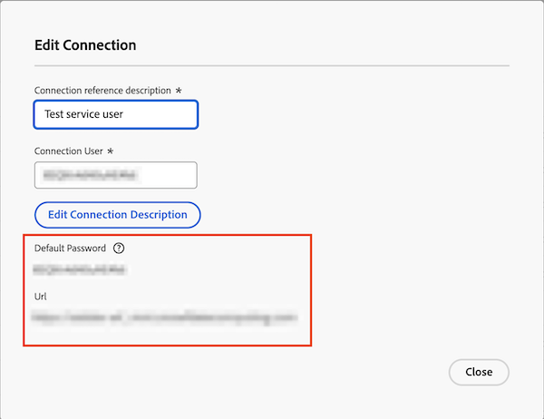

# A ferramenta Power BI não consegue se conectar com a senha fornecida

## Problema

Ao tentar fazer logon no Data Connect a partir da ferramenta Power BI, você vê o seguinte erro:

`Cannot connect from BI tool with provided password`

## Causa

Ao criar a conexão JDBC, o Workfront fornece uma senha temporária para a Conexão de dados.

Antes de acessar a Conexão de dados por meio do Power BI, primeiro faça logon usando os detalhes de conexão fornecidos, atualize a senha temporária e prossiga com o logon.

## Solução

Redefina a senha da conexão no Workfront e crie uma nova senha com o link fornecido na caixa de diálogo Editar conexão.

### Redefinir senha de conexão no Workfront

1. Acesse Workfront > Configuração > Sistema > Conexão de dados.
1. Localize e abra a conexão na lista.
1. Em **Redefinir Senha da Conexão**, marque a caixa para confirmar se deseja redefinir a senha.
1. Clique em **Redefinir Senha da Conexão**.
   
1. Prossiga para a seção abaixo.

### Criar uma nova senha para a conexão

1. Copie o URL e cole-o em uma nova guia do navegador.
1. No Workfront, copie e cole o Nome de usuário da conexão e a Senha padrão na nova guia do navegador.
   
1. Clique em **Fazer logon**.
1. Digite uma nova senha e clique em **Enviar**.
1. Acesse a ferramenta Power BI e faça logon com a nova senha.

