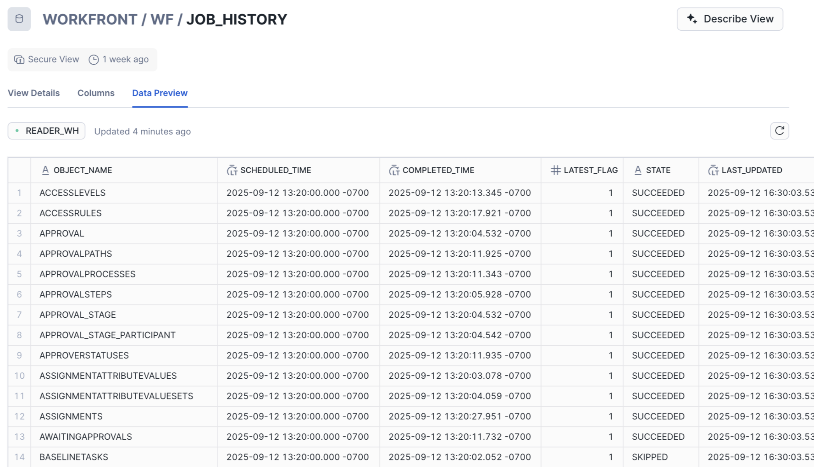

# Usar a exibição Histórico de tarefas na Conexão de dados

Na exibição Histórico de tarefas, os administradores do Workfront podem acessar registros detalhados de cada tarefa de atualização de dados. Esses registros fornecem informações valiosas sobre as tarefas que mantêm seus dados atualizados e ajudam a estabelecer prazos ideais para quando executar processos e atualizar suas visualizações de negócios.

As colunas de exibição Histórico de tarefas contêm as seguintes informações:

* **OBJECT_NAME**: exibe o nome do objeto associado ao trabalho.
* **SCHEDULED_TIME**: exibe a hora de início do trabalho.
* **COMPLETED_TIME**: exibe a hora de conclusão do trabalho.
* **LATEST_FLAG**: indica se o trabalho fez parte da atualização mais recente.
* **ESTADO**: exibe o status do trabalho. Para obter mais informações, consulte a seguinte seção neste artigo: [Status de trabalho disponíveis](#available-job-statuses).
* **LAST_UPDATED**: o último carimbo de data/hora atualizado do trabalho.

>[!NOTE]
>
>A visualização Histórico de tarefas inclui detalhes das 72 horas anteriores de tarefas agendadas.

## Status de trabalho disponíveis

A cada tarefa de Conexão de Dados é atribuído um status que indica se ela foi bem-sucedida, ignorada ou falhou.

<table>
    <tr>
        <td><b>Status do processo</b></td>
        <td><b>Definição</b></td>
    </tr>
    <tr>
        <td>Com êxito</td>
        <td>O trabalho processou com êxito cada atualização disponível e todas as atualizações desse tipo de registro agora são refletidas no data lake.</td>
    </tr>
    <tr>
        <td>Ignorado</td>
        <td>O trabalho foi ignorado porque não havia atualizações na fila para serem processadas para o tipo de registro.</td>
    </tr>
    <tr>
        <td>Falhou</td>
        <td>Falha ao executar o trabalho. Nesses casos, é provável que nenhum dado na fila tenha sido enviado para o data lake. Os registros que permanecerem na fila serão processados no próximo trabalho agendado para esse tipo de registro. </td>
    </tr>
   </table>

## Considerações sobre a execução do trabalho e o comportamento do registro em log

O Snowflake usa uma ferramenta de otimização do agendador de trabalhos que pode afetar como a execução de trabalhos é processada e registrada na exibição Histórico de Trabalhos. Esse comportamento de registro pode variar dependendo de haver ou não dados para processar.

Por exemplo, quando não há nenhuma nova linha a ser processada para um determinado objeto, um dos seguintes resultados pode ocorrer:

* **O trabalho é executado e está marcado como Ignorado**: o Snowflake detecta que não há linhas a serem processadas, executa o trabalho e registra-o com o status Ignorado na tabela.

* **O trabalho não é executado**: o Snowflake determina que não há linhas a serem processadas, não executa o trabalho e registra-o com o status Ignorado na tabela.

  >[!NOTE]
  >
  >No segundo cenário em que o trabalho não é executado, o registro mais recente desse objeto pode refletir um carimbo de data e hora que não está alinhado com o agendamento esperado.

Em outras palavras, um trabalho pode ser considerado executado mesmo se nenhuma linha for processada e pode ou não ser registrado dependendo do comportamento do agendador de trabalhos para esse trabalho específico.
