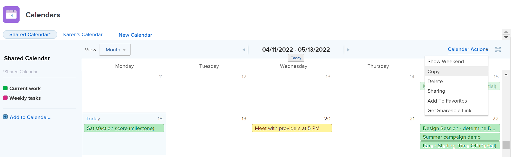

# Copiar um relatório de calendário

As informações destacadas nesta página referem-se a funcionalidades que ainda não estão disponíveis. Ele está disponível somente no ambiente de Pré-visualização da Sandbox.

Se você criou um calendário, é possível copiar o calendário e usá-lo como ponto de partida para um novo calendário.

Além disso, se você tiver o acesso de [!UICONTROL Gerenciar] a um calendário para o qual não é o proprietário, poderá copiar o calendário e se tornar o proprietário do calendário copiado.

## Requisitos de acesso

+++ Expanda para visualizar os requisitos de acesso para a funcionalidade neste artigo.

Você deve ter o seguinte acesso para executar as etapas deste artigo:

<table style="table-layout:auto"> 
 <col> 
 </col> 
 <col> 
 </col> 
 <tbody> 
  <tr> 
   <td role="rowheader">[!DNL Adobe Workfront plan]</td> 
   <td> 
Qualquer
 </td> 
  </tr> 
  <tr> 
   <td role="rowheader">[!DNL Adobe Workfront] licença</td> 
   <td>
Novo: Padrão

       
ou

       
Atual: Plano
</td> 
  </tr> 
  <tr> 
   <td role="rowheader">Configurações de nível de acesso</td> 
   <td> 
[!UICONTROL Editar] acesso a [!UICONTROL Relatórios], [!UICONTROL Painéis] e [!UICONTROL Calendários]
</td> 
  </tr> 
  <tr> 
   <td role="rowheader">Permissões de objeto</td> 
   <td>Acesso [!UICONTROL Gerenciar] ao relatório de calendário</td> 
  </tr> 
 </tbody> 
</table>

Para obter mais detalhes sobre as informações nesta tabela, consulte [Requisitos de acesso na documentação do Workfront](/help/quicksilver/administration-and-setup/add-users/access-levels-and-object-permissions/access-level-requirements-in-documentation.md).

+++

## Copiar um relatório de calendário na produção

1. Vá para o calendário que deseja copiar.
1. Na barra de ferramentas **[!UICONTROL Calendário]**, clique em **[!UICONTROL Ações de Calendário]** e selecione **[!UICONTROL Copiar]** na lista suspensa.
Uma cópia do calendário é aberta.

   

   Todos os projetos e agrupamentos do calendário original são exibidos na cópia do calendário. Somente objetos colocados por filtros de calendário são exportados para o calendário recém-copiado. Todos os eventos adicionados manualmente ao calendário original devem ser adicionados manualmente ao calendário copiado.

   Somente você tem acesso ao calendário copiado. Os usuários com acesso ao calendário original não têm acesso ao calendário copiado. Você pode conceder acesso ao calendário recém-criado compartilhando-o com outros usuários. Para saber mais sobre o compartilhamento de calendários, consulte [[!UICONTROL Compartilhar um calendário] relatório](../../../reports-and-dashboards/reports/calendars/share-a-calendar-report.md).

1. (Opcional) Renomeie o calendário.

## Copiar um relatório de calendário em Visualizar

1. Vá para o calendário que deseja copiar.
1. Clique no menu **Mais** ao lado do menu suspenso Calendário.
   

1. Selecione **[!UICONTROL Copiar]** na lista suspensa. O calendário é copiado e você é direcionado à nova cópia.

>[!NOTE]
>
>Todos os projetos e agrupamentos do calendário original são exibidos na cópia do calendário. Somente objetos colocados por filtros de calendário são exportados para o calendário recém-copiado. Todos os eventos adicionados manualmente ao calendário original devem ser adicionados manualmente ao calendário copiado.
> 
>
>Somente você tem acesso ao calendário copiado. Os usuários com acesso ao calendário original não têm acesso ao calendário copiado. Você pode conceder acesso ao calendário recém-criado compartilhando-o com outros usuários. Para saber mais sobre o compartilhamento de calendários, consulte [[!UICONTROL Compartilhar um calendário] relatório](../../../reports-and-dashboards/reports/calendars/share-a-calendar-report.md).

1. (Opcional) Clique no menu **Mais** e em **Editar** para renomear o calendário.

