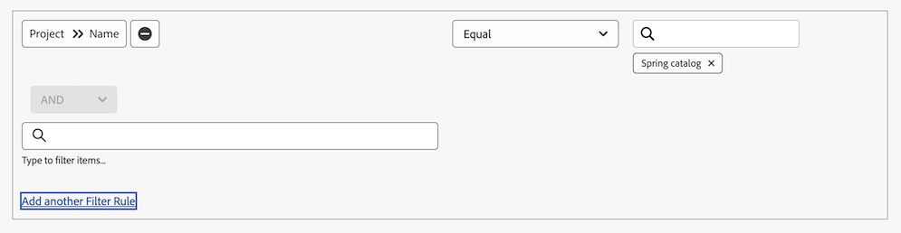

# Usar [!UICONTROL Datas Projetadas] em um relatório de calendário

Um relatório de calendário é um relatório dinâmico que fornece uma representação visual do seu trabalho. Você pode usar os campos Data projetada em um relatório de calendário para os seguintes objetos:

* Tarefas
* Problemas
* Projetos

## Requisitos de acesso

+++ Expanda para visualizar os requisitos de acesso da funcionalidade neste artigo.

<table style="table-layout:auto"> 
 <col> 
 </col> 
 <col> 
 </col> 
 <tbody> 
  <tr> 
   <td role="rowheader">Pacote do Adobe Workfront</td> 
   <td> 
Qualquer
 </td> 
  </tr> 
  <tr> 
   <td role="rowheader">Licença do Adobe Workfront</td> 
   <td>
Padrão

       
Plano
</td> 
  </tr> 
  <tr> 
   <td role="rowheader">Configurações de nível de acesso</td> 
   <td> 
Acesso de edição a relatórios, painéis e calendários
</td> 
  </tr> 
  <tr> 
   <td role="rowheader">Permissões de objeto</td> 
   <td>Gerenciar acesso ao relatório de calendário</td> 
  </tr> 
 </tbody> 
</table>

Para obter mais detalhes sobre as informações contidas nesta tabela, consulte [Requisitos de acesso na documentação do Workfront](/help/quicksilver/administration-and-setup/add-users/access-levels-and-object-permissions/access-level-requirements-in-documentation.md).

+++

## Configurar o grupo de itens

Você pode escolher como deseja que o grupo de itens seja exibido no calendário.

{{step1-to-calendars}}

1. Selecione o calendário ao qual deseja adicionar um novo grupo de itens, clique no menu Mais e **Editar**.
Ou
Clique em **[!UICONTROL + Novo calendário]**, digite o nome do projeto e clique em **[!UICONTROL Adicionar itens avançados]**.

   >[!NOTE]
   >
   >Você deve ter acesso de [!UICONTROL Edição] a [!UICONTROL Relatórios], [!UICONTROL Painéis] e [!UICONTROL Calendários] no seu nível de acesso para criar um relatório de calendário.

1. À esquerda, clique em **[!UICONTROL Adicionar ao Calendário]** e em **[!UICONTROL Adicionar itens avançados]**.

1. Especifique o seguinte:

   <table style="table-layout:auto">
    <col>
    <col>
    <tbody>
     <tr>
      <td role="rowheader"><strong>[!UICONTROL Nomeia este grupo de itens]</strong></td>
      <td>Digite um nome para o grupo de itens.</td>
     </tr>
     <tr>
      <td role="rowheader"><strong>[!UICONTROL Color]</strong></td>
      <td>Selecione uma cor para o grupo de itens. Todos os itens são exibidos na cor selecionada no relatório de calendário.</td>
     </tr>
     <tr>
      <td role="rowheader"><strong>[!UICONTROL Date Field]</strong></td>
      <td>
Escolha <strong>[!UICONTROL Datas Projetadas]</strong>. Para obter mais informações sobre Datas Projetadas, consulte 

       <ul>
        <li><a href="../../../manage-work/projects/planning-a-project/project-projected-start-date.md" class="MCXref xref">Visão geral da data de início projetada do projeto</a></li>
        <li><a href="../../../manage-work/projects/planning-a-project/project-projected-completion-date.md" class="MCXref xref">Visão geral da data de conclusão projetada para projetos, tarefas e problemas</a> </li>
       </ul></td>
     </tr>
     <tr>
      <td role="rowheader"><strong>[!UICONTROL No calendário, mostrar]</strong></td>
      <td>
Escolha como deseja que as datas sejam exibidas:

       <ul>
        <li><strong>[!UICONTROL Somente Data de Início do]</strong>: O calendário exibe o objeto em uma única data.</li>
        <li><strong>[!UICONTROL Somente Data de Término do]</strong>: O calendário exibe o objeto em uma única data.</li>
        <li><strong>[!UICONTROL Duration] (Início a Fim)</strong>: o calendário exibe o objeto em um período de dias.</li>
       </ul></td>
     </tr>
     <tr data-mc-conditions="">
      <td role="rowheader"><strong>[!UICONTROL Alterna para Datas Reais quando disponível]</strong></td>
      <td>
O calendário muda automaticamente para datas reais quando elas estão disponíveis.  Escolha <strong>[!UICONTROL Yes]</strong> ou <strong>[!UICONTROL No]</strong> para alternar para as datas reais quando disponíveis. Para obter mais informações sobre Datas Reais, consulte

       <ul>
        <li><a href="../../../manage-work/projects/planning-a-project/project-actual-start-date.md" class="MCXref xref">Visão geral da data de início real do projeto </a></li>
        <li><a href="../../../manage-work/projects/planning-a-project/project-actual-completion-date.md" class="MCXref xref">Visão geral da data de conclusão real do projeto </a></li>
       </ul></td>
     </tr>
    </tbody>
   </table>

1. Prossiga para a seção a seguir.

## Adicionar objetos ao grupo de itens

Depois de configurar como deseja que os itens sejam exibidos, você precisa adicionar os objetos que deseja ver no calendário ao agrupamento.

1. No **[!UICONTROL O que você deseja adicionar ao calendário?seção]**, selecione

   * **[!UICONTROL Tarefas]**
   * **[!UICONTROL Projetos]**
   * **[!UICONTROL Problemas]**
   * **[!UICONTROL Folga]**
1. Clique em **[!UICONTROL Adicionar Tarefas]**, **[!UICONTROL Adicionar Projetos]** ou **[!UICONTROL Adicionar Problemas]**, dependendo do tipo de objeto que você está adicionando ao calendário.

1. No menu suspenso, comece a digitar o nome do campo e selecione a origem do campo do objeto que deseja exibir no calendário (por exemplo, **[!UICONTROL Tarefas Atrasadas]**).
1. Definir uma declaração de condição para o agrupamento de calendários.

   
Para saber mais sobre como definir condições, consulte [Modificadores de filtro e condição](../../../reports-and-dashboards/reports/reporting-elements/filter-condition-modifiers.md).

1. (Opcional) Especifique objetos adicionais para o agrupamento de calendários repetindo as Etapas 1-4.
1. Em **[!UICONTROL Definir os rótulos Tarefas/Projetos/Questões como o campo...]**, selecione como os objetos neste agrupamento de calendário são rotulados no calendário.

   >[!NOTE]
   >
   >Se as opções de rótulo padrão não estiverem disponíveis para um determinado objeto, o nome do objeto será exibido. Por exemplo, quando o rótulo [!UICONTROL Tarefa pai] é selecionado e não há nenhuma tarefa pai associada ao objeto, [!DNL Adobe Workfront] exibe o nome do objeto que você está visualizando no calendário.

   

1. Clique em **[!UICONTROL Salvar]**.

