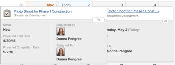

# Exibir relatórios de calendário e detalhes do evento

Você pode exibir relatórios de calendário e detalhes de eventos que você criou ou que foram compartilhados com você no Adobe Workfront.

## Requisitos de acesso

+++ Expanda para visualizar os requisitos de acesso para a funcionalidade neste artigo.

Você deve ter o seguinte acesso para executar as etapas deste artigo:

<table style="table-layout:auto"> 
 <col> 
 </col> 
 <col> 
 </col> 
 <tbody> 
  <tr> 
   <td role="rowheader">[!DNL Adobe Workfront plan]</td> 
   <td> 
Qualquer
 </td> 
  </tr> 
  <tr> 
   <td role="rowheader">[!DNL Adobe Workfront] licença</td> 
   <td>
Novo: Colaborador

       
ou

       
Atual: solicitação
</td> 
  </tr> 
  <tr> 
   <td role="rowheader">Configurações de nível de acesso</td> 
   <td> 
[!UICONTROL Exibir] ou acesso superior a [!UICONTROL Relatórios], [!UICONTROL Painéis] e [!UICONTROL Calendários]
</td> 
  </tr> 
  <tr> 
   <td role="rowheader">Permissões de objeto</td> 
   <td>[!UICONTROL Exibir] ou permissões superiores para o relatório de calendário</td> 
  </tr> 
 </tbody> 
</table>

Para obter mais detalhes sobre as informações nesta tabela, consulte [Requisitos de acesso na documentação do Workfront](/help/quicksilver/administration-and-setup/add-users/access-levels-and-object-permissions/access-level-requirements-in-documentation.md).

+++

## Exibir um relatório de calendário

<!--{{step1-to-calendars}}-->

1. Clique no ícone **[!UICONTROL Menu Principal]**  no canto superior direito do Adobe Workfront ou (se disponível) clique no ícone **[!UICONTROL Menu Principal]**  no canto superior esquerdo e clique em **[!UICONTROL Calendários]**.

   Dependendo do seu nível de acesso, você poderá ver os seguintes calendários listados:

   * Seu calendário [!DNL Adobe Workfront] padrão

     O Workfront cria um calendário para você com base nos projetos, tarefas e problemas atribuídos a você ou atribuídos a equipes, grupos ou funções atribuídas a você.

   * Calendários criados por você

     Para saber mais sobre como criar calendários, consulte [Visão geral dos relatórios de calendário](../../../reports-and-dashboards/reports/calendars/calendar-reports-overview.md).

   * Calendários que outros usuários compartilharam com você

     Para saber mais sobre o compartilhamento de calendários, consulte [[!UICONTROL Compartilhar um calendário] relatório](../../../reports-and-dashboards/reports/calendars/share-a-calendar-report.md).

1. (Condicional) Clique no menu suspenso **[!UICONTROL Exibir]** e selecione a duração do calendário que deseja exibir.
   
Você pode escolher entre as seguintes exibições de relatório do calendário:

   * **[!UICONTROL Mês]**: exibe quatro semanas do calendário
   * **[!UICONTROL Semana]**: exibe uma semana do calendário
   * **[!UICONTROL Gantt]**: exibe uma exibição contínua do calendário

     ![[!UICONTROL Relatório de calendário de Gantt]](assets/gantt-calendar-report.png)

     Você pode ver mais eventos em uma visualização de [!UICONTROL Gantt] rolando para baixo ou para os lados. Um símbolo de carregamento é exibido à medida que os dados são preenchidos para a exibição.

   >[!NOTE]
   >
   >Nos modos de exibição [!UICONTROL Mês] e [!UICONTROL Semana], os eventos atuais ou futuros (incluindo eventos que abrangem vários dias, desde que contenham hoje ou um dia futuro) têm sombreamento que corresponde à cor no agrupamento de projeto ou calendário. Os eventos anteriores têm um sombreamento mais claro para indicar que não são mais atuais, mas ainda é possível selecionar e visualizar esses eventos.

1. (Opcional) Se você estiver exibindo o calendário nos modos de exibição [!UICONTROL Mês] ou [!UICONTROL Semana], poderá alterar o modo de exibição do calendário com as seguintes opções:

   * Para incluir ou excluir fins de semana:

      1. Na barra de ferramentas **[!UICONTROL Calendário]**, clique em **[!UICONTROL Ações de Calendário]** e, na lista suspensa, selecione **[!UICONTROL Mostrar Fim de Semana]** ou **[!UICONTROL Ocultar Fim de Semana]**.

   * Para alterar rapidamente as datas exibidas:

      1. Na barra de ferramentas **[!UICONTROL Calendário]**, clique na seta para a esquerda do indicador de data para voltar no calendário ou na seta para a direita para avançar.

         \
         As datas exibidas são ajustadas por um intervalo com base na exibição do calendário atual. Por exemplo, se você estiver exibindo o calendário na exibição [!UICONTROL Semana], o calendário será exibido uma semana depois ou uma semana atrás, dependendo da seta selecionada.

      1. (Opcional) Para voltar ao dia atual, clique em [!UICONTROL **Hoje**].

1. (Opcional) Para exibir um calendário em tela inteira, clique nas setas de tela inteira no lado direito da barra de ferramentas **[!UICONTROL Calendário]**.
   \
   Pressione Esc para retornar ao modo de exibição normal do calendário.

1. (Opcional) Para ocultar os eventos de um projeto ou agrupamento de calendário vinculado ao calendário, desmarque o projeto ou agrupamento de calendário na lista de projetos.
   
Você pode tornar os eventos visíveis novamente selecionando o [!UICONTROL projeto] ou o agrupamento de calendário na lista de projetos.

## Exibir detalhes do evento de relatório do calendário

Você pode ver os detalhes de um evento em um calendário, para eventos atuais e passados.

1. Vá para o evento cujos detalhes você deseja saber e clique nele.
Uma página de detalhes do evento é aberta.
   

1. (Opcional) Para exibir detalhes adicionais sobre o objeto:

   1. Passe o mouse sobre o nome do projeto, tarefa ou problema.

      Uma página de detalhes é aberta para o objeto.
      

   1. (Opcional) Para abrir o projeto, tarefa ou problema associado, clique no título do objeto.
   1. (Opcional) Para fechar todas as páginas de detalhes abertas, clique em qualquer lugar fora das páginas de detalhes do evento.
