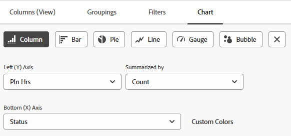
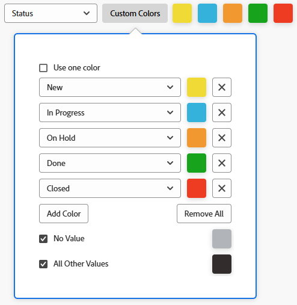

# Adicionar um gráfico a um relatório

<!--Audited: 11/2024-->

Você pode aprimorar seus relatórios adicionando um gráfico. É possível adicionar gráficos a relatórios existentes ou a relatórios que você está criando.

Antes de adicionar um gráfico a um relatório, você deve criar uma Exibição e um Agrupamento para o relatório.

Não é possível adicionar gráficos à maioria dos relatórios, a menos que você agrupe as informações no relatório primeiro. O único gráfico que pode ser adicionado sem um agrupamento é um gráfico de medidor.

Para obter informações sobre exibições, consulte [Visão geral das exibições no Adobe Workfront](../../../reports-and-dashboards/reports/reporting-elements/views-overview.md).

Para obter mais informações sobre agrupamentos, consulte [Visão geral sobre agrupamentos no Adobe Workfront](../../../reports-and-dashboards/reports/reporting-elements/groupings-overview.md).

Se o relatório exibir muitos itens, um gráfico não será criado. Nesse caso, você também deve adicionar um Filtro ao relatório para reduzir o número de resultados em seu relatório.

Para obter mais informações sobre filtros, consulte [Visão geral sobre filtros](../../../reports-and-dashboards/reports/reporting-elements/filters-overview.md).

## Requisitos de acesso

+++ Expanda para visualizar os requisitos de acesso para a funcionalidade neste artigo.

<table style="table-layout:auto"> 
 <col> 
 <col> 
 <tbody> 
  <tr> 
   <td role="rowheader">Pacote do Adobe Workfront</td> 
   <td> 
Qualquer
 </td> 
  </tr> 
  <tr> 
   <td role="rowheader">Licença do Adobe Workfront</td> 
   <td> 
      
Standard

      
Plano

   </td>
  </tr> 
  <tr> 
   <td role="rowheader">Configuração do nível de acesso</td> 
   <td> 
Editar acesso a relatórios, painéis, calendários
 
Editar acesso a Filtros, Visualizações, Agrupamentos
 </td> 
  </tr> 
  <tr> 
   <td role="rowheader">Permissões de objeto</td> 
   <td> 
Gerenciar permissões para um relatório
  </td> 
  </tr> 
 </tbody> 
</table>

Para obter mais detalhes sobre as informações nesta tabela, consulte [Requisitos de acesso na documentação do Workfront](/help/quicksilver/administration-and-setup/add-users/access-levels-and-object-permissions/access-level-requirements-in-documentation.md).

+++

## Adicionar um gráfico a um relatório

1. Ir para um relatório existente ou criar um novo relatório. Para obter mais informações sobre como criar um novo relatório, consulte [Criar um relatório personalizado](../../../reports-and-dashboards/reports/creating-and-managing-reports/create-custom-report.md).

1. (Condicional) Se você foi para um relatório existente, clique em **Ações de Relatório** > **Editar**.

1. Verifique se a guia **Colunas (Exibição)** foi atualizada para exibir as informações que você deseja representar no gráfico no relatório.

   Para obter informações sobre como criar ou modificar o Modo de Exibição para o relatório, consulte [Criar ou editar modos de exibição no Adobe Workfront](/help/quicksilver/reports-and-dashboards/reports/reporting-elements/create-edit-views.md).

1. Clique na guia **Agrupamentos** e adicione um agrupamento.

   >[!TIP]
   >
   >* Você só pode adicionar um gráfico a um relatório quando os resultados do relatório são agrupados.
   >* Os agrupamentos em modo de texto não são suportados em gráficos. Para obter mais informações sobre agrupamentos modo texto, consulte [Editar um agrupamento usando o modo texto](../../../reports-and-dashboards/reports/text-mode/edit-text-mode-in-grouping.md).
   >* Se você adicionar um único agrupamento que representa uma métrica, todos os gráficos, exceto um gráfico de pizza, serão exibidos no agrupamento com a mesma cor.

   Para obter mais informações sobre como criar agrupamentos, consulte [Criar agrupamentos no Adobe Workfront](/help/quicksilver/reports-and-dashboards/reports/reporting-elements/create-groupings.md).

1. Selecione a guia **Gráfico**.

1. Clique em um tipo de gráfico para selecioná-lo.\
   

1. Selecione entre os seguintes tipos de gráficos:

   * [Gráfico de colunas](#column-chart)
   * [Gráfico de barras](#bar-chart)
   * [Gráfico de pizza](#pie-chart)
   * [Gráfico de linhas](#line-chart)
   * [Gráfico de medição](#gauge-chart)
   * [Gráfico de bolhas](#bubble-chart)

1. Clique em **Salvar + Fechar** para salvar o gráfico e o relatório.

### Gráfico de colunas {#column-chart}

Para adicionar um gráfico de **Coluna** ao seu relatório:

1. Comece a adicionar um gráfico ao seu relatório, conforme descrito em [Adicionar um gráfico a um relatório](#add-a-chart-to-a-report).

1. No campo **Eixo Esquerdo (Y)**, selecione os valores que deseja incluir no eixo Y do gráfico e selecione como deseja que as informações sejam resumidas no campo **Resumido por**.

1. (Opcional) Clique em **Cores Personalizadas** para atribuir cores preferenciais a cada uma das colunas.\
   Para obter mais informações sobre como personalizar as cores do gráfico, consulte [Personalizar cores do gráfico](#customize-chart-colors).

1. No campo **Eixo Inferior (X)**, selecione o Agrupamento que deseja incluir no gráfico.

1. (Opcional) Clique em **Mostrar em 3D** para exibir o gráfico em uma exibição tridimensional.

1. (Opcional) **Colunas de Grupo**: selecione essa opção para definir como você deseja que as colunas sejam agrupadas.\
   Selecione entre as seguintes opções:

   * Clique em uma das seguintes opções para selecionar como as colunas agrupadas serão exibidas:

      * **Lado a lado**
      * **Empilhado**
      * **Empilhado a 100%**

   * Selecione o Agrupamento que deseja incluir no gráfico no menu suspenso **Agrupar Dados por**.
   * (Opcional) Clique em **Cores Personalizadas** para personalizar as cores das colunas.\
     Para obter mais informações sobre como personalizar as cores do gráfico, consulte [Personalizar cores do gráfico](#customize-chart-colors).

1. (Opcional) Clique em **Gráfico de Combinação** para incluir um valor adicional no gráfico, bem como sobre como você deseja que as informações sejam resumidas.\
   Considere as seguintes opções:

   * **Plotar no Eixo Secundário**: selecione esta opção para plotar os dados no lado direito do gráfico.
   * **Tipo de Gráfico**: Selecione se você deseja que este valor adicional seja exibido como uma linha ou uma terceira coluna.

1. Clique em **Salvar + Fechar** para salvar o gráfico e o relatório.

### Gráfico de barras {#bar-chart}

Para adicionar um gráfico de **Barra** ao seu relatório:

1. Comece a adicionar um gráfico ao seu relatório, conforme descrito em [Adicionar um gráfico a um relatório](#add-a-chart-to-a-report).

1. No campo **Eixo Inferior (X)**, selecione os valores que deseja incluir no eixo X do gráfico e selecione como deseja que as informações sejam resumidas no campo **Resumido por**.

1. (Opcional) Clique em **Cores personalizadas** para personalizar as cores das barras.\
   Para obter mais informações sobre como personalizar as cores do gráfico, consulte [Personalizar cores do gráfico](#customize-chart-colors).

1. No campo **Eixo esquerdo (Y)**, selecione o Agrupamento que deseja incluir no gráfico.

1. (Opcional) Clique em **Mostrar em 3D** para exibir o gráfico em uma exibição tridimensional.

1. (Opcional) Clique em **Barras de grupo** para definir como você deseja que as barras sejam agrupadas.\
   Selecione entre as seguintes opções:

   * Clique em uma das seguintes opções para selecionar como as barras agrupadas serão exibidas:

      * **Lado a lado**
      * **Empilhado**
      * **Empilhado a 100%**

   * Selecione como você deseja agrupar as informações no gráfico no menu suspenso **Agrupar dados por**.
   * (Opcional) Clique em **Cores Personalizadas** para personalizar as cores das suas colunas.\
     Para obter mais informações sobre como personalizar as cores do gráfico, consulte [Personalizar cores do gráfico](#customize-chart-colors).

1. (Opcional) Clique em **Gráfico de Combinação** para incluir um valor adicional no gráfico, bem como sobre como você deseja que as informações sejam resumidas.

1. Clique em **Salvar + Fechar** para salvar o gráfico e o relatório.

>[!IMPORTANT]
>
>Limite os gráficos de barras a 23 ou menos barras, já que os gráficos de barras que incluem mais de 23 barras não exibirão corretamente todos os rótulos de barras.

### Gráfico de pizza {#pie-chart}

Para adicionar um gráfico **Pizza** ao relatório:

1. Comece a adicionar um gráfico ao seu relatório, conforme descrito em [Adicionar um gráfico a um relatório](#add-a-chart-to-a-report).

1. No campo **Valores**, selecione os valores que deseja exibir no relatório e selecione como deseja que as informações sejam resumidas no campo **Resumo por**.\
   No campo **Cunhas**, selecione o Agrupamento que deseja incluir no gráfico. O Agrupamento é representado pelas fatias do gráfico.

1. (Opcional) Clique em **Cores Personalizadas** para personalizar as cores das cunhas no gráfico.\
   Para obter mais informações sobre como personalizar as cores do gráfico, consulte [Personalizar cores do gráfico](#customize-chart-colors).

1. (Opcional) Clique em **Mostrar em 3D** para exibir o gráfico em uma exibição tridimensional.

1. No campo **Mostrar Resultados como**, selecione como deseja que os resultados sejam exibidos no gráfico. Considere as seguintes opções:

   * **Percentage**: os resultados do gráfico são exibidos como uma porcentagem.
   * **Números**: os resultados do gráfico são exibidos como um número.

1. Clique em **Salvar + Fechar** para salvar o gráfico e o relatório.

### Gráfico de linhas {#line-chart}

Para adicionar um gráfico de **Linha** ao seu relatório:

1. Comece a adicionar um gráfico ao seu relatório, conforme descrito em [Adicionar um gráfico a um relatório](#add-a-chart-to-a-report).

1. No campo **Eixo Esquerdo (Y)**, selecione os valores que deseja incluir no eixo Y do gráfico e selecione como deseja que as informações sejam resumidas no campo **Resumido por**.

1. No campo **Eixo Inferior (X)**, selecione o Agrupamento que deseja incluir no gráfico.

1. (Opcional) Clique em **Linhas de Grupo** para selecionar um agrupamento adicional para o gráfico.\
   (Opcional) Clique em **Cores Personalizadas** para personalizar as cores do novo agrupamento.\
   Para obter mais informações sobre como personalizar as cores do gráfico, consulte [Personalizar cores do gráfico](#customize-chart-colors).

1. (Opcional) Clique em **Gráfico de combinação** para combinar suas linhas com um valor adicional.\
   Considere entre as seguintes opções:

   * Selecione o valor que deseja incluir no gráfico e como deseja que as informações sejam resumidas.
   * Clique no campo **Plotar no Eixo Secundário** para plotar os dados no lado direito do gráfico.

1. Clique em **Salvar + Fechar** para salvar o gráfico e o relatório.

### Gráfico de medição {#gauge-chart}

Um gráfico **Medidor** exibe o número de registros que atendem a um determinado critério em um formato de medidor. O indicador do medidor aponta para o número de registros que atendem aos critérios selecionados na exibição e no agrupamento do relatório. Não é necessário um agrupamento de relatório para configurar um gráfico de medidor.

Para adicionar um gráfico **Gauge** ao seu relatório:

1. Comece a adicionar um gráfico ao seu relatório, conforme descrito em [Adicionar um gráfico a um relatório](#add-a-chart-to-a-report).

1. No campo **Valores**, selecione os valores que deseja exibir no relatório e selecione como deseja que as informações sejam resumidas no campo **Resumo por**. Se você selecionar **Contagem de registros**, os valores exibidos serão o objeto do relatório.

1. No campo **Indicators**, selecione o Agrupamento que deseja incluir no gráfico. O Agrupamento é representado pela linha indicadora no gráfico.\
   Se você tiver um Agrupamento que contenha dois itens, dois indicadores serão exibidos no gráfico.\
   Por exemplo, se você tiver um Agrupamento de Status de Projeto e houver dois status de projeto (Atual e Em Retenção), seu gráfico Medição conterá dois indicadores de medição. Eles apontarão para o número de projetos que estão nesse status.\
   (Opcional) Selecione **Total** no campo **Indicators** para exibir o total de objetos selecionados no campo **Values**.

1. (Opcional) Clique em **Adicionar outro intervalo de valores** para adicionar um intervalo de valores ao gráfico.

1. (Opcional) No campo **Intervalo de valores**, especifique o intervalo de valores e a cor para representar esses valores a serem exibidos no gráfico Medidor.

1. Clique em **Salvar + Fechar** para salvar o gráfico e o relatório.

### Gráfico de bolhas {#bubble-chart}

Você pode exibir até três campos de um objeto em um gráfico de **Bolhas**. Isso significa que você pode exibir até quatro pontos de dados em um gráfico de bolhas. Cada entidade com três campos associados é exibida como um círculo que expressa dois dos campos em sua localização dentro dos eixos X e Y. O terceiro campo é representado pelo tamanho do círculo.

Para adicionar um gráfico de **Bolha** ao seu relatório:

1. Comece a adicionar um gráfico ao seu relatório, conforme descrito em [Adicionar um gráfico a um relatório](#add-a-chart-to-a-report).

1. No campo **Eixo esquerdo (Y)**, selecione os valores que deseja incluir no eixo Y do gráfico. Os valores são da exibição do relatório. Especifique como deseja que as informações sejam resumidas no campo **Resumido por**.

1. No campo **Eixo Inferior (X)**, selecione os valores que deseja incluir no eixo X do gráfico. Os valores são da exibição do relatório. Especifique como deseja que as informações sejam resumidas.

   >[!NOTE]
   >
   >Certifique-se de que haja pelo menos uma coluna resumida para que esse campo fique ativo.\
   >Para obter mais informações sobre como resumir as informações em uma coluna do relatório, consulte [Criar um relatório personalizado](../../../reports-and-dashboards/reports/creating-and-managing-reports/create-custom-report.md).

1. No campo **Tamanho da Bolha**, selecione os valores que deseja representar pelo tamanho das bolhas no gráfico. Os valores são da exibição do relatório. Especifique como deseja que as informações sejam resumidas.

   >[!NOTE]
   >
   >Certifique-se de que haja pelo menos uma coluna resumida para que esse campo fique ativo.\
   >Para obter mais informações sobre como resumir as informações em uma coluna do relatório, consulte [Criar um relatório personalizado](../../../reports-and-dashboards/reports/creating-and-managing-reports/create-custom-report.md).

1. No campo **Bolhas**, selecione o Agrupamento que deseja incluir no gráfico. O Agrupamento é representado pelo posicionamento das bolhas no gráfico.

1. No campo **Cor da Bolha**, selecione o campo que você deseja representar pelas cores das bolhas.

   A **Cor da Bolha** pode ser um Agrupamento definido no relatório, mas a opção só estará disponível se você escolher um Agrupamento no campo **Bolhas** que contenha o **Nome** de um objeto pai relativo ao objeto do relatório, como o **Nome do Projeto** de um relatório de tarefa ou o **Nome do Programa** de um relatório de projeto.

   Por exemplo, se você selecionou **Nome do Projeto** em um relatório de tarefa, poderá adicionar **Status da Tarefa** como o campo **Cor da Bolha**.

   

   No entanto, se você selecionou **Status da Tarefa** para o campo **Bolhas**, não será possível selecionar um campo **Cor da Bolha**. Além disso, você não pode selecionar **Nome do Projeto** para o campo **Cor da Bolha**, mesmo ao selecionar **Nome do Projeto** para o campo **Bolhas**.

   

1. Clique em **Salvar + Fechar** para salvar as alterações no construtor de interfaces.

## Personalizar cores do gráfico {#customize-chart-colors}

Você pode permitir que o Workfront selecione as cores dos elementos no seu gráfico, ou pode personalizá-las enquanto adiciona um gráfico aos seus relatórios. Se o gráfico contiver um único Agrupamento que represente uma métrica, como um relatório de tarefa que mostra o número de tarefas agrupadas por Data de Conclusão Real, cada resultado no Agrupamento será exibido na mesma cor.

Você só pode escolher uma cor para os campos exibidos na Exibição do relatório. Você pode escolher várias cores, uma para cada opção, para os campos exibidos no Agrupamento do relatório.

>[!IMPORTANT]
>
>Para campos de data, é possível selecionar apenas uma cor para os elementos do gráfico.

Para personalizar as cores do gráfico:

1. Ao criar um relatório, vá para a guia **Gráfico** no construtor de relatórios.

1. Selecione um tipo de gráfico para adicionar ao seu relatório.\
   Para obter mais informações sobre como adicionar um gráfico ao relatório, consulte [Adicionar um gráfico a um relatório](#add-a-chart-to-a-report).

1. Clique em **Cores Personalizadas** quando este campo estiver disponível.\
   A caixa de diálogo Cores Personalizadas é exibida.\
   

   >[!NOTE]
   >
   >É possível associar cores personalizadas a qualquer campo que possa ser agrupado por e com alguns campos que podem ser exibidos em uma exibição, incluindo campos personalizados. Os campos personalizados ou as opções personalizadas dos campos escolhidos na caixa de diálogo Cor personalizada fazem distinção entre maiúsculas e minúsculas.

1. Considere selecionar qualquer uma das seguintes opções:

   * **Usar uma cor**: todos os elementos do gráfico serão exibidos na cor selecionada.
   * **Adicionar Cor**: adicione uma cor personalizada para um possível valor do campo selecionado.
   * **Remover Tudo**: selecione esta opção para remover todos os valores e cores de campo especificados acima.
   * **Sem valor**: selecione este campo e uma cor personalizada para exibir a coluna do gráfico que agrupa itens de &quot;nenhum valor&quot;. Esses itens não podem ser agrupados por nenhuma das opções do campo selecionado no seu agrupamento.
   * **Todos os Outros Valores**: selecione este campo e uma cor personalizada para exibir todos os outros elementos do gráfico cujas opções não estão definidas acima.

     >[!NOTE]
     >
     >As cores editadas mais recentemente são exibidas à direita do botão **Cores Personalizadas**. Quando você passa o mouse sobre uma cor, o nome do campo associado a ela é exibido. Você também pode clicar em uma cor para editá-la sem reabrir as **Cores Personalizadas**.

1. Para escolher uma cor:
Clique dentro do seletor de cores para selecionar uma cor.
OU
Especifique um valor de cor hexadecimal para a cor.

1. Clique em qualquer lugar fora da caixa de diálogo Cores Personalizadas para fechá-la. As cores selecionadas são salvas automaticamente.

1. Clique em **Salvar + Fechar** para salvar o gráfico e executar o relatório.

## Exportar um gráfico

É possível exportar um gráfico para um arquivo PDF.

Para exportar um gráfico:

1. Na guia do gráfico de um relatório, clique em **Exportar** para exportar o gráfico para .pdf.\
   Um arquivo .pdf é baixado no computador.

1. Abra o arquivo .pdf.\
   O arquivo exportado inclui as seguintes informações:

   * Uma imagem do gráfico.
   * Um título que é o nome do relatório.
   * Um nome de arquivo exclusivo que se baseia no nome do relatório.
   * Um rodapé com a data e hora em que o relatório foi exportado e o número da página.

## Remover um gráfico de um relatório

Para remover um gráfico de um relatório:

1. Abra a guia **Gráfico** do Report Builder.

1. Clique no botão &quot;x&quot; à direita dos tipos de gráfico para removê-lo.

1. Clique em **Salvar + Fechar**.

## Limitações ao trabalhar com gráficos

Esteja ciente das seguintes limitações ao trabalhar com gráficos:

* A seção **Visualização de Gráfico** à direita do Report Builder não contém dados reais do seu relatório. Você deve salvar o gráfico e exibi-lo na guia **Gráfico** para ver o gráfico com seus dados.

* Alguns elementos do gráfico não são editáveis:

   * Não é possível alterar o tipo de fonte nem o tamanho nos valores de cada elemento.
   * Não é possível alterar os nomes dos eixos no gráfico.

* Não é possível editar a legenda do gráfico.
* Ao usar campos calculados para seus agrupamentos, não é possível clicar nos elementos do gráfico.
* O número máximo de pontos de dados que podem ser exibidos em um gráfico é quatro, em um gráfico de bolhas. Todos os outros tipos de gráficos exibem dois ou no máximo três pontos de dados.
