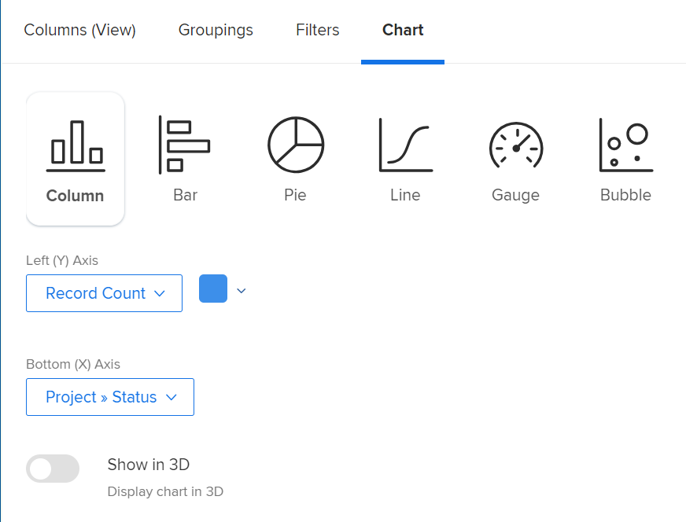

# Adicionar um gráfico a um relatório

Você pode aprimorar seus relatórios adicionando um gráfico. Você pode adicionar gráficos a relatórios existentes ou a relatórios que esteja criando.

Antes de adicionar um gráfico a um relatório, você deve criar uma Exibição e um Agrupamento para o relatório. A maioria dos gráficos não pode ser adicionada a menos que as informações sejam agrupadas no relatório. O único gráfico que pode ser adicionado sem um agrupamento é um gráfico de medidor.\
Para obter informações sobre como criar uma Exibição, consulte [Visão geral das exibições no Adobe Workfront](../../../reports-and-dashboards/reports/reporting-elements/views-overview.md).\
Para obter mais informações sobre agrupamentos, consulte [Visão geral dos agrupamentos no Adobe Workfront](../../../reports-and-dashboards/reports/reporting-elements/groupings-overview.md).

Se o seu relatório exibir muitos itens, um gráfico não será criado. Nesse caso, você também deve adicionar um Filtro ao relatório para reduzir o número de resultados em seu relatório.\
Para obter mais informações sobre filtros, consulte [Visão geral dos filtros no Adobe Workfront](../../../reports-and-dashboards/reports/reporting-elements/filters-overview.md).

## Requisitos de acesso

Você deve ter o seguinte acesso para executar as etapas neste artigo:

<table style="table-layout:auto"> 
 <col> 
 <col> 
 <tbody> 
  <tr> 
   <td role="rowheader">Plano Adobe Workfront*</td> 
   <td> 
Qualquer Um
 </td> 
  </tr> 
  <tr> 
   <td role="rowheader">Licença da Adobe Workfront*</td> 
   <td> 
Plano 
 </td> 
  </tr> 
  <tr> 
   <td role="rowheader">Configurações de nível de acesso*</td> 
   <td> 
Editar acesso a Relatórios, Painéis, Calendários
 
Editar acesso a filtros, visualizações, agrupamentos
 
Observação: Caso ainda não tenha acesso, pergunte ao administrador do Workfront se ele definiu restrições adicionais em seu nível de acesso. Para obter informações sobre como um administrador do Workfront pode modificar seu nível de acesso, consulte <a href="../../../administration-and-setup/add-users/configure-and-grant-access/create-modify-access-levels.md" class="MCXref xref">Criar ou modificar níveis de acesso personalizados</a>.
 </td> 
  </tr> 
  <tr> 
   <td role="rowheader">Permissões de objeto</td> 
   <td> 
Gerenciar permissões de um relatório
 
Para obter informações sobre como solicitar acesso adicional, consulte <a href="../../../workfront-basics/grant-and-request-access-to-objects/request-access.md" class="MCXref xref">Solicitar acesso a objetos </a>.
 </td> 
  </tr> 
 </tbody> 
</table>

&#42;Para descobrir qual plano, tipo de licença ou acesso você tem, entre em contato com o administrador da Workfront.

## Adicionar um gráfico a um relatório

1. Vá para um relatório existente ou crie um novo relatório. Para obter mais informações sobre como criar um novo relatório, consulte [Criar um relatório personalizado](../../../reports-and-dashboards/reports/creating-and-managing-reports/create-custom-report.md).
1. (Condicional) Se você foi para um relatório existente, clique em **Ações de Relatório** > **Editar**.

1. Certifique-se de que **Colunas (Exibir)** A guia foi atualizada para atender às necessidades do relatório.\
   Para obter informações sobre como criar ou modificar a Exibição do relatório, consulte [Visão geral das exibições no Adobe Workfront](../../../reports-and-dashboards/reports/reporting-elements/views-overview.md).

1. Clique no botão **Agrupamentos** e adicione um agrupamento.

   >[!TIP]
   >
   >* Você só pode adicionar um gráfico a um relatório quando os resultados do relatório forem agrupados.
   >* Os agrupamentos de modo de texto não são suportados em gráficos. Para obter mais informações sobre agrupamentos em modo de texto, consulte [Editar modo de texto em um agrupamento](../../../reports-and-dashboards/reports/text-mode/edit-text-mode-in-grouping.md).
   >* Se você adicionar um único agrupamento que represente uma métrica, todos os gráficos, exceto um gráfico de pizza, exibem cada resultado no agrupamento como a mesma cor.

   Para obter mais informações sobre agrupamentos, consulte [Visão geral dos agrupamentos no Adobe Workfront](../../../reports-and-dashboards/reports/reporting-elements/groupings-overview.md).

1. Selecione o **Gráfico** guia .
1. Clique em um tipo de gráfico para selecioná-lo.\
   

1. Você pode adicionar os seguintes tipos de gráficos a um relatório do Adobe Workfront:

   * [Gráfico de colunas](#column-chart)
   * [Gráfico de barras](#bar-chart)
   * [Gráfico de pizza](#pie-chart)
   * [Gráfico de linhas](#line-chart)
   * [Gráfico de medição](#gauge-chart)
   * [Gráfico de bolhas](#bubble-chart)

1. Clique em **Salvar + Fechar** para salvar o gráfico e o relatório.

### Gráfico de colunas {#column-chart}

Para adicionar uma **Coluna** gráfico para seu relatório:

1. Comece a adicionar um gráfico ao seu relatório, conforme descrito em [Adicionar um gráfico a um relatório](#add-a-chart-to-a-report).
1. No **Eixo Esquerdo (Y)** , selecione os valores que deseja incluir no eixo Y do gráfico, bem como como como deseja que as informações sejam resumidas.
1. No **Eixo Inferior (X)** selecione o Grouping que deseja incluir no gráfico.
1. (Opcional) Selecione **Cores personalizadas** para atribuir suas cores preferenciais a cada uma das colunas.\
   Para obter mais informações sobre como personalizar cores do gráfico, consulte [Personalizar cores do gráfico](#customize-chart-colors).

1. (Opcional) Selecione **Mostrar em 3D** para exibir o gráfico em uma visualização tridimensional.
1. (Opcional) **Colunas do Grupo**: Selecione essa opção para definir como deseja que as colunas sejam agrupadas.\
   Selecione dentre as seguintes opções:

   * Clique em uma das seguintes opções para selecionar como as colunas agrupadas serão exibidas:\
      **- Lado a lado**

      **- Empilhado**
      **- Empilhado a 100%**

   * Selecione o Agrupamento que deseja incluir no gráfico.
   * (Opcional) Selecione **Cores personalizadas** para personalizar as cores das colunas.\
      Para obter mais informações sobre como personalizar cores do gráfico, consulte [Personalizar cores do gráfico](#customize-chart-colors).

1. (Opcional) Selecione **Gráfico de Combinação** para incluir um valor adicional no gráfico, bem como como como você deseja que as informações sejam resumidas.\
   Considere as seguintes opções:

   * **Faça o plotagem no eixo secundário**: Selecione essa opção para plotar os dados no lado direito do gráfico.
   * **Tipo de gráfico**: Selecione se deseja que esse valor adicional seja exibido como uma linha ou uma terceira coluna.\
      

1. Clique em **Salvar + Fechar** para salvar o gráfico e o relatório.

### Gráfico de barras {#bar-chart}

Para adicionar uma **Barra** gráfico para seu relatório:

1. Comece a adicionar um gráfico ao seu relatório, conforme descrito em [Adicionar um gráfico a um relatório](#add-a-chart-to-a-report).
1. No **Eixo Inferior (X)** , selecione os valores que deseja incluir no eixo X do gráfico, bem como como deseja que as informações sejam resumidas.
1. No **Eixo Esquerdo (Y)** selecione o Grouping que deseja incluir no gráfico.
1. (Opcional) Selecione **Cores personalizadas** para personalizar as cores das barras.\
   Para obter mais informações sobre como personalizar cores do gráfico, consulte [Personalizar cores do gráfico](#customize-chart-colors).

1. (Opcional) Selecione **Mostrar em 3D** para exibir o gráfico em uma visualização tridimensional.
1. (Opcional)**Barras de grupo**: Selecione essa opção para definir como deseja que as barras sejam agrupadas.\
   Selecione dentre as seguintes opções:

   * Clique em uma das seguintes opções para selecionar como as barras agrupadas serão exibidas:\
      **- Lado a lado**

      **- Empilhado**
      **- Empilhado a 100%**

   * Selecione o Agrupamento que deseja incluir no gráfico.
   * (Opcional) Selecione **Cores personalizadas** para personalizar as cores de suas colunas.\
      Para obter mais informações sobre como personalizar cores do gráfico, consulte [Personalizar cores do gráfico](#customize-chart-colors).

1. (Opcional) Selecione **Gráfico de Combinação** para incluir um valor adicional no gráfico, bem como como como você deseja que as informações sejam resumidas.\
   

1. Clique em **Salvar + Fechar** para salvar o gráfico e o relatório.

### Gráfico de pizza {#pie-chart}

Para adicionar uma **Pizza** gráfico para seu relatório:

1. Comece a adicionar um gráfico ao seu relatório, conforme descrito em [Adicionar um gráfico a um relatório](#add-a-chart-to-a-report).
1. No **Valores** selecione os valores que deseja exibir no relatório, bem como como como deseja resumi-los.\
   No **Casamentos** selecione o Grouping que deseja incluir no gráfico. O Grouping é representado pelas cunhas do gráfico.

1. (Opcional) Selecione **Cores personalizadas** para personalizar as cores das cunhas no gráfico.\
   Para obter mais informações sobre como personalizar cores do gráfico, consulte [Personalizar cores do gráfico](#customize-chart-colors).

1. (Opcional) Selecione **Mostrar em 3D** para exibir o gráfico em uma visualização tridimensional.
1. No **Mostrar resultados como** selecione como deseja que os resultados sejam exibidos no gráfico. Considere as seguintes opções:

   * **Porcentagem**: Os resultados do gráfico são exibidos como uma porcentagem.
   * **Números**: Os resultados do gráfico são exibidos como um número.\
      

1. Clique em **Salvar + Fechar** para salvar o gráfico e o relatório.

### Gráfico de linhas {#line-chart}

Para adicionar uma **Linha** gráfico para seu relatório:

1. Comece a adicionar um gráfico ao seu relatório, conforme descrito em [Adicionar um gráfico a um relatório](#add-a-chart-to-a-report).
1. No **Eixo Esquerdo (Y)** , selecione os valores que deseja incluir no eixo Y do gráfico, bem como como como deseja que as informações sejam resumidas.
1. No **Eixo Inferior (X)** selecione o Grouping que deseja incluir no gráfico.
1. (Opcional) Selecione uma cor para personalizar a cor da linha.
1. (Opcional) Selecione **Linhas de Grupo**, para selecionar um agrupamento adicional para o gráfico.\
   (Opcional) Selecione **Cores personalizadas** para personalizar as cores do novo agrupamento.\
   Para obter mais informações sobre como personalizar cores do gráfico, consulte [Personalizar cores do gráfico](#customize-chart-colors).

1. (Opcional) Selecione **Gráfico de Combinação** para combinar suas linhas por um valor adicional.\
   Considere as seguintes opções:

   * Selecione o valor que deseja incluir no gráfico, bem como como como deseja que as informações sejam resumidas.
   * Selecione o **Faça o plotagem no eixo secundário** para plotar os dados no lado direito do gráfico.\
      

1. Clique em **Salvar + Fechar** para salvar o gráfico e o relatório.

### Gráfico de medição {#gauge-chart}

A **Medidor** O gráfico exibe o número de registros que atendem a determinados critérios em um formato de medidor. O indicador do medidor aponta para o número de registros que atendem aos critérios selecionados na exibição e no agrupamento do relatório. Um agrupamento de relatório não é necessário para configurar um gráfico de medidor.

Para adicionar uma **Medidor** gráfico para seu relatório:

1. Comece a adicionar um gráfico ao seu relatório, conforme descrito em [Adicionar um gráfico a um relatório](#add-a-chart-to-a-report).
1. No **Valores** selecione os valores que deseja exibir no relatório, bem como como como deseja resumi-los. Se você selecionar **Contagem de Registros**, os valores exibidos são o objeto do relatório.

1. No **Indicadores** selecione o Grouping que deseja incluir no gráfico. O Grouping é representado pela linha de indicador no gráfico.\
   Se você tiver um Agrupamento que contém dois itens, dois indicadores serão exibidos no gráfico.\
   Por exemplo, se você tiver um Agrupamento de Status do Projeto e houver dois status do projeto (Atual e Em Retenção), o gráfico de Parâmetro conterá dois indicadores de medidor. Eles indicarão o número de projetos que estão nesse status.\
   (Opcional) Selecione **Total** no **Indicadores** para exibir o total dos objetos selecionados na **Valores** campo.

1. No **Intervalo de valores** , especifique o intervalo de valores e a cor para representar esses valores a serem exibidos no gráfico Parâmetro.
1. (Opcional) Clique em **Adicionar Outro Intervalo De Valores** para adicionar outros intervalos de valor ao gráfico.\
   

1. Clique em **Salvar + Fechar** para salvar o gráfico e o relatório.

### Gráfico de bolhas {#bubble-chart}

É possível exibir até três campos de um objeto em uma **Bolha** gráfico. Isso significa que é possível exibir até quatro pontos de dados em um gráfico de bolhas. Cada entidade com três campos associados é exibida como um círculo que expressa dois dos campos em seu local dentro dos eixos X e Y. O terceiro campo é representado pelo tamanho do círculo.

Para adicionar uma **Bolha** gráfico para seu relatório:

1. Comece a adicionar um gráfico ao seu relatório, conforme descrito em [Adicionar um gráfico a um relatório](#add-a-chart-to-a-report).
1. No **Eixo Esquerdo (Y)** selecione os valores que deseja incluir no eixo Y do gráfico. Os valores vêm da visualização do relatório. Especifique como deseja que as informações sejam resumidas.
1. No **Campo de eixo inferior (X)**, selecione os valores que deseja incluir no eixo X do gráfico. Os valores vêm da visualização do relatório. Especifique como deseja que as informações sejam resumidas.

   >[!NOTE]
   >
   >Certifique-se de ter pelo menos uma coluna resumida para esse campo estar ativo.\
   >Para obter mais informações sobre o resumo das informações em uma coluna do relatório, consulte [Criar um relatório personalizado](../../../reports-and-dashboards/reports/creating-and-managing-reports/create-custom-report.md).

1. No **Tamanho da bolha** selecione os valores que deseja representar pelo tamanho das bolhas no gráfico. Os valores vêm da visualização do relatório. Especifique como deseja que as informações sejam resumidas.

   >[!NOTE]
   >
   >Certifique-se de ter pelo menos uma coluna resumida para esse campo estar ativo.\
   >Para obter mais informações sobre o resumo das informações em uma coluna do relatório, consulte [Criar um relatório personalizado](../../../reports-and-dashboards/reports/creating-and-managing-reports/create-custom-report.md).

1. No **Bolhas** selecione o Grouping que deseja incluir no gráfico. O Grouping é representado pelo posicionamento das bolhas no gráfico.
1. No **Cor da bolha** selecione o campo que deseja que seja representado pelas cores das bolhas. O **Cor da bolha** pode ser um Agrupamento definido no relatório, mas só pode ser campos do objeto selecionado como **Bolhas**. Por exemplo, se você selecionou Nome da tarefa, é possível adicionar Status da tarefa, mas não Status do projeto como um **Cor da bolha**.\
   

1. Clique em **Salvar + Fechar** para salvar as alterações no construtor de interface.

## Exportar um gráfico

Você pode exportar um gráfico para um arquivo .pdf .

Para exportar um gráfico:

1. Clique em **Exportar** para exportar o gráfico para .pdf.\
   Um arquivo .pdf é baixado no computador.

1. Abra o arquivo .pdf .\
   O arquivo exportado inclui as seguintes informações:

   * Uma imagem do gráfico.
   * Um título que é o nome do relatório.
   * Um nome de arquivo exclusivo que é o nome do relatório.
   * Um rodapé com a data e a hora em que o relatório foi exportado e o número da página.

## Personalizar cores do gráfico {#customize-chart-colors}

Você pode permitir que o Workfront selecione as cores dos elementos no gráfico, ou você pode personalizá-los enquanto adiciona um gráfico aos seus relatórios. Se o gráfico contiver um único Agrupamento que represente uma métrica, como um relatório de tarefa que mostre a quantidade de tarefas agrupadas pela Data de conclusão real, cada resultado no Agrupamento será exibido na mesma cor.

Você só pode escolher uma cor para os campos exibidos na Exibição do relatório. Você pode escolher várias cores, uma para cada opção, para os campos exibidos no Agrupamento do relatório.

>[!IMPORTANT]
>
>Para campos de data, você só pode selecionar uma cor para os elementos do gráfico.

Para personalizar as cores do gráfico:

1. Ao criar um relatório, acesse **Gráfico** no construtor de relatórios.
1. Selecione um tipo de gráfico para adicionar ao seu relatório.\
   Para obter mais informações sobre como adicionar um gráfico ao seu relatório, consulte [Adicionar um gráfico a um relatório](#add-a-chart-to-a-report).

1. Clique em **Cores personalizadas** quando este campo estiver disponível.\
   A caixa de diálogo Cores personalizadas é exibida.\
   

   >[!NOTE]
   >
   >É possível associar cores personalizadas a qualquer campo que você pode agrupar por e com alguns campos que podem ser exibidos em uma visualização, incluindo campos personalizados. Os campos personalizados ou as opções personalizadas dos campos escolhidos na caixa de diálogo Cor personalizada fazem distinção entre maiúsculas e minúsculas.

1. Considere selecionar qualquer uma das seguintes opções:

   * **Usar uma cor**: Todos os elementos do gráfico serão exibidos na cor selecionada.

      1. Comece digitando o nome de uma opção do campo selecionado e selecione uma cor. Essa opção é exibida na cor selecionada no gráfico.
      1. (Opcional) Especifique um valor de cor hexadecimal para sua cor, em vez de selecionar uma das amostras de cores disponíveis\
         Ou\
         Clique no seletor de cores exibido depois de clicar no código hexadecimal e selecione outra cor.
   * **Adicionar cor**: Continue a adicionar cores personalizadas para todas as outras opções possíveis do campo selecionado.
   * **Remover tudo**: Selecione esta opção para remover todas as cores e opções do campo selecionado acima.
   * **Opções avançadas**: Selecione entre as seguintes opções:

      * **Sem valor**: Selecione este campo e uma cor personalizada para exibir a coluna do gráfico que agrupa itens de &quot;nenhum valor&quot;. Esses são itens que não podem ser agrupados por nenhuma das opções do campo selecionado no agrupamento.
      * **Todos os outros valores**: Selecione esse campo e uma cor personalizada para exibir todos os outros elementos do gráfico cujas opções não estão selecionadas acima.

         >[!NOTE]
         >
         >As cores usadas mais recentemente são exibidas na parte superior da caixa de diálogo Cores personalizadas . Quando você passa o mouse sobre uma cor que foi usada recentemente, o nome do campo associado a ela é exibido.

1. Clique no &quot;x&quot; no canto superior direito da caixa de diálogo Cores personalizadas para fechar a caixa de diálogo Cores personalizadas. As cores selecionadas são salvas automaticamente.
1. Clique em **Salvar + Fechar** para salvar o gráfico e executar o relatório.

## Remover um gráfico de um relatório

Para remover um gráfico de um relatório:

1. Abra o **Gráfico** do construtor de relatórios.
1. Passe o mouse sobre o ícone do tipo de gráfico que você escolheu, e um botão &quot;x&quot; aparecerá no canto superior direito do ícone.
1. Clique no &quot;x&quot; para remover o gráfico.
1. Clique em **Salvar + Fechar**.

## Limitações ao trabalhar com gráficos

Esteja ciente das seguintes limitações ao trabalhar com gráficos:

* O **Visualização do gráfico** à direita do construtor de relatórios, não contém dados reais do relatório. É necessário salvar o gráfico e exibi-lo do **Gráfico** para ver o gráfico com seus dados.

* Alguns elementos de gráfico não são editáveis:

   * Não é possível alterar o tipo de fonte nem o tamanho nos valores de cada elemento.
   * Não é possível alterar os nomes dos eixos no gráfico.

* Não é possível editar a legenda do gráfico.
* Ao usar campos calculados para seus agrupamentos, não é possível clicar nos elementos do gráfico.
* A maior quantidade de pontos de dados que você pode exibir em um gráfico é quatro, em um gráfico de bolhas. Todos os outros tipos de gráfico exibem dois ou um máximo de três pontos de dados.
