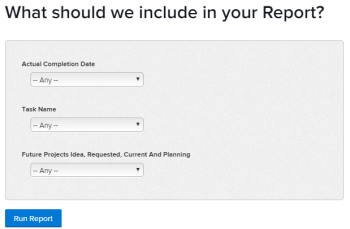

# Adicionar um prompt a um relatório

## A diferença entre prompts e filtros

Filtros e prompts são semelhantes, no sentido de que ambos restringem a quantidade de informações exibidas em um relatório.

Você cria um filtro quando quer que as informações exibidas no relatório sejam filtradas pelos mesmos critérios toda vez que executa o relatório. Os filtros são criados uma vez e são codificados no relatório. Para obter mais informações sobre a criação de filtros, consulte o artigo [Visão geral dos filtros](../../../reports-and-dashboards/reports/reporting-elements/filters-overview.md).

Prompts são filtros abertos que podem ser personalizados e aplicados de forma diferente toda vez que você executa um relatório.

Ao adicionar prompts ao seu relatório, você pode personalizar as informações de filtragem editando os critérios de prompt sempre que executar o relatório. O relatório é executado com um filtro diferente toda vez, dependendo de quais modificadores você escolher, em vez de codificar os modificadores uma vez no filtro do relatório.

Os prompts atuam como um filtro personalizável em relatórios que podem ser atualizados logo antes de você executar o relatório. Você pode criar relatórios genéricos e restringir os resultados com base nas informações que deseja ver para esse dia ou nas informações relevantes para um conjunto de critérios individuais. Por exemplo, se você tiver um relatório de Horas e quiser alterar as informações do relatório com base nos seguintes critérios:

* As datas em que as horas foram registradas
* Os usuários que entraram nas horas
* A quantidade de horas inseridas

Você criaria três prompts em que as condições são os critérios necessários e o relatório pareceria diferente toda vez que o executasse, de acordo com quais informações você escolhe para seus prompts.

Um filtro pode instruir o Adobe Workfront a mostrar apenas as horas inseridas entre junho e agosto deste ano. No entanto, com um prompt, você pode usar um intervalo de tempo diferente cada vez que executar o relatório (por exemplo, entre janeiro e fevereiro ou outubro e dezembro).

## Requisitos de acesso

Você deve ter o seguinte acesso para executar as etapas deste artigo:

<table style="table-layout:auto"> 
 <col> 
 <col> 
 <tbody> 
  <tr> 
   <td role="rowheader">plano do Adobe Workfront*</td> 
   <td> <p>Qualquer</p> </td> 
  </tr> 
  <tr> 
   <td role="rowheader">Licença da Adobe Workfront*</td> 
   <td> <p>Plano </p> </td> 
  </tr> 
  <tr> 
   <td role="rowheader">Configurações de nível de acesso*</td> 
   <td> <p>Editar acesso a relatórios, painéis, calendários</p> <p>Editar acesso a Filtros, Visualizações, Agrupamentos</p> <p>Observação: se você ainda não tiver acesso, pergunte ao administrador do Workfront se ele definiu restrições adicionais em seu nível de acesso. Para obter informações sobre como um administrador do Workfront pode modificar seu nível de acesso, consulte <a href="../../../administration-and-setup/add-users/configure-and-grant-access/create-modify-access-levels.md" class="MCXref xref">Criar ou modificar níveis de acesso personalizados</a>.</p> </td> 
  </tr> 
  <tr> 
   <td role="rowheader">Permissões de objeto</td> 
   <td> <p>Gerenciar permissões para um relatório</p> <p>Para obter informações sobre como solicitar acesso adicional, consulte <a href="../../../workfront-basics/grant-and-request-access-to-objects/request-access.md" class="MCXref xref">Solicitar acesso a objetos </a>.</p> </td> 
  </tr> 
 </tbody> 
</table>

&#42;Para descobrir seu plano, tipo de licença ou acesso, entre em contato com o administrador do Workfront.

## Pré-requisitos

Você deve criar um relatório antes de adicionar um prompt a ele.

Para obter instruções sobre como criar um relatório, consulte [Criar um relatório](../../../reports-and-dashboards/reports/creating-and-managing-reports/create-report.md)

## Criar um prompt

1. Vá para o relatório em que deseja adicionar um prompt.
1. Expandir **Ações de Relatório** e clique em **Editar**.

1. Clique em **Configurações do relatório**.
1. No **Prompts do relatório** clique em **Adicionar um prompt**.\
   

1. (Condicional) Selecione o campo no qual você deseja que o prompt se baseie. Comece digitando o nome do campo e clique em para selecioná-lo quando ele aparecer na lista.\
   As opções disponíveis para usuários que executam o relatório serão diferentes dependendo do campo selecionado.\
   Por exemplo, se você selecionar um campo de data, como Data de Conclusão Efetiva em um relatório de tarefa, &quot;Data de Conclusão Efetiva&quot; será o nome do prompt. Ao editar esse prompt enquanto está executando este relatório, você pode escolher entre um conjunto de modificadores para criar sua instrução de filtragem. Esse processo é idêntico à criação de um filtro. Para obter mais informações sobre modificadores, consulte [Filtro e modificadores de condição](../../../reports-and-dashboards/reports/reporting-elements/filter-condition-modifiers.md).

1. (Condicional) Clique em **Personalizar prompt** para criar um prompt personalizado.

   Um prompt personalizado é um prompt predefinido em que você codifica os critérios do filtro antes de executar o relatório. Nesse sentido, um prompt personalizado está mais próximo de um filtro do que de um prompt.

   No entanto, o prompt permanece tão flexível quanto um prompt regular, pois você pode escolher entre várias instruções predefinidas, em vez de ter apenas um filtro embutido em código no relatório.

   Especifique as seguintes informações para o prompt personalizado: a condição de um prompt personalizado só pode ser editada usando o modo de texto. Isso permite que várias condições sejam aplicadas em um único campo.

   * **Nome do campo:** Esse é o nome do prompt, como você o vê antes de executar o relatório.
   * **Etiqueta:** Esse é o nome de uma das opções dentro do prompt como você o vê antes de executar o relatório.
   * **Condição:** Insira uma condição que defina o prompt.

   Use a mesma sintaxe que você usaria ao inserir um filtro de modo de texto e junte suas instruções por &quot;&amp;&quot;. Para obter mais informações sobre como editar um filtro no modo de texto, consulte [Editar um filtro usando o modo de texto](../../../reports-and-dashboards/reports/text-mode/edit-text-mode-in-filter.md).

   Por exemplo, a variável **Condição** o campo do prompt personalizado para os seguintes cenários pode ter esta aparência:

   * todas as tarefas em projetos futuros em que o status do projeto seja Ideia, Solicitada, Planejada e Atual:

     ```
     project:plannedStartDate=$$TODAY&project:plannedStartDate_Mod=gte&project:status=IDA,REQ,PLN,CUR&project:status_Mod=in
     ```

   * todas as tarefas em projetos concluídos (passados) com status de Concluído ou Inativo:

     ```
     project:actualCompletionDate=$$TODAY&project:actualCompletionDate_Mod=lte&project:status=CPL,DED&project:status_Mod=in
     ```

   Para obter mais informações sobre modificadores de modo de texto, consulte [Filtro e modificadores de condição](../../../reports-and-dashboards/reports/reporting-elements/filter-condition-modifiers.md).

   >[!NOTE]
   >
   >Não é possível alterar as condições de um prompt personalizado ao executar o relatório, como você faria com um prompt padrão. Você pode ter quantas condições predefinidas forem necessárias para um prompt personalizado.

1. (Opcional) Repita a Etapa 4 ou a Etapa 5 para criar quantos prompts forem necessários.
1. Clique em **Concluído** e, em seguida, clique em **Salvar+Fechar** para salvar o relatório.

## Aplicar um prompt a um relatório

Quando um prompt é adicionado a um relatório, a guia padrão do relatório é sempre a guia Prompts.

Para executar um relatório com um prompt:

1. Acesse o relatório com o prompt.

   

1. Escolha uma condição para um ou todos os prompts exibidos no **Prompts** guia.\
   (Opcional) Você pode deixar os prompts em branco e não filtrar o relatório pelas condições do prompt.

1. Clique em **Executar relatório**.\
   (Condicional) Se você preencheu os prompts, o relatório é filtrado pelas condições escolhidas para seus prompts.\
   (Condicional) Se você deixar os prompts em branco, o relatório não será filtrado pelas condições de prompt. O relatório é exibido como se não tivesse sido filtrado.

   >[!NOTE]
   >
   >Um relatório que contém um filtro, além de um prompt, filtra os resultados de acordo com os critérios definidos no filtro e no prompt combinados.

## Limitações do compartilhamento de relatórios solicitados

>[!CAUTION]
>
>Quando você compartilha um relatório solicitado fora do Workfront, o usuário que visualiza o relatório deve estar conectado ao Workfront para executar o relatório usando o prompt. Se o usuário que visualiza o relatório não estiver conectado, todos os resultados do relatório serão exibidos sem aplicar o prompt.

A seguir, há limitações no compartilhamento de relatórios solicitados do Workfront:

* Quando você compartilha um relatório publicamente, os usuários não podem executar o relatório aplicando o prompt, a menos que tenham credenciais do Workfront e façam logon primeiro para exibir o relatório no Workfront.

  Para obter mais informações sobre como compartilhar relatórios, consulte o artigo [Compartilhar um relatório no Adobe Workfront](../../../reports-and-dashboards/reports/creating-and-managing-reports/share-report.md).
* Ao agendar um relatório solicitado para entrega, o relatório no anexo de email inclui os dados do relatório que não foram solicitados. Quando o usuário clica no link no email para acessar o relatório, ele deve fazer logon primeiro para visualizar o relatório e executar o prompt.

  Para obter informações sobre como programar um relatório entregue, consulte [Programar uma entrega automática de relatório](../../../reports-and-dashboards/reports/creating-and-managing-reports/set-up-automatic-report-delivery.md).
