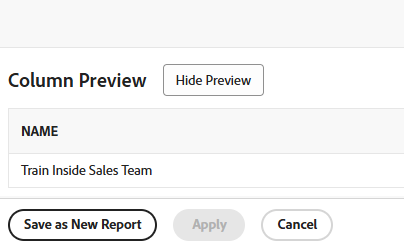

# Criar uma cópia de um relatório

<!-- Audited: 11/2024 -->

É possível criar uma cópia de qualquer relatório ao qual você tenha acesso. Você pode criar uma cópia exata de um relatório personalizado ou salvar uma nova versão de um relatório padrão. Depois de copiar um relatório, você se torna o proprietário do relatório copiado e ele é exibido na seção Meus relatórios.

## Requisitos de acesso

+++ Expanda para visualizar os requisitos de acesso para a funcionalidade neste artigo.

Você deve ter o seguinte acesso para executar as etapas deste artigo:

<table style="table-layout:auto"> 
 <col> 
 <col> 
 <tbody> 
  <tr> 
   <td role="rowheader">plano do Adobe Workfront*</td> 
   <td> 
Qualquer
 </td> 
  </tr> 
  <tr> 
   <td role="rowheader">Licença da Adobe Workfront*</td> 
   <td> 
      
Novo:

         <ul>
         <li>
Padrão
</li>
         </ul>
      
Atual:

         <ul>
         <li>
Plano
</li>
         </ul>
   </td>
  </tr> 
  <tr> 
   <td role="rowheader">Configurações de nível de acesso*</td> 
   <td> 
Editar acesso a relatórios, painéis, calendários
 
Editar acesso a Filtros, Visualizações, Agrupamentos
</td> 
  </tr> 
  <tr> 
   <td role="rowheader">Permissões de objeto*</td> 
   <td>
Exibir permissões para um relatório
</td> 
  </tr> 
 </tbody> 
</table>

*Para obter informações, consulte [Requisitos de acesso na documentação do Workfront](/help/quicksilver/administration-and-setup/add-users/access-levels-and-object-permissions/access-level-requirements-in-documentation.md).

+++

## Criar uma cópia exata de um relatório

Se quiser fazer uma cópia de um relatório personalizado, faça o seguinte:

1. Clique no ícone **[!UICONTROL Menu Principal]**  no canto superior direito do Adobe Workfront ou (se disponível) clique no ícone **[!UICONTROL Menu Principal]**  no canto superior esquerdo e clique em **[!UICONTROL Relatórios]**.

1. Clique em **Todos os relatórios** e abra um relatório.

1. Clique em **Ações de Relatório** e em **Copiar**.

   >[!TIP]
   >
   >Se o relatório for um relatório padrão, a opção Copiar não aparecerá no menu Ações de Relatório.\
   >Para obter informações sobre como criar uma cópia de um relatório padrão, consulte [Criar uma nova versão de um relatório](#create-a-new-version-of-a-report).

   

   Uma cópia do relatório original é criada com o nome padrão de _[Nome do relatório original] (Cópia)_. Por exemplo, uma cópia do relatório &quot;Tarefas concluídas do quarto trimestre&quot; seria nomeada &quot;Tarefas concluídas do quarto trimestre (Cópia)&quot;.

1. (Opcional) Para renomear o relatório, clique em **Ações de Relatório** e em **Editar**. Digite um novo nome na caixa de texto no canto superior esquerdo e clique em **Salvar + Fechar** quando terminar.

1. (Opcional) Para compartilhar a nova versão do relatório com outros usuários, clique em **Ações de Relatório** e depois em **Compartilhamento**.

   >[!NOTE]
   >
   >As informações de compartilhamento não são transferidas para o relatório copiado da versão original.\
   >Para obter informações sobre como ver com quem o relatório anterior foi compartilhado, consulte [Criar um relatório sobre atividades de relatório](../../../reports-and-dashboards/reports/report-usage/create-report-reporting-activities.md#identify).

1. (Opcional) Se você tiver Gerenciar permissões para o relatório original e o relatório original não for mais necessário, você poderá excluí-lo para remover relatórios duplicados desnecessários no Workfront.

   Para excluir o relatório original, faça o seguinte:

   1. Navegue até o relatório.

   1. Clique em **Ações de Relatório** e depois em **Excluir**.

   1. Clique em **Sim, exclua-o** para confirmar que deseja excluir o relatório.

## Criar uma nova versão de um relatório {#create-a-new-version-of-a-report}

Se quiser criar uma cópia de um relatório padrão, faça o seguinte:

1. Clique no ícone  do **Menu principal**, no canto superior direito do Adobe Workfront.

1. Clique em **Relatórios** e depois em **Todos os Relatórios**.
1. Clique no nome de um relatório padrão para abri-lo.
1. Clique em **Ações de Relatório** e depois em **Editar**.

   

1. Faça as modificações necessárias nas seguintes guias do relatório:

   * **Colunas (Modo de Exibição)**: Para obter mais informações sobre como personalizar modos de exibição, consulte o artigo [Visão geral dos modos de exibição no Adobe Workfront](../../../reports-and-dashboards/reports/reporting-elements/views-overview.md).
   * **Agrupamentos**: para obter mais informações sobre como personalizar agrupamentos, consulte o artigo [Visão geral de agrupamentos no Adobe Workfront](../../../reports-and-dashboards/reports/reporting-elements/groupings-overview.md).
   * **Filtros**: para obter mais informações sobre como personalizar filtros, consulte o artigo [Visão geral dos filtros](../../../reports-and-dashboards/reports/reporting-elements/filters-overview.md).
   * **Gráfico**: para obter mais informações sobre como personalizar um gráfico de relatório, consulte o artigo [Adicionar um gráfico a um relatório](../../../reports-and-dashboards/reports/creating-and-managing-reports/add-chart-report.md).

1. No canto superior direito, clique em **Configurações do relatório**.
1. No campo **Título do relatório**, dê um novo nome ao relatório.
1. Clique em **Concluído**.
1. Clique em **Salvar como Novo Relatório**.

   

1. (Opcional) Para compartilhar a nova versão do relatório com outros usuários, clique em **Ações de Relatório** e depois em **Compartilhamento**.
