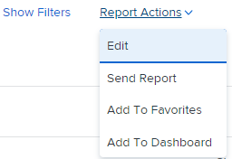
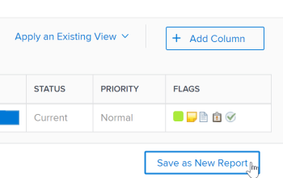

# Criar uma cópia de um relatório

É possível criar uma cópia de qualquer relatório ao qual você tenha acesso. Você pode criar uma cópia exata de um relatório personalizado ou salvar uma nova versão de um relatório padrão. Depois de copiar um relatório, você se torna o proprietário do relatório copiado e ele é exibido na seção Meus relatórios.

## Requisitos de acesso

Você deve ter o seguinte acesso para executar as etapas deste artigo:

<table style="table-layout:auto"> 
 <col> 
 <col> 
 <tbody> 
  <tr> 
   <td role="rowheader">plano do Adobe Workfront*</td> 
   <td> 
Qualquer
 </td> 
  </tr> 
  <tr> 
   <td role="rowheader">Licença da Adobe Workfront*</td> 
   <td> 
Plano 
 </td> 
  </tr> 
  <tr> 
   <td role="rowheader">Configurações de nível de acesso*</td> 
   <td> 
Editar acesso a relatórios, painéis, calendários
 
Editar acesso a Filtros, Visualizações, Agrupamentos
 
Observação: se você ainda não tiver acesso, pergunte ao administrador do Workfront se ele definiu restrições adicionais em seu nível de acesso. Para obter informações sobre como um administrador do Workfront pode modificar seu nível de acesso, consulte <a href="../../../administration-and-setup/add-users/configure-and-grant-access/create-modify-access-levels.md" class="MCXref xref">Criar ou modificar níveis de acesso personalizados</a>.
 </td> 
  </tr> 
  <tr> 
   <td role="rowheader">Permissões de objeto</td> 
   <td> 
Exibir permissões para um relatório
 
Para obter informações sobre como solicitar acesso adicional, consulte <a href="../../../workfront-basics/grant-and-request-access-to-objects/request-access.md" class="MCXref xref">Solicitar acesso a objetos </a>.
 </td> 
  </tr> 
 </tbody> 
</table>

&#42;Para descobrir seu plano, tipo de licença ou acesso, entre em contato com o administrador do Workfront.

## Criar uma cópia exata de um relatório

Se quiser fazer uma cópia de um relatório que você é o proprietário do, faça o seguinte:

1. Clique em **Menu principal** ícone  no canto superior direito do Adobe Workfront.

1. Clique em **Relatórios**, depois **Todos os relatórios**.
1. Abra um relatório.
1. Clique em **Ações de Relatório**, depois **Copiar**.

   >[!TIP]
   >
   >Se o relatório for um relatório padrão, a opção Copiar não aparecerá no menu Ações de Relatório.\
   >Para obter informações sobre como criar uma cópia de um relatório padrão, consulte [Criar uma nova versão de um relatório](#create-a-new-version-of-a-report).

   

   Uma cópia do relatório original é criada com o nome padrão de *Cópia de [Nome do relatório original]*. Por exemplo, o relatório &quot;Tarefas concluídas no quarto trimestre&quot; teria &quot;Cópia de tarefas concluídas no quarto trimestre&quot; como o nome.

1. (Opcional) Para renomear o relatório, comece digitando um novo nome.

   >[!TIP]
   >
   >Se você desmarcar o título antes de digitar o novo nome, selecione o título do relatório, exclua o nome e, em seguida, digite o novo nome.

1. (Opcional) Para compartilhar a nova versão do relatório com outros usuários, clique em **Ações de Relatório**, depois **Compartilhamento**.

   >[!NOTE]
   >
   >As informações de compartilhamento não são transferidas para o relatório copiado da versão original.\
   >Para obter informações sobre como ver com quem o relatório anterior foi compartilhado, consulte [Criar um relatório sobre atividades de relatório](../../../reports-and-dashboards/reports/report-usage/create-report-reporting-activities.md#identify).

1. (Opcional) Se você tiver Gerenciar permissões para o relatório original e o relatório original não for mais necessário, você poderá excluí-lo para remover relatórios duplicados desnecessários no Workfront.

   Para excluir o relatório original, faça o seguinte:

   1. Navegue até o relatório.
   1. Clique em **Ações de Relatório**, depois **Excluir**.

   1. Clique em **Sim, exclua.** para confirmar que deseja excluir o relatório.

## Criar uma nova versão de um relatório {#create-a-new-version-of-a-report}

Se quiser criar uma cópia de um relatório padrão, faça o seguinte:

1. Clique em **Menu principal** ícone  no canto superior direito do Adobe Workfront.

1. Clique em **Relatórios**, depois **Todos os relatórios**.
1. Clique no nome de um relatório padrão para abri-lo.
1. Clique em **Ações de Relatório**, depois **Editar**.

   

1. Faça as modificações necessárias nas seguintes guias do relatório:

   * **Colunas (Exibir)**: para obter mais informações sobre como personalizar exibições, consulte o artigo [Visão geral das exibições no Adobe Workfront](../../../reports-and-dashboards/reports/reporting-elements/views-overview.md).
   * **Agrupamentos**: para obter mais informações sobre como personalizar agrupamentos, consulte o artigo [Visão geral de agrupamentos no Adobe Workfront](../../../reports-and-dashboards/reports/reporting-elements/groupings-overview.md).
   * **Filtros**: para obter mais informações sobre como personalizar filtros, consulte o artigo [Visão geral dos filtros](../../../reports-and-dashboards/reports/reporting-elements/filters-overview.md).
   * **Gráfico**: para obter mais informações sobre como personalizar um gráfico de relatório, consulte o artigo [Adicionar um gráfico a um relatório](../../../reports-and-dashboards/reports/creating-and-managing-reports/add-chart-report.md).

1. No canto superior direito, clique em **Configurações do relatório**.
1. No **Título do relatório** dê um novo nome ao relatório.
1. Clique em **Concluído**.
1. Clique em **Salvar como novo relatório**.

   

1. (Opcional) Para compartilhar a nova versão do relatório com outros usuários, clique em **Ações de Relatório**, depois **Compartilhamento**.
