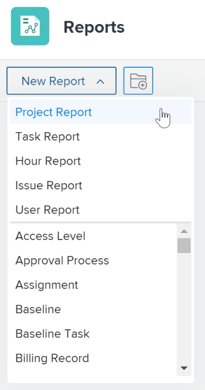

# Criar um relatório personalizado

<!--Audited: 12/2023-->

Você pode fornecer acesso às informações de que sua organização precisa no Adobe Workfront criando relatórios. Você pode usar qualquer um dos relatórios internos disponíveis no Workfront ou criar seus relatórios personalizados do zero.

Para obter mais informações sobre relatórios internos, consulte [Usar relatórios internos do Adobe Workfront](../../../reports-and-dashboards/reports/using-built-in-reports/use-workfront-built-in-reports.md).

Para obter informações sobre como criar um relatório copiando-o, consulte [Criar uma cópia de um relatório](../../../reports-and-dashboards/reports/creating-and-managing-reports/create-copy-report.md).

Para obter mais informações sobre como criar e gerenciar relatórios, incluindo aulas, vídeos e tutoriais, consulte a seção Saiba mais no site do Adobe Experience League.

## Requisitos de acesso

+++ Expanda para visualizar os requisitos de acesso para a funcionalidade neste artigo.

Você deve ter o seguinte acesso para executar as etapas deste artigo:

<table style="table-layout:auto"> 
 <col> 
 <col> 
 <tbody> 
  <tr> 
   <td role="rowheader">plano do Adobe Workfront*</td> 
   <td> 
Qualquer
 </td> 
  </tr> 
  <tr> 
   <td role="rowheader">Licença da Adobe Workfront*</td> 
   <td> 
Novo: Padrão 

   ou
   
Atual: Plano 
 </td> 
  </tr> 
  <tr> 
   <td role="rowheader">Configurações de nível de acesso*</td> 
   <td> 
Editar acesso a relatórios, painéis, calendários
 
Editar acesso a Filtros, Visualizações, Agrupamentos
 
<b>Nota</b>

   
 Se você ainda não tiver acesso, pergunte ao administrador do Workfront se ele definiu restrições adicionais em seu nível de acesso. Para obter informações sobre como um administrador do Workfront pode modificar seu nível de acesso, consulte <a href="../../../administration-and-setup/add-users/configure-and-grant-access/create-modify-access-levels.md" class="MCXref xref">Criar ou modificar níveis de acesso personalizados</a>.
 </td> 
  </tr> 
  <tr> 
   <td role="rowheader">Permissões de objeto</td> 
   <td> 
Você obtém permissões de Gerenciamento para os relatórios que criar.
 
Para obter informações sobre como solicitar acesso adicional, consulte <a href="../../../workfront-basics/grant-and-request-access-to-objects/request-access.md" class="MCXref xref">Solicitar acesso aos objetos </a>.
 </td> 
  </tr> 
 </tbody> 
</table>

&#42;Para saber qual plano, tipo de licença ou acesso você tem, contate o administrador do Workfront.

+++

## Criar um relatório {#create-a-report}

{{step1-to-reports}}

1. Clique em **Novo relatório** e selecione o tipo de objeto desejado para o relatório.

   O Report Builder é carregado.

   Para obter informações específicas sobre relatórios de objetos disponíveis, consulte a seção [Relatório sobre objetos](../../../workfront-basics/navigate-workfront/workfront-navigation/understand-objects.md#reporting-on-objects) no artigo [Entender objetos no Adobe Workfront](../../../workfront-basics/navigate-workfront/workfront-navigation/understand-objects.md).

   

   >[!TIP]
   >
   >Você também pode criar um relatório fazendo uma cópia de um relatório existente. Para obter mais informações, consulte [Criar uma cópia de um relatório](../../../reports-and-dashboards/reports/creating-and-managing-reports/create-copy-report.md).

1. No Report Builder, adicione o seguinte código ao seu relatório:

   <table style="table-layout:auto"> 
    <col> 
    <col> 
    <thead> 
     <tr> 
      <th>Recurso</th> 
      <th>Descrição</th> 
     </tr> 
    </thead> 
    <tbody> 
     <tr> 
      <td>Colunas (visualizar)</td> 
      <td> 
Adicionar colunas ao relatório determina quais informações ele contém.
 
Para saber como adicionar uma coluna, consulte <a href="#add-columns-view-to-a-report" class="MCXref xref">Adicionar colunas (exibição) a um relatório</a>. 
 </td> 
     </tr> 
     <tr> 
      <td>Agrupamento</td> 
      <td> 
Adicionar agrupamentos ao relatório determina como o relatório é organizado.
 
Para saber como adicionar um agrupamento, consulte <a href="#add-groupings-to-a-report" class="MCXref xref">Adicionar agrupamentos a um relatório</a>.
 </td> 
     </tr> 
     <tr> 
      <td>Filtros</td> 
      <td> 
Adicionar regras de filtro ao relatório determina as informações que você vê no relatório.
 
Para saber como adicionar um filtro, consulte <a href="#add-filters-to-a-report" class="MCXref xref">Adicionar filtros a um relatório</a>.
 </td> 
     </tr> 
     <tr> 
      <td>Gráfico</td> 
      <td> 
Adicionar um gráfico ao relatório determina como as informações nele contidas são apresentadas visualmente.
 
Para saber como adicionar um gráfico, consulte <a href="#add-a-chart-to-a-report" class="MCXref xref">Adicionar um gráfico a um relatório</a>.
 </td> 
     </tr> 
    </tbody> 
   </table>

1. A qualquer momento durante o processo de criação do relatório, clique em **Aplicar** para salvar suas alterações.
1. Depois de concluir, clique em **Salvar + Fechar**.

### Adicionar colunas (visualização) a um relatório {#add-columns-view-to-a-report}

1. Comece a criar um relatório conforme descrito na seção [Criar um relatório](#create-a-report) deste artigo.
1. No Report Builder, selecione a guia **Colunas (Exibição)** para identificar as colunas a serem exibidas no relatório.
1. (Opcional) Clique em **Aplicar um Modo de Exibição Existente** e clique no nome de um modo de exibição no menu suspenso para usar um modo de exibição existente.

   Para obter mais informações sobre como criar uma exibição, consulte [Visão geral das exibições no Adobe Workfront](../../../reports-and-dashboards/reports/reporting-elements/views-overview.md).

1. (Opcional) Para remover uma coluna existente, clique na coluna que você deseja remover e em **x** ao lado do nome atual no cabeçalho da coluna.

1. Para adicionar uma nova coluna, clique em **Adicionar Coluna**.

   Ou

   Para alterar uma coluna existente, clique na coluna, clique no ícone  de **Remover** à esquerda do campo atual na caixa **Mostrar neste campo de coluna** no canto superior esquerdo do Report Builder, comece a digitar um novo campo e, em seguida, clique nele quando ele for exibido na lista.

   Para obter mais informações sobre os campos exibidos nas colunas, consulte [Glossário da terminologia do Adobe Workfront](../../../workfront-basics/navigate-workfront/workfront-navigation/workfront-terminology-glossary.md).

   

1. (Opcional) Na área **Configurações de Coluna**, selecione **Classificar por esta coluna** para classificar os valores da coluna em ordem alfabética crescente ou decrescente e indique se a lista deve usar esta coluna como sua primeira classificação.

   É possível ter vários níveis de classificações em uma exibição de relatório se você quiser classificar pelo valor em uma coluna primeiro, o valor em uma segunda coluna segundo, etc.

   Se vários resultados forem idênticos de acordo com o primeiro critério de classificação, eles serão classificados na ordem do segundo critério de classificação. Se vários resultados forem idênticos de acordo com a primeira e a segunda classificação, eles serão classificados de acordo com a terceira classificação etc.

   >[!NOTE]
   >
   >Se você adicionar um campo que faça referência a um objeto muito distante do objeto sobre o qual está relatando, talvez não seja possível classificar por esse campo.\
   >Por exemplo, um relatório de problemas não pode ser classificado pelo campo Proprietário do projeto porque faz referência a três objetos adicionais: Projeto, Proprietário e Nome. No entanto, você ainda pode adicionar esse campo a um relatório de problemas e ver as informações dele.

   <!--outdated: To learn more about cross-object references in reports, see the section "Advanced Reporting Part 1 of 3" in the [Reports and Dashboards Learning Path](https://one.workfront.com/s/learningpath2/workfront-reporting-MC7MZT2BOL2ZC2LMJ4MA3EMHOCNY?tabset-dc70e=2).-->

1. (Opcional) Se você estiver usando agrupamentos e quiser resumir (agregar) as informações em uma coluna, clique na lista suspensa **Resumir esta coluna por** na área **Configurações de coluna** e selecione a opção que deseja usar para agregar as informações na coluna.

   As informações agregadas são exibidas na coluna nas linhas de agrupamento.

   

   Para obter mais informações sobre o resumo de dados em uma coluna, consulte [Visão geral das exibições no Adobe Workfront](../../../reports-and-dashboards/reports/reporting-elements/views-overview.md).

   >[!NOTE]
   >
   >As exceções a seguir se aplicam a objetos pai (por exemplo, tarefas pai) quando você está agregando valores para os seguintes campos em agrupamentos:
   >
   >* Todos os campos de número e moeda, exceto Horas Reais (por exemplo, Custo de Trabalho Planejado ou Efetivo, Custo de Despesas Planejado ou Efetivo, Custo Planejado ou Efetivo, Horas Planejadas) agregam apenas os valores das tarefas filhas e tarefas independentes. Eles não agregam os valores das tarefas pai ou pai dos pais.
   >* As Horas Reais agregam os valores das tarefas pai principal e independente; elas não agregam os números para as tarefas pai ou filho.
   >* Os campos de dados personalizados para valores de número e moeda agregam todas as tarefas: pais, filhos, pais dos pais e tarefas independentes.

   Para obter mais informações sobre como usar agrupamentos em um relatório, consulte [Visão geral sobre agrupamentos no Adobe Workfront](../../../reports-and-dashboards/reports/reporting-elements/groupings-overview.md).

1. (Opcional) Clique em **Opções Avançadas** para especificar as seguintes informações para a coluna:

   <table style="table-layout:auto"> 
    <col> 
    <col> 
    <tbody> 
     <tr> 
      <td role="rowheader">Personalizar rótulo da coluna</td> 
      <td> 
Especifique um rótulo personalizado para a coluna. Esse rótulo substitui o rótulo padrão.
 </td> 
     </tr> 
     <tr> 
      <td role="rowheader">Formato do campo</td> 
      <td> 
Selecione o formato no qual deseja que os valores sejam exibidos para os campos na coluna.
 </td> 
     </tr> 
     <tr> 
      <td role="rowheader">Mostrar esta coluna quando estiver em um Painel</td> 
      <td> 
Selecione essa opção para mostrar essa coluna em um painel, quando o relatório for exibido lado a lado com outro relatório. Quando essa opção não está selecionada, essa coluna não é exibida ao visualizar o relatório em um painel em que os relatórios são exibidos lado a lado.
 </td> 
     </tr> 
     <tr> 
      <td role="rowheader">Regras de colunas</td> 
      <td> 
Clique em <strong>Adicionar uma Regra para esta Coluna</strong> para adicionar formatação condicional à coluna. Após adicionar uma regra, é possível definir estilos de campo e texto para a forma como os campos que correspondem a essa regra são exibidos. Clique em <strong>Adicionar regra</strong> depois que terminar de definir a regra. Para obter mais informações sobre formatação condicional em um modo de exibição, consulte <a href="../../../reports-and-dashboards/reports/reporting-elements/use-conditional-formatting-views.md" class="MCXref xref">Usar formatação condicional em modos de exibição</a>.
 </td> 
     </tr> 
    </tbody> 
   </table>

1. Clique em **Aplicar** para aplicar as alterações até agora e continuar editando o relatório com as opções a seguir.

   Clique em **Salvar + Fechar** se terminar de editar as colunas no relatório e quiser salvar o relatório.

### Adicionar agrupamentos a um relatório {#add-groupings-to-a-report}

1. Comece a criar um relatório conforme descrito na seção [Criar um relatório](#create-a-report) deste artigo.
1. No Report Builder, selecione a guia **Agrupamentos** para identificar como você deseja agrupar itens no relatório.
1. Clique em **Adicionar agrupamento** para adicionar um novo agrupamento.

   Ou

   Escolha **Aplicar um agrupamento existente** para selecionar um agrupamento existente quando ele for exibido na lista.

   

1. Comece digitando o campo que deseja adicionar como um agrupamento. Se o campo estiver disponível, ele será preenchido para cada objeto em que puder ser associado. Clique no nome do campo para adicioná-lo a esse agrupamento.
1. (Opcional) Você pode optar por criar um agrupamento no modo de texto, clicando em **Alternar para Modo de Texto**. Para obter mais informações sobre como usar o modo de texto, consulte [Visão geral do Modo de Texto](../../../reports-and-dashboards/reports/text-mode/understand-text-mode.md).

   Para obter mais informações sobre como criar novos agrupamentos, consulte [Visão geral dos agrupamentos no Adobe Workfront](../../../reports-and-dashboards/reports/reporting-elements/groupings-overview.md).

1. (Opcional) Selecione **Recolher este agrupamento por padrão** se desejar que os resultados deste agrupamento sejam exibidos recolhidos, em vez de expandidos.

   Essa configuração é desabilitada por padrão e os resultados do agrupamento sempre são exibidos em uma lista expandida.

   >[!TIP]
   >
   >* Quando você ajusta agrupamentos manualmente ao visualizar uma lista, o Workfront lembra de sua preferência manual até que você faça logout. Ao fazer logon novamente, a lista é exibida de acordo com essa configuração.
   >* Os resultados de um agrupamento sempre são exibidos expandidos depois de acessados de um elemento do gráfico.

1. (Opcional) Clique em **Alternar para Agrupamento de Matriz**, para criar um agrupamento de matriz e exibir seus resultados em um formato de grade.

   Para obter mais informações sobre a criação de um relatório de matriz, consulte [Criar um relatório de matriz](../../../reports-and-dashboards/reports/creating-and-managing-reports/create-matrix-report.md).

1. Clique em **Aplicar** para aplicar as alterações até agora e continuar editando o relatório com as opções a seguir.

   Clique em **Salvar + Fechar** se tiver terminado de editar os agrupamentos no relatório e quiser salvá-lo.

### Adicionar filtros a um relatório {#add-filters-to-a-report}

1. Comece a criar um relatório conforme descrito na seção [Criar um relatório](#create-a-report) deste artigo.
1. No Report Builder, selecione a guia **Filtros** para identificar a quantidade de informações que você deseja que o relatório inclua.
1. Clique em **Adicionar uma Regra de Filtro** para adicionar um filtro personalizado.\
   Ou\
   Escolha **Aplicar um Filtro Existente** para usar um filtro existente.

   

1. Se você clicou em **Adicionar uma regra de filtro**, comece a digitar o campo que deseja adicionar como filtro. Se o campo estiver disponível, ele será preenchido para cada objeto em que puder ser associado. Clique no nome do campo para adicioná-lo a esse filtro.\
   Use modificadores de filtro para criar seu filtro. Para obter mais informações sobre modificadores de filtro, consulte [Modificadores de filtro e condição](../../../reports-and-dashboards/reports/reporting-elements/filter-condition-modifiers.md).

   Para obter mais informações sobre como criar novos filtros, consulte [Visão geral dos filtros](../../../reports-and-dashboards/reports/reporting-elements/filters-overview.md).

1. (Opcional) Você pode optar por criar um filtro no modo de texto clicando em **Alternar para Modo de Texto**.

   Para obter mais informações sobre como usar o modo de texto, consulte [Visão geral do Modo de Texto](../../../reports-and-dashboards/reports/text-mode/understand-text-mode.md).

1. Clique em **Aplicar** quando terminar de editar os filtros no relatório para aplicar suas alterações até o momento e continuar editando o relatório com as opções a seguir.

   Clique em **Salvar + Fechar** se criar o relatório e quiser salvá-lo.

### Adicionar um gráfico a um relatório {#add-a-chart-to-a-report}

1. Comece a criar um relatório conforme descrito na seção [Criar um relatório](#create-a-report) deste artigo.
1. No Report Builder, selecione a guia **Gráfico** e selecione o tipo de gráfico que deseja adicionar.

   

   Para obter mais informações sobre como criar um gráfico em um relatório, consulte [Adicionar um gráfico a um relatório](../../../reports-and-dashboards/reports/creating-and-managing-reports/add-chart-report.md).

1. Clique em **Aplicar** para aplicar as alterações até agora e continuar editando o relatório com as opções a seguir.

   Clique em **Salvar + Fechar** se terminar de editar o relatório e quiser salvá-lo.
